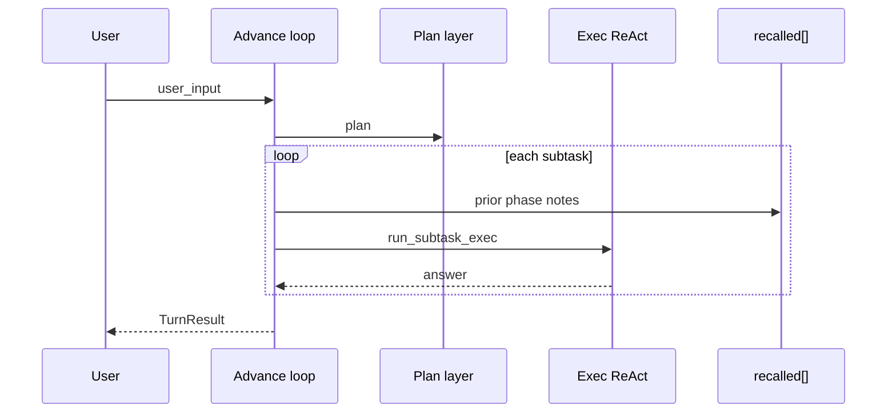

# 推進ループ（Advance loop）

HarnessSeed の**外側オーケストレーション**。1 回のユーザー依頼を計画フェーズに分解し、フェーズごとに実行層 ReAct を回す。完了フェーズの要約を `PromptBlocks::recalled` に載せ、次フェーズへ渡す。

## いつ使うか

- 長い作業を**複数フェーズ**に分け、各 LLM 呼び出しのコンテキストを小さく保ちたいとき
- `two_phase` と似るが、フェーズ間で **`recalled` 注入** と **session クリア**（任意）を行う

## 設定（`config.json`）

```json
"react": {
  "advance": {
    "enabled": true,
    "max_phases": 8,
    "clear_session_each_phase": true,
    "max_note_chars": 1500,
    "show_phases": true
  }
}
```

| キー | 意味 | 既定 |
|------|------|------|
| `enabled` | 推進ループ ON（`two_phase` より優先） | `false` |
| `max_phases` | 1 リクエストで実行する最大フェーズ数 | `8` |
| `clear_session_each_phase` | 各フェーズ前に `SessionMemory` をクリア | `true` |
| `max_note_chars` | `recalled` に載せる 1 フェーズ要約の上限 | `1500` |
| `show_phases` | フェーズ開始を stdout に表示 | `true` |

## 優先順位

`run_turn` の分岐:

1. `advance.enabled` → `run_turn_advance`
2. それ以外で `two_phase` → `run_turn_two_phase`
3. それ以外 → 単一 ReAct

## フロー



## ライブラリ

- `AdvanceConfig`, `AdvanceProgress` — `harness_seed::advance`
- `TurnResult::advance_phases` — 各フェーズの `id` / `goal` / `answer` / `steps_used`

ホストアプリは `blocks.push_recalled(...)` で注入した内容を、フェーズ間も保持する（`prepare_phase_recalled` がベースを復元する）。

## 関連

- [context-memory-mapping.md](context-memory-mapping.md) — 記憶の層
- [react-implementation.md](react-implementation.md) — 内側 ReAct
- [ideas/mempalace-integration.md](ideas/mempalace-integration.md) — 外部記憶接続（将来）
