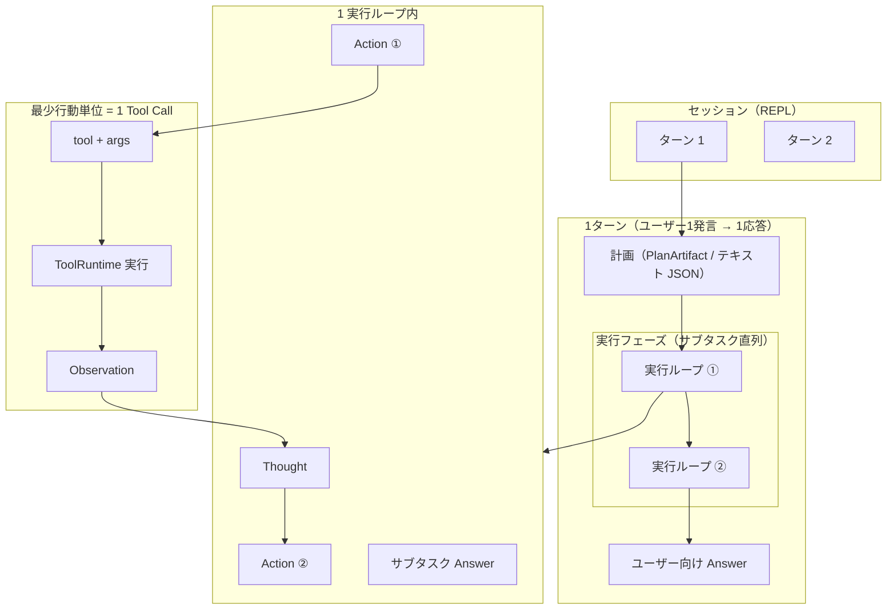
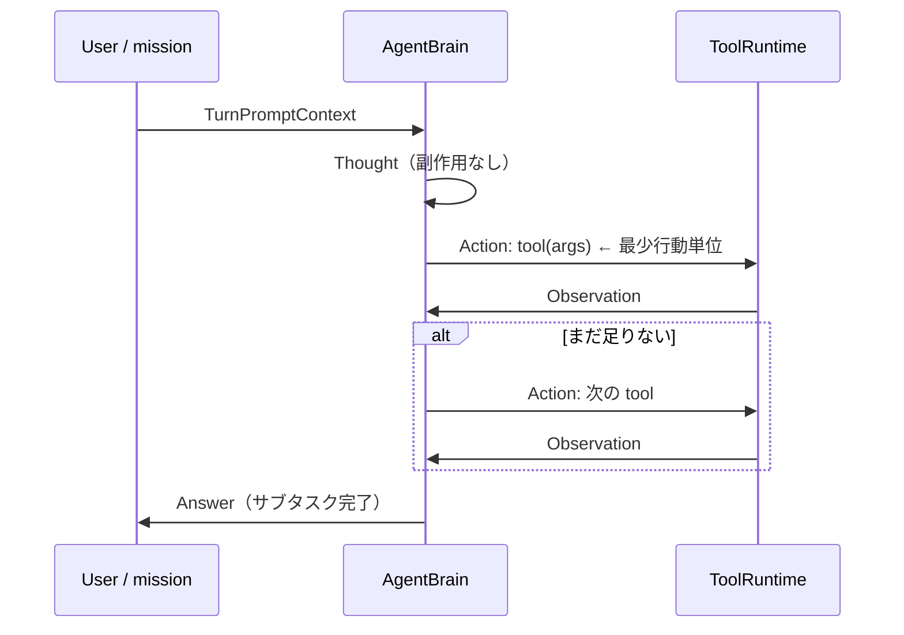
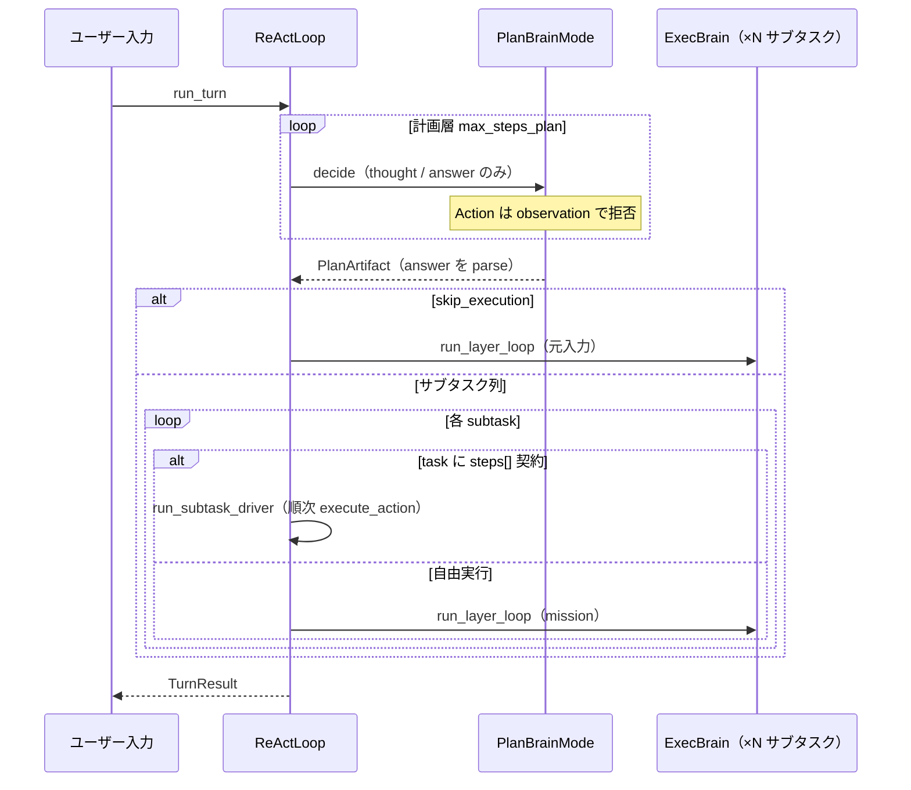
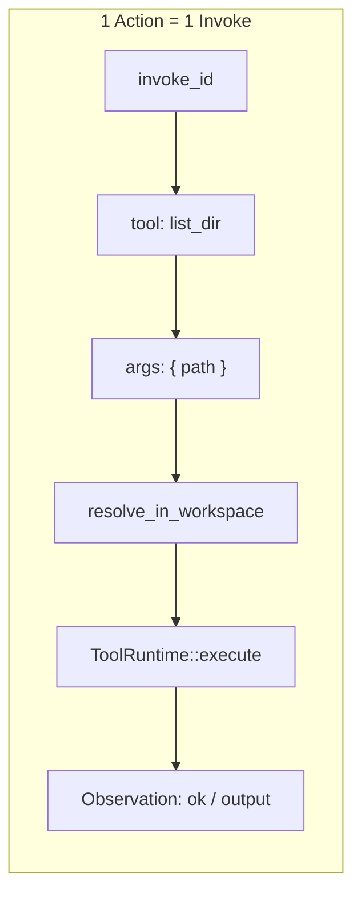
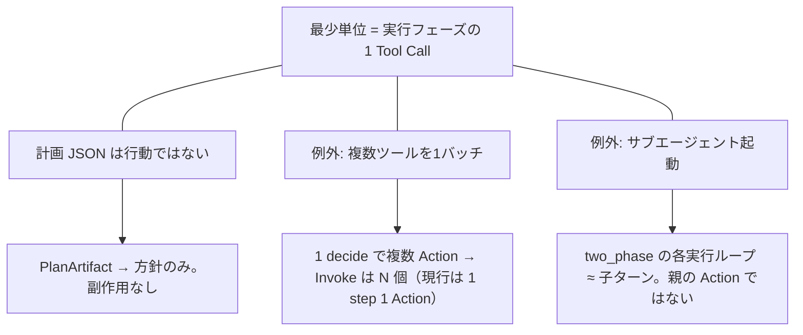

# AIエージェントの最少行動単位

多くのエージェント実装では、実世界に効く最小の操作は **「1回のツール呼び出し（Tool Call）」** である。推論テキスト・計画 JSON・ユーザー向け返答は「行動」ではなく、ツール実行とその結果（Observation）がハーネス設計・ログ記録の基本単位になる。

- ReAct 実装（現行）: [react-implementation.md](react-implementation.md)
- アーキテクチャ（計画層・実行層）: [architecture/README.md](architecture/README.md)
- コンテキストの層: [context-memory-mapping.md](context-memory-mapping.md)

## 1. 階層の全体像



| レベル | 例 | 最少単位か | HarnessSeed（`two_phase` 時） |
|--------|-----|------------|-------------------------------|
| セッション | チャット全体 | × | `SessionMemory`（REPL 短期） |
| ターン | ユーザー1発言 → 1応答 | × | `run_turn` / `TurnResult` |
| 計画 | サブタスク列の JSON | × | `PlanArtifact`（**ツールなし**） |
| 実行ループ | 1 サブタスク分の ReAct | × | `run_turn_single(mission)` |
| 行動（Action） | `read_file` を1回 | **◎** | `Action` + `invoke_id` |
| 観測（Observation） | ファイル内容・exit code | 行動の結果 | `Observation` |

**原則**: 計画フェーズは環境に触れない。副作用があるのは **実行フェーズの `Action` のみ**。

## 2. ReAct ループ（1行動の中身）

「考える → 1ツール実行 → 結果を見る」が **実行フェーズ** の最小ループ。



| 変種 | 環境への副作用 | HarnessSeed 型 |
|------|----------------|----------------|
| `Thought` | なし | `AgentStep::Thought` |
| `Action` | **あり** | `AgentStep::Action` → `execute_action` |
| `Answer` | なし（テキスト応答） | `AgentStep::Answer` |

## 3. 計画層・実行層（two_phase、共通 ReAct ループ）

`react.two_phase: true` のとき、**計画層・実行層とも** `run_layer_loop`（`src/layer.rs`）で回す。



| 層 | 頭脳 | ループ | ツール | 終了 |
|----|------|--------|--------|------|
| 計画 | `PlanBrainMode` | `run_plan_layer` | **なし** | `Answer` → `PlanArtifact` |
| 実行 | `exec` `BrainMode` | `run_layer_loop` または **ステップドライバ** | **あり** | `Answer` → ユーザー向け |

サブタスクに登録タスク id（`tasks/*.json`）があり `steps[]` が定義されているとき、`react.use_step_driver`（既定 `true`）なら **`src/tasks/driver.rs`** が LLM なしで契約順に `execute_action` する。失敗時は ReAct にフォールバック。`generic`（steps 空）は従来どおり ReAct。

計画 JSON スキーマ（抜粋）:

```json
{
  "summary": "…",
  "skip_execution": false,
  "subtasks": [
    { "id": 1, "goal": "…", "done_when": "…" }
  ]
}
```

実行へ渡す mission は `format_mission` で組み立てる（`Original request` / `Current subtask` / 先行サブタスク結果）。各実行ループの `TurnTrace` はターン終了時に **マージ** され、全 `Action` / `Observation` が1本の trace として残る。

## 4. 1 Tool Call の分解（ハーネス設計向け）

実行基盤で記録するなら、この粒度が扱いやすい。



| フィールド | 意味 | 実装 |
|------------|------|------|
| `invoke_id` | ログ・trace 上のキー | `Action::invoke_id` |
| `tool` + `args` | 再現可能な命令 | `src/tool.rs` |
| ワークスペース制約 | パス拒否 | `resolve_in_workspace` |
| `ok` + `output` | 次 `decide` への入力 | `Observation` |

## 5. 境界がブレる例（設計の注意）



| ケース | 扱い |
|--------|------|
| 計画フェーズ | テキスト / JSON。**Invoke を増やさない** |
| 並列ツール | 記録上は **Invoke が N 個**（HarnessSeed 現行は 1 ステップ 1 `Action`） |
| two_phase の複数サブタスク | **実行ループが N 回**。最少単位は各ループ内の `Action` |
| テキストのみ | `Thought` / `Answer` / 計画 summary は行動ではない |

## 6. まとめ

| 質問 | 答え |
|------|------|
| 最少行動単位は | **実行フェーズの 1 Tool Call + Observation** |
| 計画は行動か | **いいえ**（`PlanArtifact` は中間成果物） |
| 1 ターンに複数 Action があり得るか | **ある**（1 実行ループ内、またはサブタスク数ぶんの実行ループ） |
| ハーネスで何をログるか | 実行: `invoke_id`, `tool`, `args`, `Observation`。計画: `plan` + 任意で `[context plan]` |

## 7. HarnessSeed への対応（現行）

| 概念 | 型 / API | モジュール |
|------|----------|------------|
| ターン | `TurnResult` | `src/react.rs` |
| 計画成果 | `PlanArtifact`, `Subtask` | `src/plan.rs` |
| タスク契約 | `TaskDefinition`, `ExecStep`（`order` + `method`） | `src/tasks/spec.rs`, `tasks/*.json` |
| 順序照合 | `audit_trace` | `src/tasks/audit.rs` |
| 計画層ループ | `run_plan_layer` + `PlanBrainMode` | `src/layer.rs`, `src/plan/brain.rs` |
| 実行ステップ | `AgentStep` | `src/action.rs` |
| 最少行動 | `Action` | `src/action.rs` |
| 観測 | `Observation` | `src/action.rs` |
| ターン内 trace | `TurnTrace` | `src/action.rs`（two_phase 時はサブタスク分をマージ） |
| サブタスク結果 | `SubtaskExecResult` | `src/react.rs` |
| 設定 | `react.two_phase`, `react.max_steps`, `react.use_step_driver`, `react.show_prompt` | `config/config.json`, `ReActConfig` |

`two_phase: false`（既定）のときは、従来どおり **1 ターン = 1 実行ループ** のみ。`true` のときだけ §3 の計画 → 直列実行が入る。

推進ループ（セッション跨ぎのゴール管理）は未実装。REPL の `SessionMemory` がその薄い代替（[context-memory-mapping.md §10](context-memory-mapping.md#10-短期記憶sessionmemory実装)）。
