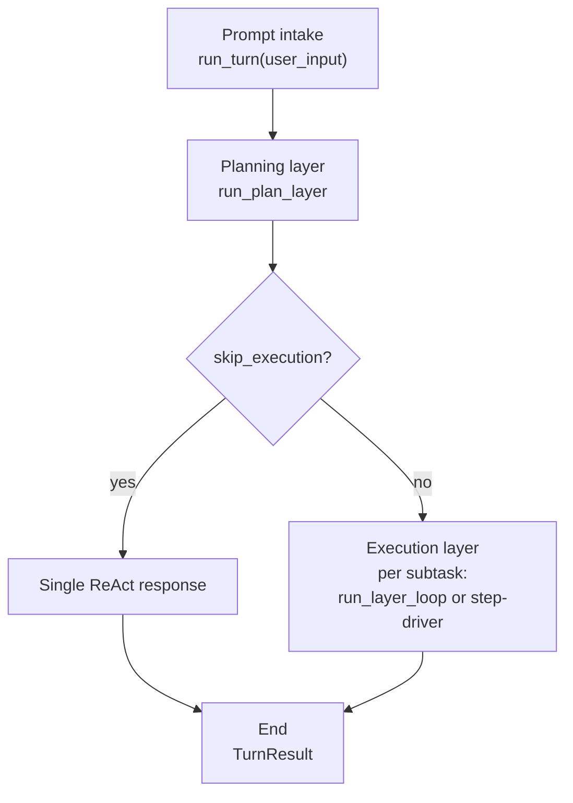
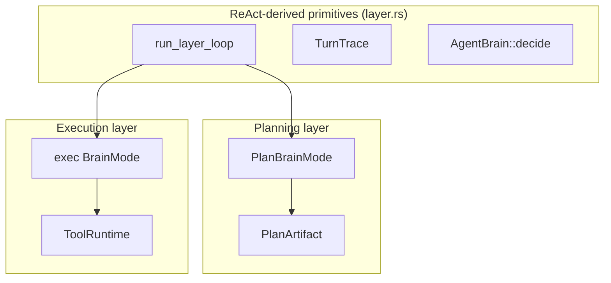
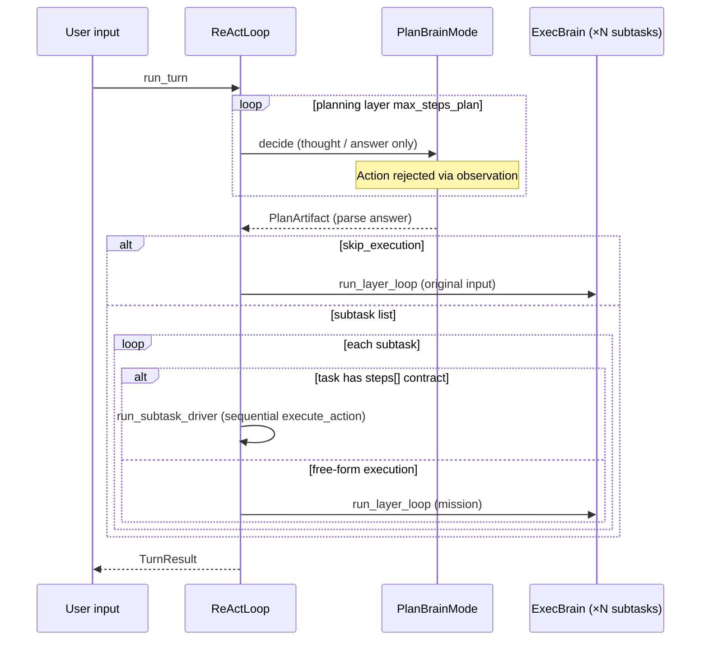
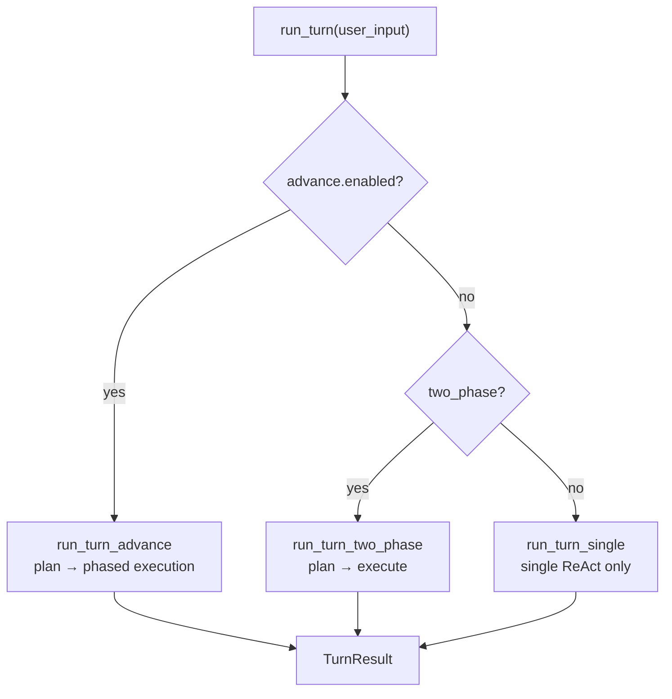
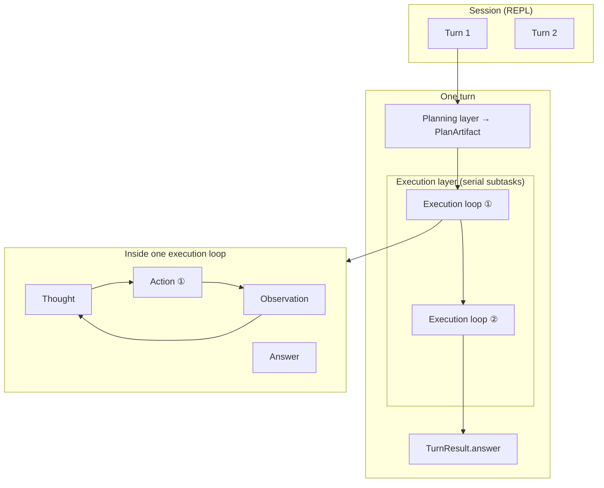

# harness-seed Structure (Planning Layer & Execution Layer)

HarnessSeed is a ReAct harness built around a **serial pipeline: prompt intake → planning layer → execution layer → end**. Both layers share the same ReAct loop primitive (`run_layer_loop`), but differ in **whether tools are enabled** and **what type of output they produce**.

- Full overview (SVG): [full_agent_architecture_v2.svg](../full_agent_architecture_v2.svg)
- Minimum action unit: [agent-minimum-action-unit.md](../agent-minimum-action-unit.md)
- ReAct implementation details: [react-implementation.md](../react-implementation.md)
- Outer advance loop: [advance-loop.md](../advance-loop.md)
- Task registry: [ideas/task-registry.md](../ideas/task-registry.md)
- Planning layer: [01_planning-layer.md](01_planning-layer.md) ([JP](../architecture/01_計画層.md))
- Execution layer: [02_execution-layer.md](02_execution-layer.md) ([JP](../architecture/02_実行層.md))
- Japanese version: [00_harness-seedの構造.md](../architecture/00_harness-seedの構造.md)

## 1. Overall Flow



Opening comment in `src/plan.rs`:

> Serial orchestration: planning layer (ReAct-derived loop, no tools) → execution layer (ReAct + tools).

## 2. Role of Each Layer

| Layer | Entry | Brain | Loop | Tools | Termination |
|-------|-------|-------|------|-------|-------------|
| **Planning** | `run_plan_layer` | `PlanBrainMode` | `run_layer_loop` (`LayerLoopOptions::plan`) | **none** | `Answer` → `PlanArtifact` |
| **Execution** | `run_turn_two_phase` / `run_subtask_exec_audited` | exec `BrainMode` | `run_layer_loop` (`LayerLoopOptions::exec`) or **step driver** | **yes** | `Answer` → user-facing response |

### Planning Layer Output (PlanArtifact)

The planning layer parses JSON returned by the LLM and builds an ordered list of subtasks.

```json
{
  "summary": "…",
  "skip_execution": false,
  "subtasks": [
    { "id": 1, "goal": "…", "done_when": "…" }
  ]
}
```

- `skip_execution: true` — trivial Q&A (greetings, help) that needs no tools
- Subtasks may reference registered task ids from `tasks/*.json`

### Execution Layer Behavior

Each subtask runs via one of:

1. **ReAct loop** — receives a mission built by `format_mission`; repeats `Thought → Action → Observation`
2. **Step driver** — when a registered task has a `steps[]` contract, runs `execute_action` in contract order without an LLM (`react.use_step_driver` defaults to `true`)

## 3. Shared ReAct Loop (layer.rs)

Both layers share **`run_layer_loop` in `src/layer.rs`**.



| Option | Planning (`plan`) | Execution (`exec`) |
|--------|-------------------|---------------------|
| `tools_enabled` | `false` | `true` |
| `context_label` | `"plan"` | `"step"` |
| `max_thoughts` | 1 (default) | 1 (default) |

**Principle**: the planning phase never touches the environment. Side effects occur only in **execution-phase `Action`s**.

## 4. Sequence Within One Turn (two_phase)

Flow when `react.two_phase: true` (default in `config/config.json`).



## 5. Execution Mode Switching

`ReActLoop::run_turn` (`src/react.rs`) branches on configuration.



| Setting | Default (config.json) | Behavior |
|---------|----------------------|----------|
| `react.two_phase` | `true` | Serial plan → execution |
| `react.advance.enabled` | `true` | Outer advance loop (takes priority over `two_phase`); carries progress into `recalled` before each phase |
| `react.use_step_driver` | `true` | Run contract-backed tasks sequentially without an LLM |

When `advance.enabled: true`, **advance takes priority over `two_phase`**, but both still **pass through the planning layer (`run_plan_layer`) first**.

## 6. Source Code Map

| Concept | File |
|---------|------|
| Turn entry | `src/react.rs` — `run_turn`, `run_turn_two_phase`, `run_turn_advance` |
| Planning loop | `src/layer.rs` — `run_plan_layer`, `run_layer_loop` |
| Plan JSON & contracts | `src/plan.rs`, `src/plan/parse.rs`, `src/plan/contract.rs` |
| Harness state | `src/harness/state.rs` — `HarnessState`, `PlanArtifact` |
| Execution tools | `src/tool/` — `ToolRuntime`, `execute_action` |
| Step driver | `src/tasks/driver.rs` |
| Task definitions | `tasks/*.json`, `src/tasks/registry.rs` |
| Minimum action unit | `src/action.rs` — `Action`, `Observation`, `TurnTrace` |

## 7. Hierarchy Overview



| Level | HarnessSeed type | Minimum action unit? |
|-------|------------------|----------------------|
| Session | `SessionMemory` | no |
| Turn | `TurnResult` | no |
| Plan | `PlanArtifact` | no (no tools) |
| Execution loop | ReAct for one subtask | no |
| Action | `Action` + `invoke_id` | **yes** |
| Observation | `Observation` | result of an action |

## 8. Summary

- harness-seed is centered on a **two-layer model: planning + execution**.
- Both layers are ReAct-derived; the planning layer **designs subtasks without tools**, and only the execution layer touches the environment via **ToolRuntime**.
- Simple conversation can skip the execution layer via `skip_execution`.
- Registered tasks can fall through to the **step driver** (no LLM) in the execution layer.
- When `advance` is enabled, long work is split into phases while the same two-layer structure repeats, carrying `recalled` context forward.
