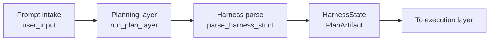
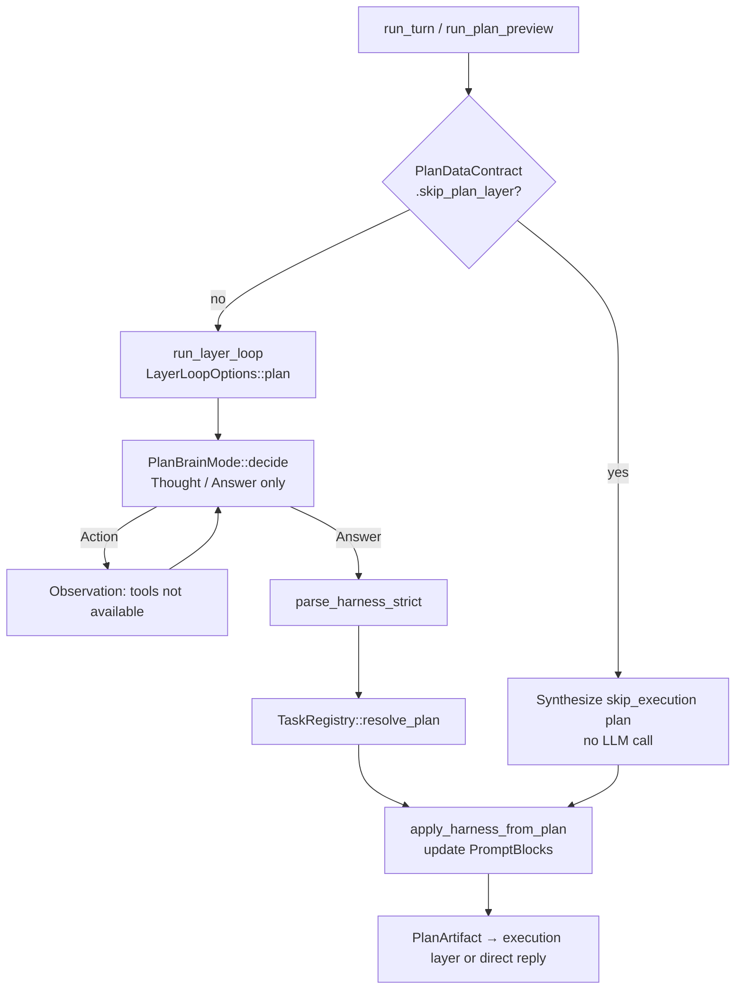
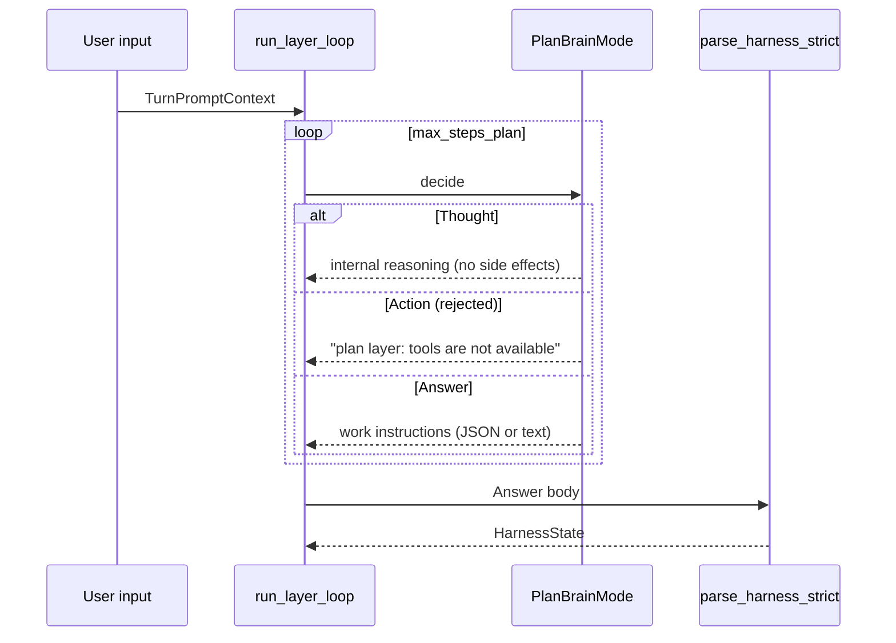
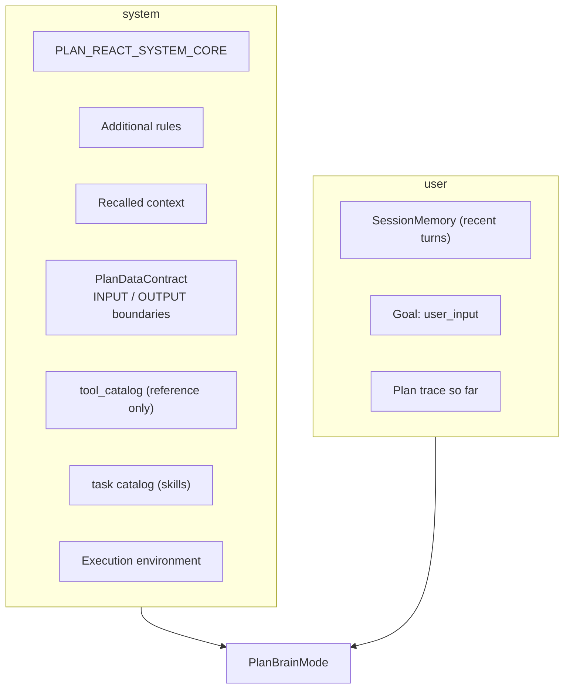
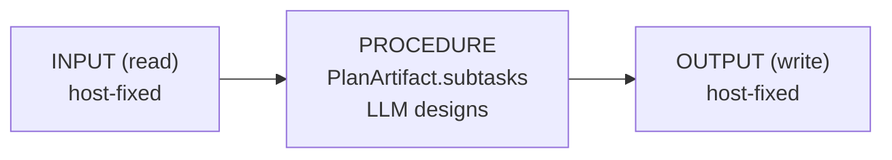
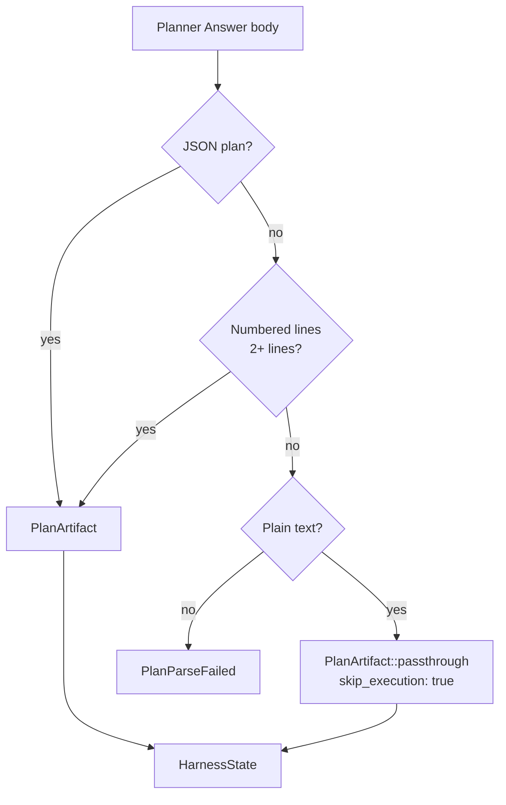
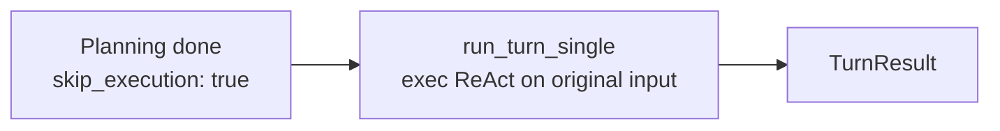

# Planning Layer

The planning layer receives the user prompt and **designs an ordered list of subtasks (work instructions)**. In HarnessSeed it runs as a ReAct-derived loop (`run_plan_layer`), **without tools**, and has no side effects on the environment.

- Overall structure: [00_harness-seed-structure.md](00_harness-seed-structure.md)
- Execution layer: [02_execution-layer.md](02_execution-layer.md)
- Full overview (SVG): [full_agent_architecture_v2.svg](../full_agent_architecture_v2.svg)
- Minimum action unit: [agent-minimum-action-unit.md](../agent-minimum-action-unit.md)
- Task registry: [ideas/task-registry.md](../ideas/task-registry.md)
- Japanese version: [01_計画層.md](../architecture/01_計画層.md)

## 1. Role of the Planning Layer



| Aspect | Planning layer | Execution layer |
|--------|----------------|-----------------|
| Brain | `PlanBrainMode` | exec `BrainMode` |
| Loop | `run_plan_layer` | `run_layer_loop` (exec) |
| Tools | **disabled** | **enabled** |
| Output | `PlanArtifact` | User-facing `Answer` |
| Side effects | **none** | **yes** |

**Principle**: the planning layer designs **PROCEDURE only**. INPUT (read sources) and OUTPUT (write targets) are fixed by the host; the LLM must not change them.

## 2. Processing Flow



### 2.1 Entry Points

| API | Purpose |
|-----|---------|
| `run_plan_layer` | Planning loop + Harness parse (`layer.rs`) |
| `run_plan_preview` | Plan only; does not enter execution layer (`react.rs`) |
| `run_turn_two_phase` / `run_turn_advance` | Serial plan → execution |

### 2.2 Skipping the Planning Layer

When `PlanDataContract::skip_plan_layer()` is `true` (trivial chat such as greetings with `skip_execution: true`), no LLM is called and this plan is synthesized immediately:

```rust
PlanArtifact {
    summary: "direct chat".into(),
    skip_execution: true,
    subtasks: vec![],
}
```

## 3. ReAct Loop (plan mode)

The planning layer also uses `run_layer_loop`, but is distinguished from execution via `LayerLoopOptions::plan`.

| Setting | Value (plan) |
|---------|----------------|
| `tools_enabled` | `false` |
| `context_label` | `"plan"` |
| `max_thoughts` | 1 |
| `max_steps` | `react.max_steps_plan` (default 4) |



LLM step format (`PlanBrainMode` / `PLAN_REACT_SYSTEM_CORE`):

```json
{"step":"thought","content":"<reasoning>"}
{"step":"answer","content":"<work instructions>"}
```

`Action` / tool calls are rejected via Observation.

## 4. Planner Fixed Zone (Prompt Layout)

The planning-layer LLM prompt is built from **Planner fixed zone** + user goal + plan trace (`plan/prompt.rs`).



Main blocks the host app sets on `PromptBlocks`:

| Block | Role |
|-------|------|
| `plan_data_contract` | Fixed INPUT (read) / OUTPUT (write) boundaries |
| `plan_task_catalog` | Registered task list (skills) |
| `tool_catalog` | Tool definitions (not executable in planning; reference only) |
| `recalled` | Long context such as referenced emails |
| `rules` | Additional rules |

## 5. Data Contract (INPUT / PROCEDURE / OUTPUT)

`PlanDataContract` (`plan/contract.rs`) prevents the LLM from guessing read/write targets for a turn.



| Layer | Examples | Decided by |
|-------|----------|------------|
| **INPUT** | `UserMessage`, `ImapEmail { uid }`, `LocalMailDb` | Host |
| **PROCEDURE** | Subtask list, `task` id, `goal`, `done_when` | **Planning LLM** |
| **OUTPUT** | `ChatOnly`, `ComposeForm`, `MailDb` | Host |

The contract is expanded into the prompt via `format_for_planner()`, instructing the LLM to read only from INPUT, write only to OUTPUT, and design the procedure in between.

## 6. Plan Parsing (Harness Parse)

The Planner `Answer` body is converted to `HarnessState` by `parse_harness_strict` (`harness/parse.rs`).



### 6.1 Accepted Plan JSON Formats

**Format A** — direct `PlanArtifact`:

```json
{
  "summary": "…",
  "skip_execution": false,
  "subtasks": [
    { "id": 1, "task": "list_dir", "params": {"path": "src"}, "goal": "…", "done_when": "…" }
  ]
}
```

**Format B** — flow form (`input` / `steps` / `output`):

```json
{
  "input": ["read: user_message"],
  "steps": [
    { "id": 1, "task": "web_research", "params": {"query": "…"}, "goal": "", "done_when": "" }
  ],
  "output": "write: chat_only",
  "skip_execution": false
}
```

On parse failure, JSON repair and multi-object extraction (`extract_json_objects`) are attempted.

### 6.2 PlanArtifact Fields

| Field | Meaning |
|-------|---------|
| `summary` | Plan summary |
| `skip_execution` | If `true`, skip execution layer and reply directly |
| `subtasks` | Serial subtasks (ids start at 1, must be unique) |

`needs_execution()` = `!skip_execution && !subtasks.is_empty()`

### 6.3 HarnessState

Internal state after parsing; used by execution layer and prompt injection.

| Field | Meaning |
|-------|---------|
| `work_instructions` | Raw Planner text |
| `plan` | Parsed `PlanArtifact` |
| `current_step` / `total_steps` | Execution progress |
| `tool_set` | Tool restriction for current step |
| `references` | Reference documents (emails, etc.) |
| `status` | `Ready` / `Executing` / `Completed` / `Aborted` |

## 7. Applying the Plan

`apply_harness_from_plan` (`react.rs`) pushes plan results into execution-layer prompts.

1. `TaskRegistry::resolve_plan` — normalize task ids and align with contract
2. `blocks.work_instructions_text` — work instruction text
3. `harness.begin_execution()` — if subtasks exist, set `status = Executing`
4. `sync_harness_step_to_blocks` — current step description into `current_step_text`

Reference info (`HarnessReference`) is loaded into `recalled` before planning starts and merged into Harness.

## 8. PlanBrainMode (Brain)

| Mode | Purpose |
|------|---------|
| `Rule(RulePlanBrain)` | `--no-llm` / rules only; help/echo → immediate `skip_execution` |
| `Llm(PlanLlmBrain)` | Production LLM with task catalog |
| `Mock` | Integration tests |

Typical rule-brain flow:

1. First `Thought` (“decompose request into subtasks”)
2. Next step `Answer` (single-subtask JSON)

## 9. Branch When skip_execution

After planning, when `PlanArtifact::needs_execution()` is `false`:



The subtask list is not used; **only the execution brain** replies to the original prompt (greetings, self-intro, plain-text passthrough, etc.).

## 10. Configuration

| Key | Default | Effect on planning layer |
|-----|---------|--------------------------|
| `react.max_steps_plan` | `4` | Max ReAct steps for planning |
| `react.two_phase` | `true` | When off, planning layer is skipped entirely |
| `react.show_plan` | `true` | Print `PlanArtifact` to stdout |
| `react.show_prompt` | `false` | Print planning prompt to stderr |
| `llm.*` | — | Connector settings for `PlanLlmBrain` |

## 11. Source Code Map

| Concern | File / symbol |
|---------|---------------|
| Planning loop | `src/layer.rs` — `run_plan_layer`, `LayerLoopOptions::plan` |
| Plan module | `src/plan.rs` |
| Brain | `src/plan/brain.rs` — `PlanBrainMode`, `RulePlanBrain`, `PlanLlmBrain` |
| Prompt | `src/plan/prompt.rs` — `build_plan_layer_messages` |
| Data contract | `src/plan/contract.rs` — `PlanDataContract` |
| JSON parse | `src/plan/parse.rs` — `parse_plan` |
| ReAct step parse | `src/plan/parse_step.rs` — `parse_plan_agent_step` |
| Harness parse | `src/harness/parse.rs` — `parse_harness_strict` |
| Internal state | `src/harness/state.rs` — `HarnessState` |
| Orchestration | `src/react.rs` — `run_turn_two_phase`, `apply_harness_from_plan`, `run_plan_preview` |
| Task resolution | `src/tasks/registry.rs` — `resolve_plan`, `catalog_for_planner` |

## 12. Summary

- The planning layer **designs subtasks (work instructions) only**; it never uses tools.
- It shares the ReAct loop with execution but runs with `tools_enabled: false`.
- INPUT / OUTPUT are host-fixed; the LLM designs **PROCEDURE (subtasks)** only.
- Planner output is parsed as JSON → numbered text → plain-text passthrough.
- With `skip_execution`, the execution layer is skipped and the exec brain replies directly.
- Parse results are handed to execution via `HarnessState` (work instructions and current step).
