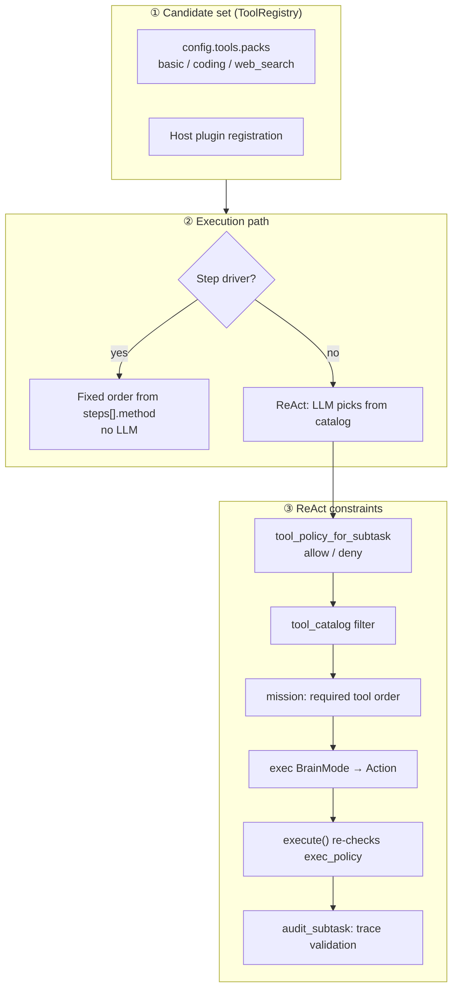
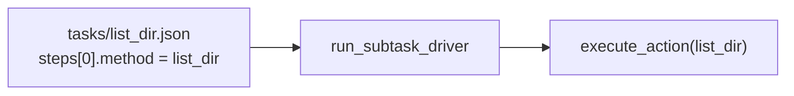

# Tool Selection (Execution Layer)

In the execution layer, **which tool to use** is determined by the **execution path** (step driver vs ReAct) and **three layers of constraints** (candidate set → subtask policy → runtime verification).

- Execution layer overview: [02_execution-layer.md](02_execution-layer.md)
- Task registry: [ideas/task-registry.md](../ideas/task-registry.md)
- Built-in tool specs: [builtin_tools/README.md](../builtin_tools/README.md)
- Japanese version: [02-01_ツールの選択.md](../architecture/02-01_ツールの選択.md)

## 1. Overview



| Stage | Who decides | What is decided |
|-------|-------------|-----------------|
| ① Candidate set | Config + host | Tool names that exist at all |
| ② Path | `use_step_driver` + task def | LLM choice vs fixed order |
| ③ Constraints (ReAct) | `tool_policy` + LLM + runtime | Per-subtask allowed tools |

## 2. Candidate Set (ToolRegistry)

The upper bound on execution-layer tools is whatever is registered in **`ToolRegistry`**.

### 2.1 Built-ins + packs

Enabled via `tools.packs` in `config/config.json` (`src/tool/pack.rs`).

| Pack | Tools |
|------|-------|
| `basic` | `echo`, `time` |
| `coding` | `list_dir`, `grep`, `read_file`, `write_file`, `run_cmd` |
| `web_search` | `web_search` (when Brave API key is set) |

Default: `basic` + `coding`. `web_search` is added when a Brave key is present.

### 2.2 Dynamic registration

- **Brave Search** — `ToolRuntime::set_brave_search` registers `web_search`
- **Host plugins** — `ToolRuntime::register_plugin` adds in-process tools (e.g. triage-mail)

### 2.3 Tool catalog

The **`Tool catalog`** in LLM prompts lists names and arg specs from the registry (`ToolRegistry::format_catalog`).

```text
Tool catalog:
- list_dir: ...
- read_file: ...
```

If the LLM returns a name not in the registry, execution fails.

## 3. Differences by Execution Path

### 3.1 Step driver — no selection (fixed)

All of:

- `react.use_step_driver: true` (default)
- Subtask has a `task` id
- `tasks/*.json` has a `steps[]` contract
- `react_only: false`



`steps[].method` **is the tool name**. Args are expanded from `params` templates (`{path}`, etc.).

Tasks with `react_only: true` use `steps[]` for mission display and audit, but run via **ReAct** (LLM fills args); the step driver is not used.

### 3.2 ReAct — LLM picks from catalog

When step-driver conditions are not met, or after driver failure fallback.

The LLM returns:

```json
{"step":"action","tool":"read_file","args":{"path":"src/lib.rs"}}
```

**The LLM chooses**, but candidates are pre-filtered as described below.

## 4. Per-Subtask tool_policy

Immediately before ReAct, `run_subtask_exec` **swaps catalog and exec policy per subtask** (`src/react.rs`).

```text
tool_policy_for_subtask(subtask)
  → blocks.tool_catalog = format_catalog_filtered(policy)  // for prompt
  → tools.set_exec_policy(policy)                          // at execute time
  → run_turn_single(mission)
  → clear policy (after subtask)
```

### 4.1 How policy is resolved

`TaskRegistry::tool_policy_for_subtask` (`src/tasks/registry.rs`):

| Subtask | Policy |
|---------|--------|
| **`task` id present** | `resolved_tool_policy()` from `tasks/*.json` `tool_policy` + `steps[].method` |
| **freeform + goal hint** | **Single-tool allow** from marker in goal |
| **plain freeform** | **No policy** → full catalog |

Freeform hint format (in goal):

```text
Execute with ReAct tools (not a registered task id): read_file ...
```

### 4.2 allow / deny semantics

`SubtaskToolPolicy::is_allowed` (`src/tasks/policy.rs`):

1. Listed in `deny` → **not allowed**
2. Empty `allow` → everything except `deny` is **allowed**
3. Non-empty `allow` → **only listed tools**

### 4.3 resolved_tool_policy composition

For registered tasks, `TaskDefinition::resolved_tool_policy`:

- Starts from `tool_policy.allow`
- **Auto-adds** each `steps[].method` to `allow`
- Applies `tool_policy.deny`

Example:

```json
"tool_policy": {
  "allow": ["get_compose_form", "get_email"],
  "deny": ["set_compose_form"]
}
```

## 5. Instructions to the LLM (mission + catalog)

On the ReAct path, the LLM uses **two sources**.

### 5.1 Tool catalog (system)

`PromptBlocks.tool_catalog` — tool list **filtered by policy**.

Rules in `REACT_SYSTEM_CORE`:

- Use only **exact names and args** from the catalog
- Read observations before returning `answer`

When Brave is enabled, `REACT_WEB_SEARCH_GUIDANCE` is appended.

### 5.2 Task contract (mission)

Built by `TaskRegistry::render_mission`:

| Block | Content |
|-------|---------|
| `## Subtask` | id / task / params / goal / done_when |
| `## Task contract` | Required order (`format_required_execution`) + tool policy text |
| `## Prior subtask results` | Prior subtask summaries |

Example required order:

```text
Required execution order (complete methods in this order; do not skip):
  1. web_search({"query":"..."})
```

Freeform display:

```text
tools: (chosen by LLM from catalog)
```

### 5.3 Harness tool_set

`prepare_harness_for_subtask` sets `HarnessState.tool_set` from policy `allow` for fixed-zone display.

## 6. Runtime and Post-Execution Checks

### 6.1 At execute time (exec_policy)

`ToolRuntime::execute` **re-checks** the tool name the LLM chose:

```text
tool 'fetch_mails' is not allowed in this subtask
```

Out-of-policy calls return failure Observations in the trace.

### 6.2 Post audit (audit_subtask)

Contract tasks use `audit_trace`:

| Check | Status |
|-------|--------|
| Required tool **call order** | Implemented |
| **Denied tools** | Implemented |
| Exact argument match | **Not implemented** |

On failure, ReAct retries with audit message in mission (max 2 attempts).

## 7. Summary by Path

| Path | Selector | Catalog | Policy | Audit |
|------|----------|---------|--------|-------|
| Step driver | **Task def** (`steps[]`) | unused | unused | `audit_trace` |
| ReAct + registered task | **LLM** | filtered | allow/deny + required order in mission | yes |
| ReAct + freeform | **LLM** | full or single-tool hint | optional | none |
| ReAct + `react_only` | **LLM** | filtered | same as registered | yes (order) |

## 8. Configuration

| Key | Effect on tool selection |
|-----|---------------------------|
| `tools.packs` | Which tool types enter the registry |
| `tools.brave_search.api_key` | Whether `web_search` exists |
| `react.use_step_driver` | Fixed-order LLM-free path for contract tasks |
| (host) `register_plugin` | Extra tools in catalog |

## 9. Source Code Map

| Concern | File / symbol |
|---------|---------------|
| Pack registration | `src/tool/pack.rs` — `apply_packs`, `ToolPack` |
| Registry / catalog | `src/tool/registry.rs` — `format_catalog_filtered` |
| Execute + policy check | `src/tool/mod.rs` — `ToolRuntime::execute`, `set_exec_policy` |
| Subtask policy resolution | `src/tasks/registry.rs` — `tool_policy_for_subtask` |
| Policy types | `src/tasks/policy.rs` — `SubtaskToolPolicy`, `resolved_tool_policy` |
| Task JSON | `tasks/*.json` — `steps[]`, `tool_policy`, `react_only` |
| Mission build | `src/tasks/registry.rs` — `render_mission` |
| Subtask entry | `src/react.rs` — `run_subtask_exec` |
| Fixed-order exec | `src/tasks/driver.rs` — `run_subtask_driver` |
| Audit | `src/tasks/audit.rs` — `audit_trace`, `audit_subtask` |
| LLM system prompt | `src/context.rs` — `REACT_SYSTEM_CORE` |

## 10. Summary

- **Step driver**: tools are **fixed** by `steps[].method` in `tasks/*.json`.
- **ReAct**: the LLM picks from catalog, but candidates are **narrowed by `tool_policy`**, and mission states **required order**.
- **Catalog filter** (prompt) and **exec_policy** (execute) provide **double enforcement** against out-of-policy calls.
- The candidate set itself comes from **config packs + plugins**; tools not in the registry cannot run.
