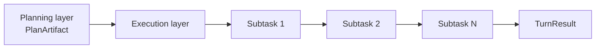
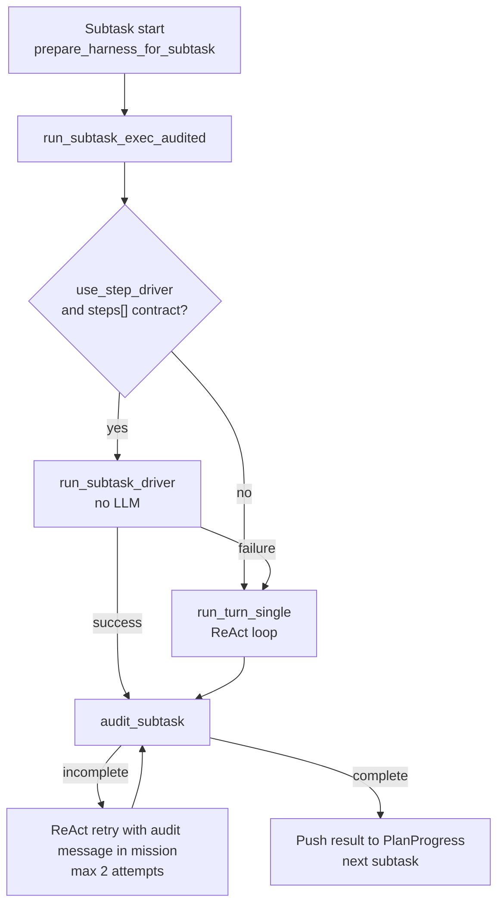
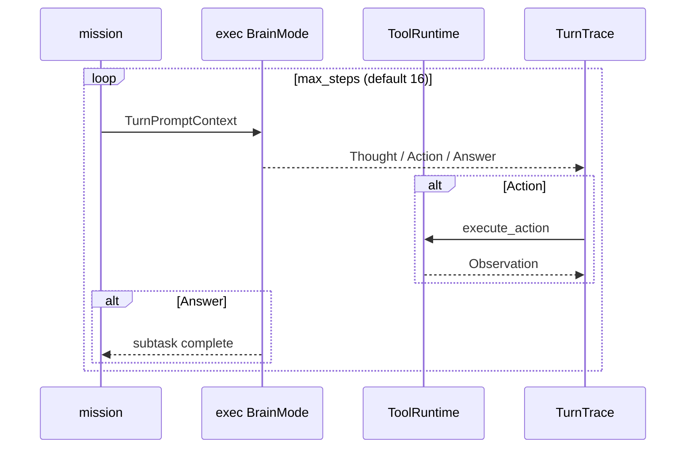
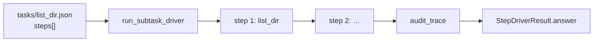
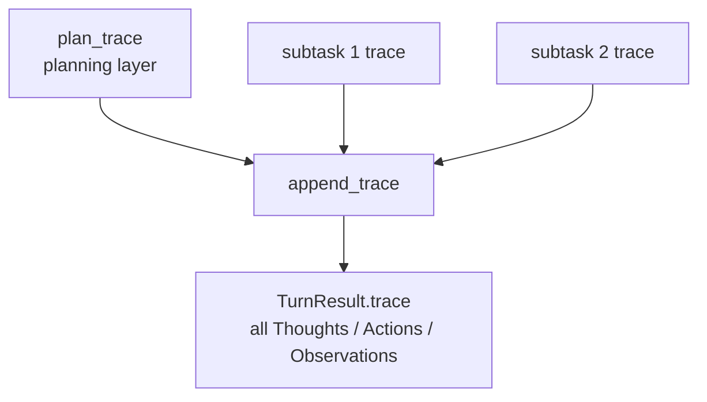

# Execution Layer

The execution layer receives `PlanArtifact` (the subtask list) from the planning layer and is the **only phase that causes side effects on the environment**. In HarnessSeed it consists mainly of a **ReAct loop** (`run_layer_loop` + `ToolRuntime`) and, for contract-backed tasks, a **step driver** (no LLM).

- Overall structure: [00_harness-seed-structure.md](00_harness-seed-structure.md)
- Planning layer: [01_planning-layer.md](01_planning-layer.md)
- Minimum action unit: [agent-minimum-action-unit.md](../agent-minimum-action-unit.md)
- ReAct implementation: [react-implementation.md](../react-implementation.md)
- Task registry: [ideas/task-registry.md](../ideas/task-registry.md)
- Outer advance loop: [advance-loop.md](../advance-loop.md)
- Tool selection: [02-01_tool-selection.md](02-01_tool-selection.md)
- Japanese version: [02_実行層.md](../architecture/02_実行層.md)

## 1. Role of the Execution Layer



| Aspect | Planning layer | Execution layer |
|--------|----------------|-----------------|
| Brain | `PlanBrainMode` | exec `BrainMode` (`exec_brain`) |
| Loop | `run_plan_layer` | `run_turn_single` → `run_layer_loop` |
| Tools | **disabled** | **enabled** (`ToolRuntime`) |
| Output | `PlanArtifact` | Per-subtask `Answer` → final turn response |
| Side effects | none | **yes** (`Action` only) |

**Principle**: file operations, shell, web search, and other external changes happen only through execution-layer `Action`s.

## 2. When the Execution Layer Runs

The execution layer runs only when `PlanArtifact::needs_execution()` is `true` after planning.

```rust
// skip_execution == false AND subtasks is not empty
pub fn needs_execution(&self) -> bool {
    !self.skip_execution && !self.subtasks.is_empty()
}
```

| Condition | Behavior |
|-----------|----------|
| `skip_execution: true` | Skip execution layer; single ReAct on original input |
| Empty `subtasks` | Same as above |
| Subtasks present | Run each subtask **serially** |

Entry points: `ReActLoop::run_turn_two_phase` or `run_turn_advance` (when `advance.enabled: true`). Both call `run_subtask_exec_audited` for each subtask after planning.

## 3. Flow for One Subtask



### 3.1 Harness State Updates

Before each subtask, `prepare_harness_for_subtask` runs:

- Set `HarnessState.current_step` to subtask id
- Inject `tool_set` from task `tool_policy`
- Put current step description into `PromptBlocks.current_step_text`

Execution-layer LLM prompts include work instructions (Harness) and current-step context.

### 3.2 Building the mission

On the ReAct path, `format_mission` builds a subtask-specific prompt:

```
## Subtask
id / task / params / goal / done_when

## Task contract
(registered task contract and required tool order)

## Prior subtask results
(summaries from PlanProgress)

Complete ONLY this subtask. Do not replan or work ahead to other subtasks.
```

Prior subtask results accumulate in `PlanProgress` and carry forward (max 500 chars per summary).

## 4. Two Execution Paths

### 4.1 ReAct Loop (Free-form)

`run_turn_single` → `run_layer_loop` (`LayerLoopOptions::exec`)



| Setting | Value (exec) |
|---------|--------------|
| `tools_enabled` | `true` |
| `context_label` | `"step"` |
| `max_thoughts` | 1 (2nd+ rejected via `__thought_limit`) |
| `max_steps` | `react.max_steps` (default 16) |

One step:

1. `AgentBrain::decide` — `Thought` / `Action` / `Answer`
2. `Action` → `execute_action(tools, &action)` → `Observation`
3. Accumulate in trace; include Observation in next prompt
4. `Answer` ends the subtask (or the turn when skipping execution)

The **minimum action unit** is one `Action` (tool call). `Thought` and `Answer` have no side effects.

### 4.2 Step Driver (Contract Execution)

When `react.use_step_driver: true` (default) and the subtask references a registered task id from `tasks/*.json` with a `steps[]` contract:



- No LLM; runs `execute_action` in `steps[]` `order`
- Args expanded from `params` templates (`{path}`, etc.)
- On failure, **falls back to ReAct**
- `generic` (`steps: []`) has no contract → always ReAct

Example (`list_dir.json`):

```json
{
  "id": "list_dir",
  "steps": [
    { "order": 1, "method": "list_dir", "args": { "path": "{path}" }, "required": true }
  ]
}
```

## 5. Tool Policy

On the ReAct path, `tool_policy` from the task definition **restricts available tools**. For the full selection model (step driver / catalog / mission / runtime checks), see [02-01_tool-selection.md](02-01_tool-selection.md).

```text
run_subtask_exec
  → tool_policy_for_subtask(subtask)
  → filter blocks.tool_catalog
  → tools.set_exec_policy(...)
  → run_turn_single
  → clear policy
```

Out-of-contract tool calls fail audit (`audit_trace`) with `complete: false`.

## 6. Audit and Retry

After each subtask, `run_subtask_exec_audited` checks the trace against the contract via `TaskRegistry::audit_subtask`.

| Check | Status |
|-------|--------|
| Required tool **call order** | Implemented |
| Forbidden tool usage | Implemented |
| Exact argument match | **Not implemented** (skeleton) |

On failure, ReAct retries with audit message in mission (`SUBTASK_AUDIT_MAX_ATTEMPTS = 2`). Retries use **ReAct only** (not the step driver).

## 7. Trace Merge for the Full Turn



At turn end, `TurnResult` includes:

| Field | Content |
|-------|---------|
| `answer` | Last subtask (or single ReAct when skipping execution) |
| `trace` | Merged planning + all subtask traces |
| `subtask_results` | Per subtask: id / answer / steps_used / used_step_driver |
| `steps_used` | Total steps (plan + execution) |

## 8. Configuration

| Key | Default | Effect on execution layer |
|-----|---------|---------------------------|
| `react.max_steps` | `16` | ReAct limit per subtask |
| `react.use_step_driver` | `true` | Run contract tasks without LLM |
| `react.show_task_execution` | `true` | Print subtask start/complete to stdout |
| `react.show_tool_output` | `true` | Print tool I/O to stderr |
| `react.two_phase` | `true` | Serial plan → execute (off = single ReAct only) |
| `react.advance.enabled` | `true` | Phased execution + `recalled` carry-forward |

## 9. Source Code Map

| Concern | File / symbol |
|---------|---------------|
| Turn orchestration | `src/react.rs` — `run_turn_two_phase`, `run_turn_advance` |
| Subtask execution | `run_subtask_exec`, `run_subtask_exec_audited` |
| ReAct loop core | `src/layer.rs` — `run_layer_loop`, `LayerLoopOptions::exec` |
| Single-loop entry | `run_turn_single` |
| Step driver | `src/tasks/driver.rs` — `run_subtask_driver` |
| Mission build | `src/plan.rs` — `format_mission`, `PlanProgress` |
| Harness state | `src/harness/state.rs` — `HarnessState`, `prepare_harness_for_subtask` |
| Tool execution | `src/tool/` — `ToolRuntime`, `execute_action` |
| Contract audit | `src/tasks/audit.rs` — `audit_trace`, `audit_subtask` |
| Task definitions | `tasks/*.json`, `src/tasks/registry.rs` |
| Action / observation | `src/action.rs` — `Action`, `Observation`, `TurnTrace` |

## 10. Summary

- The execution layer **runs PlanArtifact subtasks serially** and owns all environment side effects.
- Each subtask uses either the **step driver** (contract, no LLM) or a **ReAct loop** (free-form).
- ReAct uses the same `run_layer_loop` as planning but with `tools_enabled: true`, `exec_brain`, and `ToolRuntime`.
- `format_mission` and `HarnessState` inject per-subtask context, tool limits, and prior results into prompts.
- Failed audits trigger ReAct retries; the full-turn trace merges planning and execution layers.
