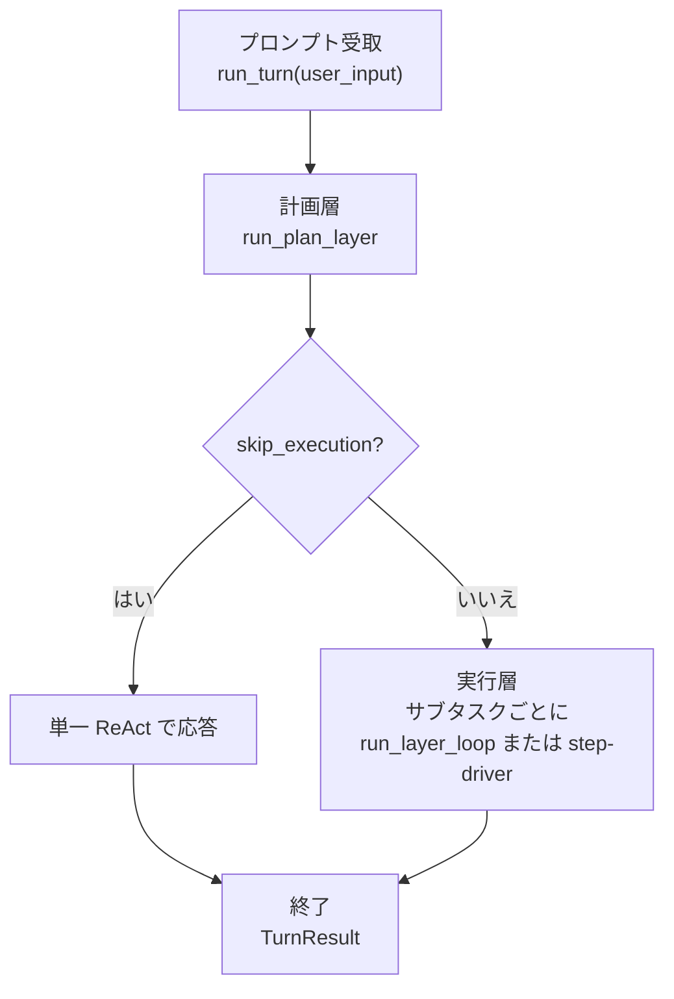
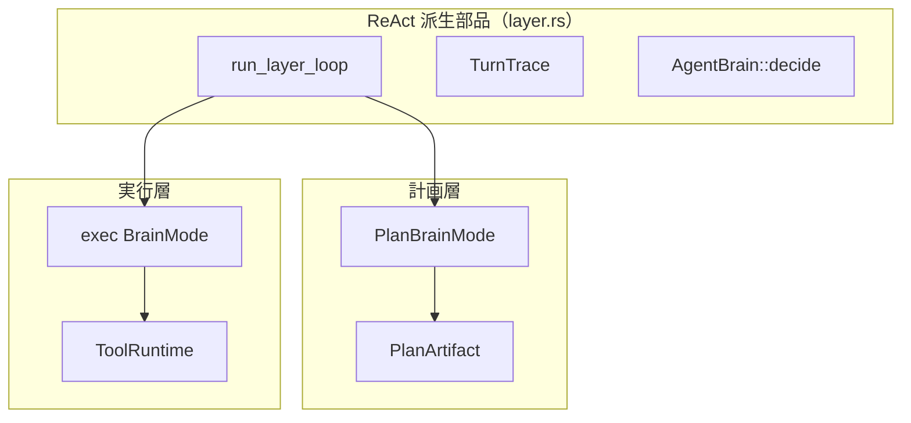
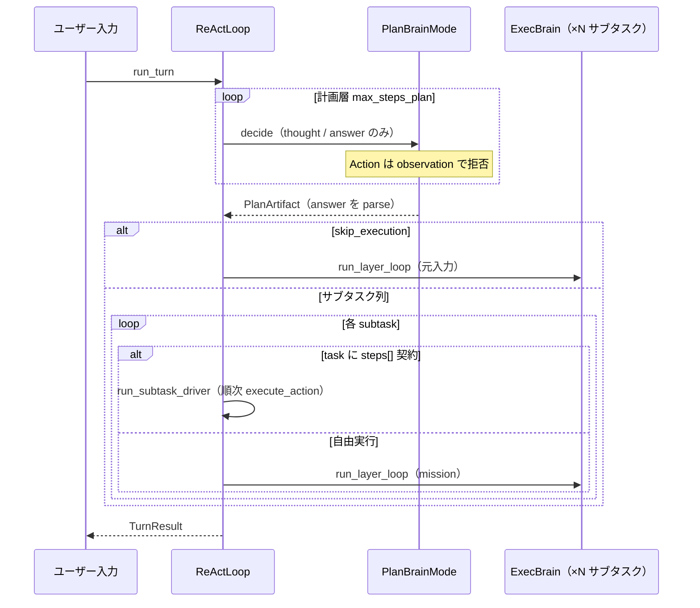
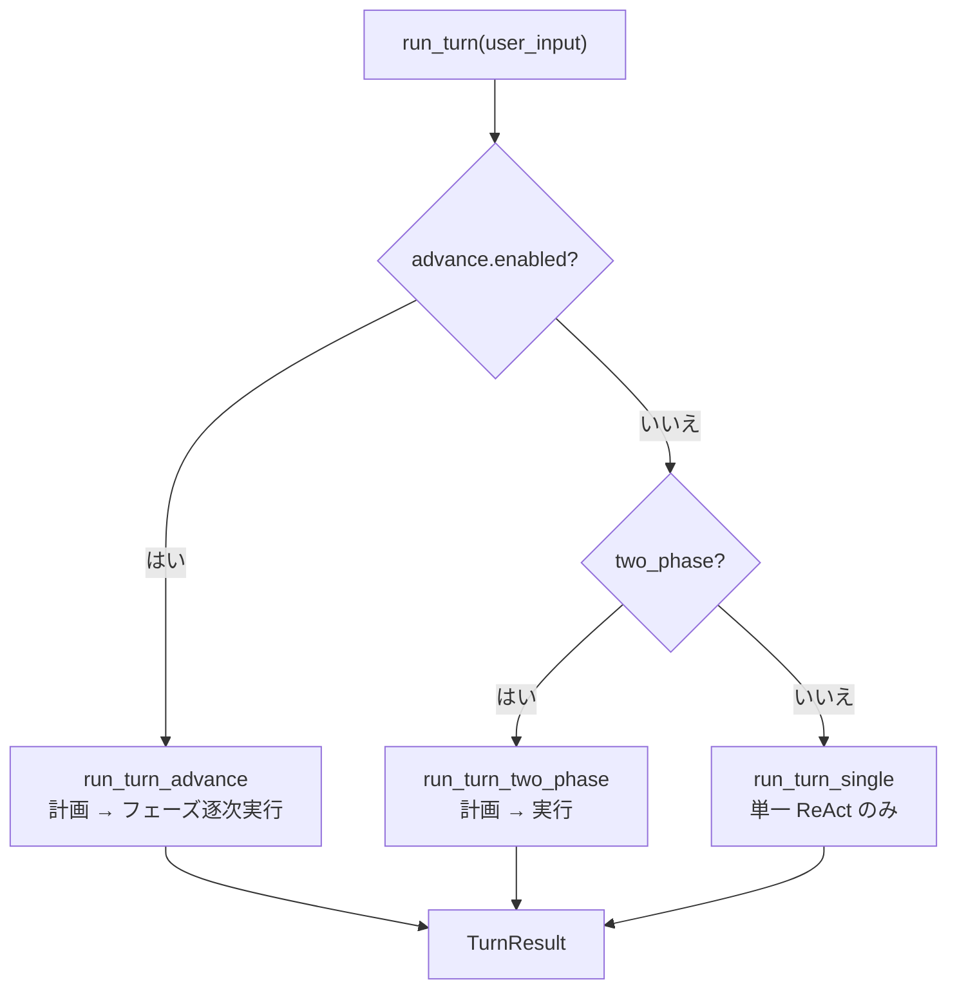
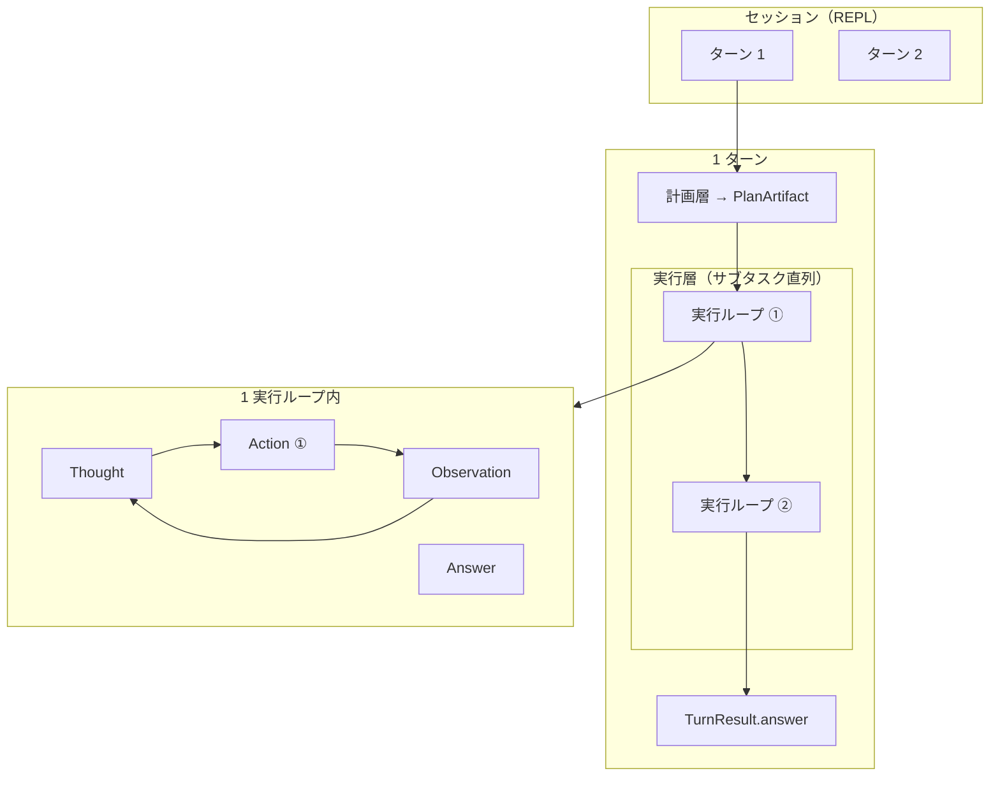

# harness-seed の構造（計画層・実行層）

HarnessSeed は **「プロンプト受取 → 計画層 → 実行層 → 終了」** という直列構成を中核とする ReAct ハーネスである。計画層と実行層はいずれも同じ ReAct ループ部品（`run_layer_loop`）を共有するが、**ツールの有無**と**出力の型**が異なる。

- 全体像（SVG）: [full_agent_architecture_v2.svg](../full_agent_architecture_v2.svg)
- 索引: [README.md](README.md)
- 最少行動単位: [agent-minimum-action-unit.md](../agent-minimum-action-unit.md)
- ReAct 実装詳細: [react-implementation.md](../react-implementation.md)
- 外側推進ループ: [advance-loop.md](../advance-loop.md)
- タスクレジストリ: [ideas/task-registry.md](../ideas/task-registry.md)
- English version: [00_harness-seed-structure.md](../architecture-en/00_harness-seed-structure.md)
- 計画層の詳細: [01_計画層.md](01_計画層.md) / [EN](../architecture-en/01_planning-layer.md)
- 実行層の詳細: [02_実行層.md](02_実行層.md) / [EN](../architecture-en/02_execution-layer.md)

## 1. 全体フロー



`src/plan.rs` の冒頭コメント:

> 計画層（ReAct 派生ループ・ツールなし）→ 実行層（ReAct + ツール）の直列オーケストレーション。

## 2. 各層の役割

| 層 | エントリ | 頭脳 | ループ | ツール | 終了条件 |
|----|----------|------|--------|--------|----------|
| **計画層** | `run_plan_layer` | `PlanBrainMode` | `run_layer_loop`（`LayerLoopOptions::plan`） | **なし** | `Answer` → `PlanArtifact` |
| **実行層** | `run_turn_two_phase` / `run_subtask_exec_audited` | exec `BrainMode` | `run_layer_loop`（`LayerLoopOptions::exec`）または **ステップドライバ** | **あり** | `Answer` → ユーザー向け応答 |

### 計画層の出力（PlanArtifact）

計画層は LLM が返した JSON をパースし、サブタスク列を組み立てる。

```json
{
  "summary": "…",
  "skip_execution": false,
  "subtasks": [
    { "id": 1, "goal": "…", "done_when": "…" }
  ]
}
```

- `skip_execution: true` … 挨拶・ヘルプなど、ツール不要な単純 Q&A
- 登録タスク id（`tasks/*.json`）を参照するサブタスクもここで列挙される

### 実行層の動き

各サブタスクについて、次のいずれかで実行する。

1. **ReAct ループ** … `format_mission` で組み立てた mission を渡し、`Thought → Action → Observation` を繰り返す
2. **ステップドライバ** … 登録タスクに `steps[]` 契約がある場合、LLM なしで契約順に `execute_action`（`react.use_step_driver` 既定 `true`）

## 3. 共通 ReAct ループ（layer.rs）

計画層・実行層は **`src/layer.rs` の `run_layer_loop`** を共有する。



| オプション | 計画層 (`plan`) | 実行層 (`exec`) |
|------------|-----------------|-----------------|
| `tools_enabled` | `false` | `true` |
| `context_label` | `"plan"` | `"step"` |
| `max_thoughts` | 1（既定） | 1（既定） |

**原則**: 計画フェーズは環境に触れない。副作用があるのは **実行フェーズの `Action` のみ**。

## 4. 1 ターン内のシーケンス（two_phase）

`react.two_phase: true`（`config/config.json` の既定）のときの流れ。



## 5. 実行モードの切り替え

`ReActLoop::run_turn`（`src/react.rs`）は設定により分岐する。



| 設定 | 既定（config.json） | 挙動 |
|------|---------------------|------|
| `react.two_phase` | `true` | 計画層 → 実行層の直列 |
| `react.advance.enabled` | `true` | 外側推進ループ（`two_phase` より優先）。各フェーズ前に `recalled` へ進捗を載せる |
| `react.use_step_driver` | `true` | 契約付きタスクを LLM なしで順次実行 |

`advance.enabled: true` のときは `two_phase` より **advance が優先**されるが、いずれも **計画層（`run_plan_layer`）を最初に通る**点は同じ。

## 6. ソースコード対応表

| 概念 | ファイル |
|------|----------|
| ターン入口 | `src/react.rs` — `run_turn`, `run_turn_two_phase`, `run_turn_advance` |
| 計画層ループ | `src/layer.rs` — `run_plan_layer`, `run_layer_loop` |
| 計画 JSON・契約 | `src/plan.rs`, `src/plan/parse.rs`, `src/plan/contract.rs` |
| Harness 状態 | `src/harness/state.rs` — `HarnessState`, `PlanArtifact` |
| 実行ツール | `src/tool/` — `ToolRuntime`, `execute_action` |
| ステップドライバ | `src/tasks/driver.rs` |
| タスク定義 | `tasks/*.json`, `src/tasks/registry.rs` |
| 最少行動単位 | `src/action.rs` — `Action`, `Observation`, `TurnTrace` |

## 7. 階層の整理



| レベル | HarnessSeed の型 | 最少行動単位か |
|--------|------------------|----------------|
| セッション | `SessionMemory` | × |
| ターン | `TurnResult` | × |
| 計画 | `PlanArtifact` | ×（ツールなし） |
| 実行ループ | 1 サブタスク分の ReAct | × |
| 行動 | `Action` + `invoke_id` | **◎** |
| 観測 | `Observation` | 行動の結果 |

## 8. まとめ

- harness-seed は **計画層・実行層の二層モデル**が中核である。
- 両層とも ReAct 派生だが、計画層は **ツールを使わず** サブタスク列を設計し、実行層だけが **ToolRuntime** で環境に触れる。
- 単純な会話は `skip_execution` で実行層を省略できる。
- 登録タスクは実行層で **ステップドライバ**（LLM なし）に落とせる。
- `advance` 有効時は、長い作業を複数フェーズに分けて `recalled` コンテキストを引き継ぎながら同じ二層構造を繰り返す。
