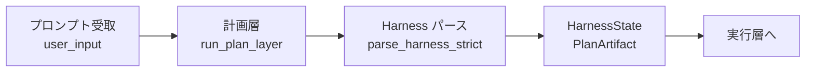
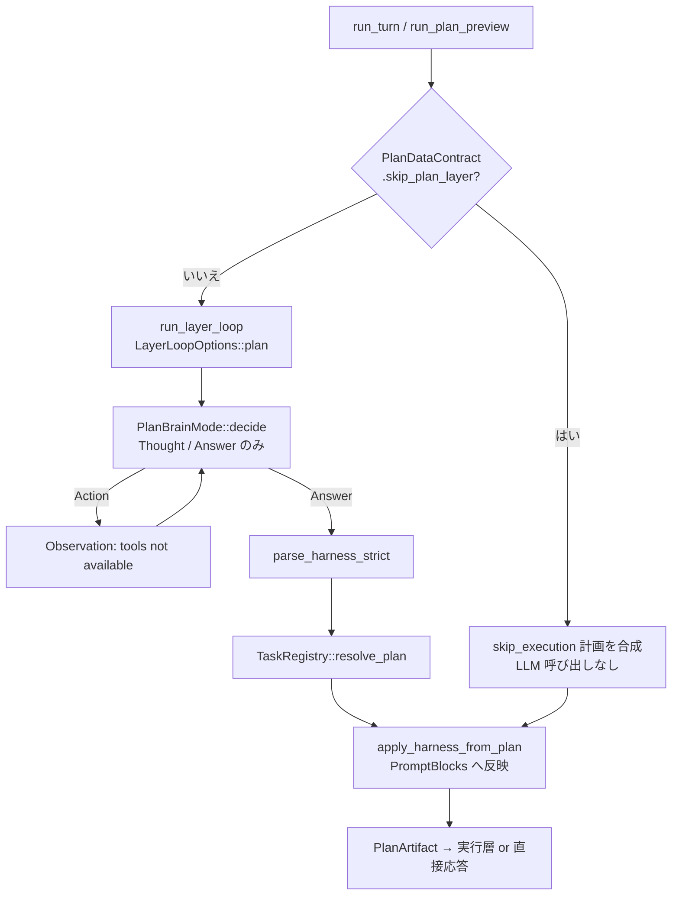
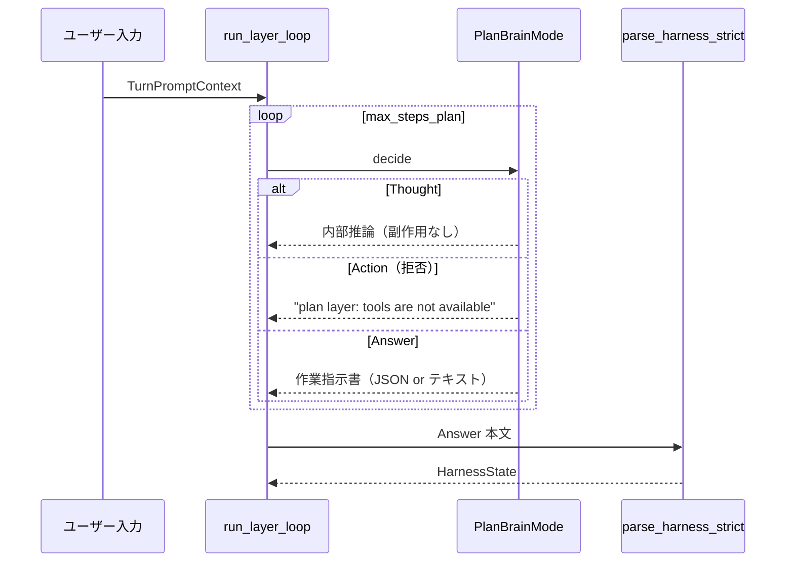
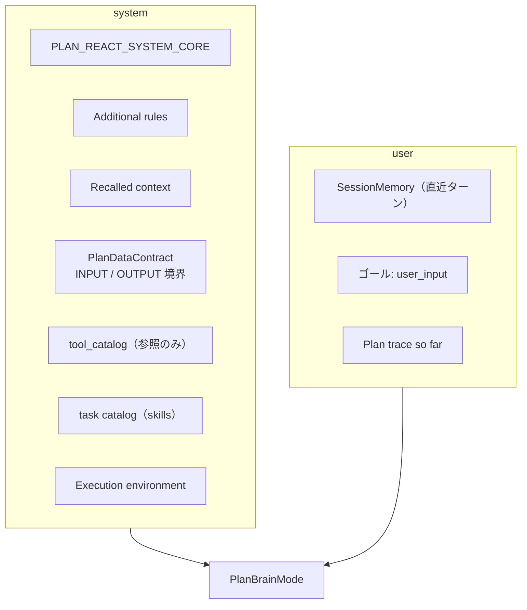
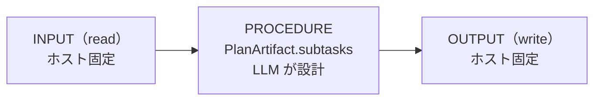
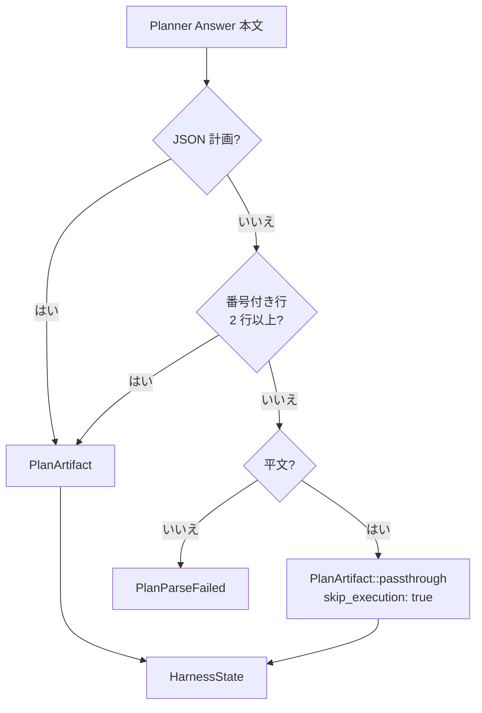
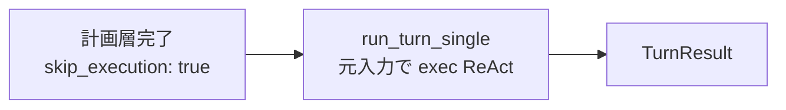

# 計画層

ユーザープロンプトを受け取り、**サブタスク列（作業指示書）を設計する**フェーズ。HarnessSeed における計画層は ReAct 派生ループ（`run_plan_layer`）で動き、**ツールを使わず**、環境への副作用を一切持たない。

- 全体構造: [00_harness-seedの構造.md](00_harness-seedの構造.md)
- 実行層: [02_実行層.md](02_実行層.md)
- 全体像（SVG）: [full_agent_architecture_v2.svg](../full_agent_architecture_v2.svg)
- 最少行動単位: [agent-minimum-action-unit.md](../agent-minimum-action-unit.md)
- タスクレジストリ: [ideas/task-registry.md](../ideas/task-registry.md)
- English version: [01_planning-layer.md](../architecture-en/01_planning-layer.md)

## 1. 計画層の位置づけ



| 項目 | 計画層 | 実行層 |
|------|--------|--------|
| 頭脳 | `PlanBrainMode` | exec `BrainMode` |
| ループ | `run_plan_layer` | `run_layer_loop`（exec） |
| ツール | **不可** | **可** |
| 出力 | `PlanArtifact` | ユーザー向け `Answer` |
| 副作用 | **なし** | **あり** |

**原則**: 計画層が設計するのは **手順（PROCEDURE）だけ**。データの読み元（INPUT）と書き込み先（OUTPUT）はホストが固定し、LLM は変更しない。

## 2. 処理フロー



### 2.1 エントリポイント

| API | 用途 |
|-----|------|
| `run_plan_layer` | 計画層ループ + Harness パース（`layer.rs`） |
| `run_plan_preview` | 計画のみ実行、実行層には進まない（`react.rs`） |
| `run_turn_two_phase` / `run_turn_advance` | 計画層のあと実行層へ直列接続 |

### 2.2 計画層スキップ

`PlanDataContract::skip_plan_layer()` が `true`（挨拶・雑談など `skip_execution: true` の trivial chat）のとき、LLM を呼ばず即座に以下を合成する。

```rust
PlanArtifact {
    summary: "direct chat".into(),
    skip_execution: true,
    subtasks: vec![],
}
```

## 3. ReAct ループ（plan モード）

計画層も `run_layer_loop` を使うが、`LayerLoopOptions::plan` により実行層と区別される。

| 設定 | 値（plan） |
|------|------------|
| `tools_enabled` | `false` |
| `context_label` | `"plan"` |
| `max_thoughts` | 1 |
| `max_steps` | `react.max_steps_plan`（既定 4） |



LLM が返すステップ形式（`PlanBrainMode` / `PLAN_REACT_SYSTEM_CORE`）:

```json
{"step":"thought","content":"<reasoning>"}
{"step":"answer","content":"<作業指示書>"}
```

`Action` / ツール呼び出しは Observation で拒否される。

## 4. Planner 固定ゾーン（プロンプト構成）

計画層の LLM プロンプトは **Planner 固定ゾーン** + ユーザーゴール + 計画 trace で構成される（`plan/prompt.rs`）。



ホスト（アプリ）が `PromptBlocks` に載せる主なブロック:

| ブロック | 役割 |
|----------|------|
| `plan_data_contract` | INPUT（read）/ OUTPUT（write）の固定境界 |
| `plan_task_catalog` | 登録タスク一覧（skills） |
| `tool_catalog` | ツール定義（計画層では実行不可・参照用） |
| `recalled` | 参照メール等の長文コンテキスト |
| `rules` | 追加ルール |

## 5. データ契約（INPUT / PROCEDURE / OUTPUT）

`PlanDataContract`（`plan/contract.rs`）は 1 ターン分の read / write を LLM に推測させない。



| 層 | 例 | 誰が決める |
|----|-----|-----------|
| **INPUT** | `UserMessage`, `ImapEmail { uid }`, `LocalMailDb` | ホスト |
| **PROCEDURE** | サブタスク列、`task` id、`goal`, `done_when` | **計画層 LLM** |
| **OUTPUT** | `ChatOnly`, `ComposeForm`, `MailDb` | ホスト |

契約はプロンプトに `format_for_planner()` で展開され、LLM には「INPUT からだけ読み、OUTPUT にだけ書け、間の手順だけ設計せよ」と指示される。

## 6. 計画のパース（Harness パース）

Planner の `Answer` 本文は `parse_harness_strict`（`harness/parse.rs`）で `HarnessState` に変換される。



### 6.1 受け付ける計画 JSON 形式

**形式 A** — `PlanArtifact` 直接:

```json
{
  "summary": "…",
  "skip_execution": false,
  "subtasks": [
    { "id": 1, "task": "list_dir", "params": {"path": "src"}, "goal": "…", "done_when": "…" }
  ]
}
```

**形式 B** — フロー形式（`input` / `steps` / `output`）:

```json
{
  "input": ["read: user_message"],
  "steps": [
    { "id": 1, "task": "web_research", "params": {"query": "…"}, "goal": "", "done_when": "" }
  ],
  "output": "write: chat_only",
  "skip_execution": false
}
```

パース失敗時は JSON 修復・複数 JSON オブジェクト抽出（`extract_json_objects`）を試みる。

### 6.2 PlanArtifact の意味

| フィールド | 説明 |
|------------|------|
| `summary` | 計画の要約 |
| `skip_execution` | `true` なら実行層を省略し直接応答 |
| `subtasks` | 直列実行するサブタスク列（id は 1 始まり・一意） |

`needs_execution()` = `!skip_execution && !subtasks.is_empty()`

### 6.3 HarnessState

パース後の内部状態。実行層・プロンプト注入に使われる。

| フィールド | 説明 |
|------------|------|
| `work_instructions` | Planner 生テキスト |
| `plan` | パース済み `PlanArtifact` |
| `current_step` / `total_steps` | 実行進捗 |
| `tool_set` | 現在ステップのツール制限 |
| `references` | 参照文書（メール等） |
| `status` | `Ready` / `Executing` / `Completed` / `Aborted` |

## 7. 計画後の反映

`apply_harness_from_plan`（`react.rs`）が計画結果を実行層向けプロンプトへ載せる。

1. `TaskRegistry::resolve_plan` — タスク id の正規化・契約との整合
2. `blocks.work_instructions_text` — 作業指示書テキスト
3. `harness.begin_execution()` — サブタスクありなら `status = Executing`
4. `sync_harness_step_to_blocks` — 現在ステップ説明を `current_step_text` へ

参照情報（`HarnessReference`）は計画開始前に `recalled` へ載せ、Harness にもマージされる。

## 8. PlanBrainMode（頭脳）

| モード | 用途 |
|--------|------|
| `Rule(RulePlanBrain)` | `--no-llm` / ルールのみ。help・echo は即 `skip_execution` |
| `Llm(PlanLlmBrain)` | 本番 LLM。タスクカタログ付きプロンプト |
| `Mock` | 統合テスト用 |

ルール頭脳の典型フロー:

1. 初回 `Thought`（「依頼をサブタスクに分解する」）
2. 次ステップで `Answer`（単一サブタスク JSON）

## 9. skip_execution 時の分岐

計画層完了後、`PlanArtifact::needs_execution()` が `false` のとき:



実行層のサブタスク列は使わず、**実行頭脳だけ**が元プロンプトに直接応答する（挨拶・自己紹介・平文 passthrough など）。

## 10. 設定項目

| キー | 既定 | 計画層への影響 |
|------|------|----------------|
| `react.max_steps_plan` | `4` | 計画 ReAct の最大ステップ |
| `react.two_phase` | `true` | オフ時は計画層自体をスキップ |
| `react.show_plan` | `true` | `PlanArtifact` を stdout 表示 |
| `react.show_prompt` | `false` | 計画層プロンプトを stderr 表示 |
| `llm.*` | — | `PlanLlmBrain` のコネクタ設定 |

## 11. ソースコード対応表

| 処理 | ファイル・シンボル |
|------|-------------------|
| 計画層ループ | `src/layer.rs` — `run_plan_layer`, `LayerLoopOptions::plan` |
| 計画モジュール | `src/plan.rs` |
| 頭脳 | `src/plan/brain.rs` — `PlanBrainMode`, `RulePlanBrain`, `PlanLlmBrain` |
| プロンプト | `src/plan/prompt.rs` — `build_plan_layer_messages` |
| データ契約 | `src/plan/contract.rs` — `PlanDataContract` |
| JSON パース | `src/plan/parse.rs` — `parse_plan` |
| ReAct ステップパース | `src/plan/parse_step.rs` — `parse_plan_agent_step` |
| Harness パース | `src/harness/parse.rs` — `parse_harness_strict` |
| 内部状態 | `src/harness/state.rs` — `HarnessState` |
| オーケストレーション | `src/react.rs` — `run_turn_two_phase`, `apply_harness_from_plan`, `run_plan_preview` |
| タスク解決 | `src/tasks/registry.rs` — `resolve_plan`, `catalog_for_planner` |

## 12. まとめ

- 計画層は **サブタスク列（作業指示書）を設計する**だけで、ツールは使わない。
- ReAct ループは実行層と共通だが `tools_enabled: false`。
- INPUT / OUTPUT はホスト固定、LLM が設計するのは **PROCEDURE（subtasks）** のみ。
- Planner 出力は JSON・番号付きテキスト・平文 passthrough の順でパースされる。
- `skip_execution` なら実行層を省略し、exec 頭脳が直接応答する。
- パース結果は `HarnessState` として実行層プロンプト（作業指示書・現在ステップ）に引き渡される。
