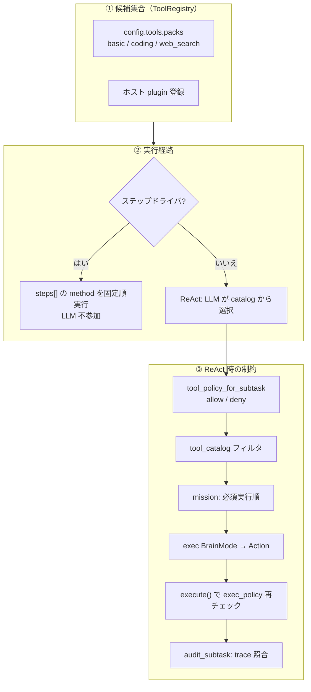
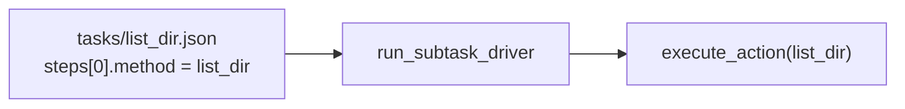

# ツールの選択（実行層）

実行層で「どのツールを使うか」は、**経路（ステップドライバ / ReAct）** と **3 段階の制約（候補集合 → サブタスクポリシー → 実行時検証）** で決まる。

- 実行層全体: [02_実行層.md](02_実行層.md)
- タスクレジストリ: [ideas/task-registry.md](../ideas/task-registry.md)
- 組み込みツール仕様: [builtin_tools/README.md](../builtin_tools/README.md)
- English version: [02-01_tool-selection.md](../architecture-en/02-01_tool-selection.md)

## 1. 全体像



| 段階 | 誰が決める | 何を決める |
|------|------------|------------|
| ① 候補集合 | 設定 + ホスト | そもそも存在するツール名 |
| ② 経路 | `use_step_driver` + タスク定義 | LLM が選ぶか、固定順か |
| ③ 制約（ReAct） | `tool_policy` + LLM + ランタイム | サブタスクごとの利用可能ツール |

## 2. 候補集合（ToolRegistry）

実行層が触れるツールの上限は **`ToolRegistry`** に登録されたものだけ。

### 2.1 組み込み + パック

`config/config.json` の `tools.packs` で有効化（`src/tool/pack.rs`）。

| パック | ツール |
|--------|--------|
| `basic` | `echo`, `time` |
| `coding` | `list_dir`, `grep`, `read_file`, `write_file`, `run_cmd` |
| `web_search` | `web_search`（Brave API キーがあるとき） |

既定は `basic` + `coding`。Brave キーがあれば `web_search` も追加される。

### 2.2 動的追加

- **Brave Search 有効化** — `ToolRuntime::set_brave_search` で `web_search` をレジストリに登録
- **ホスト plugin** — `ToolRuntime::register_plugin` で in-process ツールを追加（triage-mail 等）

### 2.3 Tool catalog

LLM プロンプトに載る **`Tool catalog`** は、レジストリ内ツールの名前と引数仕様を列挙したテキスト（`ToolRegistry::format_catalog`）。

```text
Tool catalog:
- list_dir: ...
- read_file: ...
```

catalog に無いツール名を LLM が返しても、レジストリ側で実行失敗する。

## 3. 実行経路による違い

### 3.1 ステップドライバ — 選択なし（固定）

条件（すべて満たす）:

- `react.use_step_driver: true`（既定）
- サブタスクに `task` id がある
- `tasks/*.json` に `steps[]` 契約がある
- `react_only: false`



`steps[].method` が **そのままツール名**。引数は `params` をテンプレート展開（`{path}` 等）。

`react_only: true` のタスクは契約表示・監査に `steps[]` を使うが、**LLM が引数を埋める ReAct 経路**（ステップドライバは使わない）。

### 3.2 ReAct — LLM が catalog から選択

条件: 上記ステップドライバ条件を満たさない、またはドライバ失敗後のフォールバック。

LLM は `REACT_SYSTEM_CORE` に従い、次の JSON を返す:

```json
{"step":"action","tool":"read_file","args":{"path":"src/lib.rs"}}
```

**選ぶ主体は LLM** だが、次節のポリシーと catalog フィルタで候補は先に絞られる。

## 4. サブタスクごとの tool_policy

ReAct 実行の直前、`run_subtask_exec` が **サブタスク単位**で catalog と実行ポリシーを差し替える（`src/react.rs`）。

```text
tool_policy_for_subtask(subtask)
  → blocks.tool_catalog = format_catalog_filtered(policy)  // プロンプト用
  → tools.set_exec_policy(policy)                          // 実行時用
  → run_turn_single(mission)
  → ポリシー解除（サブタスク終了後）
```

### 4.1 ポリシーの決まり方

`TaskRegistry::tool_policy_for_subtask`（`src/tasks/registry.rs`）:

| サブタスク | ポリシー |
|------------|----------|
| **`task` id あり** | `tasks/*.json` の `tool_policy` + `steps[].method` から `resolved_tool_policy()` |
| **freeform + goal ヒント** | goal 内マーカーから **1 ツールだけ allow** |
| **freeform 通常** | ポリシー **なし** → catalog 全ツール |

freeform ヒントの形式（goal 内）:

```text
Execute with ReAct tools (not a registered task id): read_file ...
```

### 4.2 allow / deny の意味

`SubtaskToolPolicy::is_allowed`（`src/tasks/policy.rs`）:

1. `deny` に載っていれば **不可**
2. `allow` が空 → deny 以外は **全部可**
3. `allow` あり → **リスト内のみ可**

### 4.3 resolved_tool_policy の合成

登録タスクでは `TaskDefinition::resolved_tool_policy` が:

- `tool_policy.allow` をベースに
- `steps[].method` を **自動で allow に追加**
- `tool_policy.deny` を適用

例（`compose_context` 系）:

```json
"tool_policy": {
  "allow": ["get_compose_form", "get_email"],
  "deny": ["set_compose_form"]
}
```

## 5. LLM への指示（mission + catalog）

ReAct 経路では、LLM は **2 つの情報源**からツールを選ぶ。

### 5.1 Tool catalog（system）

`PromptBlocks.tool_catalog` — ポリシーで **フィルタ済み**のツール一覧。

`REACT_SYSTEM_CORE` のルール:

- catalog に載っている **正確な名前と args のみ**使う
- 観測（Observation）を見てから `answer` する

Brave 有効時は `REACT_WEB_SEARCH_GUIDANCE` が追記される。

### 5.2 Task contract（mission）

`TaskRegistry::render_mission` が組み立てる mission に含まれる:

| ブロック | 内容 |
|----------|------|
| `## Subtask` | id / task / params / goal / done_when |
| `## Task contract` | 必須実行順（`format_required_execution`）+ tool policy 文 |
| `## Prior subtask results` | 先行サブタスクの要約 |

登録タスクの必須順の例:

```text
Required execution order (complete methods in this order; do not skip):
  1. web_search({"query":"..."})

Done when all above: ...
```

freeform（`task` id なし）の表示:

```text
tools: (chosen by LLM from catalog)
```

### 5.3 Harness の tool_set

`prepare_harness_for_subtask` で `HarnessState.tool_set` に policy の `allow` 一覧を載せ、固定ゾーン表示に使う（プロンプトの補助情報）。

## 6. 実行時・事後の検証

### 6.1 実行時（exec_policy）

`ToolRuntime::execute` — LLM が選んだツール名を **再度チェック**:

```text
tool 'fetch_mails' is not allowed in this subtask
```

ポリシー外は Observation として failure が返り、trace に残る。

### 6.2 事後監査（audit_subtask）

契約付きタスクは `audit_trace` で trace を照合:

| チェック | 状態 |
|----------|------|
| 必須ツールの **呼び出し順序** | 実装済み |
| **禁止ツール**（deny）の使用 | 実装済み |
| 引数の完全一致 | **未実装** |

未達時は監査メッセージ付き mission で ReAct 再試行（最大 2 回）。

## 7. 経路別まとめ

| 経路 | 選定主体 | catalog | policy | 監査 |
|------|----------|---------|--------|------|
| ステップドライバ | **タスク定義**（`steps[]`） | 使わない | 使わない | `audit_trace` |
| ReAct + 登録タスク | **LLM** | フィルタあり | allow/deny + 必須順 mission | あり |
| ReAct + freeform | **LLM** | 全ツール or 1 ツール hint | 任意 | 契約なし |
| ReAct + `react_only` | **LLM** | フィルタあり | 同上 | あり（順序） |

## 8. 設定との対応

| キー | ツール選択への影響 |
|------|-------------------|
| `tools.packs` | レジストリに載るツール種別 |
| `tools.brave_search.api_key` | `web_search` の有無 |
| `react.use_step_driver` | 契約タスクを LLM なし固定順にするか |
| （ホスト）`register_plugin` | 追加ツールを catalog に載せる |

## 9. ソースコード対応表

| 処理 | ファイル・シンボル |
|------|-------------------|
| パック登録 | `src/tool/pack.rs` — `apply_packs`, `ToolPack` |
| レジストリ / catalog | `src/tool/registry.rs` — `format_catalog_filtered` |
| 実行 + policy 検証 | `src/tool/mod.rs` — `ToolRuntime::execute`, `set_exec_policy` |
| サブタスク policy 解決 | `src/tasks/registry.rs` — `tool_policy_for_subtask` |
| policy 定義 | `src/tasks/policy.rs` — `SubtaskToolPolicy`, `resolved_tool_policy` |
| タスク JSON | `tasks/*.json` — `steps[]`, `tool_policy`, `react_only` |
| mission 組み立て | `src/tasks/registry.rs` — `render_mission` |
| サブタスク実行入口 | `src/react.rs` — `run_subtask_exec` |
| 固定順実行 | `src/tasks/driver.rs` — `run_subtask_driver` |
| 監査 | `src/tasks/audit.rs` — `audit_trace`, `audit_subtask` |
| LLM system 指示 | `src/context.rs` — `REACT_SYSTEM_CORE` |

## 10. まとめ

- **ステップドライバ**ではツールは `tasks/*.json` の `steps[].method` で **事前固定**。
- **ReAct**では LLM が catalog から選ぶが、**候補は `tool_policy` で絞られ**、mission に **必須順**が載る。
- **catalog フィルタ**（プロンプト）と **exec_policy**（実行時）の **二重チェック**でポリシー外呼び出しを防ぐ。
- 候補集合そのものは **config packs + plugin** で決まり、catalog に無いツールは実行できない。
