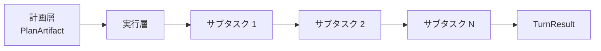
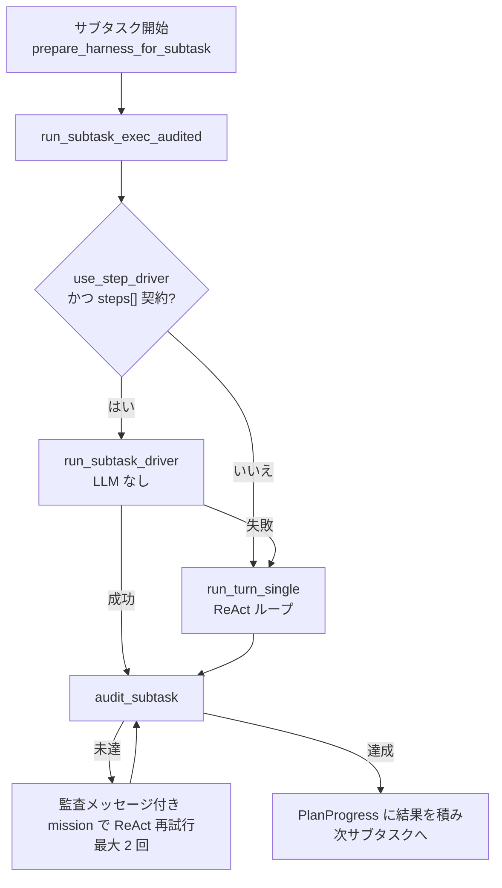
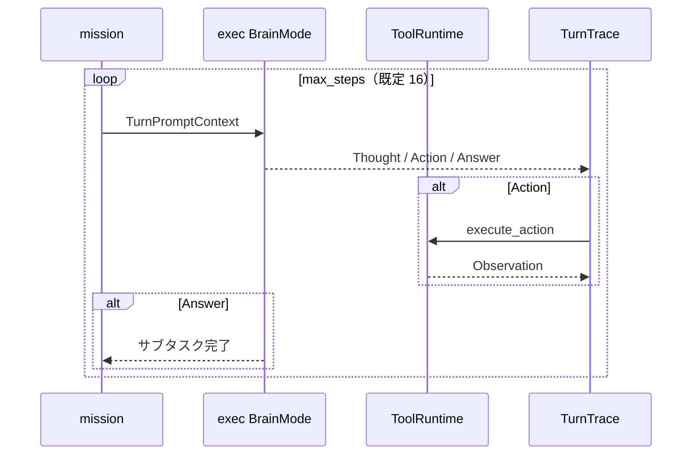
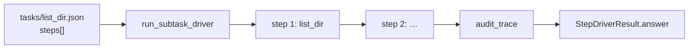
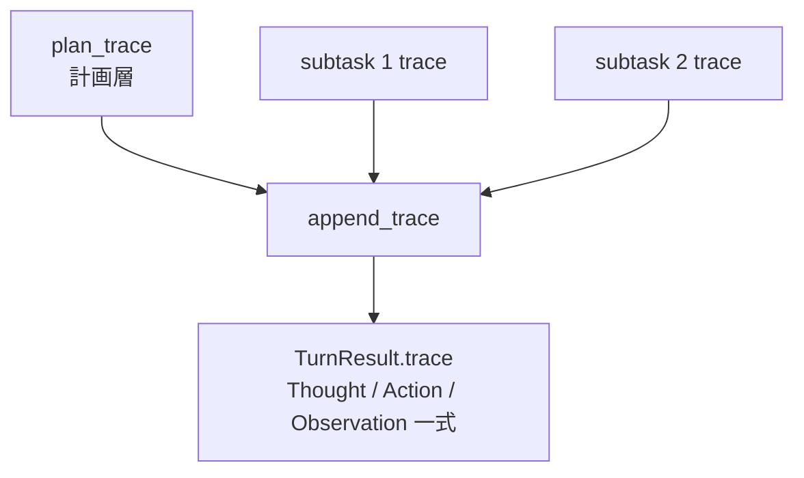

# 実行層

計画層が出力した `PlanArtifact`（サブタスク列）を受け取り、**環境に副作用を与える唯一のフェーズ**として動作する。HarnessSeed における実行層は、主に **ReAct ループ**（`run_layer_loop` + `ToolRuntime`）と、契約付きタスク向けの **ステップドライバ**（LLM なし）の二経路で構成される。

- 全体構造: [00_harness-seedの構造.md](00_harness-seedの構造.md)
- 計画層: [01_計画層.md](01_計画層.md)
- 最少行動単位: [agent-minimum-action-unit.md](../agent-minimum-action-unit.md)
- ReAct 実装: [react-implementation.md](../react-implementation.md)
- タスクレジストリ: [ideas/task-registry.md](../ideas/task-registry.md)
- 外側推進ループ: [advance-loop.md](../advance-loop.md)
- ツールの選択: [02-01_ツールの選択.md](02-01_ツールの選択.md)
- English version: [02_execution-layer.md](../architecture-en/02_execution-layer.md)

## 1. 実行層の位置づけ



| 項目 | 計画層 | 実行層 |
|------|--------|--------|
| 頭脳 | `PlanBrainMode` | exec `BrainMode`（`exec_brain`） |
| ループ | `run_plan_layer` | `run_turn_single` → `run_layer_loop` |
| ツール | **不可** | **可**（`ToolRuntime`） |
| 出力 | `PlanArtifact` | 各サブタスクの `Answer` → ターン最終応答 |
| 副作用 | なし | **あり**（`Action` のみ） |

**原則**: ファイル操作・シェル・Web 検索など、外部世界への変更は実行層の `Action` だけが行う。

## 2. いつ実行層が動くか

計画層の結果 `PlanArtifact::needs_execution()` が `true` のときだけ実行層に入る。

```rust
// skip_execution == false かつ subtasks が空でない
pub fn needs_execution(&self) -> bool {
    !self.skip_execution && !self.subtasks.is_empty()
}
```

| 条件 | 挙動 |
|------|------|
| `skip_execution: true` | 実行層を省略。元入力に対して単一 ReAct で直接応答 |
| `subtasks` が空 | 同上 |
| サブタスクあり | 各サブタスクを **直列** に実行 |

エントリは `ReActLoop::run_turn_two_phase` または `run_turn_advance`（`advance.enabled: true` 時）。いずれも計画層のあと、同じ `run_subtask_exec_audited` 経由でサブタスクを回す。

## 3. サブタスク 1 件の実行フロー



### 3.1 Harness 状態の更新

各サブタスクの直前に `prepare_harness_for_subtask` が呼ばれる。

- `HarnessState.current_step` をサブタスク id に設定
- タスクの `tool_policy` から `tool_set` を注入
- `PromptBlocks.current_step_text` に現在ステップの説明を載せる

実行層の LLM プロンプトには、作業指示書（Harness）と現在ステップの文脈が含まれる。

### 3.2 mission の組み立て

ReAct 経路では `format_mission` がサブタスク専用プロンプトを生成する。

```
## Subtask
id / task / params / goal / done_when

## Task contract
（登録タスクの契約・必須ツール順）

## Prior subtask results
（先行サブタスクの要約 — PlanProgress）

Complete ONLY this subtask. Do not replan or work ahead to other subtasks.
```

先行サブタスクの結果は `PlanProgress` に蓄積され、次サブタスクの mission に引き継がれる（各要約最大 500 文字）。

## 4. 二つの実行経路

### 4.1 ReAct ループ（自由実行）

`run_turn_single` → `run_layer_loop`（`LayerLoopOptions::exec`）



| 設定 | 値（exec） |
|------|------------|
| `tools_enabled` | `true` |
| `context_label` | `"step"` |
| `max_thoughts` | 1（2 回目以降は `__thought_limit` で拒否） |
| `max_steps` | `react.max_steps`（既定 16） |

1 ステップの流れ:

1. `AgentBrain::decide` — `Thought` / `Action` / `Answer` のいずれか
2. `Action` → `execute_action(tools, &action)` → `Observation`
3. trace に蓄積し、次ステップのプロンプトに Observation を含める
4. `Answer` で当該サブタスク（または skip 時のターン）終了

**最少行動単位**は 1 回の `Action`（ツール呼び出し）。`Thought` と `Answer` は副作用なし。

### 4.2 ステップドライバ（契約実行）

`react.use_step_driver: true`（既定）かつ、サブタスクが `tasks/*.json` の登録タスク id を持ち、`steps[]` 契約がある場合。



- LLM を呼ばず、`steps[]` の `order` 順に `execute_action` を実行
- 引数は `params` をテンプレート展開（`{path}` など）
- 失敗時は **ReAct にフォールバック**
- `generic`（`steps: []`）は契約なし → 常に ReAct

例（`list_dir.json`）:

```json
{
  "id": "list_dir",
  "steps": [
    { "order": 1, "method": "list_dir", "args": { "path": "{path}" }, "required": true }
  ]
}
```

## 5. ツールポリシー

ReAct 経路では、サブタスクに紐づくタスク定義の `tool_policy` により **利用可能ツールを絞り込む**。選定の全体像（ステップドライバ / catalog / mission / 実行時検証）は [02-01_ツールの選択.md](02-01_ツールの選択.md) を参照。

```text
run_subtask_exec
  → tool_policy_for_subtask(subtask)
  → blocks.tool_catalog をフィルタ
  → tools.set_exec_policy(...)
  → run_turn_single
  → ポリシー解除
```

契約外ツールの呼び出しは監査（`audit_trace`）で `complete: false` になる。

## 6. 監査と再試行

`run_subtask_exec_audited` はサブタスク完了後、`TaskRegistry::audit_subtask` で trace を契約と照合する。

| 照合内容 | 状態 |
|----------|------|
| 必須ツールの **呼び出し順序** | 実装済み |
| 禁止ツールの使用 | 実装済み |
| 引数の完全一致 | **未実装**（スケルトン） |

未達の場合、監査メッセージを mission に付加して ReAct で再実行（`SUBTASK_AUDIT_MAX_ATTEMPTS = 2`）。再試行は **ReAct のみ**（ステップドライバは使わない）。

## 7. 1 ターン全体の trace マージ



ターン終了時、`TurnResult` には以下が含まれる。

| フィールド | 内容 |
|------------|------|
| `answer` | 最後のサブタスク（または skip 時の単一 ReAct）の応答 |
| `trace` | 計画層 + 全サブタスクの trace をマージ |
| `subtask_results` | 各サブタスクの id / answer / steps_used / used_step_driver |
| `steps_used` | 計画 + 実行の合計ステップ数 |

## 8. 設定項目

| キー | 既定 | 実行層への影響 |
|------|------|----------------|
| `react.max_steps` | `16` | 1 サブタスクあたりの ReAct 上限 |
| `react.use_step_driver` | `true` | 契約タスクを LLM なしで実行するか |
| `react.show_task_execution` | `true` | サブタスク開始・完了を stdout 表示 |
| `react.show_tool_output` | `true` | ツール入出力を stderr 表示 |
| `react.two_phase` | `true` | 計画→実行の直列（オフ時は実行層単体 ReAct のみ） |
| `react.advance.enabled` | `true` | フェーズ逐次実行 + `recalled` 引き継ぎ |

## 9. ソースコード対応表

| 処理 | ファイル・シンボル |
|------|-------------------|
| ターンオーケストレーション | `src/react.rs` — `run_turn_two_phase`, `run_turn_advance` |
| サブタスク実行 | `run_subtask_exec`, `run_subtask_exec_audited` |
| ReAct ループ本体 | `src/layer.rs` — `run_layer_loop`, `LayerLoopOptions::exec` |
| 単一ループ入口 | `run_turn_single` |
| ステップドライバ | `src/tasks/driver.rs` — `run_subtask_driver` |
| mission 生成 | `src/plan.rs` — `format_mission`, `PlanProgress` |
| Harness 状態 | `src/harness/state.rs` — `HarnessState`, `prepare_harness_for_subtask` |
| ツール実行 | `src/tool/` — `ToolRuntime`, `execute_action` |
| 契約照合 | `src/tasks/audit.rs` — `audit_trace`, `audit_subtask` |
| タスク定義 | `tasks/*.json`, `src/tasks/registry.rs` |
| 行動・観測 | `src/action.rs` — `Action`, `Observation`, `TurnTrace` |

## 10. まとめ

- 実行層は **PlanArtifact のサブタスクを直列実行**し、環境への副作用を担う。
- 各サブタスクは **ステップドライバ**（契約あり・LLM なし）か **ReAct ループ**（自由実行）のどちらかで処理される。
- ReAct ループは計画層と同じ `run_layer_loop` だが、`tools_enabled: true` で `exec_brain` + `ToolRuntime` を使う。
- `format_mission` と `HarnessState` により、サブタスク単位の文脈・ツール制限・先行結果がプロンプトに注入される。
- 契約未達時は監査付き ReAct 再試行があり、ターン全体の trace は計画層と実行層をマージして残る。
