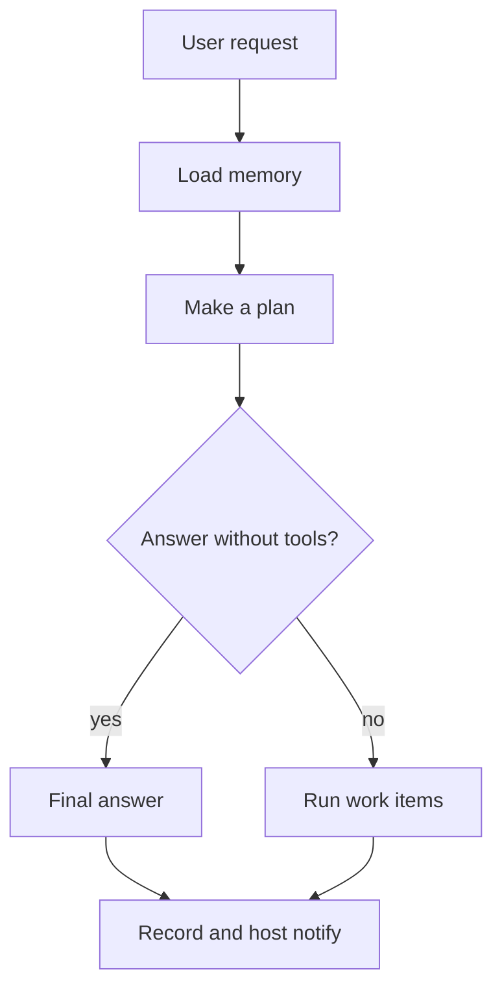
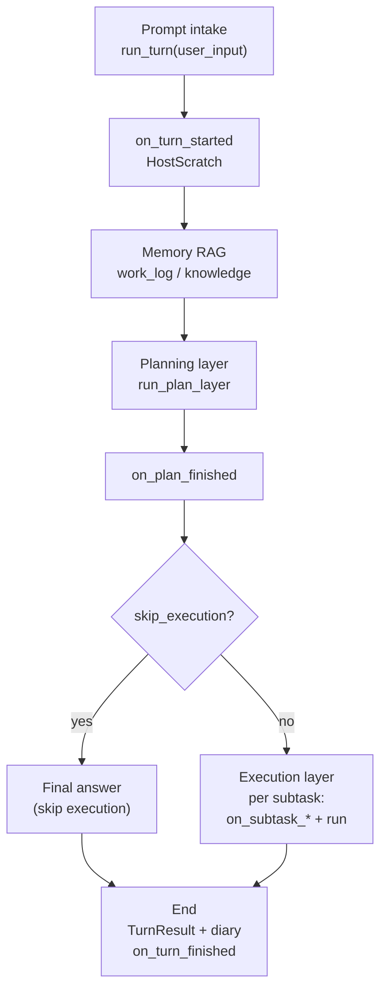
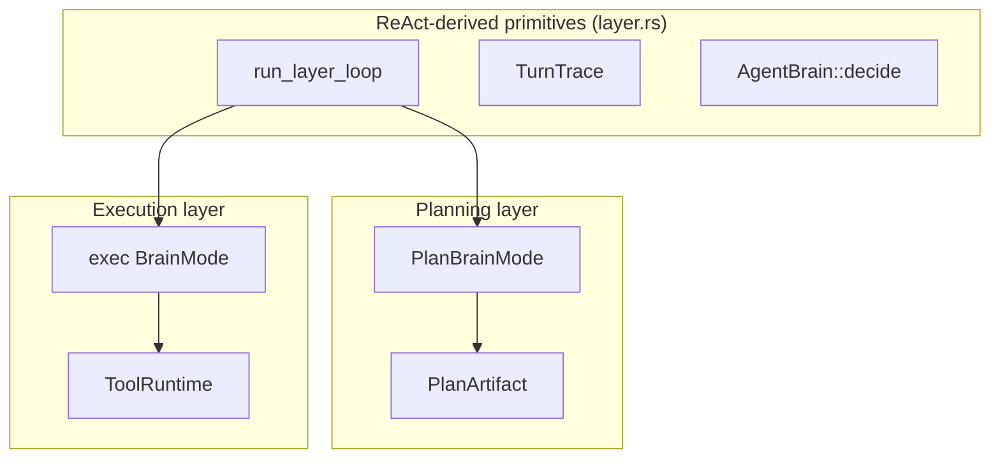
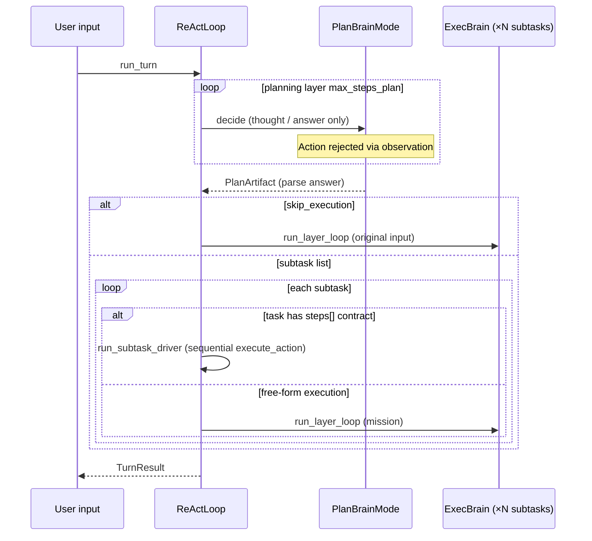
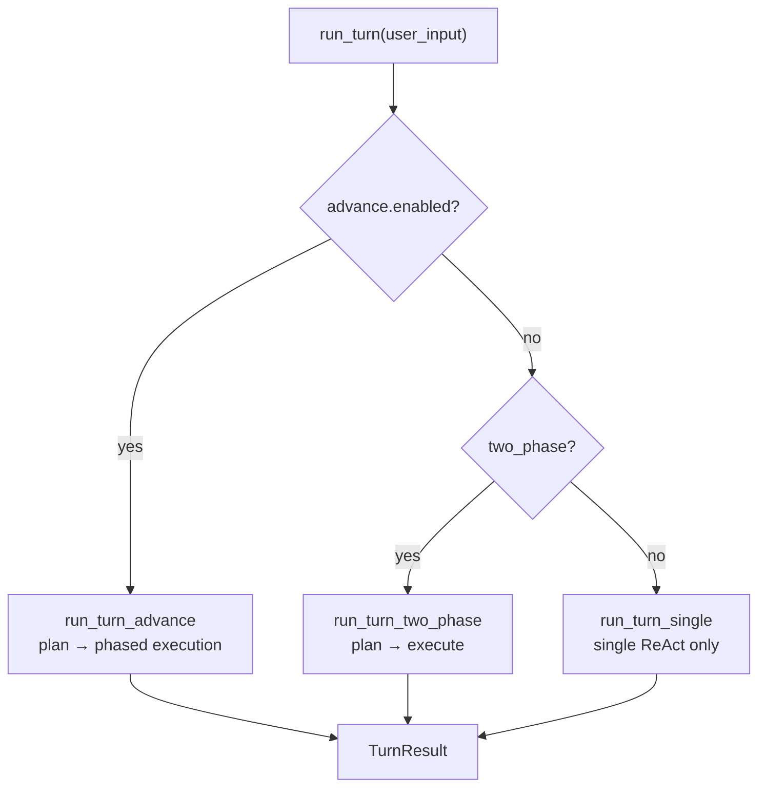
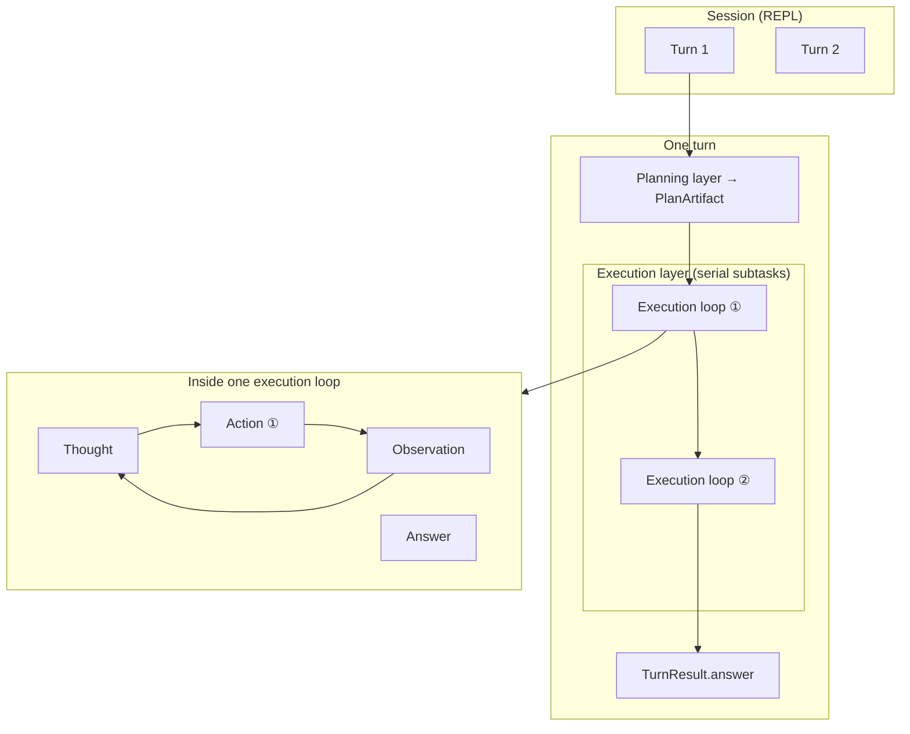

# harness-seed Structure

HarnessSeed is an embeddable agent execution engine for host apps. Rebuilding a chat-UI agent per product scatters plan / exec / memory / host contracts. This repo ships the shared loop and layer contracts as a “seed,” and leaves domain logic on the host.

A request roughly goes: optionally recall past context, plan work units without tools, execute with tools and answer, then record and notify the host. Planning and execution share the same think-and-act primitive, but differ in tools and output shape.



Every request first gathers any relevant context and makes a plan. The plan then decides whether existing knowledge is enough to answer.

If it is, the agent produces the reply without running work items. Otherwise it completes the planned work in order. Both routes finish by recording the turn and notifying the host, so those final duties do not depend on tool use.

Read this chapter first as a map. Glossary: [glossary.md](glossary.md). Principles: [development-principles.md](../development-principles.md).

Related: [03_memory-layer.md](03_memory-layer.md) · [04_host-extensions.md](04_host-extensions.md) · [SVG](../../ja/architecture/full_agent_architecture_v2.svg) · [README.md](README.md) · [10](10_agent-minimum-action-unit.md) · [08](08_react-implementation.md) · [07](07_advance-loop.md) · [05](05_task-registry.md) · [JP](../../ja/architecture/00_harness-seedの構造.md) · [01](01_planning-layer.md) · [02](02_execution-layer.md)

## 1. Overall flow (implementation)

Same story with code names:



The request begins by opening host-only state and gathering memory. That state can hold host identifiers, but is never sent to the model.

Next, planning gives the host a chance to react to the completed plan. A request that already has enough evidence proceeds to a reply; other requests run each subtask with matching host notifications. Finally, both routes write the diary and complete the turn notification.

`src/plan.rs` says the same two-layer idea in one line:

> Serial orchestration: planning layer (ReAct-derived loop, no tools) → execution layer (ReAct + tools).

## 2. Role of each layer

| Layer | Entry | Brain | Loop | Tools | Termination |
|-------|-------|-------|------|-------|-------------|
| **Planning** | `run_plan_layer` | `PlanBrainMode` | `run_layer_loop` (`LayerLoopOptions::plan`) | **none** | `Answer` → `PlanArtifact` |
| **Execution** | `run_turn_two_phase` / `run_subtask_exec_audited` | exec `BrainMode` | `run_layer_loop` (`LayerLoopOptions::exec`) or **step driver** | **yes** | `Answer` → user-facing response |

Planning uses the repeat engine to turn a request into a structured list of work. It has no access to tools, so this stage cannot change the environment.

Execution uses the same style of loop with tools available. Its completed answer is user-facing, while the planner's answer is parsed into work items. Execution can start for the whole turn or for an individual planned item.

### Planning layer output (PlanArtifact)

The planning layer parses LLM JSON into subtasks. Skeleton:

```json
{
  "summary": "…",
  "skip_execution": false,
  "knowledge_sufficient": false,
  "subtasks": [
    { "id": 1, "goal": "…", "done_when": "…" }
  ]
}
```

`summary` is human-facing; `subtasks` are the units that run. `skip_execution` alone is not enough—it is allowed only with `knowledge_sufficient: true` ([03](03_memory-layer.md)), so a plan cannot claim “already answered” without evidence. Task ids from `tasks/*.json` also sit in this `subtasks` array.

### Execution layer behavior

Each subtask runs as one of:

1. **ReAct loop** — mission from `format_mission`; `Thought → Action → Observation`
2. **Step driver** — when a registered task has `steps[]`, run `execute_action` in order without an LLM (`react.use_step_driver` defaults to `true`)

The first chooses tools while thinking; the second follows a contract. Both accumulate into the turn’s `TurnResult`.

## 3. Shared ReAct loop (layer.rs)

Both layers’ inner repeat is **`run_layer_loop` in `src/layer.rs`**.



Both layers repeat the same basic cycle: decide what comes next, then record the result. Planning uses it to produce a work list; execution uses it to run tools and respond.

The engine is shared rather than duplicated. The settings below establish which of those roles the current loop has.

| Option | Planning (`plan`) | Execution (`exec`) |
|--------|-------------------|---------------------|
| `tools_enabled` | `false` | `true` |
| `context_label` | `"plan"` | `"step"` |
| `max_thoughts` | 1 (default) | 1 (default) |

With tools disabled, an attempted planning tool call becomes a rejected observation instead of a real operation. Planning therefore leaves the environment unchanged.

Execution enables those operations. The context label only distinguishes the two stages in logs and metrics.

## 4. Sequence within one turn (two_phase)

When `react.two_phase: true` (typical sample config), one request proceeds as follows.



First comes planning only. The model may think and answer, but tool calls such as file operations do not go through (they are rejected if attempted). When the plan is ready, it becomes a work list (`PlanArtifact`).

Then it branches. If the request can be answered immediately, a short execution runs on the original prompt and the turn ends. Otherwise each item on the list is handled in order. If a task has a fixed step contract, tools run in that order without an LLM (step driver). If not, the execution brain chooses tools as it goes (ReAct).

Either way, the turn finishes by returning a combined result.

## 5. Execution mode switching

`ReActLoop::run_turn` (`src/react.rs`) branches on config:



The configuration first checks whether long-running phased work is enabled. That route takes priority because it manages the whole turn in phases.

Without it, the turn either plans before executing or uses one direct loop. Every route returns the same turn result.

| Setting | Code default (key omitted) | Behavior |
|---------|----------------------------|----------|
| `react.two_phase` | `false` | Serial plan → execution (sample config often `true`) |
| `react.advance.enabled` | `false` | Outer advance loop (priority over `two_phase`; sample may set `true`) |
| `react.use_step_driver` | `true` | Run contract / non-`react_only` tasks without LLM |
| `react.arg_audit_mode` | `soft` | Arg audit ([05_task-registry.md](05_task-registry.md)) |

When a library user omits these keys, the two-phase and advance routes are disabled. Repository examples may deliberately enable them for their scenario.

The step-driver and audit settings do not select an entry route. They alter how execution proceeds after a route has been selected. Advance still begins each phase with planning.

## 6. Source code map

| Concept | File |
|---------|------|
| Turn entry | `src/react.rs` — `run_turn`, `run_turn_two_phase`, `run_turn_advance` |
| Planning loop | `src/layer.rs` — `run_plan_layer`, `run_layer_loop` |
| Plan JSON & contracts | `src/plan.rs`, `src/plan/parse.rs`, `src/plan/contract.rs` |
| Harness state | `src/harness/state.rs` — `HarnessState`, `PlanArtifact` |
| Execution tools | `src/tool/` — `ToolRuntime`, `execute_action` |
| Step driver | `src/tasks/driver.rs` |
| Task definitions | `tasks/*.json`, `src/tasks/registry.rs` |
| Minimum action unit | `src/action.rs` — `Action`, `Observation`, `TurnTrace` |

Start with `react.rs` to see which turn route was selected. Then use `layer.rs` for the shared loop and the plan files for parsing and contracts.

Tool execution lives under `tool/`; registered procedures live in the task files and driver. The action module defines the trace records that connect those operations to audit and logging.

## 7. Hierarchy overview



A session contains successive turns. Within a turn, planning comes first and execution loops handle planned work items one after another.

Inside an execution loop, reasoning may lead to an action and its observation, then another round of reasoning. Of these nested scopes, only an action can affect the outside world.

| Level | HarnessSeed type | Minimum action unit? |
|-------|------------------|----------------------|
| Session | `SessionMemory` | no |
| Turn | `TurnResult` | no |
| Plan | `PlanArtifact` | no (no tools) |
| Execution loop | ReAct for one subtask | no |
| Action | `Action` + `invoke_id` | **yes** |
| Observation | `Observation` | result of an action |

Audit and logging treat one action as the unit that occurred in the world. Thoughts and planning data describe intent, but do not count as actions.

An observation records the outcome of that action and supplies evidence for the next reasoning step.

## 8. Summary

- Core model is **planning + execution**.
- Both use the same ReAct-derived loop; planning keeps tools closed; only execution touches the world via ToolRuntime.
- Simple chat can skip execution via `skip_execution`; terminal record/hooks still run.
- Registered tasks can fall through to the step driver (no LLM) in execution.
- With `advance`, the entrance becomes the outer loop, but inside it still repeats the same two layers per phase.
