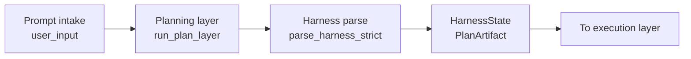
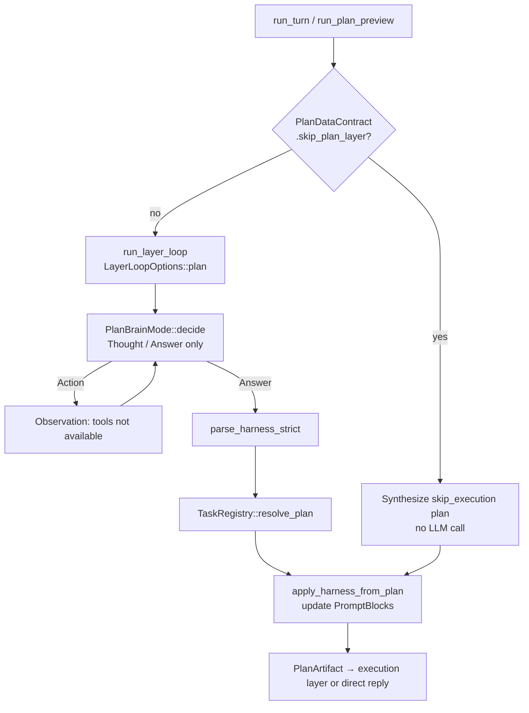
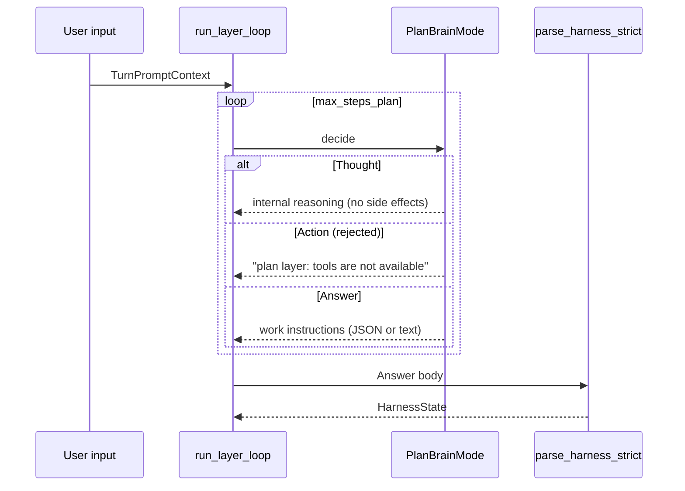
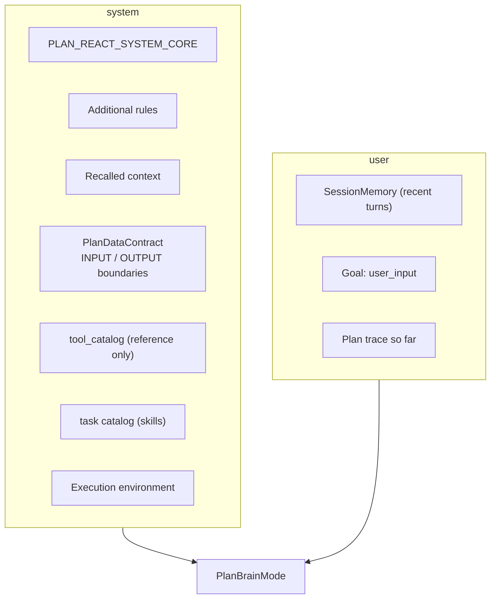
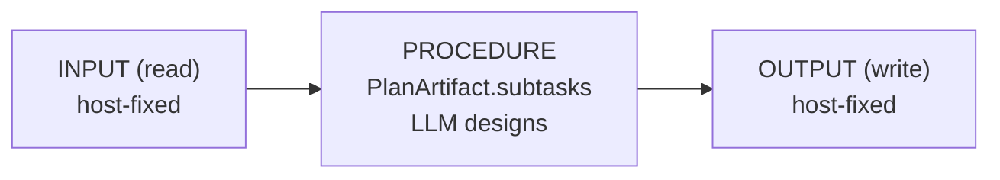
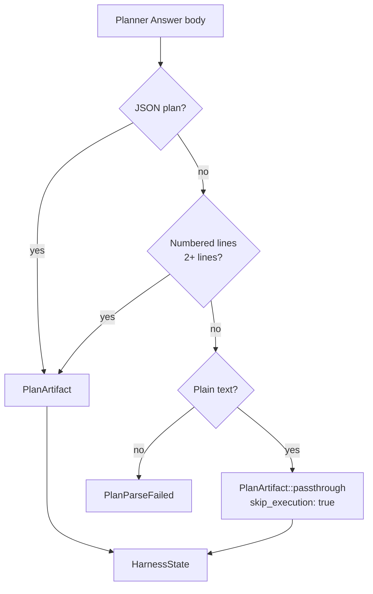
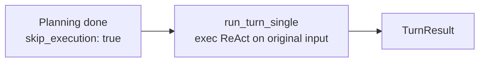

# Planning Layer


The planning layer reads the user request and decides what to do in what order (a list of subtasks). Jumping straight into execution makes tool use vague, so work units and done-when are fixed first. No tools and no environment changes here.

Standard two_phase always goes through this layer. If the host already supplies the full plan, the engine’s planning LLM can stay thin. Output is a subtask list plus summary for execution (or skip execution when knowledge alone is enough). Implementation: `run_plan_layer` → `PlanArtifact`.

Glossary: [glossary.md](glossary.md) · Structure: [00_harness-seed-structure.md](00_harness-seed-structure.md) · Execution: [02_execution-layer.md](02_execution-layer.md) · [JP](../../ja/architecture/01_計画層.md)

## 1. Role of the Planning Layer



The request first enters a tool-free planning loop. Its raw response is then validated and turned into a structured work description before anything executes.

That boundary keeps planning output separate from a reply to the user. The parsed work description is stored in `HarnessState` as a `PlanArtifact`.

| Aspect | Planning layer | Execution layer |
|--------|----------------|-----------------|
| Brain | `PlanBrainMode` | exec `BrainMode` |
| Loop | `run_plan_layer` | `run_layer_loop` (exec) |
| Tools | **disabled** | **enabled** |
| Output | `PlanArtifact` | User-facing `Answer` |
| Side effects | **none** | **yes** |

Planning cannot call tools or make changes, so its product is a work description. Execution can use tools and turns its result into the user-facing answer.

The different brain and loop names identify implementation seams. The behavioral boundary is the availability of tools and side effects.

**Principle**: the planning layer designs **PROCEDURE only**. INPUT (read sources) and OUTPUT (write targets) are fixed by the host; the LLM must not change them.

## 2. Processing Flow



The turn may bypass the planning model only when the host explicitly marks the request as trivial. In that case, the engine creates a direct-answer plan without calling an LLM.

Otherwise, the planner may reason but cannot operate tools. Its answer is parsed, resolved against the task registry, and copied into the execution context. A tool attempt is rejected and returns to the planner as an observation.

### 2.1 Entry Points

| API | Purpose |
|-----|---------|
| `run_plan_layer` | Planning loop + Harness parse (`layer.rs`) |
| `run_plan_preview` | Plan only; does not enter execution layer (`react.rs`) |
| `run_turn_two_phase` / `run_turn_advance` | Serial plan → execution |

Use the first entry point when the caller needs planning itself. Use preview to inspect a plan without executing it; the turn entries continue from the plan into execution.

### 2.2 Skipping the Planning Layer

When `PlanDataContract::skip_plan_layer()` is `true` (trivial chat such as greetings with `skip_execution: true`), no LLM is called and this plan is synthesized immediately:

```rust
PlanArtifact {
    summary: "direct chat".into(),
    skip_execution: true,
    subtasks: vec![],
}
```

## 3. ReAct Loop (plan mode)

The planning layer also uses `run_layer_loop`, but is distinguished from execution via `LayerLoopOptions::plan`.

| Setting | Value (plan) |
|---------|----------------|
| `tools_enabled` | `false` |
| `context_label` | `"plan"` |
| `max_thoughts` | 1 |
| `max_steps` | `react.max_steps_plan` (default 4) |

These settings make planning deliberately brief and non-invasive. The loop can record one thought at a time, but tool use remains disabled throughout.



The loop gives the planner repeated chances to return a thought or an answer. A thought only updates internal trace state; an answer is the only form sent to the parser.

If the planner attempts an action, the loop records that tools are unavailable rather than running it. Once an answer arrives, parsing produces the state used by the following stage.

LLM step format (`PlanBrainMode` / `PLAN_REACT_SYSTEM_CORE`):

```json
{"step":"thought","content":"<reasoning>"}
{"step":"answer","content":"<work instructions>"}
```

`Action` / tool calls are rejected via Observation.

## 4. Planner Fixed Zone (Prompt Layout)

The planning-layer LLM prompt is built from **Planner fixed zone** + user goal + plan trace (`plan/prompt.rs`).



The system portion supplies boundaries, available capabilities, and retained reference material. The user portion supplies the current goal, recent conversation when applicable, and the planner's own trace.

Together they tell the planner what is fixed and what it may design. The catalog is descriptive at this stage: it does not grant tool execution.

Main blocks the host app sets on `PromptBlocks`:

| Block | Role |
|-------|------|
| `plan_data_contract` | Fixed INPUT (read) / OUTPUT (write) boundaries |
| `plan_task_catalog` | Registered task list (skills) |
| `tool_catalog` | Tool definitions (not executable in planning; reference only) |
| `recalled` | Long context such as referenced emails |
| `rules` | Additional rules |

The host supplies these blocks before planning begins. The planner can use the task and tool descriptions to choose a procedure, but the data contract remains the authority on what may be read or written.

## 5. Data Contract (INPUT / PROCEDURE / OUTPUT)

`PlanDataContract` (`plan/contract.rs`) prevents the LLM from guessing read/write targets for a turn.



The host establishes the input source before planning starts. The planner fills in only the procedure that connects that input to the fixed output destination.

This avoids asking the model to infer permissions or invent storage targets. The named contract represents those fixed boundaries.

| Layer | Examples | Decided by |
|-------|----------|------------|
| **INPUT** | `UserMessage`, `ImapEmail { uid }`, `LocalMailDb` | Host |
| **PROCEDURE** | Subtask list, `task` id, `goal`, `done_when` | **Planning LLM** |
| **OUTPUT** | `ChatOnly`, `ComposeForm`, `MailDb` | Host |

The contract is expanded into the prompt via `format_for_planner()`, instructing the LLM to read only from INPUT, write only to OUTPUT, and design the procedure in between.

## 6. Plan Parsing (Harness Parse)

The Planner `Answer` body is converted to `HarnessState` by `parse_harness_strict` (`harness/parse.rs`).



Parsing first accepts a structured plan because it preserves explicit work items. If that is unavailable, a numbered list is converted into work; ordinary text becomes a direct-answer plan.

Only content that fits none of these forms is reported as a parse failure. Both successful branches end in the same internal state for later orchestration.

### 6.1 Accepted Plan JSON Formats

**Format A** — direct `PlanArtifact`:

```json
{
  "summary": "…",
  "skip_execution": false,
  "subtasks": [
    { "id": 1, "task": "list_dir", "params": {"path": "src"}, "goal": "…", "done_when": "…" }
  ]
}
```

**Format B** — flow form (`input` / `steps` / `output`):

```json
{
  "input": ["read: user_message"],
  "steps": [
    { "id": 1, "task": "web_research", "params": {"query": "…"}, "goal": "", "done_when": "" }
  ],
  "output": "write: chat_only",
  "skip_execution": false
}
```

On parse failure, JSON repair and multi-object extraction (`extract_json_objects`) are attempted.

### 6.2 PlanArtifact Fields

| Field | Meaning |
|-------|---------|
| `summary` | Plan summary |
| `skip_execution` | If `true`, skip execution layer and reply directly |
| `subtasks` | Serial subtasks (ids start at 1, must be unique) |

`task: replan` is a control-plane id (not a skill JSON). Include it when later steps depend on unknown results; the advance loop restarts the plan layer. It is not an exec tool name.

The summary describes the intended work, while the subtask list determines whether there is work to run. Marking execution as skipped routes the request to a direct reply instead of the subtask executor.

`needs_execution()` = `!skip_execution && !subtasks.is_empty()`

### 6.3 HarnessState

Internal state after parsing; used by execution layer and prompt injection.

| Field | Meaning |
|-------|---------|
| `work_instructions` | Raw Planner text |
| `plan` | Parsed `PlanArtifact` |
| `current_step` / `total_steps` | Execution progress |
| `tool_set` | Tool restriction for current step |
| `references` | Reference documents (emails, etc.) |
| `status` | `Ready` / `Executing` / `Completed` / `Aborted` |

The parsed text is retained for transparency, and the parsed plan carries the executable structure. As execution begins, the state also tracks the current item, permitted tools, references, and progress.

## 7. Applying the Plan

`apply_harness_from_plan` (`react.rs`) pushes plan results into execution-layer prompts.

1. `TaskRegistry::resolve_plan` — normalize task ids and align with contract
2. `blocks.work_instructions_text` — work instruction text
3. `harness.begin_execution()` — if subtasks exist, set `status = Executing`
4. `sync_harness_step_to_blocks` — current step description into `current_step_text`

Reference info (`HarnessReference`) is loaded into `recalled` before planning starts and merged into Harness.

## 8. PlanBrainMode (Brain)

| Mode | Purpose |
|------|---------|
| `Rule(RulePlanBrain)` | `--no-llm` / rules only; help/echo → immediate `skip_execution` |
| `Llm(PlanLlmBrain)` | Production LLM with task catalog |
| `Mock` | Integration tests |

Typical rule-brain flow:

1. First `Thought` (“decompose request into subtasks”)
2. Next step `Answer` (single-subtask JSON)

## 9. Branch When skip_execution

After planning, when `PlanArtifact::needs_execution()` is `false`:



When the plan says no separate work items are needed, the normal subtask path ends. The execution brain receives the original request and produces the reply directly.

This still keeps the final response in the execution-facing path rather than returning the planner's raw text.

## 10. Configuration

| Key | Default | Effect on planning layer |
|-----|---------|--------------------------|
| `react.max_steps_plan` | `4` | Max ReAct steps for planning |
| `react.two_phase` | `true` | When off, planning layer is skipped entirely |
| `react.show_plan` | `true` | Print `PlanArtifact` to stdout |
| `react.show_prompt` | `false` | Print planning prompt to stderr |
| `llm.*` | — | Connector settings for `PlanLlmBrain` |

The step limit bounds planning effort. The remaining settings decide whether planning participates in a turn and how much planning information is shown or connected to an LLM.

## 11. Source Code Map

| Concern | File / symbol |
|---------|---------------|
| Planning loop | `src/layer.rs` — `run_plan_layer`, `LayerLoopOptions::plan` |
| Plan module | `src/plan.rs` |
| Brain | `src/plan/brain.rs` — `PlanBrainMode`, `RulePlanBrain`, `PlanLlmBrain` |
| Prompt | `src/plan/prompt.rs` — `build_plan_layer_messages` |
| Data contract | `src/plan/contract.rs` — `PlanDataContract` |
| JSON parse | `src/plan/parse.rs` — `parse_plan` |
| ReAct step parse | `src/plan/parse_step.rs` — `parse_plan_agent_step` |
| Harness parse | `src/harness/parse.rs` — `parse_harness_strict` |
| Internal state | `src/harness/state.rs` — `HarnessState` |
| Orchestration | `src/react.rs` — `run_turn_two_phase`, `apply_harness_from_plan`, `run_plan_preview` |
| Task resolution | `src/tasks/registry.rs` — `resolve_plan`, `catalog_for_planner` |

The loop and orchestration files own the planning lifecycle. The plan, parse, and contract modules define what a valid plan means, while the registry connects task ids to available work contracts.
## 12. Summary

- The planning layer **designs subtasks (work instructions) only**; it never uses tools.
- It shares the ReAct loop with execution but runs with `tools_enabled: false`.
- INPUT / OUTPUT are host-fixed; the LLM designs **PROCEDURE (subtasks)** only.
- Planner output is parsed as JSON → numbered text → plain-text passthrough.
- With `skip_execution`, the execution layer is skipped and the exec brain replies directly.
- Parse results are handed to execution via `HarnessState` (work instructions and current step).
