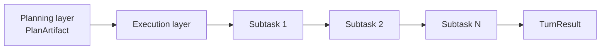
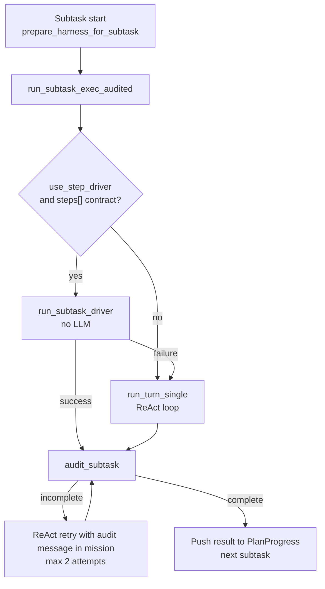
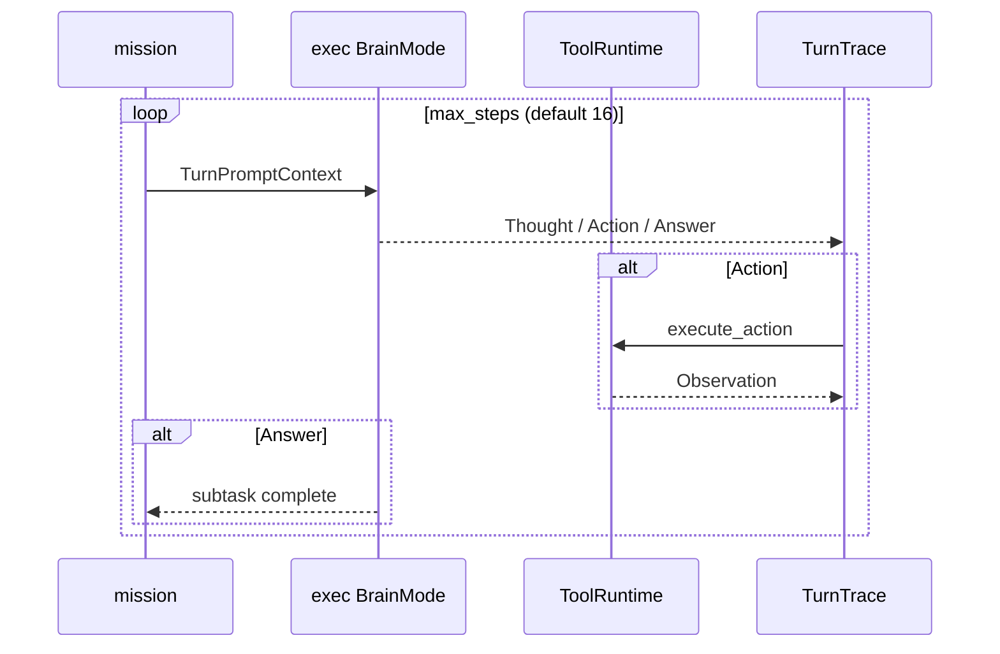
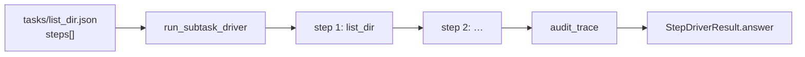
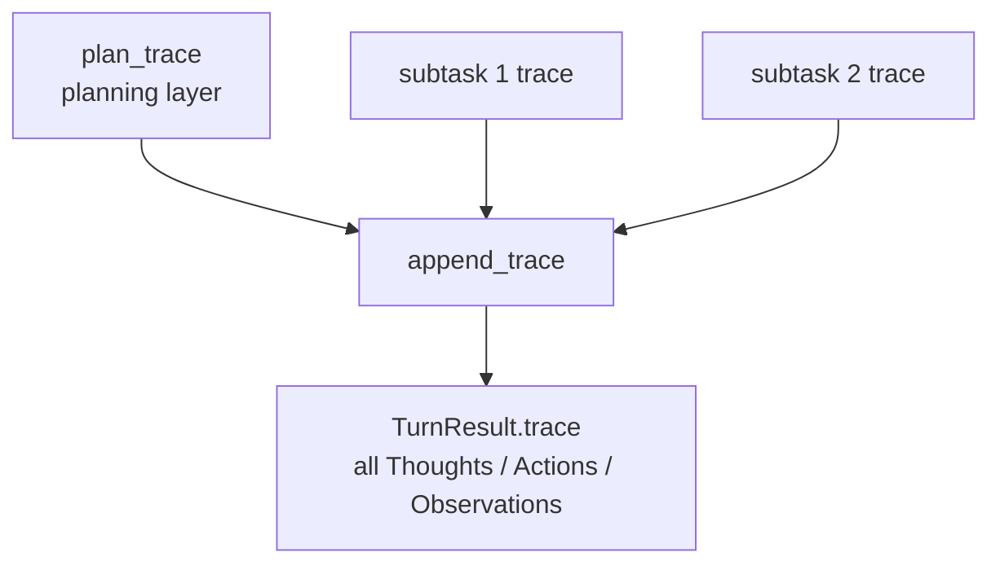

# Execution Layer


The execution layer carries out planned work, uses tools when needed, and produces a user-facing answer. A plan alone does not read files or search, so side effects and the final answer stay here. It does not call memory backends directly or own replan duties.

It runs when the plan has subtasks; skipped turns that answer from knowledge alone never enter it. Subtasks run in order—fixed steps for contract tasks, otherwise the LLM picks tools. The two main paths are the ReAct loop and the step driver.

Glossary: [glossary.md](glossary.md) · Structure: [00_harness-seed-structure.md](00_harness-seed-structure.md) · Planning: [01_planning-layer.md](01_planning-layer.md) · Tools: [02-01_tool-selection.md](02-01_tool-selection.md) · [JP](../../ja/architecture/02_実行層.md)

## 1. Role of the Execution Layer



Execution takes the planned work items one at a time. Each completed item contributes to the final turn result before the next one begins.

The chain represents time order, not parallel work. A later subtask can therefore use the outcome of an earlier one.

| Aspect | Planning layer | Execution layer |
|--------|----------------|-----------------|
| Brain | `PlanBrainMode` | exec `BrainMode` (`exec_brain`) |
| Loop | `run_plan_layer` | `run_turn_single` → `run_layer_loop` |
| Tools | **disabled** | **enabled** (`ToolRuntime`) |
| Output | `PlanArtifact` | Per-subtask `Answer` → final turn response |
| Side effects | none | **yes** (`Action` only) |

Planning describes the work without affecting the environment. Execution is the only layer allowed to use tools, and each tool operation occurs as an action.

The resulting subtask answers are combined into the reply for the whole turn.

**Principle**: file operations, shell, web search, and other external changes happen only through execution-layer `Action`s.

## 2. When the Execution Layer Runs

The execution layer runs only when `PlanArtifact::needs_execution()` is `true` after planning.

```rust
// skip_execution == false AND subtasks is not empty
pub fn needs_execution(&self) -> bool {
    !self.skip_execution && !self.subtasks.is_empty()
}
```

| Condition | Behavior |
|-----------|----------|
| `skip_execution: true` | Skip execution layer; single ReAct on original input |
| Empty `subtasks` | Same as above |
| Subtasks present | Run each subtask **serially** |

Entry points: `ReActLoop::run_turn_two_phase` or `run_turn_advance` (when `advance.enabled: true`). Both call `run_subtask_exec_audited` for each subtask after planning.

## 3. Flow for One Subtask



Every subtask first receives its current context and tool limits. The engine then prefers a fixed contract when one is available.

On that path, a driver performs the prescribed steps without an LLM. Otherwise the ReAct path chooses tools while working. Both paths are audited; an incomplete result is retried through ReAct, and a complete result becomes input for the next subtask.

### 3.1 Harness State Updates

Before each subtask, `prepare_harness_for_subtask` runs:

- Set `HarnessState.current_step` to subtask id
- Inject `tool_set` from task `tool_policy`
- Put current step description into `PromptBlocks.current_step_text`

Execution-layer LLM prompts include work instructions (Harness) and current-step context.

### 3.2 Building the mission

On the ReAct path, `format_mission` builds a subtask-specific prompt:

```
## Subtask
id / task / params / goal / done_when

## Task contract
(registered task contract and required tool order)

## Prior subtask results
(summaries from PlanProgress)

Complete ONLY this subtask. Do not replan or work ahead to other subtasks.
```

Prior subtask results accumulate in `PlanProgress` and carry forward (max 500 chars per summary).

## 4. Two Execution Paths

### 4.1 ReAct Loop (Free-form)

`run_turn_single` → `run_layer_loop` (`LayerLoopOptions::exec`)



For each iteration, the execution brain decides whether to think, use a tool, or finish. A tool action runs through the runtime and its observation becomes evidence for the next decision.

An answer ends this subtask. The trace retains every decision and observation so the result can later be checked and merged.

| Setting | Value (exec) |
|---------|--------------|
| `tools_enabled` | `true` |
| `context_label` | `"step"` |
| `max_thoughts` | 1 (2nd+ rejected via `__thought_limit`) |
| `max_steps` | `react.max_steps` (default 16) |

Tools are enabled here, unlike in planning. The limits cap reasoning and total iterations so one subtask cannot run indefinitely.

One step:

1. `AgentBrain::decide` — `Thought` / `Action` / `Answer`
2. `Action` → `execute_action(tools, &action)` → `Observation`
3. Accumulate in trace; include Observation in next prompt
4. `Answer` ends the subtask (or the turn when skipping execution)

The **minimum action unit** is one `Action` (tool call). `Thought` and `Answer` have no side effects.

### 4.2 Step Driver (Contract Execution)

When `react.use_step_driver: true` (default) and the subtask references a registered task id from `tasks/*.json` with a `steps[]` contract:



The registered contract identifies the required operations before execution starts. The driver expands its parameters and performs those operations in order without asking a model to select them.

If the contract path fails, execution switches to ReAct so the agent can attempt the work with the available evidence. Tasks without steps always use that flexible path.

- No LLM; runs `execute_action` in `steps[]` `order`
- Args expanded from `params` templates (`{path}`, etc.)
- On failure, **falls back to ReAct**
- `generic` (`steps: []`) has no contract → always ReAct

Example (`list_dir.json`):

```json
{
  "id": "list_dir",
  "steps": [
    { "order": 1, "method": "list_dir", "args": { "path": "{path}" }, "required": true }
  ]
}
```

The planner trace and each subtask trace remain separate while work is underway. At the end, they are appended into one ordered history for the turn.

That combined trace supports the final answer, audit details, and a per-subtask result summary.
## 5. Tool Policy

On the ReAct path, `tool_policy` from the task definition **restricts available tools**. For the full selection model (step driver / catalog / mission / runtime checks), see [02-01_tool-selection.md](02-01_tool-selection.md).

```text
run_subtask_exec
  → tool_policy_for_subtask(subtask)
  → filter blocks.tool_catalog
  → tools.set_exec_policy(...)
  → run_turn_single
  → clear policy
```

Out-of-contract tool calls fail audit (`audit_trace`) with `complete: false`.

## 6. Audit and Retry

After each subtask, `run_subtask_exec_audited` checks the trace against the contract via `TaskRegistry::audit_subtask`.

| Check | Status |
|-------|--------|
| Required tool **call order** | Implemented |
| Forbidden tool usage | Implemented |
| Args (expected ⊆ actual) | `react.arg_audit_mode`: `soft` (default) / `hard` / `off` |

On failure, ReAct retries with audit message in mission (`SUBTASK_AUDIT_MAX_ATTEMPTS = 2`). Retries use **ReAct only** (not the step driver). Soft arg warnings alone do not trigger retry. See [task-registry.md](05_task-registry.md).

## 7. Trace Merge for the Full Turn



While work is underway, the planner’s history and each subtask’s history stay separate. At the end they are appended into one ordered record for the turn, so a reader can follow planning decisions and then each executed item in sequence.

| Field | Content |
|-------|---------|
| `answer` | Last subtask (or single ReAct when skipping execution) |
| `trace` | Merged planning + all subtask traces |
| `subtask_results` | Per subtask: id / answer / steps_used / used_step_driver |
| `steps_used` | Total steps (plan + execution) |

The answer is the last response produced for the turn. The remaining fields preserve how that response was obtained.

## 8. Configuration

| Key | Default | Effect on execution layer |
|-----|---------|---------------------------|
| `react.max_steps` | `16` | ReAct limit per subtask |
| `react.use_step_driver` | `true` | Run contract tasks without LLM (`react_only: false`) |
| `react.arg_audit_mode` | `soft` | Arg audit: `off` / `soft` / `hard` |
| `react.show_task_execution` | `true` | Print subtask start/complete to stdout |
| `react.show_tool_output` | `true` | Print tool I/O to stderr |
| `react.two_phase` | `false` | Serial plan → execute when on |
| `react.advance.enabled` | `false` | Phased execution + `recalled` carry-forward ([advance-loop.md](07_advance-loop.md)) |

The first three settings control the amount and style of work within each subtask. The display settings affect diagnostics only, while the final two choose whether planning and phased execution wrap the work.

## 9. Source Code Map

| Concern | File / symbol |
|---------|---------------|
| Turn orchestration | `src/react.rs` — `run_turn_two_phase`, `run_turn_advance` |
| Subtask execution | `run_subtask_exec`, `run_subtask_exec_audited` |
| ReAct loop core | `src/layer.rs` — `run_layer_loop`, `LayerLoopOptions::exec` |
| Single-loop entry | `run_turn_single` |
| Step driver | `src/tasks/driver.rs` — `run_subtask_driver` |
| Mission build | `src/plan.rs` — `format_mission`, `PlanProgress` |
| Harness state | `src/harness/state.rs` — `HarnessState`, `prepare_harness_for_subtask` |
| Tool execution | `src/tool/` — `ToolRuntime`, `execute_action` |
| Contract audit | `src/tasks/audit.rs` — `audit_trace`, `audit_subtask` |
| Task definitions | `tasks/*.json`, `src/tasks/registry.rs` |
| Action / observation | `src/action.rs` — `Action`, `Observation`, `TurnTrace` |

Start in `react.rs` to follow the turn into subtask execution. The layer module runs the free-form loop, while the driver and audit modules own contract execution and verification.

The plan and harness modules build the per-subtask context. Tool and action modules perform operations and record their outcomes.
## 10. Summary

- The execution layer **runs PlanArtifact subtasks serially** and owns all environment side effects.
- Each subtask uses either the **step driver** (contract, no LLM) or a **ReAct loop** (free-form).
- ReAct uses the same `run_layer_loop` as planning but with `tools_enabled: true`, `exec_brain`, and `ToolRuntime`.
- `format_mission` and `HarnessState` inject per-subtask context, tool limits, and prior results into prompts.
- Failed audits trigger ReAct retries; the full-turn trace merges planning and execution layers.
