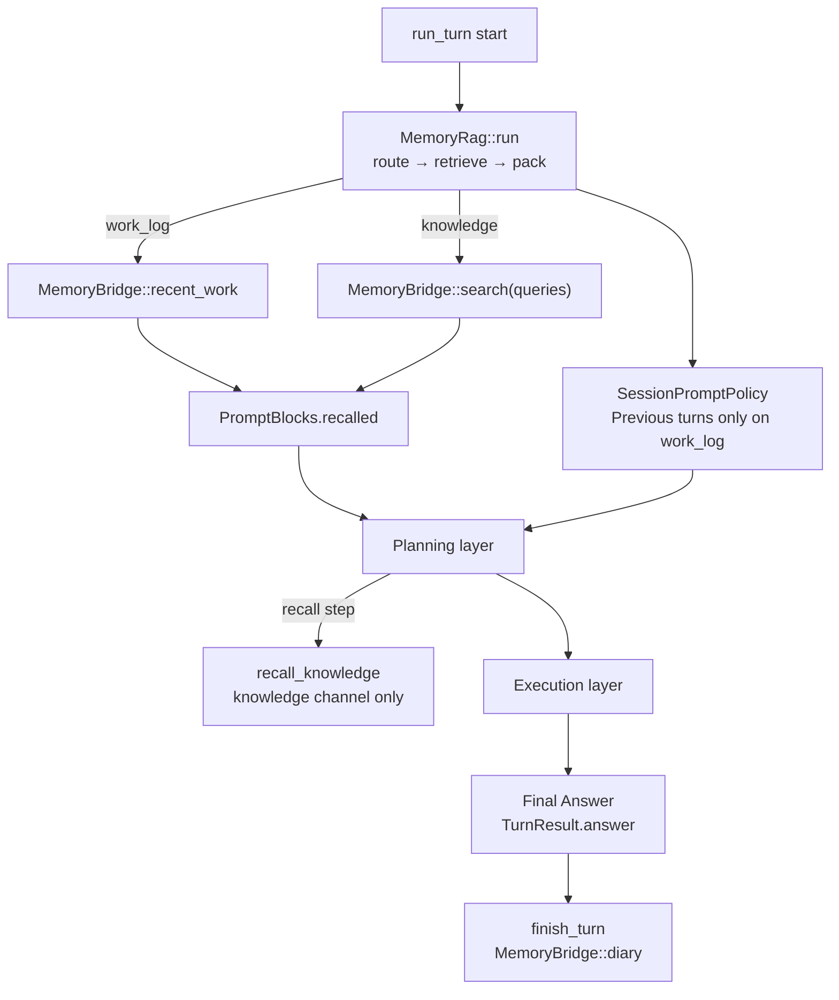

# Memory Layer


The memory layer recalls past work or knowledge and persists a record after a turn. Zero context breaks multi-turn work; dumping full history balloons the prompt. Only what this turn needs is loaded, then a diary is written. External stores are reached through `MemoryBridge`, never by calling product APIs from the core.

Useful for continuous requests or searchable knowledge. Safe to disable for fully stateless one-shots.

Glossary: [glossary.md](glossary.md) · Principles: [development-principles.md](../development-principles.md) · Adapter: [adapters/mempalace-adapter/README.md](../../../adapters/mempalace-adapter/README.md) · Config: [config/README.md](../../../config/README.md) · [JP](../../ja/architecture/03_記憶層.md)

## 1. Roles

| Layer | Plain responsibility | Implementation |
|-------|----------------------|----------------|
| **Memory RAG** | At turn start, branch work log vs knowledge and build the recalled prompt slot | `src/memory/rag.rs` |
| **MemoryBridge** | I/O only: recent work / search / diary; product logic stays in adapters | `recent_work` / `search` / `diary` |
| **Plan / exec** | Do not know the Bridge; consume assembled recalled (and prior-turn summary if any) | planning / execution |

Never call mempalace (etc.) directly from the core. Always go through `MemoryBridge` (e.g. factory-built `LayeredMemoryBridge`).

The RAG component decides which kind of context this request needs and assembles it. The bridge only reads or writes storage; planning and execution consume the assembled result without knowing which backend supplied it.

## 2. In-turn flow



At turn start, routing chooses either recent work or knowledge search and places the result in the recalled context. Only continued-work requests also receive prior turns.

Planning can request another knowledge lookup, but it does not use the work-log route for that step. After execution produces the final answer, the memory layer records a diary entry.

### 2.1 Routing

The router (`memory.rag.router`: `llm` default / `rule`) returns a JSON-like branch.

| Field | Meaning |
|-------|---------|
| `work_log` | Load recent diary (continued work) |
| `knowledge` | Run knowledge search |
| `queries` | Search terms for knowledge (1…`max_queries`) |

The router first distinguishes a continuation from a request for information. If both interpretations are returned, knowledge wins so unrelated diary context is not mixed into a search answer.

Previous turns follow only the continuation route. A greeting can take neither route and starts without recalled material.
**If both are true, prefer knowledge and drop `work_log`** (mechanical guard against topic mixing).

- Work log: continuation cues (“continue”, “earlier”, …)
- Knowledge: facts, explanations, unrelated questions
- Neither: greetings, etc.

`Previous turns` (`SessionMemory`) is injected **only on `work_log`** (`SessionPromptPolicy`).

### 2.2 Layer stack

| Layer | Implementation | Role |
|-------|----------------|------|
| local | `LocalDiaryBridge` | In-process diary (recommended always-on) |
| mempalace etc. | `MempalaceBridge` + adapter | Persistence / cross search (add via `backends`) |

The local diary is the baseline layer and remains available even if an external backend cannot be reached. External adapters add persistence or search rather than replacing the local fallback.

Do not replace `local` with an external backend. If externals fail, local still works.

### 2.3 Diary write

When the turn reaches a **final answer** (`TurnResult.answer` after execution — not the planning layer’s `step:answer`), `finish_turn` → `record_diary` → `MemoryBridge::diary`.

- local: full-text entry
- mempalace: compressed text (`user` / `summary` / `phases` / **always `answer`**) written to its own room with `source_file=*:diary`

Success log: `[memory] diary written: …`

## 3. Contract with the planning layer

| Item | Behavior |
|------|----------|
| `knowledge_sufficient` | Whether Recalled and/or general knowledge can fully answer. Included in plan JSON |
| `skip_execution: true` | **Allowed only when `knowledge_sufficient == true`**. Otherwise the harness forces execution |
| Empty steps but execution needed | One freeform subtask (no hardcoded tool recipes) |
| `recall` step | Planning layer only. Extra knowledge search (`recall_max_rounds`, default 2) |
| Plan loop cap | `react.max_steps_plan` (default **4**). Do not explore for long |
| Missing answer | Once force “emit a problem-solving answer”; if still missing → `single_subtask(user request)` |

Planning may skip execution only when the assembled evidence is explicitly sufficient. If it is not, an empty plan becomes one general work item instead of a hardcoded procedure.

The planner's extra recall is limited to the knowledge channel. Tool-based evidence gathering remains an execution responsibility.
The planning layer has no tools (`recall` is the only exception). Gather missing evidence in the **execution layer**.

## 4. Code layout

| Path | Content |
|------|---------|
| `src/memory/mod.rs` | `MemoryBridge`, local, config, factory entry |
| `src/memory/rag.rs` | `MemoryRag`, `RuleRouter` / `LlmRouter`, injection |
| `src/memory/layered.rs` | Stack of Bridges |
| `src/memory/mempalace.rs` | Thin adapter wrapper (feature `mempalace`) |
| `src/memory/factory.rs` | `config.memory` → Bridge |
| `src/action.rs` | Observation char cap (avoid blowing context on huge files) |
| `src/tool/builtin.rs` | If `read_file` gets a directory, suggest `list_dir` |

The memory modules own routing, storage composition, and bridge construction. The action and tool references are supporting safeguards that keep recalled material and observations from growing without bound.
## 5. Config example

```json
"memory": {
  "local": true,
  "backends": ["mempalace"],
  "providers": {
    "mempalace": {
      "protocol": "mcp_stdio",
      "command": "python",
      "args": ["-m", "mempalace.mcp_server"],
      "agent_name": "harness-seed",
      "wing_from_cwd": true
    }
  },
  "recent_work": { "enabled": true, "max_entries": 3, "max_chars": 800 },
  "search": { "enabled": true, "top_k": 5, "max_chars": 3200 },
  "rag": { "router": "llm", "max_queries": 3 },
  "recall_max_rounds": 2
}
```

Key details: [config/README.md](../../../config/README.md).
