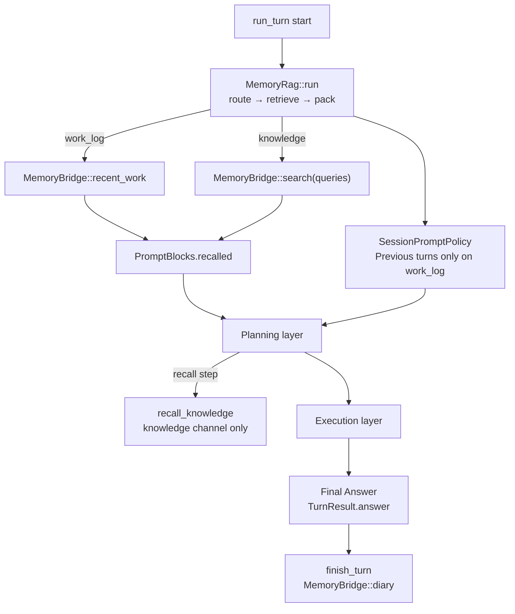

# Memory Layer

## What this is

How the agent **recalls past work or knowledge** and **persists a record** after a turn. Not “paste the whole chat history”: only what seems relevant goes into the prompt; a summary is saved when done.

External stores (local diary, mempalace, and so on) are reached only through a **bridge (`MemoryBridge`)**, never by calling product APIs from the core.

Glossary: [glossary.md](glossary.md)

## When to use / not use

- Use: continuous requests need context, or you want searchable knowledge in the prompt
- Skip: fully stateless one-shot runs with memory disabled

## Plain flow

Turn start → choose work-log vs knowledge → fetch via bridge → fill the “recalled” prompt slot → (plan / exec) → write diary at end

Principles: [development-principles.md](../development-principles.md)

- Design history (stub): [ideas/memory-and-replan-architecture.md](../../ja/ideas/memory-and-replan-architecture.md)
- mempalace adapter: [adapters/mempalace-adapter/README.md](../../../adapters/mempalace-adapter/README.md)
- Config: `memory` section in [config/README.md](../../../config/README.md)
- Japanese: [03_記憶層.md](../../ja/architecture/03_記憶層.md)

## 1. Roles

| Layer | Plain responsibility | Implementation |
|-------|----------------------|----------------|
| **Memory RAG** | At turn start, branch work log vs knowledge and build the recalled prompt slot | `src/memory/rag.rs` |
| **MemoryBridge** | I/O only: recent work / search / diary; product logic stays in adapters | `recent_work` / `search` / `diary` |
| **Plan / exec** | Do not know the Bridge; consume assembled recalled (and prior-turn summary if any) | planning / execution |

Never call mempalace (etc.) directly from the core. Always go through `MemoryBridge` (e.g. factory-built `LayeredMemoryBridge`).

## 2. In-turn flow



### 2.1 Routing

The router (`memory.rag.router`: `llm` default / `rule`) returns a JSON-like branch.

| Field | Meaning |
|-------|---------|
| `work_log` | Load recent diary (continued work) |
| `knowledge` | Run knowledge search |
| `queries` | Search terms for knowledge (1…`max_queries`) |

**If both are true, prefer knowledge and drop `work_log`** (mechanical guard against topic mixing).

- Work log: continuation cues (“continue”, “earlier”, …)
- Knowledge: facts, explanations, unrelated questions
- Neither: greetings, etc.

`Previous turns` (`SessionMemory`) is injected **only on `work_log`** (`SessionPromptPolicy`).

### 2.2 Layer stack

| Layer | Implementation | Role |
|-------|----------------|------|
| local | `LocalDiaryBridge` | In-process diary (recommended always-on) |
| mempalace etc. | `MempalaceBridge` + adapter | Persistence / cross search (add via `backends`) |

Do not replace `local` with an external backend. If externals fail, local still works.

### 2.3 Diary write

When the turn reaches a **final answer** (`TurnResult.answer` after execution — not the planning layer’s `step:answer`), `finish_turn` → `record_diary` → `MemoryBridge::diary`.

- local: full-text entry
- mempalace: compressed text (`user` / `summary` / `phases` / **always `answer`**) written to its own room with `source_file=*:diary`

Success log: `[memory] diary written: …`

## 3. Contract with the planning layer

| Item | Behavior |
|------|----------|
| `knowledge_sufficient` | Whether Recalled and/or general knowledge can fully answer. Included in plan JSON |
| `skip_execution: true` | **Allowed only when `knowledge_sufficient == true`**. Otherwise the harness forces execution |
| Empty steps but execution needed | One freeform subtask (no hardcoded tool recipes) |
| `recall` step | Planning layer only. Extra knowledge search (`recall_max_rounds`, default 2) |
| Plan loop cap | `react.max_steps_plan` (default **4**). Do not explore for long |
| Missing answer | Once force “emit a problem-solving answer”; if still missing → `single_subtask(user request)` |

The planning layer has no tools (`recall` is the only exception). Gather missing evidence in the **execution layer**.

## 4. Code layout

| Path | Content |
|------|---------|
| `src/memory/mod.rs` | `MemoryBridge`, local, config, factory entry |
| `src/memory/rag.rs` | `MemoryRag`, `RuleRouter` / `LlmRouter`, injection |
| `src/memory/layered.rs` | Stack of Bridges |
| `src/memory/mempalace.rs` | Thin adapter wrapper (feature `mempalace`) |
| `src/memory/factory.rs` | `config.memory` → Bridge |
| `src/action.rs` | Observation char cap (avoid blowing context on huge files) |
| `src/tool/builtin.rs` | If `read_file` gets a directory, suggest `list_dir` |

## 5. Config example

```json
"memory": {
  "local": true,
  "backends": ["mempalace"],
  "providers": {
    "mempalace": {
      "protocol": "mcp_stdio",
      "command": "python",
      "args": ["-m", "mempalace.mcp_server"],
      "agent_name": "harness-seed",
      "wing_from_cwd": true
    }
  },
  "recent_work": { "enabled": true, "max_entries": 3, "max_chars": 800 },
  "search": { "enabled": true, "top_k": 5, "max_chars": 3200 },
  "rag": { "router": "llm", "max_queries": 3 },
  "recall_max_rounds": 2
}
```

Key details: [config/README.md](../../../config/README.md).
