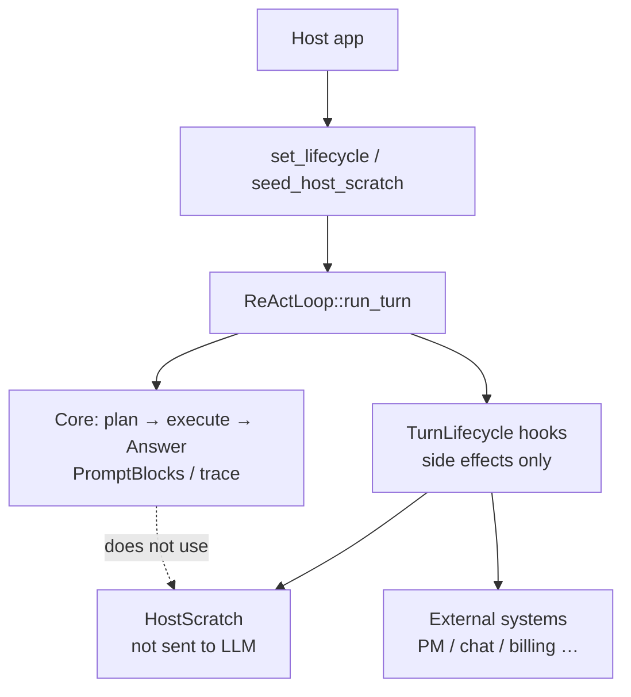

# Lifecycle hooks and HostScratch

Extension surface for host applications (triage-mail, development agents, etc.) to integrate externally **without changing the core ReAct loop**.

- Implementation: `src/lifecycle.rs`
- Registration: `ReActLoop::set_lifecycle` / `seed_host_scratch` / `host_scratch`
- Development principles: [development-principles.md](../development-principles.md) (domain vocabulary lives on the host side)
- Japanese version: [04_ホスト拡張.md](../../ja/architecture/04_ホスト拡張.md)

## 1. Responsibility split

| Side | Owns |
|------|------|
| **Engine (harness-seed)** | Plan / execution loop, **when** hooks are invoked, per-turn bag `HostScratch` |
| **Host** | Hook implementations (tickets, notifications, billing, etc.), bag key design, external APIs |

The engine does **not** know about Redmine / Paperclip / LINE WORKS / Stripe, and so on. The host mounts those on the same surface.



## 2. Prohibited actions (do not break the core path)

Hooks must **not** do the following.

- **Re-enter** `run_turn` or tool execution
- **Directly rewrite** the plan queue, `TurnTrace`, or the final Answer

Hooks are limited to **observation and side effects** (plus writes to `HostScratch`). Control always stays with the engine.

External API failures should ideally be handled inside the hook. If a hook panics anyway, the engine catches it via `invoke_lifecycle` (`catch_unwind`), logs to stderr, and continues the core path. Partial `HostScratch` writes from a panicking hook are **not** rolled back.

## 3. Invocation timing

For `two_phase` / `advance` turns that have a plan:

```text
begin_host_scratch_for_turn  (clear bag → merge seed)
  on_turn_started
  … memory RAG …
  … planning layer …
  on_plan_finished           (after resolve_plan; also called when skip_execution)
  for each subtask:
    on_subtask_started
    … execution …
    on_subtask_finished
  finish_turn（session / diary）
  on_turn_finished
```

For single-phase execution (no plan), only `on_turn_started` and `on_turn_finished` run.

If a turn aborts with an error, any pending `on_subtask_finished` / `on_turn_finished` calls are **not** invoked.

## 4. Payloads (full context is not passed)

The engine does **not** pass full rules / recalled / tool catalog / observation text from the core path. Only structured fragments usable for ticket descriptions and similar are passed.

| hook | arguments | write scope |
|------|-----------|-------------|
| `on_turn_started` | `user_input`, `host: HostView` | `turn` |
| `on_plan_finished` | `user_input`, `plan`, `host` | `turn` |
| `on_subtask_started` | `user_input`, `plan`, `subtask`, `index` (0-based), `host` | `subtasks.{subtask.id}` |
| `on_subtask_finished` | above + `answer`, `steps_used`, `host` | `subtasks.{subtask.id}` |
| `on_turn_finished` | `user_input`, `answer`, `plan?`, `steps_used`, `host` | `turn` |

Guidance for external ticket description text:

| timing | available material |
|--------|-------------------|
| parent ticket creation (`on_plan_finished`) | `plan.summary`, each subtask's `goal` / `done_when` |
| child ticket creation (`on_subtask_started`) | `subtask.goal` |
| child result (`on_subtask_finished`) | that subtask's `answer` |
| parent completion comment (`on_turn_finished`) | final `answer` |

## 5. HostScratch (per-turn nested bag)

Nested JSON scoped to one turn. **Never used for prompt assembly or LLM input.**

```json
{
  "turn": {
    "project_id": 1,
    "ticket_id": 10,
    "parent_ticket_id": 42
  },
  "subtasks": {
    "1": { "child_ticket_id": 7 },
    "2": { "child_ticket_id": 8 }
  }
}
```

| region | keys | hooks allowed to write |
|--------|------|------------------------|
| `turn` | host-defined | `on_turn_started` / `on_plan_finished` / `on_turn_finished` (and seed) |
| `subtasks.{id}` | **subtask id** (not an array index) | only `on_subtask_started` / `on_subtask_finished` for that id |

**Reads use the whole bag** (`host.to_value()` / `turn_get_*` / `subtask_get_*`). **Writes are limited to the caller's node** (`HostView::insert`). Under parallelism, sibling subtasks use different branches, so contention is unlikely.

### 5.1 Lifetime

1. At the start of `run_turn`, the bag is **cleared**
2. If `seed_host_scratch` is set, **only `turn` is merged** (`subtasks` are not seeded)
3. Each hook reads and writes via `HostView`
4. After the turn, the bag is readable via `react.host_scratch()` (**cleared again at the next `run_turn` start**)

### 5.2 How to supply identifiers

**IDs chosen in the UI (recommended; seed goes into `turn`)**

```rust
let mut seed = HostScratch::new();
seed.turn_insert("project_id", 1);
seed.turn_insert("ticket_id", 10);
react.seed_host_scratch(seed);
react.run_turn(&user_input)?;
```

**Parse from the instruction text**

In `on_turn_started`, parse `user_input` and call `host.insert(...)` (write scope is `turn`).

### 5.3 HostView

| operation | API |
|-----------|-----|
| read whole bag | `to_value()` / `turn()` / `subtask(id)` / `turn_get_*` / `subtask_get_*` |
| write own node | `insert` / `remove` / `get` / `get_i64` (own node only) |
| write scope | `WriteScope::Turn` or `WriteScope::Subtask(id)` (assigned by the engine) |

## 6. Registration and example implementation

```rust
use harness_seed::{HostScratch, HostView, PlanArtifact, Subtask, TurnLifecycle};

struct PmSync;

impl TurnLifecycle for PmSync {
    fn on_turn_started(&self, user_input: &str, host: HostView<'_>) {
        let _ = (user_input, host.turn_get_i64("ticket_id"));
    }

    fn on_plan_finished(&self, _user_input: &str, plan: &PlanArtifact, mut host: HostView<'_>) {
        // Create parent ticket → write to turn
        host.insert("parent_ticket_id", 42);
        let _ = plan;
    }

    fn on_subtask_started(
        &self,
        _user_input: &str,
        _plan: &PlanArtifact,
        subtask: &Subtask,
        _index: usize,
        mut host: HostView<'_>,
    ) {
        let parent = host.turn_get_i64("parent_ticket_id");
        // Create child ticket → write to this subtask's node
        host.insert("child_ticket_id", 7);
        let _ = (subtask, parent);
    }

    fn on_subtask_finished(
        &self,
        _user_input: &str,
        _plan: &PlanArtifact,
        subtask: &Subtask,
        answer: &str,
        _steps_used: usize,
        host: HostView<'_>,
    ) {
        let child = host.get_i64("child_ticket_id");
        let _ = (subtask, answer, child);
    }

    fn on_turn_finished(
        &self,
        _user_input: &str,
        answer: &str,
        _plan: Option<&PlanArtifact>,
        _steps_used: usize,
        host: HostView<'_>,
    ) {
        // Aggregate child nodes and update parent
        let _ = (answer, host.subtask_get_i64(1, "child_ticket_id"));
    }
}
```

Multiple integrations can be chained with `CompositeLifecycle` (same bag, same write scopes).

## 7. Difference from TurnObserver

| | `TurnLifecycle` | `TurnObserver` |
|--|-----------------|----------------|
| purpose | host business logic (PM, notifications, billing) | UI / debugging (step display) |
| granularity | turn, plan, subtask | one LLM call, one tool call |
| state bag | `HostScratch` | none |
| mutation | side effects only (core path unchanged) | observation only |

Both may be registered.

## 8. Subtask dependencies and parallelism (`two_phase`)

Each subtask in a plan may optionally carry `depends_on: [id, …]`. The engine splits work into dependency waves (`execution_waves`).

- Waves run strictly in sequence
- Subtasks within the same wave do not depend on each other → with `react.parallel_subtasks: true`, **step-driver contract tasks** run in parallel on threads
- ReAct (LLM) subtasks in the same wave run serially on the main thread (brain and prompts share `&mut`)
- Panics inside parallel drivers are caught on the worker thread; the main thread falls back to ReAct like a driver failure (other subtasks and the turn as a whole are not affected)
- `TurnLifecycle` hooks are invoked sequentially from the main thread before and after thread spawn (host implementations need not be thread-safe)
- `HostScratch` child nodes are keyed by subtask id, so `on_subtask_finished` after parallel drivers do not collide on branches

```json
{
  "subtasks": [
    { "id": 1, "task": "list_dir", "params": { "path": "src" }, "goal": "…", "done_when": "…" },
    { "id": 2, "task": "list_dir", "params": { "path": "tests" }, "goal": "…", "done_when": "…", "depends_on": [] },
    { "id": 3, "task": "write_file_verify", "params": { "path": "out.txt", "content": "x" }, "goal": "…", "done_when": "…", "depends_on": [1, 2] }
  ]
}
```

In the example above, ids 1 and 2 form wave 0 (may run in parallel); id 3 is wave 1.

## 9. Related

- Planning data contract (host fixes INPUT/OUTPUT): [01_planning-layer.md](01_planning-layer.md)
- Memory layer (recalled content shown to the LLM): [03_memory-layer.md](03_memory-layer.md)
- Overall structure: [00_harness-seed-structure.md](00_harness-seed-structure.md)
