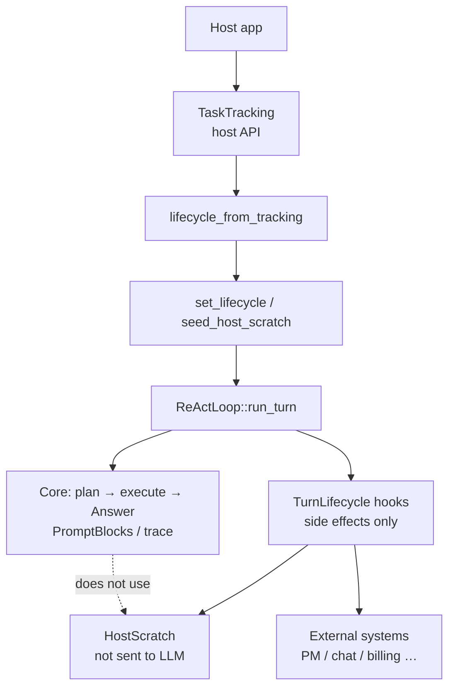

# Lifecycle hooks and HostScratch


Host-facing callbacks at fixed points in a turn—hooks—so external systems (tickets, notifications, billing) can react without rewriting planning, execution, or the final answer. Mixing that into the core loop couples products and risks re-entry. Side effects stay on the host; the engine keeps control. Hooks must not re-enter `run_turn` or rewrite Answer / trace.

Use them for turn-aligned side effects. Changing tool choice or planning itself belongs in core config and task contracts. Ticket IDs live in HostScratch and never go to the LLM. Details follow.

Code: `src/lifecycle.rs` / `tracking.rs`. Register via `set_lifecycle` / `lifecycle_from_tracking` / `seed_host_scratch`. Glossary: [glossary.md](glossary.md) · [JP](../../ja/architecture/04_ホスト拡張.md)

## 1. What is a hook?

A **lifecycle hook** is a host-facing callback that the engine invokes at **fixed points** while advancing a turn.

- The engine notifies **facts** such as “the plan is fixed” or “a subtask is starting / finished”
- The host reacts with **external side effects** (create tickets, update progress, send notifications, and so on)
- Hooks must **not** steer or rewrite the core path (planning, tool execution, final Answer). The engine remains in control

Analogy: the factory line itself does not change; a clerk writes paperwork whenever a station bell rings. The bell (timing) and the paperwork (external API) are hooks / host code; the line design is the ReAct core.

Related but different:

| | lifecycle hook | tool (`run_cmd`, etc.) | `TurnObserver` |
|--|----------------|------------------------|----------------|
| who calls it | engine, aligned with turn progress | LLM / driver chooses and runs it | engine, for step display |
| purpose | host business side effects | the work itself (observation returns to the LLM) | UI / debugging |
| LLM context | not included (`HostScratch` only) | included as Observation | not included |

Hosts implement “what to do when called,” not “which tool to run next.”

The hook is triggered by the engine at a known lifecycle point. It performs host work such as creating or updating an external record, while tool selection stays in the execution layer.

## 2. Responsibility split

| Side | Owns |
|------|------|
| **Engine (harness-seed)** | Plan / execution loop, **when** hooks run, `RunStatus` / outcomes, per-turn bag `HostScratch` |
| **Host** | [`TaskTracking`] (preferred) or raw `TurnLifecycle`, bag key design, external APIs |

The engine owns timing and the outcomes it reports. The host owns the meaning of those events, the external API calls they trigger, and its own stored identifiers.

The engine does **not** know about Redmine / Paperclip / LINE WORKS / Stripe, and so on. The host mounts those on the same surface.



The host adapts its business integration to the lifecycle interface before starting a turn. During the turn, the core continues planning and execution while hooks receive progress events separately.

Hooks may write host-only state or call external systems. That state is deliberately outside prompt construction, so the model cannot read or alter host identifiers.

## 3. Prohibited actions (do not break the core path)

Hooks must **not** do the following.

- **Re-enter** `run_turn` or tool execution
- **Directly rewrite** the plan queue, `TurnTrace`, or the final Answer

Hooks are limited to **observation and side effects** (plus writes to `HostScratch`). Control always stays with the engine.

External API failures should ideally be handled inside the hook. If a hook panics anyway, the engine catches it via `invoke_lifecycle` (`catch_unwind`), logs to stderr, and continues the core path. Partial `HostScratch` writes from a panicking hook are **not** rolled back.

## 4. Invocation timing

For `two_phase` / `advance` turns that have a plan:

```text
begin_host_scratch_for_turn  (clear bag → merge seed)
  on_turn_started
  … memory RAG …
  … planning layer …
  on_plan_finished           (after resolve_plan; also called when skip_execution)
  for each subtask:
    on_subtask_started
    … execution …
    on_subtask_finished      (status=Completed on success)
  finish_turn (session / diary)
  on_turn_finished           (status=Completed)
```

For single-phase execution (no plan), only `on_turn_started` and `on_turn_finished` run.

If a turn aborts with an error or cancel, **started but unfinished subtasks** and the **turn** still receive `on_subtask_finished` / `on_turn_finished` with `Failed` or `Cancelled` (so external work items are not left open).

## 5. Structured outcomes and TaskTracking API

### 5.1 `RunStatus` / outcome

| Type | Meaning |
|------|---------|
| `RunStatus` | `Completed` / `Failed` / `Cancelled` |
| `SubtaskOutcome` | `status` + `message` (answer on success, reason otherwise) + `steps_used` |
| `TurnOutcome` | `status` + `answer` + `steps_used` |

Completion callbacks receive a stable status plus enough detail to close or update host-side work. The same shape represents success, failure, and cancellation, preventing unfinished external records from being silently ignored.

`on_subtask_finished` / `on_turn_finished` always receive these outcomes.

### 5.2 Preferred: `TaskTracking`

For PM integration, implement [`TaskTracking`] instead of wiring raw `TurnLifecycle`.

| TaskTracking | Maps from TurnLifecycle | Typical use |
|--------------|-------------------------|-------------|
| `on_turn_started` | same | inspect seeded ids |
| `on_plan_ready` | `on_plan_finished` | create parent work item |
| `on_work_started` | `on_subtask_started` | create / start child work item |
| `on_work_finished` | `on_subtask_finished` | close child (ok / fail / cancel) |
| `on_turn_finished` | same | close parent |

`TaskTracking` names the common business lifecycle without exposing the raw engine callback details. A host can create a parent item when planning finishes, then track each child work item through its outcome.

```rust
use harness_seed::{lifecycle_from_tracking, HostView, PlanArtifact, TaskTracking, WorkFinishedEvent, WorkStartedEvent};
use std::sync::Arc;

struct PmSync;
impl TaskTracking for PmSync {
    fn on_plan_ready(&self, _user_input: &str, plan: &PlanArtifact, mut host: HostView<'_>) {
        host.insert("parent_ticket_id", 42);
        let _ = plan;
    }
    fn on_work_started(&self, event: WorkStartedEvent<'_>, mut host: HostView<'_>) {
        host.insert("child_ticket_id", 7);
        let _ = event.subtask;
    }
    fn on_work_finished(&self, event: WorkFinishedEvent<'_>, host: HostView<'_>) {
        let child = host.get_i64("child_ticket_id");
        let _ = (event.outcome.status, event.outcome.message, child);
    }
}

react.set_lifecycle(Some(lifecycle_from_tracking(Arc::new(PmSync))));
```

### 5.3 Hook arguments and write scope

The engine does **not** pass full rules / recalled / tool catalog / observation text.

| hook | arguments | write scope |
|------|-----------|-------------|
| `on_turn_started` | `user_input`, `host` | `turn` |
| `on_plan_finished` | `user_input`, `plan`, `host` | `turn` |
| `on_subtask_started` | `user_input`, `plan`, `subtask`, `index`, `host` | `subtasks.{subtask.id}` |
| `on_subtask_finished` | above + `outcome: SubtaskOutcome`, `host` | `subtasks.{subtask.id}` |
| `on_turn_finished` | `user_input`, `plan?`, `outcome: TurnOutcome`, `host` | `turn` |

Hooks receive only the information needed for lifecycle integration, not the full prompt or tool transcript. Their write scope follows the event: turn-wide hooks write the turn node, while subtask hooks write only their own node.

## 6. HostScratch (per-turn nested bag)

Nested JSON scoped to one turn. **Never used for prompt assembly or LLM input.**

```json
{
  "turn": {
    "project_id": 1,
    "ticket_id": 10,
    "parent_ticket_id": 42
  },
  "subtasks": {
    "1": { "child_ticket_id": 7 },
    "2": { "child_ticket_id": 8 }
  }
}
```

| region | keys | hooks allowed to write |
|--------|------|------------------------|
| `turn` | host-defined | `on_turn_started` / `on_plan_finished` / `on_turn_finished` (and seed) |
| `subtasks.{id}` | **subtask id** (not an array index) | only `on_subtask_started` / `on_subtask_finished` for that id |

Turn-level values are shared across the lifecycle, such as a host's parent identifier. Each subtask has a separate branch keyed by its stable id, which keeps child updates isolated.

**Reads use the whole bag** (`host.to_value()` / `turn_get_*` / `subtask_get_*`). **Writes are limited to the caller's node** (`HostView::insert`). Under parallelism, sibling subtasks use different branches, so contention is unlikely.

### 6.1 Lifetime

1. At the start of `run_turn`, the bag is **cleared**
2. If `seed_host_scratch` is set, **only `turn` is merged** (`subtasks` are not seeded)
3. Each hook reads and writes via `HostView`
4. After the turn, the bag is readable via `react.host_scratch()` (**cleared again at the next `run_turn` start**)

### 6.2 How to supply identifiers

**IDs chosen in the UI (recommended; seed goes into `turn`)**

```rust
let mut seed = HostScratch::new();
seed.turn_insert("project_id", 1);
seed.turn_insert("ticket_id", 10);
react.seed_host_scratch(seed);
react.run_turn(&user_input)?;
```

**Parse from the instruction text**

In `on_turn_started`, parse `user_input` and call `host.insert(...)` (write scope is `turn`).

### 6.3 HostView

| operation | API |
|-----------|-----|
| read whole bag | `to_value()` / `turn()` / `subtask(id)` / `turn_get_*` / `subtask_get_*` |
| write own node | `insert` / `remove` / `get` / `get_i64` (own node only) |
| write scope | `WriteScope::Turn` or `WriteScope::Subtask(id)` (assigned by the engine) |

## 7. Registration and example implementation

```rust
use harness_seed::{HostScratch, HostView, PlanArtifact, Subtask, SubtaskOutcome, TurnLifecycle, TurnOutcome};

struct PmSync;

impl TurnLifecycle for PmSync {
    fn on_turn_started(&self, user_input: &str, host: HostView<'_>) {
        let _ = (user_input, host.turn_get_i64("ticket_id"));
    }

    fn on_plan_finished(&self, _user_input: &str, plan: &PlanArtifact, mut host: HostView<'_>) {
        // Create parent ticket → write to turn
        host.insert("parent_ticket_id", 42);
        let _ = plan;
    }

    fn on_subtask_started(
        &self,
        _user_input: &str,
        _plan: &PlanArtifact,
        subtask: &Subtask,
        _index: usize,
        mut host: HostView<'_>,
    ) {
        let parent = host.turn_get_i64("parent_ticket_id");
        // Create child ticket → write to this subtask's node
        host.insert("child_ticket_id", 7);
        let _ = (subtask, parent);
    }

    fn on_subtask_finished(
        &self,
        _user_input: &str,
        _plan: &PlanArtifact,
        subtask: &Subtask,
        outcome: &SubtaskOutcome,
        host: HostView<'_>,
    ) {
        let child = host.get_i64("child_ticket_id");
        let _ = (subtask, outcome.status, outcome.message, child);
    }

    fn on_turn_finished(
        &self,
        _user_input: &str,
        _plan: Option<&PlanArtifact>,
        outcome: &TurnOutcome,
        host: HostView<'_>,
    ) {
        // Aggregate child nodes and update parent
        let _ = (outcome.status, outcome.answer, host.subtask_get_i64(1, "child_ticket_id"));
    }
}
```

Multiple integrations can be chained with `CompositeLifecycle` (same bag, same write scopes).

## 8. Difference from TurnObserver

| | `TurnLifecycle` | `TurnObserver` |
|--|-----------------|----------------|
| purpose | host business logic (PM, notifications, billing) | UI / debugging (step display) |
| granularity | turn, plan, subtask | one LLM call, one tool call |
| state bag | `HostScratch` | none |
| mutation | side effects only (core path unchanged) | observation only |

Lifecycle hooks coordinate host business work at coarse turn and subtask boundaries. Observers are lighter-weight reporting callbacks for individual model and tool steps; neither changes the core result.

Both may be registered.

## 9. Subtask dependencies and parallelism (`two_phase`)

Each subtask in a plan may optionally carry `depends_on: [id, …]`. The engine splits work into dependency waves (`execution_waves`).

- Waves run strictly in sequence
- Subtasks within the same wave do not depend on each other → with `react.parallel_subtasks: true`, **step-driver contract tasks** run in parallel on threads
- ReAct (LLM) subtasks in the same wave run serially on the main thread (brain and prompts share `&mut`)
- Panics inside parallel drivers are caught on the worker thread; the main thread falls back to ReAct like a driver failure (other subtasks and the turn as a whole are not affected)
- `TurnLifecycle` hooks are invoked sequentially from the main thread before and after thread spawn (host implementations need not be thread-safe)
- `HostScratch` child nodes are keyed by subtask id, so `on_subtask_finished` after parallel drivers do not collide on branches

```json
{
  "subtasks": [
    { "id": 1, "task": "list_dir", "params": { "path": "src" }, "goal": "…", "done_when": "…" },
    { "id": 2, "task": "list_dir", "params": { "path": "tests" }, "goal": "…", "done_when": "…", "depends_on": [] },
    { "id": 3, "task": "write_file_verify", "params": { "path": "out.txt", "content": "x" }, "goal": "…", "done_when": "…", "depends_on": [1, 2] }
  ]
}
```

In the example above, ids 1 and 2 form wave 0 (may run in parallel); id 3 is wave 1.

## 10. Related

- Planning data contract (host fixes INPUT/OUTPUT): [01_planning-layer.md](01_planning-layer.md)
- Memory layer (recalled content shown to the LLM): [03_memory-layer.md](03_memory-layer.md)
- Overall structure: [00_harness-seed-structure.md](00_harness-seed-structure.md)
