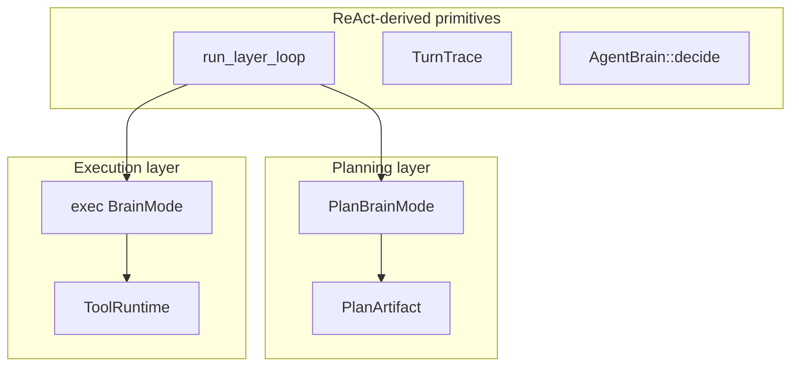

# Task Registry

## What this is

A place to store **repeatable work as JSON contracts**. When a plan points at a contract, execution can run a fixed step driver instead of letting the LLM pick tools every time.

Glossary: [glossary.md](glossary.md)

## When to use / not use

- Use: you have reproducible procedures and want mechanical argument/step audit
- Skip: only freeform one-off work; registry-less freeform execution is enough

## Plain flow

Write `tasks/*.json` → plan references a task id → step driver or ReAct runs → audit

Feature-block tasks are defined with **`steps[]` (required `method` + `order`)**. Planning and execution share the ReAct-derived loop (`src/layer.rs`).

| Area | Location |
|------|----------|
| JSON defs | [`tasks/`](../../../tasks/) (schema overview: [`tasks/README.md`](../../../tasks/README.md)) |
| Definition / audit | `src/tasks/` |
| Planning | `PlanBrainMode` + `run_plan_layer` |
| Execution | `ReActLoop` + `run_layer_loop` or `run_subtask_driver` |

Tool selection / audit: [02-01_tool-selection.md](02-01_tool-selection.md) · Japanese: [05_タスクレジストリ.md](../../ja/architecture/05_タスクレジストリ.md)

## Two layers + shared primitives

## Task contract

- `order` + `method` (tool name) + `args` template (`{param}` expansion)
- `react_only: true` (recommended)… contract for mission / audit; execution uses ReAct
- `react_only: false`… fixed-order execution without LLM when `use_step_driver` is on
- `tool_policy`… per-subtask allow / deny

## Plan resolve gates

`TaskRegistry::resolve_plan_with_tools`:

| Condition | Behavior |
|-----------|----------|
| Unknown `task` id | Demote to freeform subtask (hint in goal) |
| Required `method` missing from tool registry | Same (list missing tool names) |

The catalog hides non-runnable tasks via `catalog_for_planner_filtered(..., require_all_tools: true)`.

## Audit contract

After execution, `audit_subtask` / `audit_trace` check the trace.

| Check | Behavior |
|-------|----------|
| Required tool call order | Required. On miss → ReAct retry (max 2) |
| `tool_policy.deny` | Fail if a denied tool succeeded |
| Args | Expected keys ⊆ actual. `soft` (default) warns only; `hard` fails; `off` skips |

Config: `react.arg_audit_mode` (`off` / `soft` / `hard`). Unexpanded `{placeholder}` leaves are wildcards.

## Implementation map

| Item | Location |
|------|----------|
| `ExecStep` / `TaskDefinition` | `src/tasks/spec.rs` |
| `TaskRegistry` | `src/tasks/registry.rs` |
| Audit | `src/tasks/audit.rs` |
| Step driver | `src/tasks/driver.rs` |
| Candidate selection | `src/plan/candidates.rs` |

## Related

- [10_agent-minimum-action-unit.md](10_agent-minimum-action-unit.md)
- [08_react-implementation.md](08_react-implementation.md)
- [06_tool-plugins.md](06_tool-plugins.md)
- [02_execution-layer.md](02_execution-layer.md)
