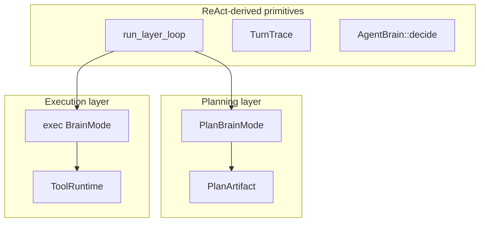

# Task Registry

A store of repeatable work as JSON contracts. Leaving routine tool order to the LLM every time drifts; required methods and order become machine-readable for candidate pick, audit, and optional step drivers. Domain recipes are not hardcoded into the engine—contracts live in `tasks/*.json`.

Use it for reproducible procedures and audit. Freeform alone is enough for one-off work. Feature blocks use `steps[]` (`method` + `order`). Planning and execution share the ReAct-derived loop in `src/layer.rs`.

| Area | Location |
|------|----------|
| JSON | [`tasks/`](../../../tasks/) ([README](../../../tasks/README.md)) |
| Code | `src/tasks/` |
| Planning | `PlanBrainMode` + `run_plan_layer` |
| Execution | `ReActLoop` + loop or `run_subtask_driver` |

Task definitions live outside the engine so hosts can add repeatable procedures without changing core logic. Planning can select them, and execution can either follow their steps mechanically or use them as constraints for ReAct.

Glossary: [glossary.md](glossary.md) · Tools: [02-01_tool-selection.md](02-01_tool-selection.md) · [JP](../../ja/architecture/05_タスクレジストリ.md)

## Two layers + shared primitives

The planner and executor share the same decision-and-trace machinery. They diverge only after that shared loop: planning produces a work description, while execution can operate tools.

## Task contract

- `order` + `method` (tool name) + `args` template (`{param}` expansion)
- `react_only: true` (recommended)… contract for mission / audit; execution uses ReAct
- `react_only: false`… fixed-order execution without LLM when `use_step_driver` is on
- `tool_policy`… per-subtask allow / deny

Each contract declares what must happen and which tools are permitted. A `react_only` contract guides and audits an LLM-driven execution; a driver-eligible contract can run its declared steps directly.

## Plan resolve gates

`TaskRegistry::resolve_plan_with_tools`:

| Condition | Behavior |
|-----------|----------|
| Unknown `task` id | Demote to freeform subtask (hint in goal) |
| Required `method` missing from tool registry | Same (list missing tool names) |

Resolution protects execution from selecting a contract that cannot run. Unknown or unavailable tasks become free-form work, preserving the goal without pretending a missing procedure is executable.

The catalog hides non-runnable tasks via `catalog_for_planner_filtered(..., require_all_tools: true)`.

## Audit contract

After execution, `audit_subtask` / `audit_trace` check the trace.

| Check | Behavior |
|-------|----------|
| Required tool call order | Required. On miss → ReAct retry (max 2) |
| `tool_policy.deny` | Fail if a denied tool succeeded |
| Args | Expected keys ⊆ actual. `soft` (default) warns only; `hard` fails; `off` skips |

Audit first checks whether required operations occurred in the required order. It then rejects successful use of denied tools and applies the configured argument strictness.

A contract failure can be retried through ReAct, while placeholders remain flexible where the contract intentionally leaves values unresolved.
Config: `react.arg_audit_mode` (`off` / `soft` / `hard`). Unexpanded `{placeholder}` leaves are wildcards.

## Implementation map

| Item | Location |
|------|----------|
| `ExecStep` / `TaskDefinition` | `src/tasks/spec.rs` |
| `TaskRegistry` | `src/tasks/registry.rs` |
| Audit | `src/tasks/audit.rs` |
| Step driver | `src/tasks/driver.rs` |
| Candidate selection | `src/plan/candidates.rs` |

The specification and registry modules define and resolve contracts. The driver executes eligible fixed procedures, the audit module verifies traces, and candidate selection makes runnable contracts available to planning.
## Related

- [10_agent-minimum-action-unit.md](10_agent-minimum-action-unit.md)
- [08_react-implementation.md](08_react-implementation.md)
- [06_tool-plugins.md](06_tool-plugins.md)
- [02_execution-layer.md](02_execution-layer.md)
