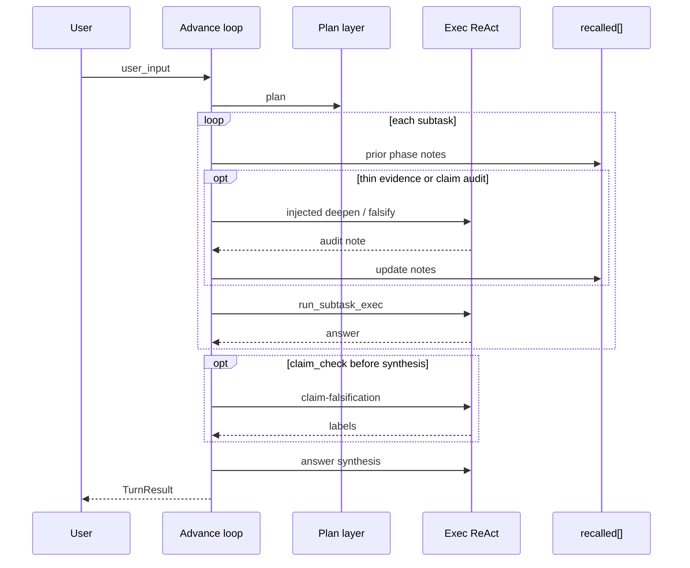

# Advance Loop


Outer progress that splits long requests into phases and carries summaries forward so one huge context does not dominate cost and quality. Not required for short jobs—standard two_phase is enough then.

Similar to two_phase, with thicker hand-off: recalled injection and optional session clear between phases. General gates also live here—evidence deepening, claim falsification, and citation checks—so the loop does not conclude from thin evidence or treat unsupported claims as settled facts.

Glossary: [glossary.md](glossary.md) · [JP](../../ja/architecture/07_推進ループ.md)

## Config (`config.json`)

```json
"react": {
  "advance": {
    "enabled": true,
    "max_phases": 8,
    "clear_session_each_phase": true,
    "max_note_chars": 1500,
    "show_phases": true,
    "min_substantive_obs": 3,
    "citation_check": true,
    "claim_check": true,
    "absence_check": true
  }
}
```

| Key | Meaning | Default |
|-----|---------|---------|
| `enabled` | Advance loop ON (priority over `two_phase`) | `false` |
| `max_phases` | Max phases per request | `8` |
| `clear_session_each_phase` | Clear `SessionMemory` before each phase | `true` |
| `max_note_chars` | Cap for one phase summary in `recalled` | `1500` |
| `show_phases` | Print phase start to stdout | `true` |
| `min_substantive_obs` | Min successful substantive tool observations (read/grep/etc.; bare `list_dir` does not count) before judgment | `3` |
| `citation_check` | After synthesis, flag path-like citations missing from prior Paths | `true` |
| `claim_check` | Before later work or synthesis, once try to falsify prior Claims | `true` |
| `absence_check` | After synthesis, flag absence claims missing/conflicting with tool trace | `true` |

These settings bound how much long-running work a single request can perform, how much of each completed phase is carried forward, and where the harness stops thin-evidence conclusions.

## Priority

`run_turn` branching:

1. `advance.enabled` → `run_turn_advance`
2. Else if `two_phase` → `run_turn_two_phase`
3. Else → single ReAct

## Flow



The advance loop makes one plan, then handles its subtasks as successive phases. Before each phase, it restores the accumulated phase notes into recalled context.

The execution result becomes both the phase outcome and evidence for the following phase. When no phases remain, their work is returned as one turn result.

When the plan emits `task: replan`, treat it as control-plane work, not an exec tool. `resolve_plan` keeps the id (it is not demoted to freeform); the advance loop restarts the plan layer. The exec layer must not invent an Action tool named `replan`.

### Evidence handoff and synthesis

Later phases receive an **evidence grounding** rule in Recalled (and in the mission when prior results exist): claims must cite prior-phase evidence; unsupported points are unverified candidates or need more tools. After two or more phases finish, the harness runs a final **answer synthesis** pass that rewrites the user reply from phase evidence only.

Phase handoff uses a **structured note** (Paths / Claims / Open questions, plus a short answer excerpt when needed) instead of only truncating the full answer. Later Recalled context and final synthesis prefer that structure.

### Evidence deepening

When **substantive** successful tool observations (`read_file` / `grep` / `web_search` / `run_cmd` / `write_file`; bare `list_dir` does not count) are still below `min_substantive_obs` (default 3) before the next phase, the harness inserts one **evidence-deepening** subtask (also after an empty `replan`). Weak `done_when` values such as `step completed` are raised to an evidence-oriented criterion at plan resolve.

### Claim falsification

When prior phases have Claims or Paths and `claim_check` is on (default), the harness inserts one **claim-falsification** phase before the next planned phase, or once before final synthesis if the plan queue is already empty. For each substantive claim it tries once to find contradictory evidence with tools (prefer `read_file` / `grep` on cited Paths) and labels the claim supported / falsified / unverified. This phase does not invent new recommendations; it only stress-tests existing claims. Later Recalled context and synthesis apply `claim_audit_rules` so falsified claims are not repeated as facts or high-confidence proposals.

If evidence is still thin, deepening runs first; claim falsification runs at most once afterward.

### Citation check

After multi-phase answer synthesis, when `citation_check` is on (default), path-like tokens in the final reply are checked against prior Paths; unsupported ones are annotated under `## Citation check` as unverified. Path tokens must be mostly ASCII so Japanese headings are not mistaken for paths.

### Absence-claim gate

When `absence_check` is on (default), absence/deficiency claims in the final answer (e.g. “does not exist”, “一切ない”) are checked against the turn’s tool trace. Claims with no related `grep` / `read_file` are annotated under `## Unverified absence`. Claims that conflict with non-empty related observations are annotated under `## Contradicted absence`.

If a claim-falsification phase finishes with zero substantive tool successes, the harness retries that audit once before synthesis.

## Library

- `AdvanceConfig`, `AdvanceProgress`, `AdvancePhaseNote` — `harness_seed::advance`
- `claim_falsification_subtask`, `claim_audit_rules`, `evidence_deepening_subtask`
- `apply_citation_gate`, `prior_has_auditable_claims`
- `TurnResult::advance_phases` — per phase `id` / `goal` / `answer` / `steps_used`

The configuration describes the limits and carry-forward policy. The progress record preserves each completed phase so hosts can inspect both the final answer and the intermediate work that led to it.
Host apps keep content pushed via `blocks.push_recalled(...)` across phases (`prepare_phase_recalled` restores the base).

## Related

- [03_memory-layer.md](03_memory-layer.md) — external memory (Memory RAG + Bridge, local / mempalace)
- [09_context-memory-mapping.md](09_context-memory-mapping.md) — memory layers
- [08_react-implementation.md](08_react-implementation.md) — inner ReAct
- [config/README.md](../../../config/README.md) — `react.advance` keys
