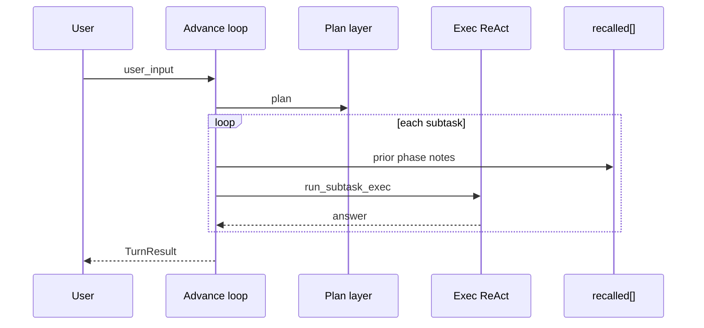

# Advance Loop


Outer progress that splits long requests into phases and carries summaries forward so one huge context does not dominate cost and quality. Not required for short jobs—standard two_phase is enough then.

Similar to two_phase, with thicker hand-off: recalled injection and optional session clear between phases.

Glossary: [glossary.md](glossary.md) · [JP](../../ja/architecture/07_推進ループ.md)

## Config (`config.json`)

```json
"react": {
  "advance": {
    "enabled": true,
    "max_phases": 8,
    "clear_session_each_phase": true,
    "max_note_chars": 1500,
    "show_phases": true
  }
}
```

| Key | Meaning | Default |
|-----|---------|---------|
| `enabled` | Advance loop ON (priority over `two_phase`) | `false` |
| `max_phases` | Max phases per request | `8` |
| `clear_session_each_phase` | Clear `SessionMemory` before each phase | `true` |
| `max_note_chars` | Cap for one phase summary in `recalled` | `1500` |
| `show_phases` | Print phase start to stdout | `true` |

These settings bound how much long-running work a single request can perform and how much of each completed phase is carried forward. Clearing session memory prevents unrelated conversational history from accumulating between phases.

## Priority

`run_turn` branching:

1. `advance.enabled` → `run_turn_advance`
2. Else if `two_phase` → `run_turn_two_phase`
3. Else → single ReAct

## Flow



The advance loop makes one plan, then handles its subtasks as successive phases. Before each phase, it restores the accumulated phase notes into recalled context.

The execution result becomes both the phase outcome and evidence for the following phase. When no phases remain, their work is returned as one turn result.
## Library

- `AdvanceConfig`, `AdvanceProgress` — `harness_seed::advance`
- `TurnResult::advance_phases` — per phase `id` / `goal` / `answer` / `steps_used`

The configuration describes the limits and carry-forward policy. The progress record preserves each completed phase so hosts can inspect both the final answer and the intermediate work that led to it.
Host apps keep content pushed via `blocks.push_recalled(...)` across phases (`prepare_phase_recalled` restores the base).

## Related

- [03_memory-layer.md](03_memory-layer.md) — external memory (Memory RAG + Bridge, local / mempalace)
- [09_context-memory-mapping.md](09_context-memory-mapping.md) — memory layers
- [08_react-implementation.md](08_react-implementation.md) — inner ReAct
