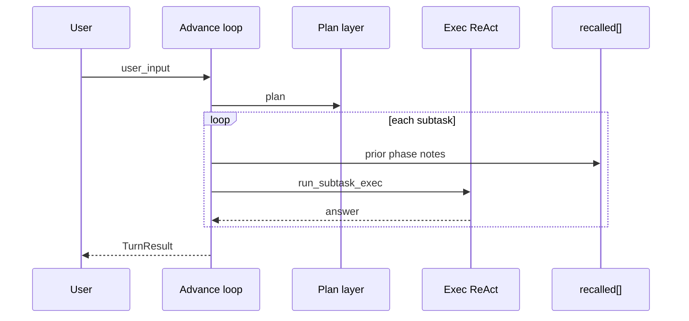

# Advance Loop

## What this is

**Outer progress for long requests**: split work into phases, put a summary of each finished phase into the next prompt so context does not balloon.

Glossary: [glossary.md](glossary.md)

## When to use / not use

- Use: long work in multiple phases; keep each LLM call’s context small
- Skip: short requests where standard plan-then-execute (`two_phase`) is enough

Similar to `two_phase`, but also does **recalled injection** and optional **session clear** between phases.

## Plain flow

Overall plan → run phase 1 → carry summary → phase 2… → final answer

Japanese version: [07_推進ループ.md](../../ja/architecture/07_推進ループ.md)

## Config (`config.json`)

```json
"react": {
  "advance": {
    "enabled": true,
    "max_phases": 8,
    "clear_session_each_phase": true,
    "max_note_chars": 1500,
    "show_phases": true
  }
}
```

| Key | Meaning | Default |
|-----|---------|---------|
| `enabled` | Advance loop ON (priority over `two_phase`) | `false` |
| `max_phases` | Max phases per request | `8` |
| `clear_session_each_phase` | Clear `SessionMemory` before each phase | `true` |
| `max_note_chars` | Cap for one phase summary in `recalled` | `1500` |
| `show_phases` | Print phase start to stdout | `true` |

## Priority

`run_turn` branching:

1. `advance.enabled` → `run_turn_advance`
2. Else if `two_phase` → `run_turn_two_phase`
3. Else → single ReAct

## Flow



## Library

- `AdvanceConfig`, `AdvanceProgress` — `harness_seed::advance`
- `TurnResult::advance_phases` — per phase `id` / `goal` / `answer` / `steps_used`

Host apps keep content pushed via `blocks.push_recalled(...)` across phases (`prepare_phase_recalled` restores the base).

## Related

- [03_memory-layer.md](03_memory-layer.md) — external memory (Memory RAG + Bridge, local / mempalace)
- [09_context-memory-mapping.md](09_context-memory-mapping.md) — memory layers
- [08_react-implementation.md](08_react-implementation.md) — inner ReAct
