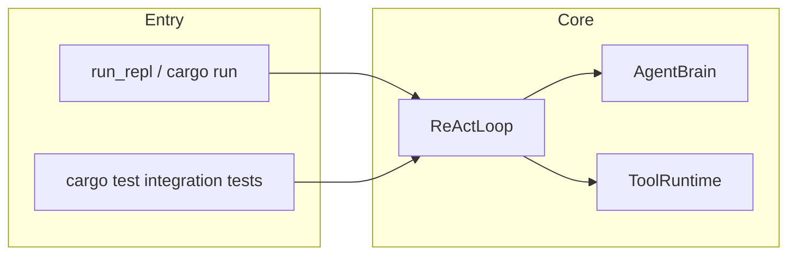
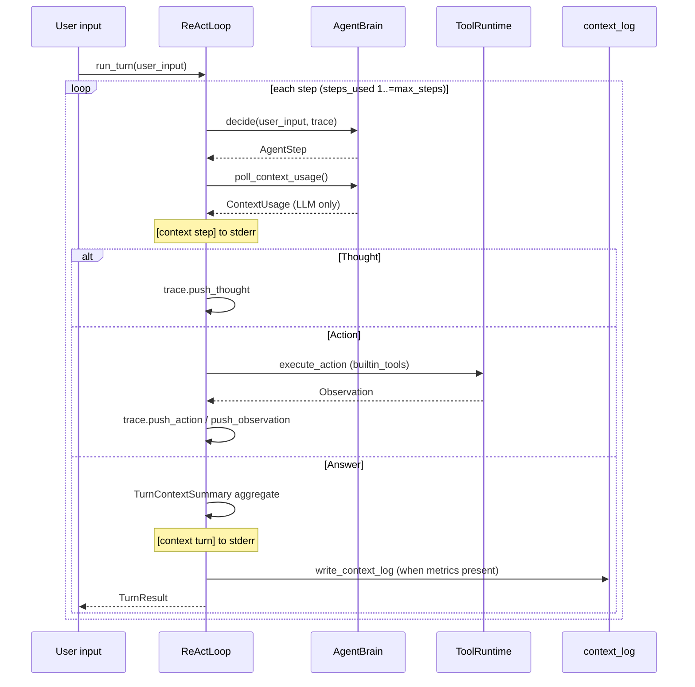

# HarnessSeed ReAct implementation (current)


A snapshot of how the think → (optionally) tool → observe loop is implemented in this repository (source as of 2026-05). Layer docs alone do not explain limits and step kinds; this page shares those boundaries. It is not product-domain procedure.

One user input is one turn. Thought / Action / Observation repeat until `Answer`.

Glossary: [glossary.md](glossary.md) · Unit: [10_agent-minimum-action-unit.md](10_agent-minimum-action-unit.md) · Index: [README.md](README.md) · [JP](../../ja/architecture/08_ReAct実装.md)

## 1. Overview

HarnessSeed runs a ReAct loop where **one user input = one turn**, repeating `Thought` / `Action` / `Observation` until an `Answer` is returned.

| item | implementation |
|------|----------------|
| engine | `ReActLoop<B: AgentBrain>` (`src/react.rs`) |
| minimum action unit | **one `Action` (tool call)** |
| brain | `SimpleRuleBrain` (rules) / `LlmBrain` (LLM JSON step) |
| CLI path | `BrainMode` → `ReActLoop` (`src/main.rs`) |
| configuration | `config/config.json` + `AppConfig::react_config` |
| tool specification docs | [../builtin_tools/README.md](../builtin_tools/README.md) (implementation in `src/tool/`) |

The loop is the common runtime for both the command-line path and integration tests. It asks a brain for the next step and delegates any tool operation to the runtime.



Both entry paths create the same loop. The loop consults a brain for decisions and consults the tool runtime only when that decision is an action.

## 2. Module layout

| path | responsibility |
|------|----------------|
| `src/react.rs` | loop body, REPL, `ReActConfig` |
| `src/action.rs` | `AgentStep`, `Action`, `Observation`, `TurnTrace` |
| `src/brain.rs` | `AgentBrain` trait, `SimpleRuleBrain`, `BrainMode` |
| `src/tool/` | tool trait, registry, packs, `ToolRuntime` (specs in [../builtin_tools/README.md](../builtin_tools/README.md)) |
| `src/llm/brain.rs` | `LlmBrain`, system prompt, message assembly |
| `src/llm/parse.rs` | LLM output JSON → `AgentStep` |
| `src/context_metrics.rs` | prompt / completion metrics |
| `src/context_log.rs` | append JSON Lines to `logs/context.jsonl` |

The loop module coordinates a turn, while the action module records each kind of step. Brain and LLM modules decide and parse the next response; tool and context modules execute operations and preserve diagnostics.

## 3. One-turn control flow

`run_turn` loops up to `max_steps` (default 16). Each iteration returns **one step from the brain**.



The loop starts with the user's input and repeats one decision at a time. It records model usage after each decision, then handles the returned step.

Thoughts change only the trace. Actions call a tool and record its observation; an answer finalizes metrics and returns the completed turn.

### 3.1 Handling `AgentStep`

| variant | loop behavior | side effects on environment |
|---------|---------------|----------------------------|
| `Thought(String)` | accumulate in `trace` only | none |
| `Action(Action)` | run [built-in tool](../builtin_tools/README.md) → accumulate `Observation` in `trace` | **yes (minimum action unit)** |
| `Answer(String)` | end turn; return `TurnResult` | none (final user-facing reply) |

Only an action can change the environment. Thoughts preserve reasoning for the next decision, and an answer ends the turn without performing additional work.

`steps_used` is the **loop iteration count** (number of `decide` calls), which may differ from the number of tool calls (`Thought` or immediate `Answer` also count as one step).

## 4. Brain (AgentBrain)

### 4.1 Trait

```rust
pub trait AgentBrain {
    fn decide(&mut self, user_input: &str, trace: &TurnTrace) -> AgentStep;
    fn poll_context_usage(&mut self) -> Option<ContextUsage> { None }
}
```

- **`decide`**: from current `user_input` and in-turn `trace`, choose the next single step.
- **`poll_context_usage`**: returns metrics only when the preceding `decide` invoked the LLM (consumed on the brain side after fetch).

### 4.2 SimpleRuleBrain (rule brain)

Used with `--no-llm` or when `config` has no `llm.provider`.

| input pattern | typical step sequence |
|---------------|----------------------|
| `help` | `Answer` (1 step) |
| `echo <text>` | `Action(echo)` → `Answer` (2 steps) — [echo.md](../builtin_tools/echo.md) |
| `time` | `Action(time)` → `Answer` (2 steps) — [time.md](../builtin_tools/time.md) |
| other | `Thought` → `Action(echo)` → `Answer` (3 steps) |

The rule brain follows fixed patterns and therefore does not produce model usage data. Each pattern still uses the same turn loop and action recording as an LLM-backed turn.

Because no LLM is used, **`context_usages` is always empty** → no context log is written.

### 4.3 LlmBrain (LLM brain)

Each `decide` calls the **Chat Completions API once**. The response is interpreted as a **single JSON object**.

**System prompt** (`SYSTEM_PROMPT` constant in `src/llm/brain.rs` + dynamic `Tool catalog`):

- role: ReAct agent
- output schema: `thought` / `action` / `answer`
- enumeration of available tools (`ToolRegistry::format_catalog()` — automatic when packs are registered; each tool also has a `.md` doc)

**User message** (rebuilt every call):

```
User input:
{user_input}

Turn trace so far:
[thought 0] ...
[action 1] echo {...}
[observation 1] ok: ...

Next step JSON:
```

Parsing: `parse_agent_step` in `src/llm/parse.rs`. On failure, the turn ends with an error message in `Answer`.

### 4.4 BrainMode (CLI wrapper)

`main` selects `Rule` / `Llm` via `BrainMode::from_cli` and passes it to `ReActLoop<BrainMode>`.

**Important**: `BrainMode` **forwards** `poll_context_usage` to the inner brain (metrics and file logging work on the CLI path too).

## 5. Tools (ToolRuntime)

When `ReActLoop` receives an `Action`, it calls `ToolRuntime::execute`. Implementation source of truth is `src/tool/`; human-readable specs are in **[../builtin_tools/README.md](../builtin_tools/README.md)** (**one tool, one file**).

### 5.1 Catalog

| tool | purpose (summary) | spec |
|------|-------------------|------|
| `echo` | return string as-is | [echo.md](../builtin_tools/echo.md) |
| `time` | Unix epoch seconds | [time.md](../builtin_tools/time.md) |
| `list_dir` | directory listing | [list_dir.md](../builtin_tools/list_dir.md) |
| `grep` | text search | [grep.md](../builtin_tools/grep.md) |
| `read_file` | read file | [read_file.md](../builtin_tools/read_file.md) |
| `write_file` | write file | [write_file.md](../builtin_tools/write_file.md) |
| `run_cmd` | shell execution | [run_cmd.md](../builtin_tools/run_cmd.md) |

The runtime exposes only registered tools. Each catalog row points to the human-readable contract for its operation, while the implementation under `src/tool/` performs the call.

### 5.2 Common behavior (see builtin_tools README)

- **Workspace**: paths must stay under the crate root (`resolve_in_workspace`). Details in [../builtin_tools/README.md](../builtin_tools/README.md).
- **Observation**: meaning of `ok` / `output` is in the README "Observation" section.
- **Unknown tool**: fails with `unknown tool: <name>`; with the LLM brain, the next `decide` sees it on the trace.

### 5.3 Extension procedure

To add a new tool:

1. Add a `Tool` implementation in `src/tool/builtin.rs` and register via `ToolPack` or `register_plugin`
2. Update `SYSTEM_PROMPT` in `src/llm/brain.rs`
3. Add `doc/ja/builtin_tools/<tool>.md` and one row in [../builtin_tools/README.md](../builtin_tools/README.md)
4. If needed, add prompt constants and integration tests in `tests/common/mod.rs`

## 6. Context metrics and logging

### 6.1 Metrics hooks

On each LLM call:

1. `decide` retains `CompletionResult.usage` (`ContextUsage`)
2. the loop fetches via `poll_context_usage()` → push to `trace.context_usages`
3. stderr: `[context step] ...` (**verbose not required**)
4. with `show_prompt: true` or `--show-prompt`, full prompt per step (`--- [plan|step] prompt step N ---`)
5. at turn end: `[context turn] ...` (when `show_context_metrics: true`)
6. append to `context.jsonl` + `context log: appended to ...`

`prompt_tokens` counts the **full payload sent to the API** (system + user wrapper + trace), not the user text alone.

### 6.2 File log

| item | value |
|------|-------|
| default path | `logs/context.jsonl` (resolved from `CARGO_MANIFEST_DIR`) |
| configuration | `context_metrics` in `config.json` (empty string disables) |
| one line | one turn's JSON |
| `steps[].prompt` | full prompt for that LLM call |

Metrics are collected per model decision and summarized when the turn completes. The JSON Lines file stores one turn per line, including the prompt captured for each LLM step when logging is enabled.

## 7. Configuration and startup

### 7.1 Brain selection

```
want_llm = !no_llm && (use_llm || config has llm.provider or API key)
```

| flag / config | result |
|---------------|--------|
| default + `llm.provider: lmstudio`, etc. | LLM brain |
| `--no-llm` | rule brain |
| `--llm` | force LLM even without `provider` (API config required) |

Configuration or explicit flags decide whether the loop uses rule-based behavior or an LLM. The forced LLM route still requires working API settings before a turn can complete.
### 7.2 ReAct-related config

```json
{
  "react": {
    "max_steps": 16,
    "verbose": false,
    "show_context_metrics": true
  },
  "log": {
    "context_metrics": "logs/context.jsonl"
  }
}
```

CLI `-v` / `--verbose` overrides `react.verbose` and enables Thought / Action / Observation on stderr. `--show-prompt` behaves like `react.show_prompt`, printing the full LLM prompt per ReAct step to stderr (API payload for LLM brain; preview for rule brain).

## 8. Tests and representative prompts

Integration tests share `config/config.json` from `tests/common/mod.rs`.

| constant | purpose |
|----------|---------|
| `SELF_INTRO_USER_PROMPT` | self-introduction (`tests/self_intro_test.rs`) |
| `LIST_FILES_USER_PROMPT` | current directory listing via [list_dir](../builtin_tools/list_dir.md) (`tests/list_files_test.rs`) |
| `WRITE_CODE_USER_PROMPT` | code creation via [write_file](../builtin_tools/write_file.md) / [read_file](../builtin_tools/read_file.md) (`tests/write_code_test.rs`) |

| test file | verifies |
|-----------|----------|
| `integration_test.rs` | basic rule-brain responses |
| `llm_connector_test.rs` | LLM connectivity, one ReAct turn |
| `brain_mode_context_test.rs` | metrics on same path as CLI |
| `context_metrics_test.rs` | metrics summary |
| `list_files_test.rs` | listing via `list_dir` tool |

The shared test configuration keeps integration paths comparable. LLM-dependent tests are conditional because their external model service may not be available in every environment.
LLM tests **SKIP** when the host is down or the model is unavailable (they do not fail the suite).

## 9. Current limitations and gaps

| item | status |
|------|--------|
| multi-turn conversation memory | `SessionMemory` → `Previous turns` (**work-log path only**). External memory: [03_memory-layer.md](03_memory-layer.md) (Memory RAG + Bridge). In-turn `TurnTrace` is fresh each turn |
| Observation size | truncated by `MAX_OBSERVATION_CHARS` (prevents context overflow on huge files) |
| external system prompt config | constants in `brain.rs` only (not `config.json`) |
| parallel tool calls | one `Action` per step only |
| mandatory Thought | LLM may return `action` / `answer` directly |
| streaming responses | not supported (blocking completion only) |
| dynamic tool registration | `ToolPack` + `register_plugin` ([06_tool-plugins.md](06_tool-plugins.md)) |
| `run_cmd` safety | see [run_cmd.md](../builtin_tools/run_cmd.md). cwd restricted to workspace; command content is unrestricted |

The current loop intentionally keeps one action per step and does not stream responses. Memory and prompt size controls are partial safeguards, while tool registration and command-content policy remain important deployment boundaries.
## 10. Typical patterns

### LLM + list_dir (2 steps)

Tool spec: [list_dir.md](../builtin_tools/list_dir.md)

```
User: LIST_FILES_USER_PROMPT
  → decide #1: action list_dir
  → Observation: Cargo.toml, src/, ...
  → decide #2: answer (return listing as-is)
```

### LLM + code creation (about 3 steps)

Tool specs: [write_file.md](../builtin_tools/write_file.md), [read_file.md](../builtin_tools/read_file.md), (for verification) [run_cmd.md](../builtin_tools/run_cmd.md)

```
User: WRITE_CODE_USER_PROMPT
  → write_file → read_file to verify → answer
  (optionally run_cmd for cargo check)
```

### Rule brain + general input (3 steps)

```
User: hello world
  → Thought
  → Action(echo, "hello world")
  → Answer("Received: hello world")
```

---

## Related documentation

| document | content |
|----------|---------|
| [../builtin_tools/README.md](../builtin_tools/README.md) | **Built-in tools overview** (workspace, Observation, catalog) |
| [../builtin_tools/echo.md](../builtin_tools/echo.md) and other `.md` files | per-tool arguments, behavior, failures, LLM call examples |
| [10_agent-minimum-action-unit.md](10_agent-minimum-action-unit.md) | minimum action unit concept |
| [../../config/README.md](../../../config/README.md) | configuration layout |

The tool documentation explains individual operations. The surrounding architecture pages explain how the loop groups those operations into a turn and why one action is the audit boundary.