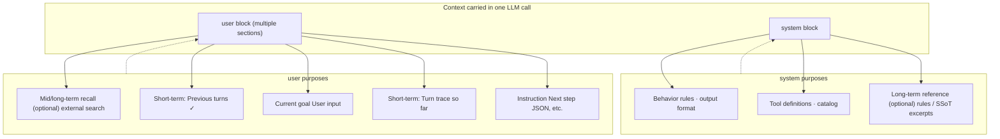
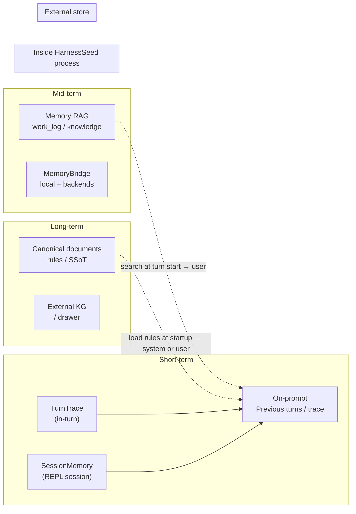
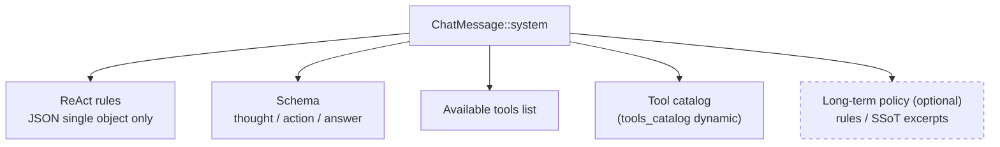
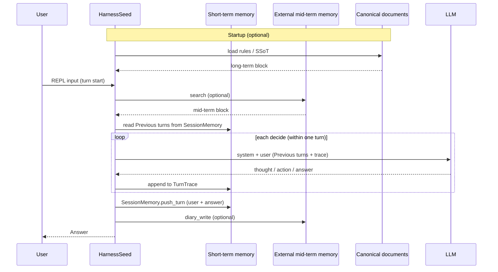
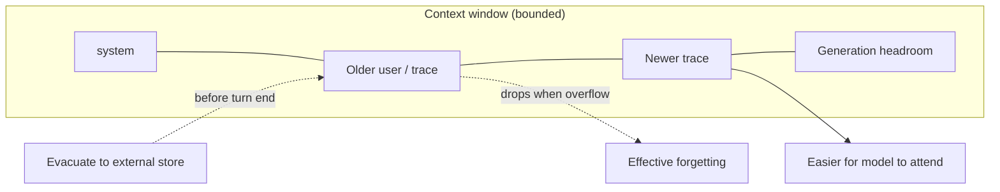
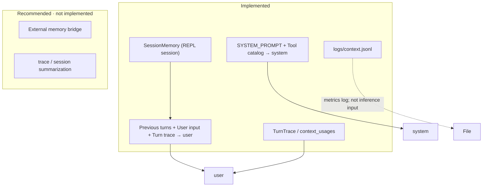
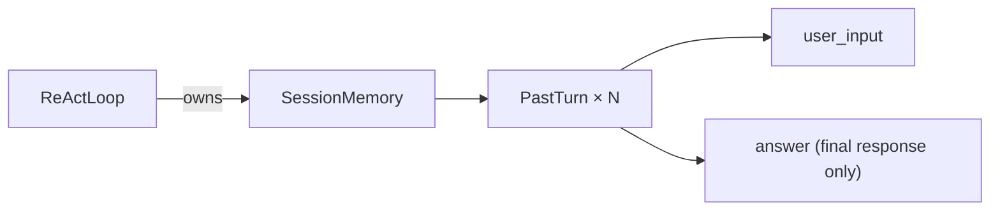
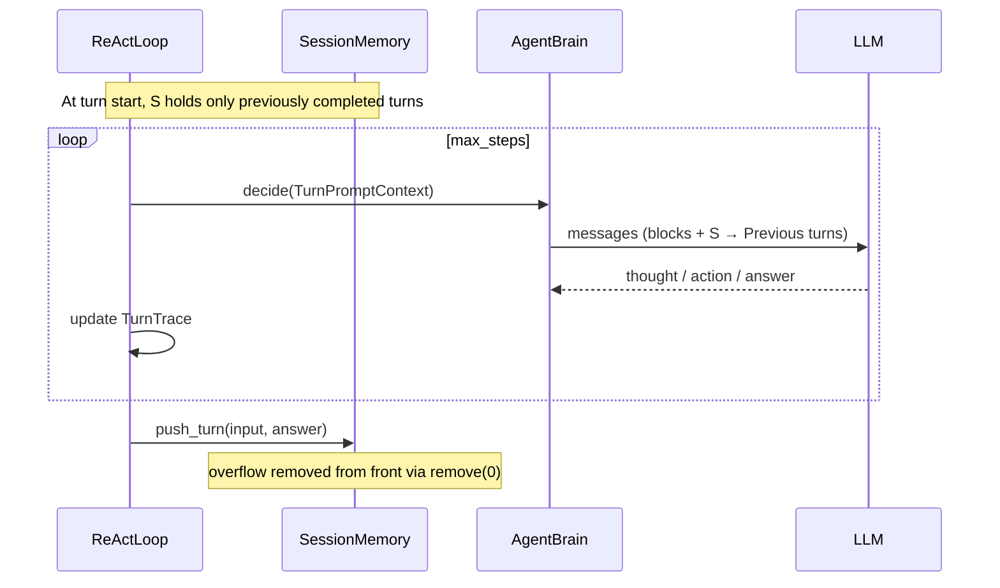

# Context memory mapping


A map of what goes into one LLM request—purpose, length, and placement—so short chat, recalled snippets, and long knowledge are not confused. It does not replace memory-backend detail ([03_memory-layer.md](03_memory-layer.md)).

Use it when prompts balloon and you need a shared language for what the model sees. Assembly is mainly `TurnPromptContext::render`.

Glossary: [glossary.md](glossary.md) · ReAct: [08_react-implementation.md](08_react-implementation.md) · [JP](../../ja/architecture/09_コンテキストマッピング.md)

**Status (as of 2026-07)**

| Area | Status |
|------|--------|
| In-turn `TurnTrace` | Implemented (older observations clipped when injected into prompts) |
| Session short-term `SessionMemory` → `Previous turns` | **Implemented** (§10). Injected **only on the work-log path (`work_log`)** |
| Context metrics / `logs/context.jsonl` | Implemented (Observation has a character cap) |
| External memory (search / diary) | **Implemented** — [03_memory-layer.md](03_memory-layer.md) (memory RAG + `MemoryBridge`) |
| Rules file injection (`prompt.rules_paths`) | **Implemented** (`PromptBlocks`) |
| trace / session summarization | Trace uses **windowed clipping**; semantic session summary not yet |

The current implementation keeps in-turn trace (with prompt-side clipping of older observations), selected previous turns, metrics, external recall, and rules injection. Semantic session summaries are still future work.

---

## 1. One-page view: contents of the context window



The system message carries rules and tool descriptions that change infrequently. The user message carries recalled evidence, the current request, and the trace that changes as work proceeds.

**Principles**

| Layer | Primary placement | Change frequency |
|-------|-------------------|------------------|
| Near-invariant policy | **system** | Low |
| Current request · in-progress work | **user** (block split) | High |

Stable policy belongs in the system message so it is consistently applied. Current work belongs in the user message, where the prompt can refresh it for each decision.

---

## 2. Memory layer × storage location



Short-term memory keeps the current turn’s trace and recent conversation in process. Those pieces are ready for the next decision, but they disappear when the session ends.

Longer-lived material stays in external memory or canonical documents. At turn start the engine pulls only what is needed into the prompt, so it does not resend entire histories every time.

| Memory layer | Role | Storage (recommended) | HarnessSeed today |
|--------------|------|----------------------|-------------------|
| **Short-term** | Current turn · recent utterances | Heap `TurnTrace` / `SessionMemory` → **user block** | trace + **SessionMemory** (`Previous turns`, reset on REPL `clear`) |
| **Mid-term** | Days–weeks of work · history | External diary, search | Not connected |
| **Long-term** | Conventions · canonical sources · relations | Canonical documents / external KG | Not connected |

---

## 3. Order within the user block (recommended layout)

```mermaid
block-beta
    columns 1

    block:recall:2
        columns 1
        recallTitle["Recalled context (optional)"]
        memSearch["External search results"]
        docRecall["Canonical / rules excerpts"]
    end

    block:session:2
        columns 1
        sessTitle["Session memory (optional)"]
        prev["Previous turns: last N turns ✓"]
    end

    block:task:1
        columns 1
        goal["User input: current goal"]
    end

    block:work:2
        columns 1
        traceTitle["Working memory (in-turn)"]
        trace["Turn trace so far\nthought / action / observation"]
    end

    block:cue:1
        columns 1
        next["Next step JSON:"]
```

First come recalled excerpts that frame the request, then recent conversation so continuity is not lost. After that the current goal is stated, followed by the operations and observations already gathered in this turn. A short output cue closes the block so the model answers in the expected format.

| Order | Section | Purpose | Typical source |
|-------|---------|---------|----------------|
| 1 | Recalled context | Quotes from long/mid-term | External store, rules files |
| 2 | Previous turns | Short-term (conversation continuity) | `SessionMemory` |
| 3 | User input | **Current task** | REPL one-line input |
| 4 | Turn trace so far | **In-progress facts** | `TurnTrace` |
| 5 | Next step JSON | Output-format reminder | Harness fixed text |

HarnessSeed currently assembles previous turns, the user input, the trace, and the response cue. Recalled context and rule injection are added when those configured sources provide material.

---

## 4. Purposes within the system block



The system block first fixes output format and standing constraints. It then lists available tools and their arguments so the model does not invent operations that do not exist.

Optional long-term policy may be appended here, but the current request itself stays in the user message. That keeps durable rules separate from the turn’s goal.

| Content | Placement | Update frequency |
|---------|-----------|------------------|
| Output format · prohibitions | Fixed in system | On code change |
| Tool names · argument summary | system + catalog | On tool add |
| Project constitution · rules | system head or tail (optional) | On canonical document update |

**Do not put the current goal in system** (use user `User input` instead).

---

## 5. Lifecycle: when each piece is loaded



At startup the host may load durable rules. At turn start it optionally searches external memory and reads previous turns, then builds each model call from that material plus the growing in-turn trace. When the answer is fixed, the session store is updated and an optional diary write closes the turn.

| Timing | Short-term | Mid-term | Long-term |
|--------|------------|----------|-----------|
| Process startup | — | — | Load rules / canonical (optional · not yet) |
| Turn start | **Implemented**: `SessionMemory` → `Previous turns` at user head | search → user (not yet) | Load (not yet) |
| Each `decide` | `TurnTrace` grows (re-sent only within turn) | — | — |
| Turn end | **Implemented**: `push_turn(user, answer)` | diary_write (not yet) | Usually not written |
| REPL `clear` | **Implemented**: `SessionMemory::clear()` | — | — |

---

## 6. When context is long (forgetting)



As the prompt grows, older material can fall outside the window and stop affecting decisions. Keeping a short summary, or writing important results out before they are dropped, preserves evidence that would otherwise be lost.

| Phenomenon | Cause | Mitigation |
|------------|-------|------------|
| Old observations stop working in-turn | trace grows linearly | Summarize trace · keep last N steps only |
| REPL forgets earlier utterances (beyond K) | Turns older than `session_max_turns` are dropped | Tune K, `clear`, future: evacuate to external store |
| Complete loss of overflowed content | Outside window | Evacuate to external diary / local summary file |

Check metrics via `[context step]` / `prompt_tokens` in `logs/context.jsonl`.

---

## 7. Quick reference: purpose × placement

| Purpose | Placement | Memory layer | Recommended store |
|---------|-----------|--------------|-------------------|
| JSON output format only | system | — | Code |
| Tool list | system + catalog | — | Code + [../builtin_tools/README.md](../builtin_tools/README.md) |
| Project rules / conduct conventions | system (excerpt) | Long-term | Rules files / canonical |
| Project spec · decisions | user head or system | Long-term | Canonical documents |
| Recall similar past work | user head | Mid-term | External search |
| Recent conversation | user `Previous turns` | Short-term | In-process SessionMemory |
| Current request | user `User input` | Short-term | Input itself |
| Thought / Action / Observation | user `Turn trace` | Short-term | TurnTrace |
| Raw tool output | observation in trace | Short-term | TurnTrace |
| Cross-session diary | (injection or tool) | Mid-term | External diary |
| Entity relations | user excerpt or tool | Long-term | External KG |

Use the purpose to choose placement: enduring instructions belong in system, current work and retrieved evidence belong in user, and durable history belongs outside the prompt until it is needed.

---

## 8. Mapping to HarnessSeed today



What is already wired builds system rules and the active user context for each call. Metrics go to a file for diagnosis and are not fed back into the model. Compression and broader external memory remain recommended next steps, without changing that separation.

| Mapping element | Source |
|-----------------|--------|
| system rules · tools | `src/llm/brain.rs` `SYSTEM_PROMPT` + `tools_catalog()` |
| user `Previous turns` | `src/session.rs` `format_for_prompt` ← `ReActLoop.session` |
| user goal + trace | `src/llm/brain.rs` `build_messages` |
| Short-term in-turn | `src/action.rs` `TurnTrace` |
| Short-term cross-session | `src/session.rs` `SessionMemory` / `src/react.rs` |
| Metrics | `src/context_metrics.rs`, `src/context_log.rs` |
---

## 10. Short-term memory (SessionMemory) implementation

Keeps **completed turn history** valid only during a REPL session and loads it into later LLM calls as `Previous turns:`.

### 10.1 Data structures



The loop owns one session store. That store keeps completed user/answer pairs and intentionally omits in-turn reasoning and raw tool output, so the next turn starts from a compact conversational record.

| Type | File | Contents |
|------|------|----------|
| `PastTurn` | `src/session.rs` | One turn: `user_input` + `answer` |
| `SessionMemory` | `src/session.rs` | `Vec<PastTurn>` + limit settings |

**Intentionally not stored**

- In-turn `thought` / `action` / `observation` (`TurnTrace` is discarded at turn end)
- Full tool output (summarization if needed: future §10.4)

### 10.2 Prompt placement

User block layout in `LlmBrain::build_messages` (`src/llm/brain.rs`):

```
{Previous turns: (omitted if empty)}

User input:
{current REPL one-liner}

Turn trace so far:
{trace for this turn}

Next step JSON:
```

During a turn, the session contains only earlier completed turns. Each model decision receives that history together with the current trace, which grows independently.

Once the answer is fixed, the loop appends the completed pair and removes the oldest entry when the configured limit is exceeded.
`Previous turns` format (`SessionMemory::format_for_prompt`):

```text
Previous turns:
[turn 1]
User: ...
Assistant: ...
[turn 2]
...
```

### 10.3 Lifecycle (implementation)



During the turn the loop only reads previous completed turns into each decide. After the answer is fixed it appends the new pair, dropping the oldest when the session limit is exceeded. REPL clear empties the store entirely.

| Operation | Timing | Code |
|-----------|--------|------|
| Read | Each `decide` | `TurnPromptContext { blocks, input, trace, session }` |
| Write | Right after `Answer` is fixed | `session.push_turn(user_input, answer)` |
| Reset | REPL `clear` / `forget` / `reset` | `session.clear()` (`src/react.rs` `run_repl`) |

The third argument `session` to `AgentBrain::decide` is **accepted by all brains**, but only **LlmBrain** reflects it in the prompt today (`SimpleRuleBrain` does not use it).

### 10.4 Limits and configuration

| Item | Default | Setting |
|------|---------|---------|
| Turns retained | 8 | `react.session_max_turns` (`config/config.json`) |
| Max chars per field | 2000 | Code constant `SessionMemory::DEFAULT_MAX_CHARS_PER_FIELD` (overflow truncated with `…`) |

The retention count limits how many completed turns remain available. The per-field cap limits the size of any one contribution, preventing a single long exchange from consuming the entire prompt.
`ReActConfig::session_max_turns` ← resolved via `AppConfig::react_config()`. `SessionMemory::new(...)` is created in `ReActLoop::new`.

### 10.5 Observation · verification

- **REPL**: From turn 2 onward in the same session, ask about something said earlier
- **Log**: Each step in `logs/context.jsonl` includes `Previous turns` in `prompt` (from turn 2 onward)
- **stderr**: `[context step]` `prompt_tokens` tends to grow as turns progress

### 10.6 Not implemented (next steps for short-term)

| Item | Description |
|------|-------------|
| session summarization | Compress meaning beyond N turns to shorten Previous turns |
| Persistence | `SessionMemory` is lost on process exit (file / external store not wired) |
| Rule brain | `SimpleRuleBrain` responses that reference session (demo · optional) |

In-turn trace uses windowed clipping via `format_trace` (recent observations kept fuller; older ones shortened). That is not semantic summarization.

These are future compression and persistence improvements. Current behavior retains a bounded in-process history only for the LLM path, then loses it when the process exits.
---

## 11. Related documents

| Document | Contents |
|----------|----------|
| [08_react-implementation.md](08_react-implementation.md) | ReAct loop · brains · logging |
| [10_agent-minimum-action-unit.md](10_agent-minimum-action-unit.md) | Action = 1 Tool Call |
| [../builtin_tools/README.md](../builtin_tools/README.md) | Tool specifications |
| [../../config/README.md](../../../config/README.md) | Runtime config (includes `session_max_turns`) |

Use the implementation page for the loop itself and the memory-layer page for retrieval and diary behavior. This page connects those mechanisms to the sections of one model request.