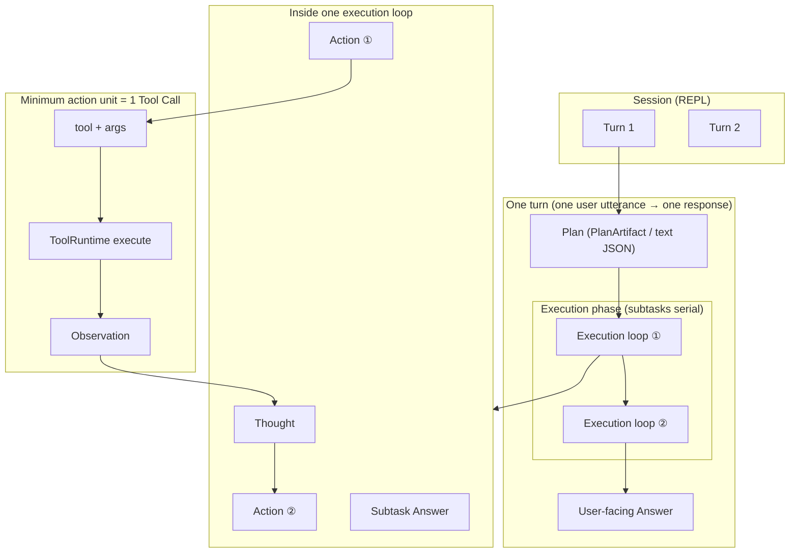
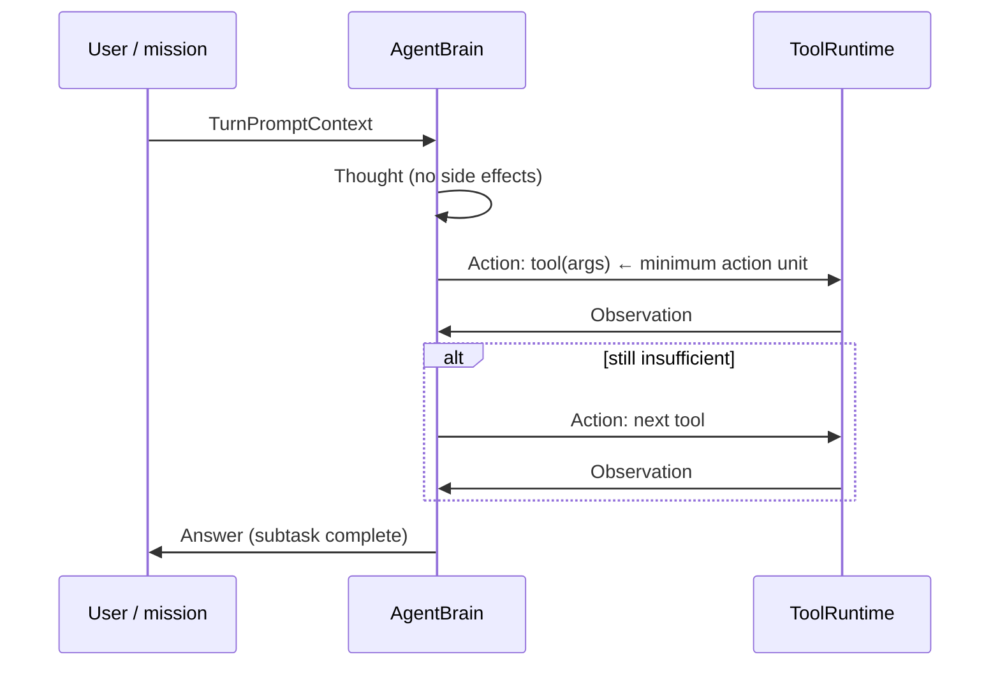
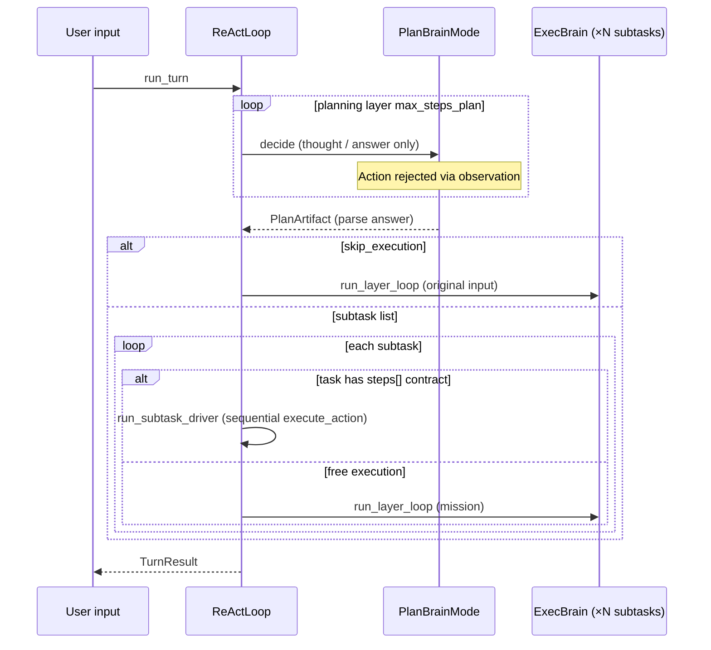
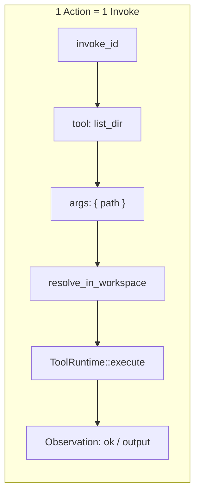
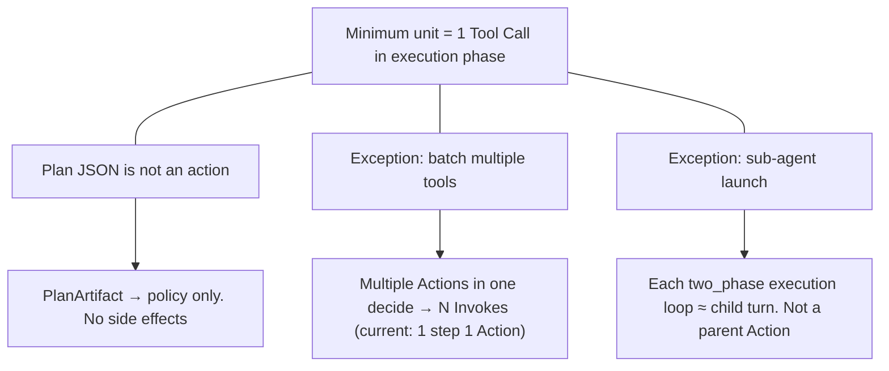

# Minimum action unit

In most agent implementations, the smallest operation that affects the real world is **one tool call (Tool Call)**. Reasoning text, plan JSON, and user-facing replies are not "actions"; tool execution and its result (Observation) are the basic units for harness design and logging.

- ReAct implementation (current): [08_react-implementation.md](08_react-implementation.md)
- Architecture (planning · execution layers): [README.md](README.md)
- Context layers: [09_context-memory-mapping.md](09_context-memory-mapping.md)
- Japanese version: [10_最少行動単位.md](../../ja/architecture/10_最少行動単位.md)

## 1. Hierarchy overview



| Level | Example | Minimum unit? | HarnessSeed (`two_phase` on) |
|-------|---------|---------------|------------------------------|
| Session | Entire chat | × | `SessionMemory` (REPL short-term) |
| Turn | One user utterance → one response | × | `run_turn` / `TurnResult` |
| Plan | Subtask list JSON | × | `PlanArtifact` (**no tools**) |
| Execution loop | ReAct for one subtask | × | `run_turn_single(mission)` |
| Action | One `read_file` | **◎** | `Action` + `invoke_id` |
| Observation | File contents · exit code | Result of action | `Observation` |

**Principle**: the planning phase does not touch the environment. Side effects come **only from `Action` in the execution phase**.

## 2. ReAct loop (inside one action)

"Think → run one tool → see result" is the smallest loop in the **execution phase**.



| Variant | Side effects on environment | HarnessSeed type |
|---------|----------------------------|------------------|
| `Thought` | None | `AgentStep::Thought` |
| `Action` | **Yes** | `AgentStep::Action` → `execute_action` |
| `Answer` | None (text response) | `AgentStep::Answer` |

## 3. Planning layer · execution layer (`two_phase`, shared ReAct loop)

When `react.two_phase: true`, **both** planning and execution layers run via `run_layer_loop` (`src/layer.rs`).



| Layer | Brain | Loop | Tools | Termination |
|-------|-------|------|-------|-------------|
| Plan | `PlanBrainMode` | `run_plan_layer` | **none** | `Answer` → `PlanArtifact` |
| Exec | exec `BrainMode` | `run_layer_loop` or **step driver** | **yes** | `Answer` → user-facing |

When a subtask has a registered task id (`tasks/*.json`) with a defined `steps[]`, and `react.use_step_driver` (default `true`) is on, **`src/tasks/driver.rs`** runs `execute_action` in contract order without an LLM. On failure it falls back to ReAct. `generic` (empty steps) uses ReAct as before.

Plan JSON schema (excerpt):

```json
{
  "summary": "…",
  "skip_execution": false,
  "subtasks": [
    { "id": 1, "goal": "…", "done_when": "…" }
  ]
}
```

The mission passed to execution is built with `format_mission` (`Original request` / `Current subtask` / prior subtask results). Each execution loop's `TurnTrace` is **merged** at turn end so all `Action` / `Observation` remain in one trace.

## 4. Decomposing one Tool Call (for harness design)

If the execution substrate records events, this granularity is easiest to work with.



| Field | Meaning | Implementation |
|-------|---------|----------------|
| `invoke_id` | Key in logs · trace | `Action::invoke_id` |
| `tool` + `args` | Reproducible command | `src/tool.rs` |
| Workspace constraint | Path rejection | `resolve_in_workspace` |
| `ok` + `output` | Input to next `decide` | `Observation` |

## 5. Boundary cases (design notes)



| Case | Treatment |
|------|-----------|
| Planning phase | Text / JSON. **Does not add Invokes** |
| Parallel tools | **N Invokes** in logs (HarnessSeed current: 1 step 1 `Action`) |
| Multiple subtasks in two_phase | **N execution loops**. Minimum unit is `Action` within each loop |
| Text only | `Thought` / `Answer` / plan summary are not actions |

## 6. Summary

| Question | Answer |
|----------|--------|
| Minimum action unit | **1 Tool Call + Observation in the execution phase** |
| Is planning an action? | **No** (`PlanArtifact` is an intermediate artifact) |
| Can one turn have multiple Actions? | **Yes** (within one execution loop, or one loop per subtask) |
| What does the harness log? | Execution: `invoke_id`, `tool`, `args`, `Observation`. Plan: `plan` + optional `[context plan]` |

## 7. HarnessSeed mapping (current)

| Concept | Type / API | Module |
|---------|------------|--------|
| Turn | `TurnResult` | `src/react.rs` |
| Plan artifact | `PlanArtifact`, `Subtask` | `src/plan.rs` |
| Order audit | `audit_trace` / `ArgAuditMode` | `src/tasks/audit.rs` |
| Task contract | `TaskDefinition`, `ExecStep` (`order` + `method`) | `src/tasks/spec.rs`, `tasks/*.json` — [05_task-registry.md](05_task-registry.md) |
| Planning layer loop | `run_plan_layer` + `PlanBrainMode` | `src/layer.rs`, `src/plan/brain.rs` |
| Execution step | `AgentStep` | `src/action.rs` |
| Minimum action | `Action` | `src/action.rs` |
| Observation | `Observation` | `src/action.rs` |
| In-turn trace | `TurnTrace` | `src/action.rs` (merged across subtasks when `two_phase`) |
| Subtask result | `SubtaskExecResult` | `src/react.rs` |
| Config | `react.two_phase`, `react.max_steps`, `react.use_step_driver`, `react.show_prompt` | `config/config.json`, `ReActConfig` |

With `two_phase: false` (default), one turn is **one execution loop** only. With `true`, §3 planning → serial execution applies.

The outer advance loop (phase split · `recalled` carry-over) is [07_advance-loop.md](07_advance-loop.md) (`react.advance.enabled`). REPL `SessionMemory` is thin short-term memory across turns ([09_context-memory-mapping.md §10](09_context-memory-mapping.md#10-short-term-memory-sessionmemory-implementation)).
