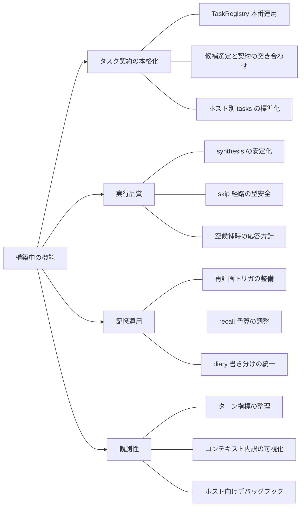
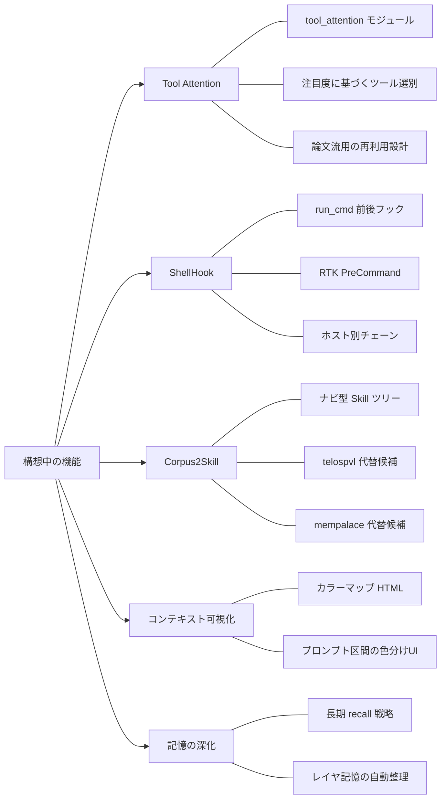

# HarnessSeed — 機能実装マインドマップ

ルートを左、枝を右へ縦並びに配置。三区分は **実現 / 構築中 / 構想中**。

図内クリック（`click`）はプレビュー環境によっては無効なため、各ツリー直下に **ドキュメントリンク** を併記しています。

## 実現機能

```mermaid
flowchart LR
  done[実現機能]

  done --> core[二層ハーネス]
  core --- k1[計画層 run_plan_layer]
  core --- k2[実行層 two_phase]
  core --- k3[共有 layer loop]
  core --- k4[skip_execution]
  core --- k5[PlanDataContract]

  done --> planFeat[計画まわり]
  planFeat --- p1[候補選定 candidates]
  planFeat --- p2[TaskRegistry 骨格]
  planFeat --- p3[tasks JSON 契約]
  planFeat --- p4[PlanArtifact パース]
  planFeat --- p5[知識十分ゲート]

  done --> exec[実行まわり]
  exec --- e1[ReAct Thought Action]
  exec --- e2[ステップドライバ]
  exec --- e3[ツールポリシー]
  exec --- e4[監査 audit]
  exec --- e5[回答 synthesis]
  exec --- e6[typed skip]

  done --> tools[ツール基盤]
  tools --- t1[Tool trait プラグイン]
  tools --- t2[tools packs]
  tools --- t3[echo time]
  tools --- t4[list_dir grep]
  tools --- t5[read_file write_file]
  tools --- t6[run_cmd]
  tools --- t7[web_search]

  done --> llm[LLM 接続]
  llm --- l1[OpenAI 互換]
  llm --- l2[Gemini]
  llm --- l3[Anthropic]
  llm --- l4[Ollama]
  llm --- l5[LM Studio]
  llm --- l6[ルール頭脳]

  done --> mem[記憶とホスト]
  mem --- m1[Memory RAG]
  mem --- m2[MemoryBridge]
  mem --- m3[diary local]
  mem --- m4[mempalace 連携]
  mem --- m5[TurnLifecycle]
  mem --- m6[HostScratch]

  done --> surf[CLIと拡張面]
  surf --- s1[対話 REPL]
  surf --- s2[JSON Lines ワイヤ]
  surf --- s3[外側 advance ループ]
  surf --- s4[コンテキスト colormap v0]

  click done "./architecture/00_harness-seedの構造.md" "構造"
  click core "./architecture/00_harness-seedの構造.md" "構造"
  click planFeat "./architecture/01_計画層.md" "計画層"
  click exec "./architecture/02_実行層.md" "実行層"
  click tools "./builtin_tools/README.md" "組み込みツール"
  click llm "../README.ja.md" "README"
  click mem "./memory.md" "記憶層"
  click surf "./wire-protocol.md" "ワイヤ"
```

| 枝 | ドキュメント |
|----|--------------|
| 構造（二層） | [00_harness-seedの構造.md](./architecture/00_harness-seedの構造.md) |
| 計画層 | [01_計画層.md](./architecture/01_計画層.md) |
| 実行層 | [02_実行層.md](./architecture/02_実行層.md) |
| ツール選択 | [02-01_ツールの選択.md](./architecture/02-01_ツールの選択.md) |
| ReAct 実装 | [react-implementation.md](./react-implementation.md) |
| 最少行動単位 | [agent-minimum-action-unit.md](./agent-minimum-action-unit.md) |
| 組み込みツール一覧 | [builtin_tools/README.md](./builtin_tools/README.md) |
| ツール packs | [ideas/tool-plugins.md](./ideas/tool-plugins.md) |
| 記憶層 | [memory.md](./memory.md) |
| lifecycle | [lifecycle.md](./lifecycle.md) |
| advance ループ | [advance-loop.md](./advance-loop.md) |
| ワイヤプロトコル | [wire-protocol.md](./wire-protocol.md) |
| コンテキスト対応 | [context-memory-mapping.md](./context-memory-mapping.md) |
| colormap v0 | [ideas/context-colormap.md](./ideas/context-colormap.md) |
| TaskRegistry | [ideas/task-registry.md](./ideas/task-registry.md) |
| 開発方針 | [development-principles.md](./development-principles.md) |
| 使い方（CLI / LLM） | [README.ja.md](../README.ja.md) |

## 構築中の機能

| 枝 | ドキュメント |
|----|--------------|
| ideas 索引 | [ideas/README.md](./ideas/README.md) |
| TaskRegistry | [ideas/task-registry.md](./ideas/task-registry.md) |
| 計画層（候補選定） | [01_計画層.md](./architecture/01_計画層.md) |
| 実行層 | [02_実行層.md](./architecture/02_実行層.md) |
| 記憶・再計画メモ | [ideas/memory-and-replan-architecture.md](./ideas/memory-and-replan-architecture.md) |
| 記憶正本 | [memory.md](./memory.md) |
| colormap / 可視化 | [ideas/context-colormap.md](./ideas/context-colormap.md) |
| コンテキスト対応表 | [context-memory-mapping.md](./context-memory-mapping.md) |

## 構想中の機能

| 枝 | ドキュメント |
|----|--------------|
| ideas 索引 | [ideas/README.md](./ideas/README.md) |
| Tool Attention | [tool-attention-reuse-ideas.md](./ideas/tool-attention-reuse-ideas.md) |
| ShellHook / RTK | [shell-hook-rtk.md](./ideas/shell-hook-rtk.md) |
| Corpus2Skill | [corpus2skill-integration.md](./ideas/corpus2skill-integration.md) |
| colormap（HTML など） | [context-colormap.md](./ideas/context-colormap.md) |
| 記憶・再計画 | [memory-and-replan-architecture.md](./ideas/memory-and-replan-architecture.md) |
| mempalace 連携メモ | [mempalace-integration.md](./ideas/mempalace-integration.md) |
| knowledge 資料置き場 | [knowledge/README.md](./knowledge/README.md) |
