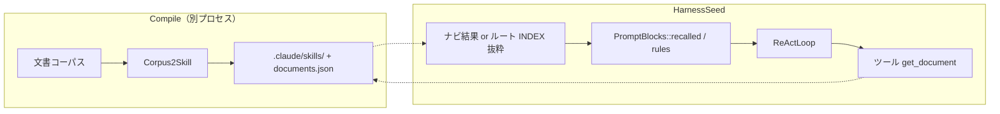

# Corpus2Skill 連携（未実装）

[Corpus2Skill](https://github.com/dukesun99/Corpus2Skill)（論文: [Don't Retrieve, Navigate — arXiv:2604.14572](https://arxiv.org/abs/2604.14572)）を HarnessSeed の**中期・長期知識層**に載せる案。

**仮説（検討中）**: プライベート運用で想定していた **telospvl / mempalace**（外部記憶・SSoT・search）のうち、**企業文書・規約コーパスの「想起」**は Corpus2Skill の **ナビゲーション型 Skill ツリー**で代替できる可能性が高い。diary / セッション退避 / KG まで含めて完全置換かは未検証。

- マッピング: [context-memory-mapping.md](../context-memory-mapping.md)（**本文は汎用表現のみ**）
- 代替候補との比較: [mempalace-integration.md](mempalace-integration.md)
- **優先度**: 本体強化が先。Compile パイプラインは別リポジトリ・別プロセスとして扱う

---

## 1. Corpus2Skill の要点

| フェーズ | 内容 |
|----------|------|
| **Compile** | 文書 → embed → 階層クラスタ → LLM 要約・ラベル → `.claude/skills/` ツリー（`SKILL.md` / `INDEX.md`）+ `documents.json` |
| **Serve** | 質問に対し LLM がツリーを**辿る** → 葉の doc ID → `get_document` で全文。serve 時に vector DB / BM25 **不要** |

設計思想: **全文を毎ターン retrieve しない**。薄い INDEX から枝を開き、必要なときだけ全文取得（段階的開示）。prompt cache と相性が良い（README: 安定 prefix + ナビ）。

---

## 2. telospvl / mempalace との関係（仮説）

| 役割（従来想定） | mempalace / telospvl 寄り | Corpus2Skill 寄り |
|------------------|---------------------------|-------------------|
| 規約・正本・SSoT | 正本ドキュメント + 検索 | Compile 済み Skill ツリー + ナビ |
| 中期（数日〜数週） | diary, search → `recalled` | ナビ結果 + 抜粋 → `recalled` |
| 長期 KG・関係 | KG, drawer | ツリー構造そのものが階層索引（KG 代替候補） |
| セッション溢れ退避 | diary へ push | `documents.json` + 要約 diary（要設計） |

**置き換えしやすいもの**

- ターン開始の **「似た過去・仕様の想起」**（ベクトル search で chunk 投げ込み）
- 大量 Markdown / PDF コーパスの **RAG 的利用**

**残す・別途検討**

- **遂行規約・BOOT** 系（telospvl 的 SSoT）→ 短い `rules` ファイル or ツリー根の SKILL のみ常時載せ
- **エージェント実行ログの diary**（作業経緯）→ Corpus2Skill は文書コーパス向き。実行 trace の退避は別チャネル
- **リアルタイム更新** → Compile はバッチ。差分更新戦略が要る

結論（現時点のメモ）: **「文書ナビ + オンデマンド全文」**は Corpus2Skill 優先でよい。**「生きたセッション記憶・KG 更新」**は mempalace 案と併存 or 後回し、と割り切る。

---

## 3. HarnessSeed との接続（案）



| 接続 | 説明 |
|------|------|
| `prompt.rules_paths` | ツリー**ルート**の `SKILL.md` 要約だけ（常時薄く） |
| `push_recalled` | ターン開始前に **ナビ 1 回**の結果（上位 INDEX 抜粋）を注入 |
| **新ツール** `get_document(id)` | 葉で確定した ID の全文取得（Observation は要約 or 上限付き） |
| **新ツール** `list_skill_index(path)` | （任意）ReAct から枝を辿る代替。serve を HarnessSeed 内で再実装する場合 |

**載せないもの**: コーパス全文、`documents.json` 全体、全 INDEX の列挙。

---

## 4. モジュール分割（破壊的変更を避ける）

| モジュール（案） | 責務 |
|------------------|------|
| `context` | `recalled` / rules のレンダリングのみ |
| **`knowledge_nav`**（新規） | コンパイル成果パス、ナビ、get_document |
| `react` | ターン開始フック（任意） |
| Corpus2Skill 本体 | **依存として CLI / Python サブプロセス**。クレートにベットしない |

### 非破壊の原則

1. `memory.enabled` / `knowledge.provider` 既定は **off / none**
2. provider が `corpus2skill` のときだけナビ + get_document 有効
3. mempalace ブリッジと**排他または併用**は config で明示（既定はどちらか一方）

---

## 5. 設定スケッチ（案）

```json
"knowledge": {
  "enabled": false,
  "provider": "corpus2skill",
  "compiled_dir": "./data/c2s_compiled",
  "navigate_on_turn_start": true,
  "max_recalled_chars": 4000,
  "root_skill_in_rules": true
}
```

環境変数で Anthropic キー（Compile / ナビ用）— HarnessSeed の LLM プロバイダとは独立しうる。

---

## 6. 他アイディアとの関係

| doc | 関係 |
|-----|------|
| [mempalace-integration.md](mempalace-integration.md) | 代替候補。リアルタイム search / diary 重視なら残す |
| [tool-attention-reuse-ideas.md](tool-attention-reuse-ideas.md) | プロンプト**ツール schema** 節約。Corpus2Skill は**知識本文** |
| [shell-hook-rtk.md](shell-hook-rtk.md) | **Observation** 圧縮。直交 |

---

## 7. リスク・限界

| 項目 | 内容 |
|------|------|
| Compile コスト | embed + 複数 LLM 呼び出し。初回・再索引はバッチ |
| 鮮度 | 文書更新 → 再 Compile が必要 |
| プロバイダ | 公式 serve は Anthropic Skills API 寄り。HarnessSeed 多プロバイダなら **ナビ結果のテキスト注入**が現実的 |
| WIP | リポジトリは early release（2026-05 時点） |
| コーディング trace | リポジトリ QA 向き。`cargo test` 出力圧縮は RTK 側 |

---

## 8. 実装フェーズ（将来）

1. コンパイル成果ディレクトリを読む `list_skill_index` + `get_document`（ルール頭脳でもテスト可）
2. ターン開始: ホスト or サブプロセスでナビ → `push_recalled`
3. `rules_paths` にルート `SKILL.md` を追加可能に
4. `context.jsonl` に `nav_turns`, `documents_fetched`, `recalled_chars`
5. （任意）telospvl / mempalace ブリッジより先に本 provider を既定にするかは運用判断

---

## 9. 参照

- リポジトリ: https://github.com/dukesun99/Corpus2Skill
- 論文: https://arxiv.org/abs/2604.14572
- ローカル要約（任意）: `doc/knowledge/` に README / PDF を置く場合は gitignore 対象
