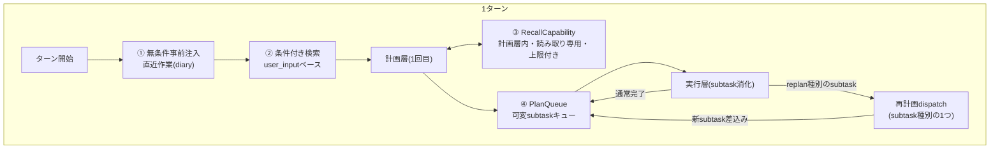

# メモリ外付け + 計画層拡張 + タスク連結

HarnessSeed に「外部メモリ参照」「計画層の情報探索」「再計画によるタスク連結」を段階的に足すための設計メモ。単発の機能追加ではなく、下の4層が積み重なった1つの構造として扱う。

- 関連（既存）: [mempalace-integration.md](mempalace-integration.md)（外部記憶の役割分担・Phase 0〜3）
- 関連（既存）: [shell-hook-rtk.md](shell-hook-rtk.md)（Tool層のhookパターン。今回の`RecallCapability`と役割は別）
- 参照: [../architecture/00_harness-seedの構造.md](../architecture/00_harness-seedの構造.md)（二層モデルの原則）
- 参照: [../context-memory-mapping.md](../context-memory-mapping.md)（記憶の層と格納先）

**実装状況**（2026-07）:

| # | 項目 | 状態 | コード |
|---|------|------|--------|
| 1–3 | `MemoryBridge` / `NoopBridge` / `LocalDiaryBridge` + recent_work / search | ✅ | `src/memory/`、`config.memory` |
| 4 | `PlanQueue` | ✅ | `src/plan/queue.rs`、`run_turn_advance` |
| 5 | `task: "replan"` 分岐 | ✅ | `is_replan_subtask` → `run_replan_subtask` |
| 6 | `RecallCapability`（計画層内ミニループ） | ✅ | `AgentStep::Recall`、`run_layer_loop` + `memory.recall_max_rounds` |
| — | mempalace バックエンド | ✅ | `adapters/mempalace-adapter` + `MempalaceBridge` |
| — | corpus2skill バックエンド | ❌ 未実装 | `provider` 拡張で接続予定 |

---

## 1. 背景・原則の再確認と修正

`00_harness-seedの構造.md`の原則:

> 計画フェーズは環境に触れない。副作用があるのは実行フェーズの `Action` のみ。

この設計を進める上で、原則の**解釈を1点だけ明文化しておく**。

| 主張 | 意味 | 読み取り専用の記憶参照は満たすか |
|------|------|--------------------------------|
| 副作用がない | 状態を書き換えない | ✅ |
| 環境に触れない（字義通り） | ネットワーク接続すら行わない | ❌（読み取り専用でも外部接続は発生する） |

→ 本メモでは原則を **「計画フェーズは書き込み・実行系の環境に触れない。読み取り専用の記憶参照は例外として許可する」** と読み替える。ただしレート制限・コスト・レイテンシは参照系でも発生するため、上限（後述）は必須。

---

## 2. 全体構造



| # | 名称 | 役割 | 実装対象 |
|---|------|------|----------|
| ① | 無条件事前注入 | 「続きやって」的な曖昧指示に対応。毎ターン機械的に直近作業をrecalledへ | `MemoryBridge::recent_work()` |
| ② | 条件付き検索 | `user_input`をクエリにした意味検索 | `MemoryBridge::search()` |
| ③ | RecallCapability | 計画層が自分で「情報が足りない」と判断した時だけ、読み取り専用で追加検索 | `PlanBrainMode::decide()`内部の非公開ループ |
| ④ | PlanQueue | subtask列を固定Vecでなく可変キューにし、再計画で差し込めるようにする | `plan.subtasks`の型変更 + dispatcher |

---

## 3. ①② 無条件事前注入 + 条件付き検索（MemoryBridge）

### 3.1 trait

```rust
pub trait MemoryBridge: Send + Sync {
    /// 毎ターン無条件: 直近の作業状態（diary/advance_phases由来）
    fn recent_work(&self, max_entries: usize) -> Result<Vec<RecalledItem>, MemoryError> {
        Ok(vec![])
    }
    /// user_inputベースの意味検索
    fn search(&self, query: &str, top_k: usize) -> Result<Vec<RecalledItem>, MemoryError> {
        Ok(vec![])
    }
    /// ターン終了時（任意）: タスク単位の要約を書き込む
    fn diary(&self, entry: &DiaryEntry) -> Result<(), MemoryError> { Ok(()) }
}

pub struct NoopBridge; // 既定。既存挙動と完全互換
```

- **既定は`NoopBridge`**（既存回帰なし）。`config.json`の`memory.provider`で`mempalace` / `corpus2skill` / 将来のバックエンドに切替（`llm.provider`と同じ切替パターンを流用）
- `recent_work`の情報源は`TurnResult.advance_phases`（フェーズごとの`goal`/`answer`）を`diary`書き込みのソースにするのが自然。「続きやって」的な指示語を検出する必要が一切なくなる

### 3.2 config

```json
"memory": {
  "provider": "noop",
  "recent_work": { "enabled": true, "max_entries": 3, "max_chars": 800 },
  "search": { "enabled": true, "top_k": 5, "max_chars": 3200 }
}
```

`max_recalled_chars`の予算を①②で分割管理する。

### 3.3 recalledブロックの表示分離

```
Recalled context:
[recent work]
  - 前回セッション: ○○の提案資料、△△パート途中
[search hit]
  - (1) ファルモ導入事例メモ (ref: diary#204)
```

---

## 4. ③ RecallCapability（計画層内・読み取り専用・上限付き）

**`Tool`ではない。** `ToolRuntime`/`exec_policy`/`ToolRegistry`を一切通らない、`PlanBrainMode::decide()`の内部だけで完結するミニループ。

```rust
fn decide(&self, ctx: &TurnPromptContext) -> AgentStep {
    let mut blocks = ctx.blocks.clone();
    let mut recall_rounds = 0;

    loop {
        let messages = build_plan_layer_messages(&blocks, ctx.input, ctx.trace);
        let raw = self.llm.complete(&messages);

        match parse_plan_or_recall(&raw) {
            ParsedOutput::RecallQuery(query) if recall_rounds < MAX_RECALL_ROUNDS => {
                let hits = self.memory.search(&query, RECALL_TOP_K);
                blocks.push_recalled(format_recall(&hits));
                recall_rounds += 1;
                continue;
            }
            ParsedOutput::Plan(plan) => return AgentStep::Answer(plan.to_json()),
            _ => return AgentStep::Answer(raw),
        }
    }
}
```

- スキーマに`recall_query`フィールドを追加（optional）
- `MAX_RECALL_ROUNDS`（例: 1〜2）で無限recall要求を防ぐ
- 外形（`run_layer_loop`・`max_thoughts`・`AgentStep`enum）は無変更

**注意**: 副作用なし＝OKだが、外部接続自体は発生する（§1参照）。レート制限・コストの上限は`MemoryBridge`実装側で持つこと。

---

## 5. 計画層の情報探索限界と「再計画」

### 5.1 現状の回避策とその限界

`PLAN_SYSTEM_CORE`は既に「外部情報が要るときは`web_research`タスクを使え」と指示している（＝計画層自身が情報不足を認識できるケースがある証拠）。しかし:

```rust
// run_turn_advance の subtask 実行ループ（現状）
for (phase_index, subtask) in plan.subtasks.iter().take(phase_limit).enumerate() {
```

`plan.subtasks`は`Vec<Subtask>`で**計画時に確定・不変**。`web_research`をsubtask 1に積めても、その結果を見て subtask 2 以降を設計し直す手段がない。

### 5.2 切り分け

| 問題 | 対応 | 難度 |
|------|------|------|
| 計画時点で**既存の記憶**が見えていない | §4 RecallCapability | 小 |
| 計画時点で**まだ存在しない情報**（Web最新情報・実行結果次第の事実）が要る | 再計画（replan） | 大 |

### 5.3 再計画のディスパッチ場所

**`Tool`としては実装しない。** `ToolContext`は`env`/`brave_search`しか持たず、計画層のLLM・PromptBlocks・subtask列への参照を持てない。`web_search`のような単純な箱に「計画層をもう一度起動する」という重い役割を持たせると、Tool＝1ツール1ファイルの単純さが壊れる。

代わりに、**subtaskの実行方式を決めているdispatcher**（現状「`steps[]`契約あり→ステップドライバ／契約なし→自由記述ReAct」の2分岐）に3番目の分岐を足す。

```
各subtaskについて:
  task == "replan"（予約済み） → run_plan_layer を再度呼び、結果をPlanQueueへ差し込む
  steps[]契約あり              → ステップドライバ
  契約なし                     → 自由記述ReAct
```

計画層のJSON出力から`{"task": "replan"}`を自然に指せるようにしておく。

---

## 6. ④ PlanQueue（タスク連結管理）

### 6.1 何が要るか

| 要素 | 今 | 要る形 |
|------|----|--------|
| subtaskの入れ物 | `Vec<Subtask>`（固定・`.iter()`） | `VecDeque<Subtask>`（可変） |
| 総予算 | `phase_limit`（計画時の件数で決定） | **replan由来の追加分も含めた総上限**（無限連鎖防止に必須） |
| 追跡 | `advance_phases: Vec<...>`（結果のみ） | 親子関係（どのsubtaskがどのreplanから生まれたか） |
| 停止条件 | `phase_limit`到達 or 全消化 | 予算到達 / 完了 / replan自身の停止判断 |

### 6.2 設計

```rust
struct PlanQueue {
    pending: VecDeque<Subtask>,
    consumed_count: usize,
    total_budget: usize,
    lineage: Vec<(u32, Option<u32>)>, // (subtask_id, 生成元subtask_id)
}

impl PlanQueue {
    fn pop_next(&mut self) -> Option<Subtask> {
        self.pending.pop_front()
    }

    fn splice_from_replan(
        &mut self,
        new_subtasks: Vec<Subtask>,
        parent_id: u32,
    ) -> Result<(), &'static str> {
        if self.consumed_count + self.pending.len() + new_subtasks.len() > self.total_budget {
            return Err("total_budget exceeded — replan chain too long");
        }
        for s in &new_subtasks {
            self.lineage.push((s.id, Some(parent_id)));
        }
        for s in new_subtasks.into_iter().rev() {
            self.pending.push_front(s);
        }
        Ok(())
    }
}
```

```rust
while let Some(subtask) = plan_queue.pop_next() {
    if subtask.task.as_deref() == Some("replan") {
        let new_subtasks = run_plan_layer(...)?;
        plan_queue.splice_from_replan(new_subtasks, subtask.id)?;
        continue;
    }
    // 既存の subtask 実行（step driver / freeform ReAct）
}
```

`total_budget`は**必須**。無いと「replanがreplanを呼ぶ」連鎖で無限ループする。

### 6.3 破壊的変更の範囲

- `plan.subtasks: Vec<Subtask>` → `VecDeque<Subtask>`
- `format_plan_for_display`等、`&[Subtask]`前提の箇所は`.make_contiguous()`かスライス変換で局所化

---

## 7. 実装順序（提案）

1. `MemoryBridge` trait + `NoopBridge`（既定・回帰なし） — §3
2. `memory.recent_work`（無条件事前注入） — 「続きやって」問題はここでほぼ解決
3. `memory.search`（条件付き検索） — §3
4. `PlanQueue`（`Vec`→`VecDeque` + `total_budget` + `lineage`） — §6（③④より先に土台を作る）
5. replan dispatch（subtask種別の3番目の分岐） — §5.3
6. `RecallCapability`（計画層内・読み取り専用・`MAX_RECALL_ROUNDS`） — §4（最後でよい。①②で大半のケースは解決する見込みのため）

---

## 8. 実装したら更新するdoc

- [../architecture/00_harness-seedの構造.md](../architecture/00_harness-seedの構造.md) — 原則の文言修正（§1）
- [../context-memory-mapping.md](../context-memory-mapping.md) — 外部記憶ブリッジ接続済みに更新
- [mempalace-integration.md](mempalace-integration.md) — 本メモとの役割分担を明記
- [../../config/README.md](../../config/README.md) — `memory`セクション
