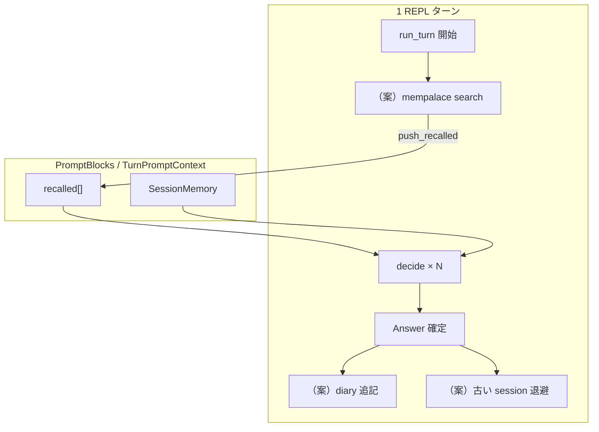

# mempalace 連携（未実装）

HarnessSeed と **mempalace**（外部記憶・検索・KG）を接続する案。現状は `PromptBlocks::recalled` の**差し込み口だけ**あり、MCP / API 呼び出しは未接続。

> **代替候補**: 企業文書コーパスの想起は [corpus2skill-integration.md](corpus2skill-integration.md)（Corpus2Skill）の方が適合する可能性が高い。本 doc は diary / 動的 search / KG 寄りの経路として残す。

- マッピング上の位置: [context-memory-mapping.md](../context-memory-mapping.md) §2・§7（中期・長期・**本文は汎用表現のみ**。具体プロバイダは本 doc）
- 現状: `recalled` は手動 `push_recalled` またはホストアプリから注入可能。自動 search / diary / 退避なし
- **優先度**: 本体の機能強化（ReAct、context、ツール、LLM コネクタ等）が先。ここは設計メモのみ

---

## 1. 役割分担（記憶の層）

| 層 | HarnessSeed（プロセス内） | mempalace（外部） |
|----|---------------------------|-------------------|
| **短期** | `TurnTrace`, `SessionMemory` | — |
| **中期** | `recalled` へ注入された抜粋 | diary, search |
| **長期** | `rules`（ファイル）+ `recalled` | KG, drawer, 正本連携 |

原則: **ウィンドウに載せるのは要約・検索ヒット**。原文・大量ログは mempalace 側に置き、ID や短い引用だけプロンプトへ（チャック思想）。

---

## 2. 挿入点（既存コードとの接続）



| タイミング | 処理（案） | 載せ先 |
|------------|------------|--------|
| ターン開始 | `user_input` で search → top-k 要約 | `PromptBlocks::push_recalled` → user ブロック上部（`render` の Recalled context） |
| ターン中 | （任意）ツール `memory_search` | 同上、または trace 経由 |
| ターン終了 | 完了ターンの要約を diary | mempalace のみ（プロンプトには載せない） |
| session 溢れ | 落ちる直前ターンを退避 | mempalace diary + 必要なら 1 行 recalled |

**`context` は組み立てのみ**。検索・書き込みロジックは別モジュール（下記 `memory_bridge`）に閉じる。

---

## 3. モジュール分割（破壊的変更を避ける）

| モジュール（案） | 責務 |
|------------------|------|
| `context` | `recalled` をプロンプトにレンダリング（現状どおり） |
| **`memory_bridge`**（新規） | mempalace MCP / HTTP の呼び出し、結果の整形 |
| `react` | `run_turn` 前後で bridge を呼ぶ（設定で ON/OFF） |
| ホストアプリ | bridge を使わず `loop.blocks.push_recalled(...)` だけでも可 |

### 非破壊の原則

1. 既定 **`memory.enabled: false`** — 今と同じ（recalled 空）。
2. `AgentBrain` トレイトは変更しない。
3. MCP 不通時は **スキップして ReAct 継続**（ログのみ）。telospvl 等の「不通なら停止」は HarnessSeed 本体には載せない（ホスト側ポリシーで上書き可）。
4. secrets / テナント ID は **config または環境変数**。リポジトリに含めない。

---

## 4. 接続方式（案）

| 方式 | メリット | デメリット |
|------|----------|------------|
| **MCP**（Cursor / ホストがサーバを立てる） | ツールとして再利用、既存 mempalace サーバ | HarnessSeed 単体 REPL では MCP クライアント実装が要る |
| **HTTP / SDK** | 組み込み・CI 向き | mempalace 側 API 契約の維持 |
| **ホスト注入のみ** | 実装最小 | 検索タイミングはホスト任せ |

推奨の段階:

1. **Phase 0** — ホストが `push_recalled`（既に可能）。ドキュメントだけ。
2. **Phase 1** — `memory_bridge` + 設定。ターン開始 search のみ。
3. **Phase 2** — diary 書き込み、session 溢れ退避。
4. **Phase 3** — 任意ツール `memory_search` / `memory_store`、KG 参照。

---

## 5. 設定スケッチ（案）

```json
"memory": {
  "enabled": false,
  "provider": "mempalace",
  "search_on_turn_start": true,
  "search_top_k": 5,
  "max_recalled_chars": 4000,
  "diary_on_turn_end": false,
  "offload_session_turns": false
}
```

環境変数でエンドポイント・認証を上書き（名前は実装時に `HARNESS_SEED_*` で統一）。

---

## 6. `recalled` ブロックの整形（案）

search 結果をそのまま突っ込まず、テンプレートで統一:

```text
Recalled context (mempalace search):
[1] <title> — <1–2 line summary>
    ref: <id or path>
...
```

- トークン上限: `max_recalled_chars` で切り詰め
- user ブロック内順序は [context-memory-mapping.md](../context-memory-mapping.md) §3 どおり（recalled → Previous turns → User input → trace）

---

## 7. 他アイディアとの関係

| ドキュメント | 関係 |
|--------------|------|
| [tool-attention-reuse-ideas.md](tool-attention-reuse-ideas.md) | プロンプト**ツール schema** の節約。recalled は**テキスト** RAG で並列 |
| [shell-hook-rtk.md](shell-hook-rtk.md) | Observation 圧縮。mempalace は**過去の意味**の注入 |
| `prompt.rules_paths`（実装済み） | 長期の**ファイル**正本。mempalace は**動的**記憶 |

---

## 8. 実装フェーズ（将来）

1. `MemoryBridge` trait + `NoopBridge`（既定）
2. `MempalaceBridge` — search → `push_recalled`（Phase 1）
3. `ReActLoop::run_turn` 先頭で bridge 呼び出し
4. diary / session offload（Phase 2）
5. 専用ツール・計測（`context.jsonl` に `recalled_chars`, `search_hit_count`）

---

## 9. 実装したら更新する doc

- [context-memory-mapping.md](../context-memory-mapping.md) — §2 未接続 → 接続済み、§8 planned
- [react-implementation.md](../react-implementation.md) — ターン開始フック
- [config/README.md](../../config/README.md) — `memory` セクション
