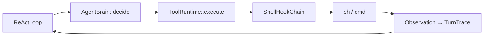

# シェル Hook + RTK 連携（未実装）

HarnessSeed の **`run_cmd` 実行パス**に hook チェーンを差し込み、[RTK](https://github.com/rtk-ai/rtk) などを **PreCommand** として載せる案。IDE（Cursor / Claude Code）の RTK フックに依存せず、組み込み ReAct / REPL でも同じ効果を狙う。

- 参考（ローカル）: [`doc/knowledge/rtk-summary.md`](../knowledge/rtk-summary.md)
- 関連（別軸）: [tool-attention-reuse-ideas.md](tool-attention-reuse-ideas.md)（プロンプト側・ツール schema）
- 現状コード: `src/tool.rs` の `run_shell_command` → 生 stdout/stderr を Observation へ

**優先度**: 本体の機能強化が先。ここは設計メモのみ。

---

## 1. 狙い

| 問題 | 方針 |
|------|------|
| `run_cmd` の出力が trace を太らせる | シェル**直前・直後**で圧縮・整形 |
| RTK は Cursor 等の Bash フック前提 | HarnessSeed 内蔵の **ShellHook** で `rtk <cmd>` に書き換え |
| LLM に「rtk 付けて」と頼むと漏れる | hook で**確実**に適用（RTK README と同じ思想） |

RTK は **Observation 側**、Tool Attention は **プロンプト側** — 併用可、モジュールは分離。

---

## 2. アーキテクチャ案



**汎用 ReAct** = 頭脳は現行 JSON ReAct のまま、**実行の手はシェル（`run_cmd`）中心** + その境界に hook。

| 層 | 変更 |
|----|------|
| `react` | 基本そのまま |
| `tool` | `run_cmd` だけ hook 経由に |
| `context` | 触らない |
| 新規（案） | `shell_hook` または `tool::hook` — trait + チェーン |

---

## 3. Hook 種別（案）

| Hook | タイミング | 例 |
|------|------------|-----|
| **PreCommand** | 実行前 | `git status` → `rtk git status` |
| **PostOutput** | 実行後 | 行数 cap、dedup（RTK なしの軽量版も可） |
| **Policy** | 実行前 | cwd / コマンド拒否（`resolve_in_workspace` と整合） |
| **Tee** | 失敗時 | フルログをファイル、要約と併記（RTK tee 同型） |

RTK = **PreCommand の 1 実装**。バイナリ未導入時はスキップ（フォールバック）。

---

## 4. API スケッチ（未実装）

```rust
// 概念のみ
pub trait ShellHook {
    fn before_command(&self, ctx: &ShellHookContext, command: &str) -> HookResult<String>;
    fn after_output(&self, ctx: &ShellHookContext, command: &str, output: &str) -> HookResult<String>;
}

pub struct ShellHookContext {
    pub cwd: PathBuf,
    pub invoke_id: u64,
    // 将来: trace の要約、config 参照
}

pub struct ToolRuntime {
    shell_hooks: Vec<Box<dyn ShellHook>>,
}
```

`execute("run_cmd", args)` 内で:

1. `command` を resolve
2. `for h in hooks { command = h.before_command(...) }`
3. `run_shell_command(&command, cwd)`
4. `for h in hooks { output = h.after_output(...) }`
5. `Observation`

---

## 5. 設定（案）

`config.json`:

```json
"shell": {
  "hooks": ["rtk"],
  "rtk_binary": "rtk",
  "exclude_commands": ["curl"]
}
```

- 既定: **hooks 空**（現状と同じ生シェル）
- `rtk` 指定時: PATH 上の `rtk` を probe、無ければ warn して素の cmd

---

## 6. スコープ外・注意

| 項目 | 扱い |
|------|------|
| `read_file` / `list_dir` | hook 対象外。必要なら `run_cmd` で `rtk read` に寄せるか別途 |
| Windows ネイティブ | `cmd /C` でも `rtk ...` は可能（RTK フィルタは動く）。WSL はフル |
| crates.io の別 `rtk` | 誤インストール注意（knowledge 要約参照） |
| RTK ロジックの再実装 | 最初は**外部バイナリ呼び出し**のみ。PostOutput の自前圧縮は後回し可 |

---

## 7. 実装フェーズ（将来）

1. `ShellHook` trait + `ToolRuntime` への 1 箇所差し込み（hooks 空で regression なし）
2. `RtkPreCommandHook` — 既知プレフィックス（`git`, `cargo`, `rg` …）だけ `rtk` 付与
3. config + 起動ログ
4. （任意）PostOutput truncation、`context.jsonl` に `observation_chars` / `hook_applied`

---

## 8. 実装したら更新する doc

- [react-implementation.md](../react-implementation.md) — `run_cmd` パス
- [context-memory-mapping.md](../context-memory-mapping.md) — Observation 圧縮の層
- [config/README.md](../../config/README.md) — `shell.hooks`
