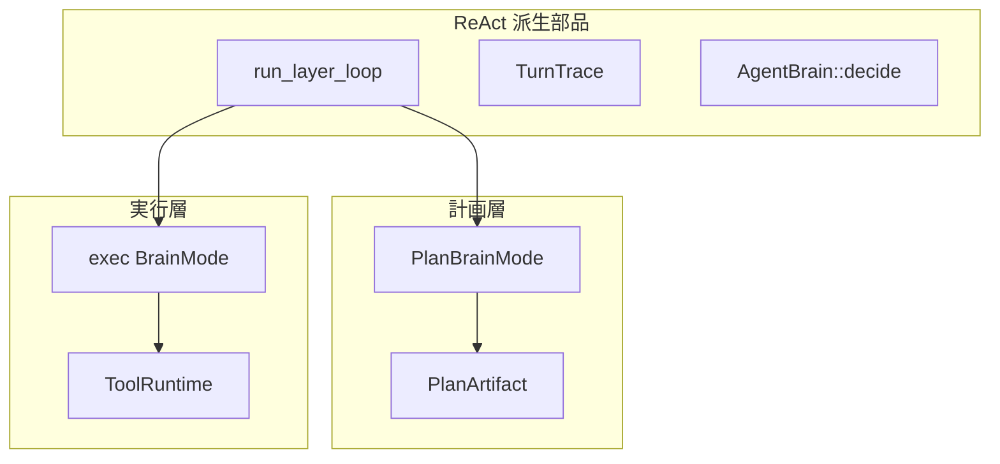

# タスクレジストリ（スケルトン実装済み）

機能塊タスクは **`steps[]`（必須 `method` + `order`）** で定義する。計画層・実行層はいずれも ReAct 派生ループ（`src/layer.rs`）。

| 区分 | 置き場 |
|------|--------|
| JSON 定義 | [`tasks/`](../../tasks/) |
| 定義・照合 | `src/tasks/` |
| 計画層 | `PlanBrainMode` + `run_plan_layer` |
| 実行層 | `ReActLoop` + `run_layer_loop` または `run_subtask_driver` |

## 二層 + 共通部品

## タスク契約

- `order` + `method`（ツール名）+ `args` テンプレ
- `audit_trace` — 実行 trace のツール名順序を照合（スケルトン）

## 現状

- [x] `ExecStep` / `TaskRegistry`
- [x] 計画層 ReAct ループ（`max_steps_plan`）
- [x] 実行層 ReAct ループ（`max_steps`）
- [ ] 引数の厳密照合
- [x] ステップドライバ（`src/tasks/driver.rs` — LLM なし順次 `execute_action`）

## 関連

- [agent-minimum-action-unit.md](../agent-minimum-action-unit.md)
- [react-implementation.md](../react-implementation.md)
