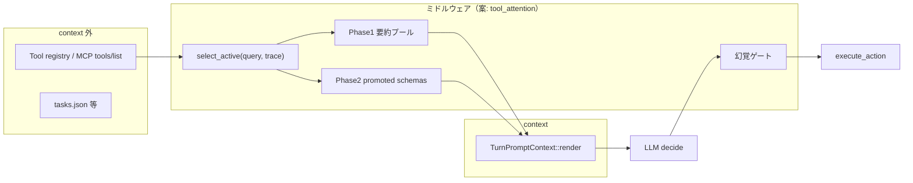

# Tool Attention 流用アイディア（未実装）

HarnessSeed 向けに、[Tool Attention Is All You Need](https://arxiv.org/abs/2604.21816)（arXiv:2604.21816v1）の考え方をどう取り込むかの**設計メモ**。実装予定ではなく、アイディア・境界の整理用。

- 関連: [context-memory-mapping.md](../context-memory-mapping.md)（プロンプトブロック・**本文は汎用表現のみ**）、[react-implementation.md](../react-implementation.md)（ReAct ループ）
- 原典 PDF: ローカルの [`doc/knowledge/`](../knowledge/)（**リポジトリ外・gitignore**）

---

## 1. 論文が言っていること（要約）

| 概念 | 内容 |
|------|------|
| **Tools Tax** | MCP 等で毎ターン**全ツールのフル JSON schema** をプロンプトに載せる隠れコスト（実運用で 1 万〜数万 tok/turn） |
| **ISO** | ユーザークエリとツール要約の埋め込み類似度（Intent–Schema Overlap） |
| **State ゲート** | 認証・直前ツール出力・マイルストーン等の**決定的**前提で候補を落とす |
| **2 段 lazy schema** | Phase1: 全ツールの**短い要約プール**常駐 / Phase2: top-k だけ**フル schema** を promote |
| **幻覚ゲート** | そのターンで promote していないツール名の呼び出しは拒否し、構造化エラーで再推論 |

論文の主な**直接計測**はトークン数シミュレーション。タスク成功率・レイテンシの改善は投影値（†）と明記されている。

---

## 2. HarnessSeed との相性

現状（2025-05 時点）:

| 項目 | 状態 |
|------|------|
| 組み込みツール | 少数（`echo`, `time`, `list_dir`, …）— Tools Tax はまだ小さい |
| プロンプト組み立て | `PromptBlocks` + `TurnPromptContext::render()`（`src/context.rs`） |
| ツール定義 | `tools_catalog()` 全量を system に注入 |
| MCP | 未接続（将来ここで Tax が効く） |

論文の本質は「ツール集合にも attention（動的選択）を適用する」ことで、**チャック（タスク・schema を context 外に置く）** や **`recalled` ブロック** と同じ思想の延長。

---

## 3. モジュール分割（破壊的変更を避ける）

**`context` にロジックを直書きしない**。別モジュール + オプトインがよい。

| モジュール（案） | 責務 |
|------------------|------|
| `tool` | 実行、`ToolSpec`、カタログ SSOT |
| **`tool_attention`**（新規） | 要約プール生成、active 選別、promote 本文、実行前ゲート |
| `context` | rules / recalled / session / trace の組み立て + **ツール本文の差し込みスロット** |
| `react` | `decide` 前に router を呼ぶ（有効時のみ） |

### 非破壊の原則

1. `AgentBrain::decide(&TurnPromptContext)` は**そのまま**。
2. デフォルトは **`ToolAttentionMode::Full`**（現状と同じ全ツール catalog）。
3. ゲートは **`react` の Action 分岐**（`execute_action` 前）。各 Brain 実装を分岐しない。
4. `TurnPromptContext` には `tool_section: Option<ToolPromptSection>` のような**オプション**だけ追加（`None` なら従来プロンプト）。

有効化の例（案）:

- `ReActLoop::with_tool_attention(config, router)`
- `config.json` の `tool_attention.enabled: false`（既定）

---

## 4. 実装フェーズ案（アイディア）

### Phase A — プロンプトだけ（embedding なし）

- `ToolSpec { name, summary, schema, preconditions? }`
- v0 ルーティング: キーワード + `TurnTrace`（例: ファイル操作系は `read` 後に `write` / `run_cmd` を promote）
- `format_summary_pool()` + `format_promoted_schemas(active)`
- `REACT_SYSTEM_CORE` から固定ツール列挙の**重複**を削り、要約プールに一本化

### Phase B — 幻覚ゲート

- `action.tool ∉ active_set` → Observation（`tool_not_available` + `available: [...]`）
- unknown tool エラーと統合

### Phase C — 計測

- `context.jsonl` に `active_tools`, `tool_phase1_chars`, `tool_phase2_chars`（任意）

### Phase D — スケール時

- ISO（埋め込み + 索引）、MCP `tools/list` 連携、レジストリ外置き
- 論文どおり prompt cache 向けレイアウト（Phase1 を安定 prefix、Phase2 を user 直前）

---

## 5. `context` との役割分担

| 層 | 役割 |
|----|------|
| `PromptBlocks` | rules, recalled, system_extra（**何を載せるか**） |
| `tool_attention` | **どのツールを載せるか**（Phase1/2、active set） |
| `recalled`（中期記憶） | クエリに応じた**テキスト**の RAG |
| ISO（将来） | クエリに応じた**ツール**の RAG（`recalled` と並列） |

---

## 6. 期待効果と限界

| 規模 | 期待 |
|------|------|
| 現状（〜10 ツール） | トークン削減は小さい。設計の足場・テスト分離の価値が大きい |
| MCP 数十〜百ツール | Tools Tax 対策として本番価値。Phase A〜B でもかなり効く可能性 |
| ReAct + JSON | MCP native `tool_calls` とは別経路。ゲートは `parse_agent_step` 後の `action.tool` に載せる |

注意:

- 論文の downstream 改善（成功率・コスト）は**投影**が多い。まずトークン計測で検証するのが妥当。
- ルーティングの false negative は幻覚ゲート + 再 `decide` で吸収する設計（論文 Algorithm 1）。

---

## 7. 関連ドキュメントの更新タイミング

実装に入るとき:

- [context-memory-mapping.md](../context-memory-mapping.md) — system のツールブロックを Phase1/2 に分割した図
- [react-implementation.md](../react-implementation.md) — `tool_attention` フック位置
- [config/README.md](../../config/README.md) — `tool_attention` セクション

---

## 8. 参照

- 論文: [arXiv:2604.21816v1](https://arxiv.org/abs/2604.21816) — *Tool Attention Is All You Need*（Sadani & Kumar, 2026)
- 参考実装（論文）: https://github.com/asadani/tool-attention
- ローカル PDF: `doc/knowledge/2604.21816v1.pdf`（git 管理外）
