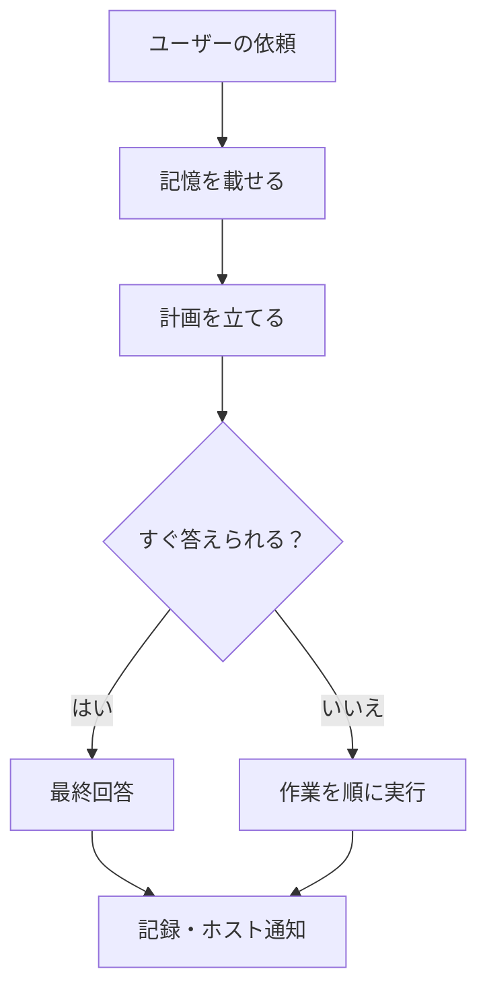
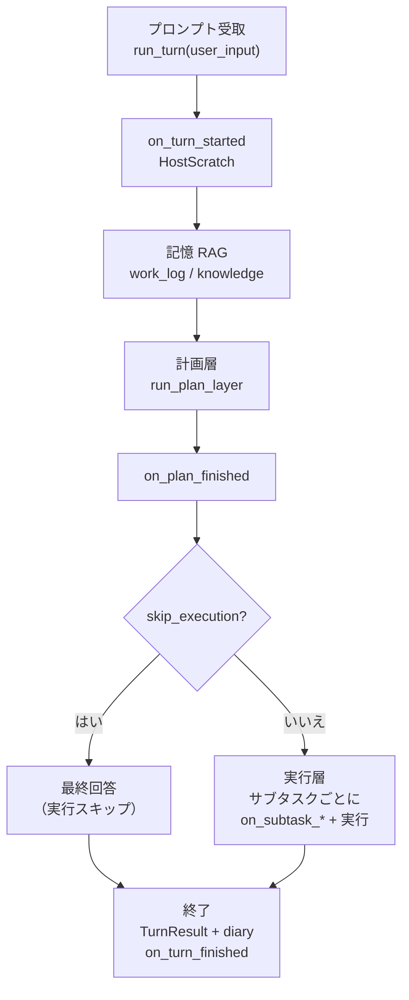
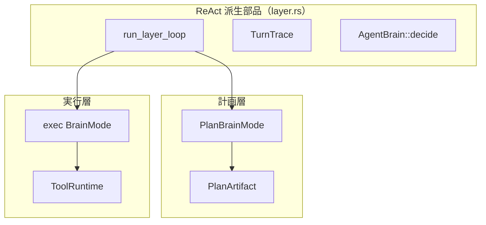
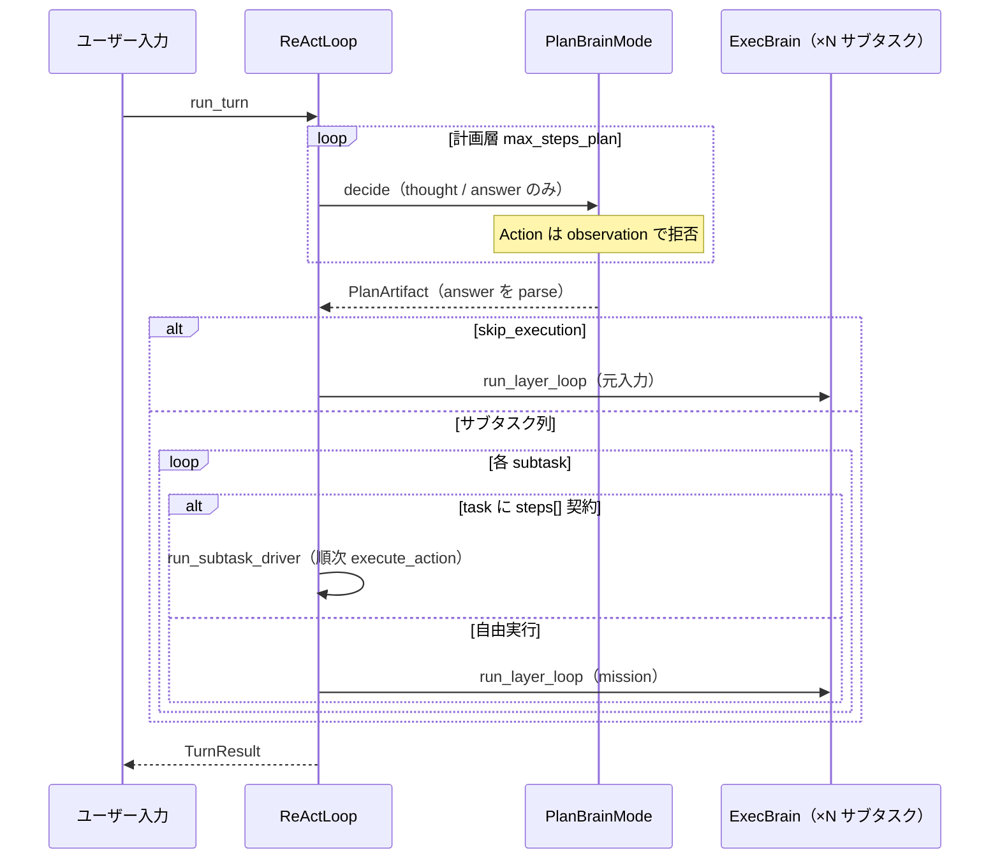
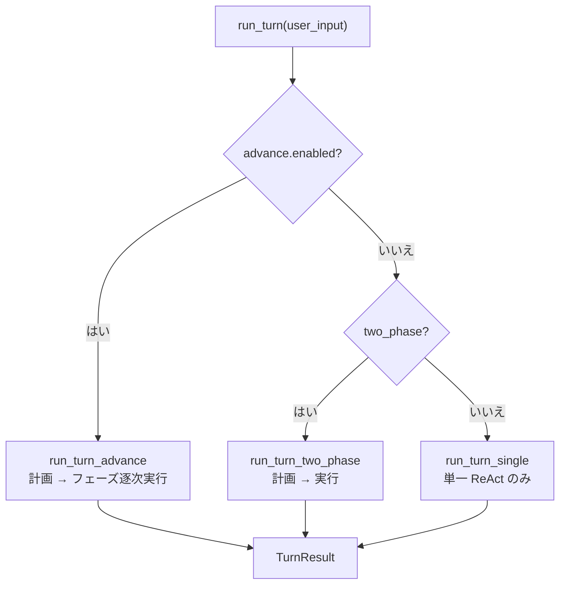
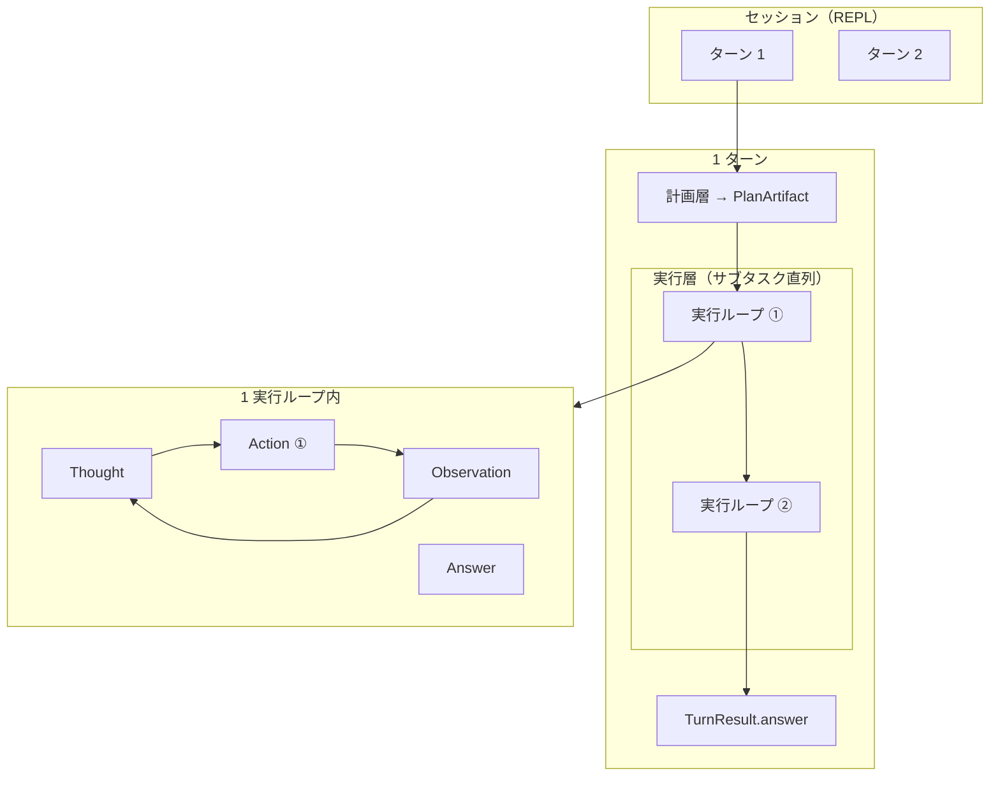

# harness-seed の構造

HarnessSeed は、ホストアプリに埋め込むエージェント実行エンジンである。チャット UI 付きの巨大エージェントを製品ごとに作り直すと、計画・実行・記憶・ホスト連携の契約がすぐバラける。ここでは共通ループと層の契約だけを「種」として渡し、ドメインはホストに残す。

ユーザーが依頼すると、だいたい次の順で進む。必要なら過去を思い出し、計画で作業単位を決め（ここではツールを使わない）、実行で道具を使い最終回答を返し、記録やホスト通知で閉じる。計画と実行は同じ「考えて動く」部品を共有するが、ツールの有無と出力の形（計画かユーザー向け回答か）が違う。



依頼は必ず「計画」を通るが、実行は必須ではない。記憶を載せたあと計画を立て、そこで「すぐ答えられるか」を見る。答えられるなら最終回答へ、そうでなければ作業を順に実行する。どちらの場合も最後は記録とホスト通知で閉じるので、日記やチケット更新は実行の有無に依存しない。

リポジトリの地図として最初に読む章。用語は [用語集.md](用語集.md)。開発方針は [development-principles.md](../development-principles.md)。

関連: [03_記憶層.md](03_記憶層.md) · [04_ホスト拡張.md](04_ホスト拡張.md) · [full_agent_architecture_v2.svg](full_agent_architecture_v2.svg) · [README.md](README.md) · [10_最少行動単位.md](10_最少行動単位.md) · [08_ReAct実装.md](08_ReAct実装.md) · [07_推進ループ.md](07_推進ループ.md) · [05_タスクレジストリ.md](05_タスクレジストリ.md) · [EN](../../en/architecture/00_harness-seed-structure.md) · [01_計画層.md](01_計画層.md) · [02_実行層.md](02_実行層.md)

## 1. 全体フロー（実装対応）

上と同じ物語を、コード上の名前で描き直すと次になる。



依頼は `run_turn` から入り、ホスト用の袋（HostScratch）を開いてから記憶を載せる。袋の中身は LLM には出ない。記憶は作業ログ向きか知識向きかに分かれる（詳細は [03](03_記憶層.md)）。計画が終わるとホストが親チケットなどを作れる。すぐ答えられるなら実行を飛ばし、そうでなければサブタスクごとにホスト通知と実行が挟まる。終端の日記とターン終了通知は、実行の有無にかかわらず同じ場所に落ちる。前節の「記録・ホスト通知」が、ここに対応する。

`src/plan.rs` 冒頭も同じ二層を一文で言っている。

> 計画層（ReAct 派生ループ・ツールなし）→ 実行層（ReAct + ツール）の直列オーケストレーション。

## 2. 各層の役割

| 層 | エントリ | 頭脳 | ループ | ツール | 終了条件 |
|----|----------|------|--------|--------|----------|
| **計画層** | `run_plan_layer` | `PlanBrainMode` | `run_layer_loop`（`LayerLoopOptions::plan`） | **なし** | `Answer` → `PlanArtifact` |
| **実行層** | `run_turn_two_phase` / `run_subtask_exec_audited` | exec `BrainMode` | `run_layer_loop`（`LayerLoopOptions::exec`）または **ステップドライバ** | **あり** | `Answer` → ユーザー向け応答 |

最初に計画層は、依頼を実行可能な作業の並びへ変える。この段階では環境に触れないため、誤ってファイルを書き換えたり外部サービスを呼んだりしない。

次に実行層が、その作業を一件ずつ進める。ここで初めて道具が有効になり、調査や変更の結果を集める。両者は同じ繰り返しの土台を共有するが、計画の答えは内部の作業指示書になり、実行の答えはユーザーへの返答になる。実装上は前者を `PlanArtifact` としてパースし、後者を最終応答として返す。

### 計画層の出力（PlanArtifact）

計画層は LLM が返した JSON をパースし、サブタスク列を組み立てる。骨子は次の形である。

```json
{
  "summary": "…",
  "skip_execution": false,
  "knowledge_sufficient": false,
  "subtasks": [
    { "id": 1, "goal": "…", "done_when": "…" }
  ]
}
```

`summary` は人間向けの要約、`subtasks` が実際に回す作業単位である。`skip_execution` が真でも、無条件には飛ばさない。`knowledge_sufficient` も真のときだけ許可する（[03](03_記憶層.md)）。根拠なしに「もう答えた」と偽る計画を機械的に落とすためである。`task` id（`tasks/*.json`）を持つサブタスクも、この `subtasks` 配列に載る。

### 実行層の動き

各サブタスクは次のいずれかで進む。

1. **ReAct ループ** — `format_mission` で組み立てた mission を渡し、`Thought → Action → Observation` を繰り返す  
2. **ステップドライバ** — 登録タスクに `steps[]` 契約がある場合、LLM なしで契約順に `execute_action`（`react.use_step_driver` 既定 `true`）

前者は「考えながら道具を選ぶ」、後者は「契約どおりに道具を叩く」。どちらも結果はサブタスクの回答として積み上がり、ターン最終の `TurnResult` になる。

## 3. 共通 ReAct ループ（layer.rs）

計画も実行も、中核の繰り返しは **`src/layer.rs` の `run_layer_loop`** である。



計画層と実行層は別物だが、中の繰り返しエンジンは共有である。共有しているのは「考えて決める」ループと、その記録である。計画側は作業一覧を出し、実行側は道具を動かす。計画専用の別エンジンがあるわけではない。差は次の表のとおり、ループに渡すスイッチである。

| オプション | 計画層 (`plan`) | 実行層 (`exec`) |
|------------|-----------------|-----------------|
| `tools_enabled` | `false` | `true` |
| `context_label` | `"plan"` | `"step"` |
| `max_thoughts` | 1（既定） | 1（既定） |

`tools_enabled: false` のとき、計画中にツールを呼ぼうとしても観察側で拒否される。だから計画フェーズは環境を汚さない。副作用があるのは実行の `Action` だけである。`context_label` はログやメトリクスで「いま計画か実行か」を見分ける印である。

## 4. 1 ターン内のシーケンス（two_phase）

`react.two_phase: true`（サンプル config の典型）のとき、1 回の依頼は次の順で進む。



まず計画だけを行う。ここでは考えたり答えを出したりできるが、ファイル操作などのツール呼び出しは通らない（呼んでも拒否される）。計画が固まると、作業の一覧（`PlanArtifact`）になる。

そのあと分岐する。すぐ答えられるなら、元の依頼文のまま短い実行に回して終わりにする。そうでなければ、一覧の各作業を順に片付ける。各作業は、あらかじめ手順が契約されているなら LLM なしでその順にツールを叩く（ステップドライバ）。契約がなければ、実行用の頭脳がツールを選びながら進む（ReAct）。

どちらも終わると、結果をまとめて返す。

## 5. 実行モードの切り替え

`ReActLoop::run_turn`（`src/react.rs`）は設定で入口が分岐する。



入口は設定で三つに分かれる。長い作業向けの外側ループ（`advance`）が最優先で、それがオフなら「計画→実行」の二段か、計画なしの単一ループかのどちらかになる。どれを選んでも返り値の型は同じである。

| 設定 | コード既定（キー省略時） | 挙動 |
|------|--------------------------|------|
| `react.two_phase` | `false` | 計画層 → 実行層の直列（サンプル config では `true` が多い） |
| `react.advance.enabled` | `false` | 外側推進ループ（`two_phase` より優先）。サンプルでは `true` のことがある |
| `react.use_step_driver` | `true` | 契約付き・`react_only: false` のタスクを LLM なしで順次実行 |
| `react.arg_audit_mode` | `soft` | 引数監査（[05_タスクレジストリ.md](05_タスクレジストリ.md)） |

設定を省略したライブラリ利用では、まず単一の ReAct ループとして動く。二段構成を有効にすると、先に計画を作ってから実行へ渡す。さらに長い作業では推進ループがその入口を引き受け、フェーズごとに進める。

一方、ステップドライバと引数監査は入口を選ぶ設定ではない。選ばれた実行経路の内部で、定型作業を機械的に進めるか、渡した引数をどこまで厳しく確かめるかを決める。推進ループを選んだ場合も、各フェーズで計画を先に通す。

## 6. ソースコード対応表

| 概念 | ファイル |
|------|----------|
| ターン入口 | `src/react.rs` — `run_turn`, `run_turn_two_phase`, `run_turn_advance` |
| 計画層ループ | `src/layer.rs` — `run_plan_layer`, `run_layer_loop` |
| 計画 JSON・契約 | `src/plan.rs`, `src/plan/parse.rs`, `src/plan/contract.rs` |
| Harness 状態 | `src/harness/state.rs` — `HarnessState`, `PlanArtifact` |
| 実行ツール | `src/tool/` — `ToolRuntime`, `execute_action` |
| ステップドライバ | `src/tasks/driver.rs` |
| タスク定義 | `tasks/*.json`, `src/tasks/registry.rs` |
| 最少行動単位 | `src/action.rs` — `Action`, `Observation`, `TurnTrace` |

まずターンを受け取り、どの実行方式に入るかを決める箇所が `react.rs` にある。次に、計画と自由実行で共通の反復処理を `layer.rs` が担う。

計画の形式や解釈は `plan*` に集め、実際に環境へ触る処理は `tool/` に閉じている。定型作業だけは JSON 契約を読み、`tasks/driver.rs` が決められた順で動かす。各操作とその結果を残す最小の記録は `action.rs` にある。

## 7. 階層の整理



まずセッションには、複数のユーザー依頼がターンとして並ぶ。各ターンでは計画を作り、その後で必要なサブタスクを順番に実行する。

各サブタスクの中では、結果を見て次の手を考え、必要なときだけ一つの操作を行う。この小さな往復を繰り返して答えに到達する。外側の単位は作業をまとめるためのもので、実世界に触れるのは内側の Action だけである。

| レベル | HarnessSeed の型 | 最少行動単位か |
|--------|------------------|----------------|
| セッション | `SessionMemory` | × |
| ターン | `TurnResult` | × |
| 計画 | `PlanArtifact` | ×（ツールなし） |
| 実行ループ | 1 サブタスク分の ReAct | × |
| 行動 | `Action` + `invoke_id` | **◎** |
| 観測 | `Observation` | 行動の結果 |

監査で数えるのは、道具を一度呼んだという事実である。計画や考えた内容は、その操作の前後にある判断材料であり、同じ単位にはしない。

操作の結果は Observation として残り、次の判断に渡る。したがって、再現や監査では Action を軸にしつつ、なぜ次の操作になったかを Observation から追える。

## 8. まとめ

- harness-seed の中核は **計画層・実行層の二層**である。
- 両層とも同じ ReAct 派生ループを使うが、計画はツールを閉じ、実行だけが ToolRuntime で環境に触れる。
- 単純な会話は `skip_execution` で実行を省略できる。スキップしても終端の記録・hook は走る。
- 登録タスクは実行でステップドライバ（LLM なし）に落とせる。
- `advance` 有効時は入口が外側ループに切り替わるが、中では同じ二層をフェーズごとに繰り返す。
