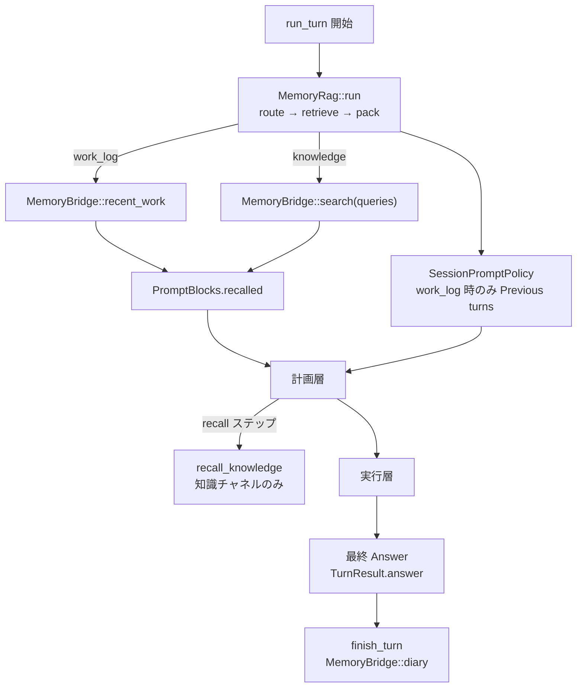

# 記憶層

## これは何か

エージェントが **過去の作業や知識を思い出し、ターン終了後に記録を残す**ための層。チャットの「前の会話を全部貼る」のではなく、今回の依頼に関係しそうなものだけをプロンプトに載せ、終わったら要約などを保存する。

外部の記憶サービス（ローカル日記、mempalace など）には、エンジン本体から直接触れず **橋渡し口（MemoryBridge）** 経由で読む・書く。

用語: [用語集.md](用語集.md)

## いつ使う／使わない

- 使う: 連続する依頼で文脈を継ぎたい、または社内知識を検索して載せたいとき
- 使わない: 完全にステートレスな一発実行だけが必要で、記憶設定を切っているとき

## 平易な流れ

ターン開始 →「作業ログ向きか／知識向きか」を決める → 橋渡し口から取得 → プロンプトの「思い出し」欄へ →（計画・実行）→ 終了時に日記を書く

実装正本の詳細は以下。開発方針: [development-principles.md](../development-principles.md)

- 設計経緯（スタブ）: [ideas/memory-and-replan-architecture.md](../ideas/memory-and-replan-architecture.md)
- mempalace アダプタ: [adapters/mempalace-adapter/README.md](../../../adapters/mempalace-adapter/README.md)
- 設定: [config/README.md](../../../config/README.md) の `memory` セクション
- English: [03_memory-layer.md](../../en/architecture/03_memory-layer.md)

## 1. 役割

| 層 | 責務（平易） | 実装 |
|----|--------------|------|
| **記憶 RAG** | ターン開始時に作業ログか知識かを分け、材料を集めて「思い出し」欄（`recalled`）を組み立てる | `src/memory/rag.rs` |
| **MemoryBridge** | 最近の作業・検索・日記の読み書きだけ。製品固有ロジックはアダプタ内 | `recent_work` / `search` / `diary` |
| **計画・実行** | 橋渡し口を直接知らない。組み立て済みの思い出しと、必要なら直前ターン要約だけを見る | 計画層・実行層 |

本体から mempalace 等を **直叩きしない**。読み書きは必ず `MemoryBridge`（工場が組み立てた `LayeredMemoryBridge` 等）経由。

## 2. ターン内フロー



### 2.1 分岐（route）

ルータ（`memory.rag.router`: `llm` 既定 / `rule`）が JSON 相当の分岐を返す。

| フィールド | 意味 |
|------------|------|
| `work_log` | 直近 diary（続き作業）を載せる |
| `knowledge` | 知識検索する |
| `queries` | 知識側の検索語（1〜`max_queries`） |

**両方 true のときは knowledge 優先で `work_log` を落とす**（話題混線防止の機械的ガード）。

- 作業ログ: 「続き」「さっき」など継続系
- 知識: 事実・説明・別件の質問
- どちらも不要: 挨拶など

`Previous turns`（`SessionMemory`）は **`work_log` のときだけ**載せる（`SessionPromptPolicy`）。

### 2.2 レイヤ構成

| レイヤ | 実装 | 役割 |
|--------|------|------|
| local | `LocalDiaryBridge` | プロセス内 diary（常設推奨） |
| mempalace 等 | `MempalaceBridge` + adapter | 永続・横断検索（`backends` で追加） |

`local` は外部バックエンドで置き換えない。不通時も local だけは動く。

### 2.3 diary 書き込み

ターンが **最終回答**（実行完了後の `TurnResult.answer`。計画層の `step:answer` ではない）まで到達したとき、`finish_turn` → `record_diary` → `MemoryBridge::diary`。

- local: 全文エントリ
- mempalace: 圧縮テキスト（`user` / `summary` / `phases` / **必ず `answer`**）を `source_file=*:diary` で自 room に書く

成功時ログ: `[memory] diary written: …`

## 3. 計画層との契約

| 項目 | 挙動 |
|------|------|
| `knowledge_sufficient` | Recalled／一般知識だけで最終回答できるか。計画 JSON に含める |
| `skip_execution: true` | **`knowledge_sufficient == true` のときだけ許可**。否则ハーネスが実行へ落とす |
| steps 空で実行必要 | 自由記述 subtask 1 本（特定ツール手順は埋め込まない） |
| `recall` ステップ | 計画層のみ。知識チャネルの追加検索（`recall_max_rounds`、既定 2） |
| 計画ループ上限 | `react.max_steps_plan`（既定 **4**）。長く探索しない |
| answer 未達 | 一度だけ「課題解決に妥当な answer を出せ」と強制。それでもダメなら `single_subtask(ユーザ要求)` |

計画層はツール不可（`recall` のみ例外）。足りない証拠は **実行層**で集める。

## 4. コード配置

| パス | 内容 |
|------|------|
| `src/memory/mod.rs` | `MemoryBridge`、local、設定、工場入口 |
| `src/memory/rag.rs` | `MemoryRag`、`RuleRouter` / `LlmRouter`、注入 |
| `src/memory/layered.rs` | 複数 Bridge の重ね合わせ |
| `src/memory/mempalace.rs` | adapter への薄いラッパ（feature `mempalace`） |
| `src/memory/factory.rs` | `config.memory` → Bridge |
| `src/action.rs` | Observation 文字上限（巨大ファイルで文脈を壊さない） |
| `src/tool/builtin.rs` | `read_file` がディレクトリなら `list_dir` を案内 |

## 5. 設定例

```json
"memory": {
  "local": true,
  "backends": ["mempalace"],
  "providers": {
    "mempalace": {
      "protocol": "mcp_stdio",
      "command": "python",
      "args": ["-m", "mempalace.mcp_server"],
      "agent_name": "harness-seed",
      "wing_from_cwd": true
    }
  },
  "recent_work": { "enabled": true, "max_entries": 3, "max_chars": 800 },
  "search": { "enabled": true, "top_k": 5, "max_chars": 3200 },
  "rag": { "router": "llm", "max_queries": 3 },
  "recall_max_rounds": 2
}
```

詳細キーは [config/README.md](../../../config/README.md)。
