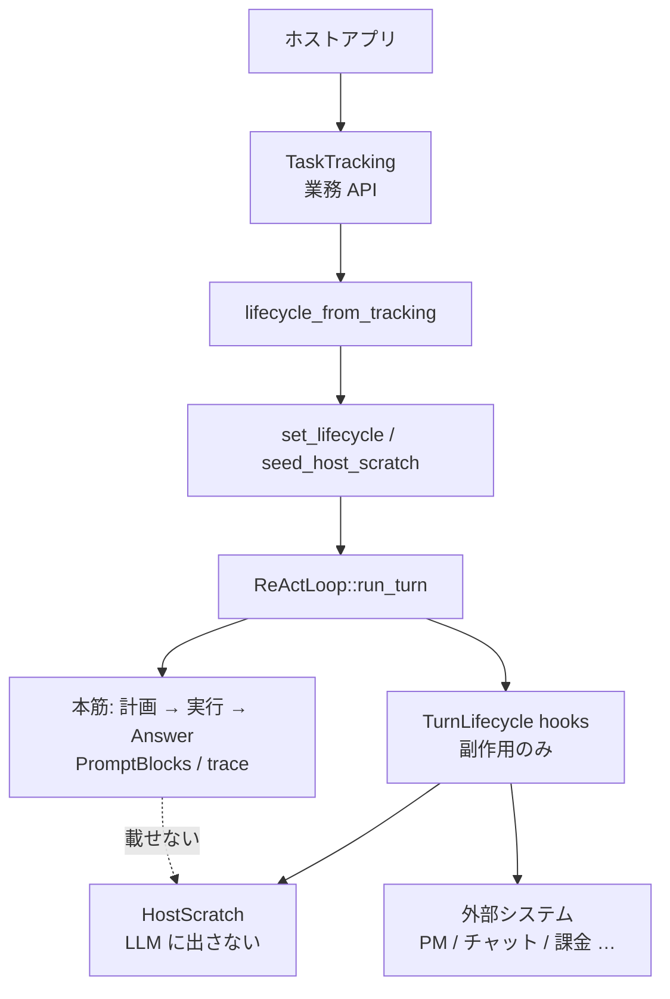

# ライフサイクル hook と HostScratch

ホストアプリ（triage-mail、開発エージェントなど）が、**本筋の ReAct ループを変えずに**外部連携するための拡張面。

- 実装: `src/lifecycle.rs`、タスク管理 API: `src/lifecycle/tracking.rs`
- 登録: `ReActLoop::set_lifecycle` / `lifecycle_from_tracking` / `seed_host_scratch` / `host_scratch`
- 開発方針: [development-principles.md](../development-principles.md)（ドメイン語彙はホスト側）

## 1. hook とは何か

**hook（ライフサイクル hook）**とは、エンジンがターンを進める途中の**決まった地点**で呼び出す、ホスト向けのコールバックである。

- エンジンが「いま計画が固まった」「サブタスクを始める／終えた」といった**事実**を通知する
- ホストはその通知を受けて、チケット起票・進捗更新・通知送信など**外部への副作用**を行う
- hook は本筋（計画・ツール実行・最終 Answer）の**分岐や書き換えには使わない**。制御の主語は常にエンジン

たとえ話: 工場のラインそのものは変えず、各工程のベルが鳴ったときに帳票を書く係がいる、という関係。ベル（タイミング）と帳票の書き方（外部 API）が hook／ホスト実装で、ライン設計が ReAct 本筋である。

似て非なるもの:

| | lifecycle hook | ツール（`run_cmd` 等） | `TurnObserver` |
|--|----------------|----------------------|----------------|
| 誰が呼ぶか | エンジンがターン進行に合わせて呼ぶ | LLM／ドライバが選んで実行する | エンジンがステップ表示用に呼ぶ |
| 目的 | ホスト業務の副作用 | 作業そのもの（観察結果が LLM に戻る） | UI／デバッグ表示 |
| LLM コンテキスト | 載せない（`HostScratch` のみ） | Observation として載る | 載せない |

ホストが書くのは「いつ呼ばれたら何をするか」であり、「次にどのツールを走らせるか」ではない。

## 2. 役割分担

| 側 | 持つもの |
|----|----------|
| **エンジン（harness-seed）** | 計画／実行ループ、hook の**呼び出しタイミング**、`RunStatus` / outcome、ターン袋 `HostScratch` |
| **ホスト** | [`TaskTracking`]（推奨）または生の `TurnLifecycle`、袋のキー設計、外部 API |

エンジンは Redmine / Paperclip / LINE WORKS / Stripe 等を**知らない**。ホストが同じ面に載せる。



## 3. 禁止事項（本筋を壊さない）

hook 内では次を**行わない**。

- `run_turn` / ツール実行の**再入**
- 計画キュー・`TurnTrace`・最終 Answer の**直接書き換え**

hook は**観測と副作用**（および `HostScratch` への書き込み）に限る。制御権は常にエンジン。

外部 API 失敗は hook 内で処理するのが望ましい。万一パニックしても、エンジンは `invoke_lifecycle`（`catch_unwind`）で捕捉し stderr に出して本筋を継続する。パニック途中の `HostScratch` 書き込みはロールバックしない。

## 4. 呼び出しタイミング

`two_phase` / `advance` で計画があるターン:

```text
begin_host_scratch_for_turn  （袋クリア → seed マージ）
  on_turn_started
  … 記憶 RAG …
  … 計画層 …
  on_plan_finished           （resolve_plan 適用後。skip_execution でも呼ばれる）
  for each subtask:
    on_subtask_started
    … 実行 …
    on_subtask_finished      （成功時 status=Completed）
  finish_turn（session / diary）
  on_turn_finished           （status=Completed）
```

単相実行（計画なし）では `on_turn_started` と `on_turn_finished` のみ。

ターンがエラー／取消で中断した場合も、**開始済みの未完了サブタスク**と**ターン**に対して `on_subtask_finished` / `on_turn_finished` が `Failed` または `Cancelled` で呼ばれる（チケットが開きっぱなしにならないようにする）。

## 5. 構造化 outcome と TaskTracking API

### 5.1 `RunStatus` / outcome

| 型 | 意味 |
|----|------|
| `RunStatus` | `Completed` / `Failed` / `Cancelled` |
| `SubtaskOutcome` | `status` + `message`（成功時は回答、失敗時は理由）+ `steps_used` |
| `TurnOutcome` | `status` + `answer` + `steps_used` |

`on_subtask_finished` / `on_turn_finished` は常にこれらの outcome を受け取る。

### 5.2 推奨: `TaskTracking`

PM 連携では生の `TurnLifecycle` より、開始／完了の業務面 [`TaskTracking`] を実装する。

| TaskTracking | 対応する TurnLifecycle | 用途の目安 |
|--------------|------------------------|------------|
| `on_turn_started` | 同名 | seed 済み標識の確認 |
| `on_plan_ready` | `on_plan_finished` | 親 work item 作成 |
| `on_work_started` | `on_subtask_started` | 子 work item 作成／開始 |
| `on_work_finished` | `on_subtask_finished` | 子の完了・失敗・取消 |
| `on_turn_finished` | 同名 | 親のクローズ |

```rust
use harness_seed::{
    lifecycle_from_tracking, HostView, PlanArtifact, TaskTracking, WorkFinishedEvent,
    WorkStartedEvent,
};
use std::sync::Arc;

struct PmSync;
impl TaskTracking for PmSync {
    fn on_plan_ready(&self, _user_input: &str, plan: &PlanArtifact, mut host: HostView<'_>) {
        host.insert("parent_ticket_id", 42);
        let _ = plan;
    }
    fn on_work_started(&self, event: WorkStartedEvent<'_>, mut host: HostView<'_>) {
        host.insert("child_ticket_id", 7);
        let _ = event.subtask;
    }
    fn on_work_finished(&self, event: WorkFinishedEvent<'_>, host: HostView<'_>) {
        let child = host.get_i64("child_ticket_id");
        let _ = (event.outcome.status, event.outcome.message, child);
    }
}

react.set_lifecycle(Some(lifecycle_from_tracking(Arc::new(PmSync))));
```

### 5.3 hook 引数と write scope

本筋の rules / recalled / tool catalog / observation 全文は**渡さない**。

| hook | 引数 | write scope |
|------|------|-------------|
| `on_turn_started` | `user_input`, `host` | `turn` |
| `on_plan_finished` | `user_input`, `plan`, `host` | `turn` |
| `on_subtask_started` | `user_input`, `plan`, `subtask`, `index`, `host` | `subtasks.{subtask.id}` |
| `on_subtask_finished` | 上記 + `outcome: SubtaskOutcome`, `host` | `subtasks.{subtask.id}` |
| `on_turn_finished` | `user_input`, `plan?`, `outcome: TurnOutcome`, `host` | `turn` |

## 6. HostScratch（ターン袋・入れ子）

ターン専用の入れ子 JSON。**プロンプト組み立て・LLM 入力には一切使わない。**

```json
{
  "turn": {
    "project_id": 1,
    "ticket_id": 10,
    "parent_ticket_id": 42
  },
  "subtasks": {
    "1": { "child_ticket_id": 7 },
    "2": { "child_ticket_id": 8 }
  }
}
```

| 領域 | キー | 書いてよい hook |
|------|------|-----------------|
| `turn` | ホスト自由 | `on_turn_started` / `on_plan_finished` / `on_turn_finished`（および seed） |
| `subtasks.{id}` | **subtask id**（配列ではない） | その id の `on_subtask_started` / `on_subtask_finished` のみ |

**参照は袋全体**（`host.to_value()` / `turn_get_*` / `subtask_get_*`）。**書き込みは自ノードのみ**（`HostView::insert`）。並列時も子同士は枝が違うので競合しにくい。

### 6.1 寿命

1. `run_turn` 先頭で袋を **clear**
2. `seed_host_scratch` があれば **`turn` のみ merge**（`subtasks` は載せない）
3. 各 hook が `HostView` 経由で読み書き
4. ターン後は `react.host_scratch()` で読める（**次の `run_turn` 開始で再び clear**）

### 6.2 標識の入れ方

**UI で選んだ ID（推奨・seed は turn へ）**

```rust
let mut seed = HostScratch::new();
seed.turn_insert("project_id", 1);
seed.turn_insert("ticket_id", 10);
react.seed_host_scratch(seed);
react.run_turn(&user_input)?;
```

**指示文から読む**

`on_turn_started` で `user_input` をパースし、`host.insert(...)`（write scope は `turn`）する。

### 6.3 HostView

| 操作 | API |
|------|-----|
| 全体参照 | `to_value()` / `turn()` / `subtask(id)` / `turn_get_*` / `subtask_get_*` |
| 自ノード書き込み | `insert` / `remove` / `get` / `get_i64`（自ノード） |
| write scope | `WriteScope::Turn` または `WriteScope::Subtask(id)`（エンジンが付与） |

## 7. 登録と実装例

```rust
use harness_seed::{HostScratch, HostView, PlanArtifact, Subtask, SubtaskOutcome, TurnLifecycle, TurnOutcome};

struct PmSync;

impl TurnLifecycle for PmSync {
    fn on_turn_started(&self, user_input: &str, host: HostView<'_>) {
        let _ = (user_input, host.turn_get_i64("ticket_id"));
    }

    fn on_plan_finished(&self, _user_input: &str, plan: &PlanArtifact, mut host: HostView<'_>) {
        host.insert("parent_ticket_id", 42);
        let _ = plan;
    }

    fn on_subtask_started(
        &self,
        _user_input: &str,
        _plan: &PlanArtifact,
        subtask: &Subtask,
        _index: usize,
        mut host: HostView<'_>,
    ) {
        let parent = host.turn_get_i64("parent_ticket_id");
        host.insert("child_ticket_id", 7);
        let _ = (subtask, parent);
    }

    fn on_subtask_finished(
        &self,
        _user_input: &str,
        _plan: &PlanArtifact,
        subtask: &Subtask,
        outcome: &SubtaskOutcome,
        host: HostView<'_>,
    ) {
        let child = host.get_i64("child_ticket_id");
        let _ = (subtask, outcome.status, outcome.message, child);
    }

    fn on_turn_finished(
        &self,
        _user_input: &str,
        _plan: Option<&PlanArtifact>,
        outcome: &TurnOutcome,
        host: HostView<'_>,
    ) {
        let _ = (outcome.status, outcome.answer, host.subtask_get_i64(1, "child_ticket_id"));
    }
}
```

複数連携は `CompositeLifecycle` で順に呼ぶ（同一袋・同一 write scope）。

## 8. TurnObserver との違い

| | `TurnLifecycle` | `TurnObserver` |
|--|-----------------|----------------|
| 目的 | ホスト業務（PM・通知・課金） | UI / デバッグ（ステップ表示） |
| 粒度 | ターン・計画・サブタスク | LLM 1 回・ツール 1 回 |
| 状態袋 | `HostScratch` あり | なし |
| 変更 | 副作用のみ（本筋不変） | 観測のみ |

両方登録してよい。

## 9. サブタスク依存と並列（`two_phase`）

計画の各 subtask は任意で `depends_on: [id, …]` を持てる。エンジンは依存波に分割する（`execution_waves`）。

- 波と波の間は常に直列
- 同一波内は互いに依存しない → `react.parallel_subtasks: true` のとき **ステップドライバ契約タスク**をスレッド並列実行
- 同一波の ReAct（LLM）サブタスクはメインスレッドで直列（脳・プロンプトが共有 `&mut` のため）
- 並列ドライバ内のパニックはスレッド側で `catch_unwind` し、ドライバ失敗と同じくメインで ReAct フォールバック（他 subtask やターン全体は巻き込まない）
- `TurnLifecycle` hook はスレッド生成の前後でメインスレッドから逐次呼び出し（ホスト実装はスレッドセーフ不要）
- `HostScratch` の子ノードは subtask id キーなので、並列ドライバ完了後の `on_subtask_finished` でも枝が衝突しない

```json
{
  "subtasks": [
    { "id": 1, "task": "list_dir", "params": { "path": "src" }, "goal": "…", "done_when": "…" },
    { "id": 2, "task": "list_dir", "params": { "path": "tests" }, "goal": "…", "done_when": "…", "depends_on": [] },
    { "id": 3, "task": "write_file_verify", "params": { "path": "out.txt", "content": "x" }, "goal": "…", "done_when": "…", "depends_on": [1, 2] }
  ]
}
```

上の例では id 1 と 2 が第 0 波（並列可）、id 3 が第 1 波。

## 10. 関連

- 計画データ契約（ホストが INPUT/OUTPUT を固定）: [architecture/01_計画層.md](01_計画層.md)
- 記憶層（LLM に見せる recalled）: [memory.md](03_記憶層.md)
- 全体構造: [architecture/00_harness-seedの構造.md](00_harness-seedの構造.md)
