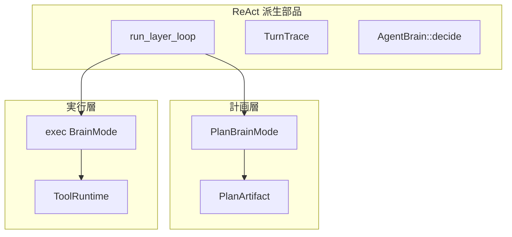

# タスクレジストリ

何度も同じ道具の順を踏む作業を、JSON の契約として置いておく置き場である。毎回 LLM に順を任せると定型でも抜けや引数ずれが起きやすいので、必須ツールと順序を機械が読める形にし、計画の候補選定・実行後の監査・（任意の）ステップドライバで共有する。ドメイン専用の手順書をエンジンにハードコードはしない。契約は `tasks/*.json` が持つ。

再現したい定型や監査したいとき向き。毎回違う自由記述だけなら freeform で足りる。機能塊は `steps[]`（必須 `method` + `order`）で定義する。計画層・実行層はいずれも ReAct 派生ループ（`src/layer.rs`）を共有する。

| 区分 | 置き場 |
|------|--------|
| JSON 定義 | [`tasks/`](../../../tasks/)（[`tasks/README.md`](../../../tasks/README.md)） |
| 定義・照合 | `src/tasks/` |
| 計画層 | `PlanBrainMode` + `run_plan_layer` |
| 実行層 | `ReActLoop` + `run_layer_loop` または `run_subtask_driver` |

用語: [用語集.md](用語集.md) · ツール選定: [02-01_ツールの選択.md](02-01_ツールの選択.md) · [EN](../../en/architecture/05_task-registry.md)

## 二層 + 共通部品

まず計画層は、登録された契約を候補として参照し、依頼をどの作業に分けるかを決める。この段階では契約を実行せず、実行可能な計画へ整える。

次に実行層が、選ばれた作業を処理する。契約に固定手順があればドライバがその順で進め、そうでなければ実行用の ReAct ループが道具を選ぶ。どちらの経路も操作の記録を残すため、後で契約と照合できる。

## タスク契約

- `order` + `method`（ツール名）+ `args` テンプレ（`{param}` 展開可）
- `react_only: true`（推奨）… 契約は mission / 監査用。実行は ReAct
- `react_only: false` … `use_step_driver` が有効なら LLM なし固定順実行
- `tool_policy` … サブタスクの allow / deny

契約は、定型作業に必要な操作と順序をデータとして表す。計画では候補を示し、実行では必要なツールを制限し、完了後には実際に守られたかを確認する。

固定順に実行するかは `react_only` とステップドライバの設定で決まる。どちらの場合でも、タスク固有の手順をエンジン本体へ埋め込まず JSON 側に置く。

## 計画解決ゲート

`TaskRegistry::resolve_plan_with_tools`:

| 条件 | 挙動 |
|------|------|
| 未登録の `task` id | 自由記述サブタスクへ（goal にヒント） |
| 必須 `method` がツールレジストリに無い | 同上（欠落ツール名を明記） |

まず計画に指定されたタスクが登録済みかを確認する。未登録なら、特定の契約を装わず自由記述の作業として実行へ渡す。

登録済みでも必要なツールが現在の環境に無い場合は、固定手順を約束しない。同じく自由記述へ落とし、計画候補からも実行不能な契約を除く。

## 監査契約

実行後 `audit_subtask` / `audit_trace` が trace を照合する。

| チェック | 挙動 |
|----------|------|
| 必須ツールの呼び出し順序 | 必須。未達なら ReAct 再試行（最大 2 回） |
| `tool_policy.deny` | 成功呼び出しがあれば失敗 |
| 引数 | 期待キー ⊆ 実引数。`soft`（既定）は警告のみ、`hard` は失敗、`off` は見ない |

実行後には、必要な操作が順番どおりに行われたかをまず確かめる。禁止された操作が成功していれば、その作業は完了扱いにしない。

引数の照合は設定で厳しさを選べる。通常は警告として残し、厳格な設定では不一致を失敗にする。テンプレートとして残る値は、実行時に具体化される前提なので固定値との不一致にはしない。

## 実装対応

| 項目 | 場所 |
|------|------|
| `ExecStep` / `TaskDefinition` | `src/tasks/spec.rs` |
| `TaskRegistry` | `src/tasks/registry.rs` |
| 監査 | `src/tasks/audit.rs` |
| ステップドライバ | `src/tasks/driver.rs` |
| 候補選定 | `src/plan/candidates.rs` |

## 関連

- [agent-minimum-action-unit.md](10_最少行動単位.md)
- [react-implementation.md](08_ReAct実装.md)
- [tool-plugins.md](06_ツールプラグイン.md)
- [architecture/02_実行層.md](02_実行層.md)
