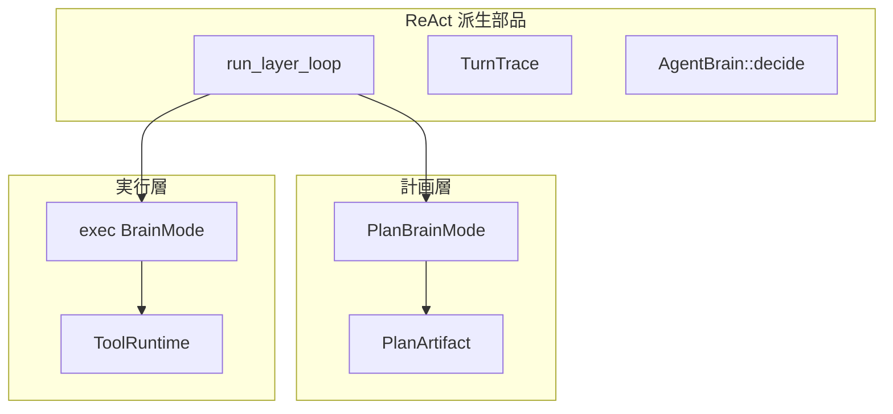

# タスクレジストリ

機能塊タスクは **`steps[]`（必須 `method` + `order`）** で定義する。計画層・実行層はいずれも ReAct 派生ループ（`src/layer.rs`）を共有する。

| 区分 | 置き場 |
|------|--------|
| JSON 定義 | [`tasks/`](../../../tasks/)（スキーマ概要: [`tasks/README.md`](../../../tasks/README.md)） |
| 定義・照合 | `src/tasks/` |
| 計画層 | `PlanBrainMode` + `run_plan_layer` |
| 実行層 | `ReActLoop` + `run_layer_loop` または `run_subtask_driver` |

ツール選定・監査の詳細: [architecture/02-01_ツールの選択.md](02-01_ツールの選択.md)

## 二層 + 共通部品

## タスク契約

- `order` + `method`（ツール名）+ `args` テンプレ（`{param}` 展開可）
- `react_only: true`（推奨）… 契約は mission / 監査用。実行は ReAct
- `react_only: false` … `use_step_driver` が有効なら LLM なし固定順実行
- `tool_policy` … サブタスクの allow / deny

## 計画解決ゲート

`TaskRegistry::resolve_plan_with_tools`:

| 条件 | 挙動 |
|------|------|
| 未登録の `task` id | 自由記述サブタスクへ（goal にヒント） |
| 必須 `method` がツールレジストリに無い | 同上（欠落ツール名を明記） |

カタログ側は `catalog_for_planner_filtered(..., require_all_tools: true)` で実行不能タスクを隠す。

## 監査契約

実行後 `audit_subtask` / `audit_trace` が trace を照合する。

| チェック | 挙動 |
|----------|------|
| 必須ツールの呼び出し順序 | 必須。未達なら ReAct 再試行（最大 2 回） |
| `tool_policy.deny` | 成功呼び出しがあれば失敗 |
| 引数 | 期待キー ⊆ 実引数。`soft`（既定）は警告のみ、`hard` は失敗、`off` は見ない |

設定: `react.arg_audit_mode`（`off` / `soft` / `hard`）。未展開 `{placeholder}` 葉はワイルドカード。

## 実装対応

| 項目 | 場所 |
|------|------|
| `ExecStep` / `TaskDefinition` | `src/tasks/spec.rs` |
| `TaskRegistry` | `src/tasks/registry.rs` |
| 監査 | `src/tasks/audit.rs` |
| ステップドライバ | `src/tasks/driver.rs` |
| 候補選定 | `src/plan/candidates.rs` |

## 関連

- [agent-minimum-action-unit.md](10_最少行動単位.md)
- [react-implementation.md](08_ReAct実装.md)
- [tool-plugins.md](06_ツールプラグイン.md)
- [architecture/02_実行層.md](02_実行層.md)
