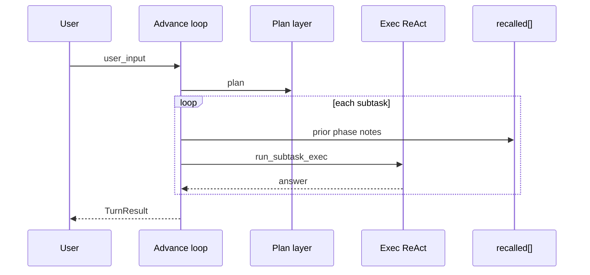

# 推進ループ（Advance loop）


長い依頼をいくつかの区切り（フェーズ）に分けて進める外側の進行である。一ターンの巨大コンテキストで回すと品質とコストが崩れやすいので、終わったフェーズの要約だけ次のプロンプトに載せる。短い依頼まで常に必須ではない。標準の計画→実行（two_phase）で足りるならそちらでよい。

全体計画のあとフェーズを順に実行し、要約を引き継いで最終回答に至る。`two_phase` と似るが、フェーズ間の思い出し注入と任意の session クリアがある。

用語: [用語集.md](用語集.md) · [EN](../../en/architecture/07_advance-loop.md)

## 設定（`config.json`）

```json
"react": {
  "advance": {
    "enabled": true,
    "max_phases": 8,
    "clear_session_each_phase": true,
    "max_note_chars": 1500,
    "show_phases": true
  }
}
```

| キー | 意味 | 既定 |
|------|------|------|
| `enabled` | 推進ループ ON（`two_phase` より優先） | `false` |
| `max_phases` | 1 リクエストで実行する最大フェーズ数 | `8` |
| `clear_session_each_phase` | 各フェーズ前に `SessionMemory` をクリア | `true` |
| `max_note_chars` | `recalled` に載せる 1 フェーズ要約の上限 | `1500` |
| `show_phases` | フェーズ開始を stdout に表示 | `true` |

## 優先順位

`run_turn` の分岐:

1. `advance.enabled` → `run_turn_advance`
2. それ以外で `two_phase` → `run_turn_two_phase`
3. それ以外 → 単一 ReAct

## フロー



最初に依頼全体の計画を作り、そこから実行するフェーズを取り出す。各フェーズを始める前に、すでに終わったフェーズの短い要約だけを `recalled` として渡す。

フェーズは一つずつ実行し、答えと使用量を記録する。すべてのフェーズが終わると、個別の結果を集めて一つの `TurnResult` として返す。全文の履歴を毎回持ち回らないため、長い作業でも次の段階に必要な経緯を絞って引き継げる。

計画に `task: replan` が出たときは実行ツールではなく制御プレーンとして扱う。`resolve_plan` はこれを自由記述へ落とさず、推進ループが計画層を再起動する。実行層の Action に `replan` というツール名を発明してはならない。

後続フェーズでは、先行結果があるとき Recalled（および mission）に**根拠拘束**を載せる。主張は先行フェーズの証拠に紐づけ、裏付けのない点は未検証候補とするか追加で集める。フェーズが 2 つ以上終わると、最終回答をフェーズ証拠だけから書き直す**回答合成**を一度走らせる。

成功した**実質証拠**ツール observation（`read_file` / `grep` / `web_search` / `run_cmd` / `write_file`。浅い `list_dir` は数えない）が `min_substantive_obs`（既定 3）未満のまま次フェーズへ進むときは、一度だけ**証拠深化**サブタスクを差し込む（空の `replan` のあとも同様）。番号付き計画などの弱い `done_when`（`step completed` など）は解決時に証拠志向の完了条件へ上げる。

各フェーズの引き継ぎは全文切り捨てではなく、**Paths / Claims / Open questions**（と必要なら Answer excerpt）の構造化ノートにする。次フェーズの Recalled と最終合成は、この短い構造を優先して読む。

多フェーズの最終合成後、`citation_check`（既定 ON）が有効なら回答中のパス風参照を先行 Paths と機械照合し、証拠に無いものを `## Citation check` で未検証として注記する。

## ライブラリ

- `AdvanceConfig`, `AdvanceProgress` — `harness_seed::advance`
- `TurnResult::advance_phases` — 各フェーズの `id` / `goal` / `answer` / `steps_used`

ホストアプリは `blocks.push_recalled(...)` で注入した内容を、フェーズ間も保持する（`prepare_phase_recalled` がベースを復元する）。

## 関連

- [memory.md](03_記憶層.md) — 外部記憶（Memory RAG + Bridge、local / mempalace）
- [context-memory-mapping.md](09_コンテキストマッピング.md) — 記憶の層
- [react-implementation.md](08_ReAct実装.md) — 内側 ReAct
