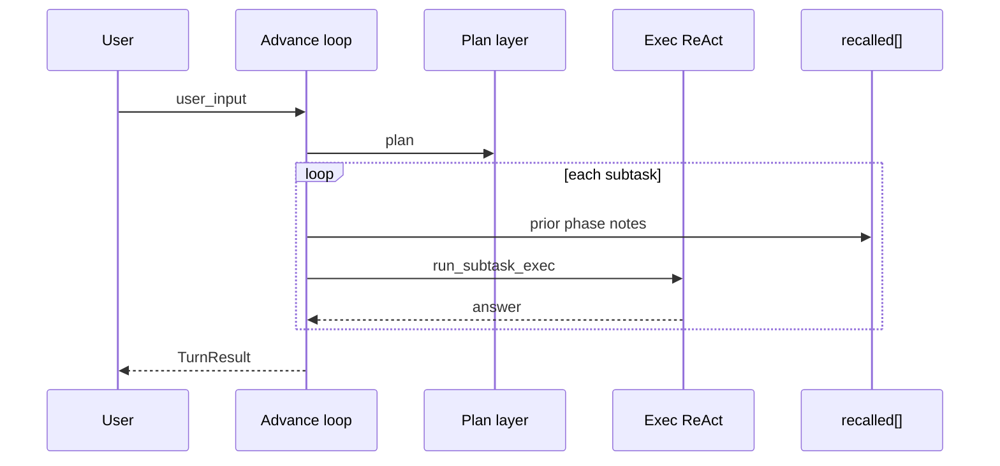

# 推進ループ（Advance loop）

## これは何か

**長い依頼をいくつかの区切り（フェーズ）に分けて進める**外側の進行。各区切りが終わったら要約を次のプロンプトに載せ、文脈が膨らみすぎないようにする。

用語: [用語集.md](用語集.md)

## いつ使う／使わない

- 使う: 長い作業を複数フェーズに分け、各 LLM 呼び出しのコンテキストを小さく保ちたいとき
- 使わない: 短い依頼で、標準の「計画してから実行」（two_phase）で足りるとき

`two_phase` と似るが、フェーズ間で **思い出し欄への注入** と **session クリア**（任意）を行う。

## 平易な流れ

全体計画 → フェーズ1実行 → 要約を載せる → フェーズ2… → 最終回答

## 設定（`config.json`）

```json
"react": {
  "advance": {
    "enabled": true,
    "max_phases": 8,
    "clear_session_each_phase": true,
    "max_note_chars": 1500,
    "show_phases": true
  }
}
```

| キー | 意味 | 既定 |
|------|------|------|
| `enabled` | 推進ループ ON（`two_phase` より優先） | `false` |
| `max_phases` | 1 リクエストで実行する最大フェーズ数 | `8` |
| `clear_session_each_phase` | 各フェーズ前に `SessionMemory` をクリア | `true` |
| `max_note_chars` | `recalled` に載せる 1 フェーズ要約の上限 | `1500` |
| `show_phases` | フェーズ開始を stdout に表示 | `true` |

## 優先順位

`run_turn` の分岐:

1. `advance.enabled` → `run_turn_advance`
2. それ以外で `two_phase` → `run_turn_two_phase`
3. それ以外 → 単一 ReAct

## フロー



## ライブラリ

- `AdvanceConfig`, `AdvanceProgress` — `harness_seed::advance`
- `TurnResult::advance_phases` — 各フェーズの `id` / `goal` / `answer` / `steps_used`

ホストアプリは `blocks.push_recalled(...)` で注入した内容を、フェーズ間も保持する（`prepare_phase_recalled` がベースを復元する）。

## 関連

- [memory.md](03_記憶層.md) — 外部記憶（Memory RAG + Bridge、local / mempalace）
- [context-memory-mapping.md](09_コンテキストマッピング.md) — 記憶の層
- [react-implementation.md](08_ReAct実装.md) — 内側 ReAct
