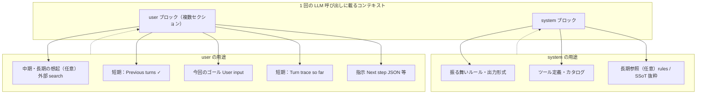
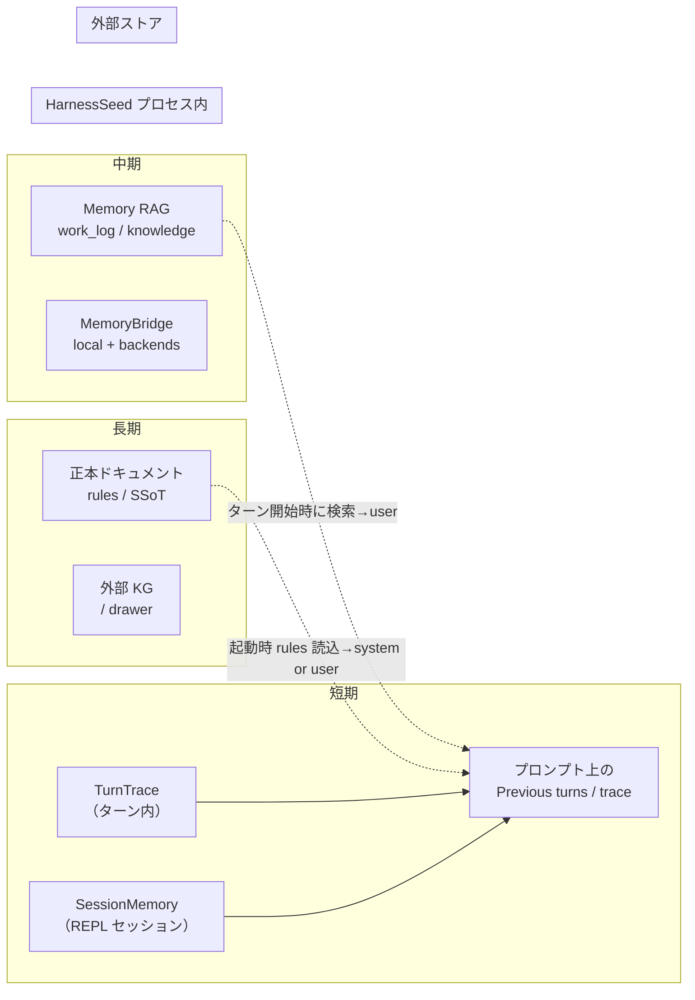
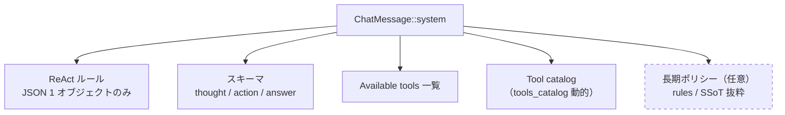
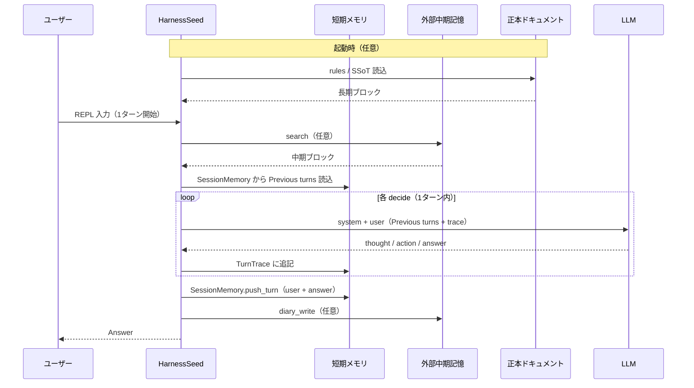
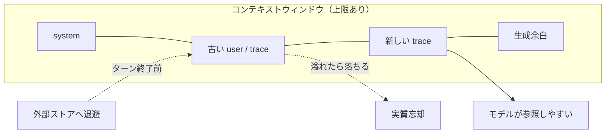
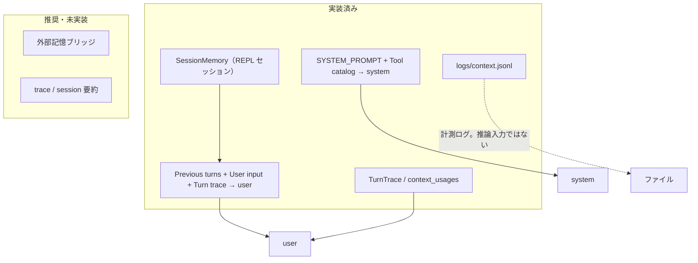
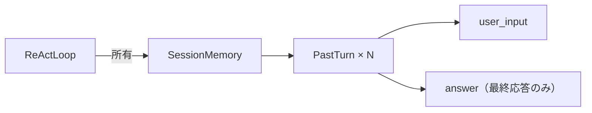
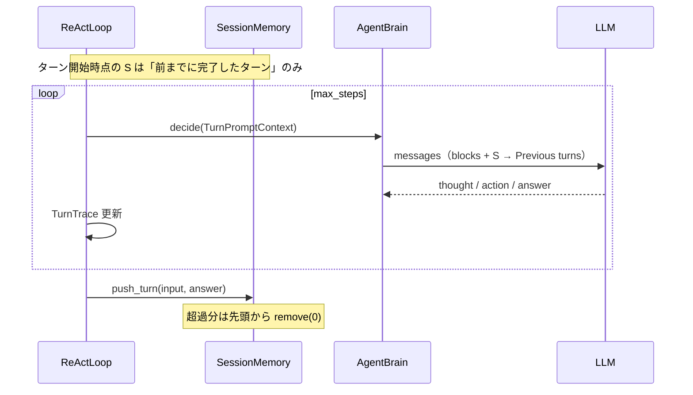

# コンテキスト内の用途別マッピング


LLM に一度に渡す文章を、何のために・どのくらい長く・どこに置くかで整理した地図である。「何が見えているか」が混ざると肥大化や欠落の切り分けができない。記憶バックエンドの実装詳細の代替ではない（それは [03_記憶層.md](03_記憶層.md)）。

プロンプトが肥大したとき、切り分けの共通言語として使う。実装では主に `TurnPromptContext::render` が 1 リクエストを組み立てる。

用語: [用語集.md](用語集.md) · ReAct: [08_ReAct実装.md](08_ReAct実装.md) · 単位: [10_最少行動単位.md](10_最少行動単位.md) · [EN](../../en/architecture/09_context-memory-mapping.md)

**現状（2026-07 時点）**

| 区分 | 状態 |
|------|------|
| ターン内 `TurnTrace` | 実装済み（プロンプト注入時に古い observation を短縮） |
| セッション短期 `SessionMemory` → `Previous turns` | **実装済み**（§10）。**作業ログ経路（`work_log`）のときだけ**注入 |
| コンテキスト計測・`logs/context.jsonl` | 実装済み（Observation は文字上限あり） |
| 外部記憶（検索・diary） | **実装済み** — [memory.md](03_記憶層.md)（記憶 RAG + `MemoryBridge`） |
| ルールファイル注入（`prompt.rules_paths`） | **実装済み**（`PromptBlocks`） |
| trace / session の要約 | trace は**窓付き短縮**実装済み。session 意味要約は未実装 |

---

## 1. 一枚絵：コンテキストウィンドウの中身



まず system 側に、毎回ほぼ変わらない振る舞いの制約とツールの定義を置く。ここはモデルが今回の依頼に応じて書き換える場所ではない。

次に user 側へ、必要なら過去から取り出した情報、今回のゴール、ターン内で起きた操作の結果を渡す。作業が進むほど trace が増えるため、同じルールを保ったまま最新の事実だけが更新される。

**原則**

| 層 | 主な載せ方 | 変わる頻度 |
|----|------------|------------|
| 不変に近い方針 | **system** | 低 |
| 今回の依頼・途中経過 | **user**（ブロック分割） | 高 |

---

## 2. 記憶の層 × 格納先



短期記憶は、現在のターンの trace とセッション中の直近会話を持つ。これらはプロセス内にあり、次の判断にすぐ使えるが、セッションを終えると残らない。

より長く残す情報は外部の記憶や正本ドキュメントに置く。ターンを始めるときに必要な部分だけを検索・読込し、プロンプトの想起コンテキストへ移す。保存場所とプロンプトに載る場所を分けることで、全履歴を毎回送らずに済む。

| 記憶の層 | 役割 | 格納先（推奨） | HarnessSeed 現状 |
|----------|------|----------------|----------------|
| **短期** | いまのターン・直近の発話 | ヒープ `TurnTrace` / `SessionMemory` → **user ブロック** | trace + **SessionMemory**（`Previous turns`、REPL `clear` でリセット） |
| **中期** | 数日〜数週の作業・経緯 | 外部 diary, search | 未接続 |
| **長期** | 規約・正本・関係 | 正本ドキュメント / 外部 KG | 未接続 |

---

## 3. user ブロック内の順序（推奨レイアウト）

```mermaid
block-beta
    columns 1

    block:recall:2
        columns 1
        recallTitle["Recalled context（任意）"]
        memSearch["外部 search 結果"]
        docRecall["正本・rules 抜粋"]
    end

    block:session:2
        columns 1
        sessTitle["Session memory（任意）"]
        prev["Previous turns: 直近 N ターン ✓"]
    end

    block:task:1
        columns 1
        goal["User input: 今回のゴール"]
    end

    block:work:2
        columns 1
        traceTitle["Working memory（ターン内）"]
        trace["Turn trace so far\nthought / action / observation"]
    end

    block:cue:1
        columns 1
        next["Next step JSON:"]
```

最初に、今回の作業に関係する過去の知識やルールを置く。続いて直近の会話を加え、今までの流れを必要な範囲で引き継ぐ。

その後に今回の依頼を明示し、同じターンで実行済みの操作と結果を渡す。最後に出力形式を短く示すので、モデルは古い背景を前提にしながら、最新の観測へ反応して次の一手を返せる。

| 順序 | セクション | 用途 | 典型ソース |
|------|------------|------|------------|
| 1 | Recalled context | 長期・中期からの引用 | 外部ストア、rules ファイル |
| 2 | Previous turns | 短期（会話の続き） | `SessionMemory` |
| 3 | User input | **今回のタスク** | REPL 1 行入力 |
| 4 | Turn trace so far | **作業中の事実** | `TurnTrace` |
| 5 | Next step JSON | 出力形式のリマインド | ハーネス固定文言 |

HarnessSeed **現行**（`src/llm/brain.rs`）は **2 + 3 + 4 + 5**（`Previous turns` あり。1・外部記憶 / rules 注入は未接続）。

---

## 4. system ブロック内の用途



system ブロックでは、まず出力の形式と守るべき制約を固定する。次に利用可能なツールと引数の概要を加え、モデルが存在しない操作を選ばないようにする。

長期ポリシーを載せる場合も、今回の依頼そのものはここへ置かない。依頼は user 側に残すことで、恒常的な規則とターンごとに変わる目的を分離できる。

| 内容 | 載せ方 | 更新頻度 |
|------|--------|----------|
| 出力形式・禁止事項 | system 固定 | コード変更時 |
| ツール名・引数の要約 | system + catalog | ツール追加時 |
| プロジェクト憲法・rules | system 先頭または末尾（任意） | 正本ドキュメント更新時 |

**今回のゴールは system に入れない**（user の `User input` へ）。

---

## 5. ライフサイクル：いつ何が載るか



起動時には、必要なら長期のルールを読み込んで固定の文脈を準備する。ターンが始まると、外部記憶の検索とセッション履歴の読込を行い、今回の判断材料をそろえる。

各判断では、同じルールと今回の材料に、増えていく trace を加えてモデルへ渡す。答えが確定してから短期記憶へ会話を保存し、外部日記が有効ならそこにも記録する。こうして読む処理と書く処理はターンの両端に分かれる。

| タイミング | 短期 | 中期 | 長期 |
|------------|------|------|------|
| プロセス起動 | — | — | rules / 正本の読み込み（任意・未） |
| ターン開始 | **実装**: `SessionMemory` → `Previous turns` を user 先頭へ | search → user（未） | 読み込み（未） |
| 各 `decide` | `TurnTrace` 増殖（ターン内のみ再送） | — | — |
| ターン終了 | **実装**: `push_turn(user, answer)` | diary_write（未） | 通常は書かない |
| REPL `clear` | **実装**: `SessionMemory::clear()` | — | — |

---

## 6. コンテキストが長いとき（忘却）



コンテキストには上限があるため、固定の system、古い経緯、新しい観測、生成のための余白が同じ枠を使う。情報が増えるほど、古い部分は枠から押し出されやすくなる。

最新の観測を残したい場合は、不要な古い trace を縮めるか、将来のために外部ストアへ退避する。これはモデルが意図的に忘れる処理ではなく、入力枠に収まらない情報を再送できなくなる問題への対処である。

| 現象 | 原因 | 対策 |
|------|------|------|
| ターン内で古い observation が効かない | trace が線形に増える | trace 要約・最後の N ステップのみ |
| REPL 前の発話を忘れる（K 超過） | `session_max_turns` を超えた古いターンは捨てられる | K の調整、`clear`、将来は外部ストアへ退避 |
| 溢れた内容の完全喪失 | ウィンドウ外 | 外部 diary / ローカル要約ファイルへ退避 |

計測は `[context step]` / `logs/context.jsonl` の `prompt_tokens` で確認。

---

## 7. 用途 × 載せ方 早見表

| 用途 | 載せ方 | 記憶層 | 推奨ストア |
|------|--------|--------|------------|
| JSON 出力形式のみ | system | — | コード |
| ツール一覧 | system + catalog | — | コード + [builtin_tools](../builtin_tools/README.md) |
| プロジェクト rules / 遂行規約 | system（抜粋） | 長期 | rules ファイル / 正本 |
| プロジェクト仕様・決定 | user 先頭 or system | 長期 | 正本ドキュメント |
| 似た過去作業の想起 | user 先頭 | 中期 | 外部 search |
| 直近の会話 | user `Previous turns` | 短期 | プロセス内 SessionMemory |
| 今回の依頼 | user `User input` | 短期 | 入力そのもの |
| Thought / Action / Observation | user `Turn trace` | 短期 | TurnTrace |
| ツール実行結果の原文 | trace 内 observation | 短期 | TurnTrace |
| セッションまたぎの日記 | （注入 or ツール） | 中期 | 外部 diary |
| エンティティ関係 | user 抜粋 or ツール | 長期 | 外部 KG |

---

## 8. HarnessSeed 現行との対応



現行実装では、ルールとツール一覧が system に入り、会話の履歴・今回の依頼・ターン内 trace が user に入る。trace とセッションは判断のための入力であり、ターンが進むたびに更新される。

計測ログは、どの程度の文脈を送ったかを後から確認するための記録で、モデルの入力には戻さない。外部記憶や要約の仕組みを加える場合も、この入力と観測ログの区別を保つ。

| マッピング上の要素 | ソース |
|--------------------|--------|
| system ルール・ツール | `src/llm/brain.rs` `SYSTEM_PROMPT` + `tools_catalog()` |
| user `Previous turns` | `src/session.rs` `format_for_prompt` ← `ReActLoop.session` |
| user ゴール + trace | `src/llm/brain.rs` `build_messages` |
| 短期ターン内 | `src/action.rs` `TurnTrace` |
| 短期セッション跨ぎ | `src/session.rs` `SessionMemory` / `src/react.rs` |
| 計測 | `src/context_metrics.rs`, `src/context_log.rs` |

---

## 10. 短期記憶（SessionMemory）実装

REPL セッション中だけ有効な **完了ターンの履歴** を保持し、次ターン以降の LLM 呼び出しに `Previous turns:` として載せる。

### 10.1 データ構造



ReActLoop はセッションごとに履歴を持ち、その中に完了済みターンを追加する。一件の履歴には、ユーザー入力と最終応答だけを残す。

途中の考えやツール出力はこの履歴へは移さない。それらはターン内だけで使う trace に留めるため、次のターンへ持ち越す情報量を抑えられる。

| 型 | ファイル | 内容 |
|----|----------|------|
| `PastTurn` | `src/session.rs` | 1 ターン分の `user_input` + `answer` |
| `SessionMemory` | `src/session.rs` | `Vec<PastTurn>` + 上限設定 |

**意図的に保存しないもの**

- ターン内の `thought` / `action` / `observation`（`TurnTrace` はターン終了で破棄）
- ツール出力の全文（要約が必要なら将来 §10.4）

### 10.2 プロンプトへの載せ方

`LlmBrain::build_messages`（`src/llm/brain.rs`）の user ブロック構成:

```
{Previous turns:（空なら省略）}

User input:
{今回の REPL 1 行}

Turn trace so far:
{当ターンの trace}

Next step JSON:
```

`Previous turns` の書式（`SessionMemory::format_for_prompt`）:

```text
Previous turns:
[turn 1]
User: ...
Assistant: ...
[turn 2]
...
```

### 10.3 ライフサイクル（実装）



新しいターンを始めるとき、セッションには過去に完了したターンだけが入っている。各判断では、その履歴と現在の trace を合わせてモデルに渡す。

最終回答が決まってから、入力と回答を一組としてセッションへ追加する。保持上限を超えた場合は最も古い組を捨てるので、直近の会話を優先しながらメモリの大きさを一定に保つ。

| 操作 | タイミング | コード |
|------|------------|--------|
| 読み取り | 各 `decide` | `TurnPromptContext { blocks, input, trace, session }` |
| 書き込み | `Answer` 確定直後 | `session.push_turn(user_input, answer)` |
| リセット | REPL `clear` / `forget` / `reset` | `session.clear()`（`src/react.rs` `run_repl`） |

`AgentBrain::decide` の第 3 引数 `session` は **全頭脳で受け取る**が、現状プロンプトへ反映するのは **LlmBrain のみ**（`SimpleRuleBrain` は未使用）。

### 10.4 上限と設定

| 項目 | 既定 | 設定 |
|------|------|------|
| 保持ターン数 | 8 | `react.session_max_turns`（`config/config.json`） |
| 1 フィールド最大文字 | 2000 文字 | コード定数 `SessionMemory::DEFAULT_MAX_CHARS_PER_FIELD`（超過は `…` で切り詰め） |

`ReActConfig::session_max_turns` ← `AppConfig::react_config()` で解決。`ReActLoop::new` 時に `SessionMemory::new(...)` を生成。

### 10.5 観測・確認

- **REPL**: 2 ターン目以降、同じセッションで「さっき言ったこと」を聞く
- **ログ**: `logs/context.jsonl` の各 step の `prompt` に `Previous turns` が含まれる（ターン 2 以降）
- **stderr**: `[context step]` の `prompt_tokens` がターン進行とともに増える傾向

### 10.6 未実装（短期の次の一手）

| 項目 | 説明 |
|------|------|
| session 要約 | N ターン超の「意味」を圧縮して Previous turns を短くする |
| 永続化 | プロセス終了で `SessionMemory` は消える（ファイル / 外部ストア連携は未） |
| ルール頭脳 | `SimpleRuleBrain` が session を参照した応答（デモ用・任意） |

ターン内 trace は `format_trace` が直近 observation を厚め・古いものを短くする窓付き短縮を行う（意味要約ではない）。

---

## 11. 関連ドキュメント

| ドキュメント | 内容 |
|--------------|------|
| [react-implementation.md](08_ReAct実装.md) | ReAct ループ・頭脳・ログ |
| [agent-minimum-action-unit.md](10_最少行動単位.md) | Action = 1 Tool Call |
| [builtin_tools/README.md](../builtin_tools/README.md) | ツール仕様 |
| [config/README.md](../../../config/README.md) | 実行時設定（`session_max_turns` 含む） |
