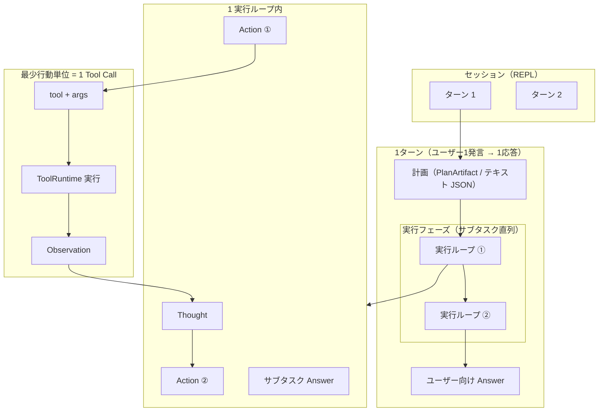
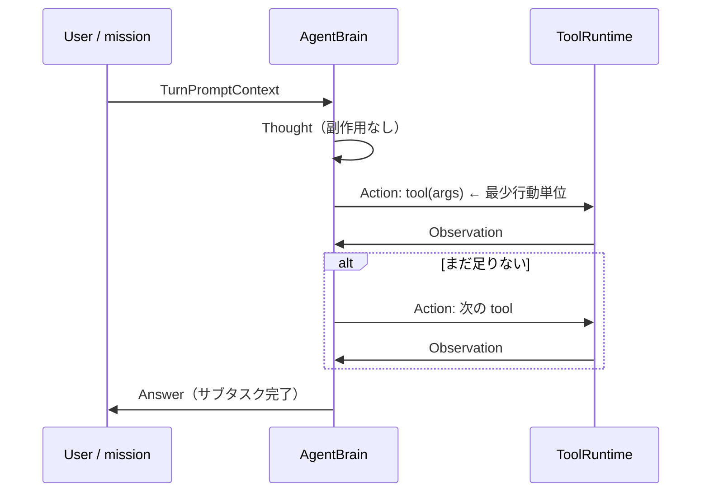
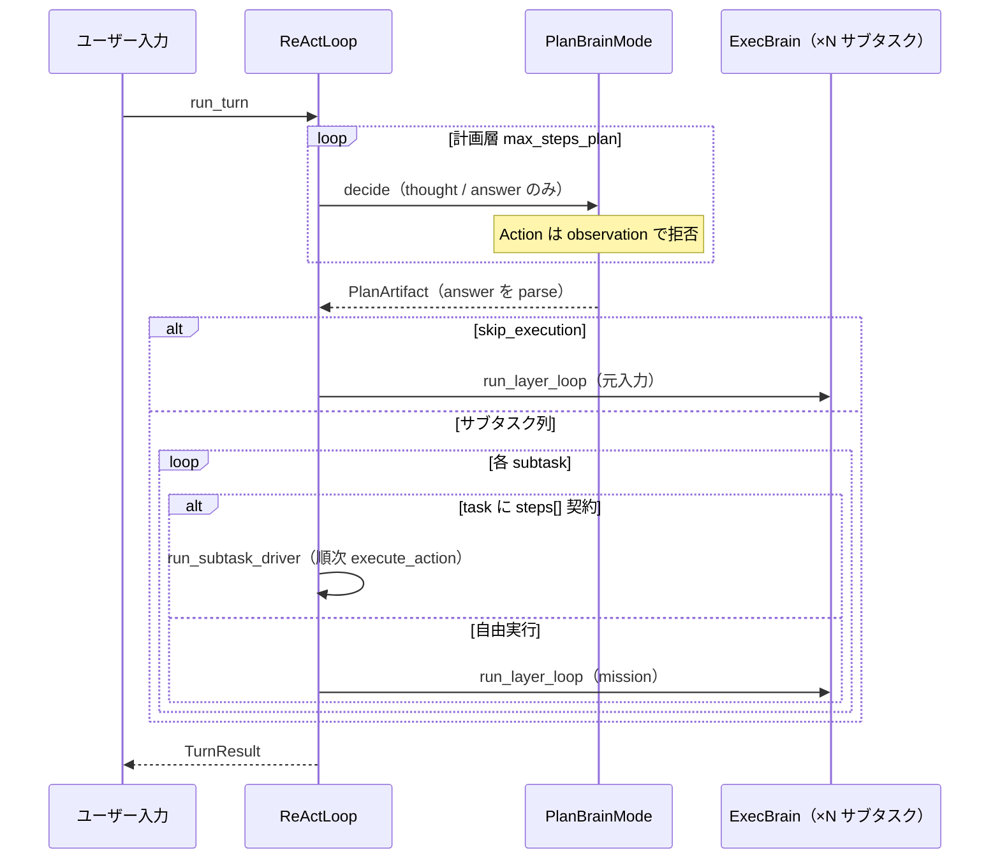
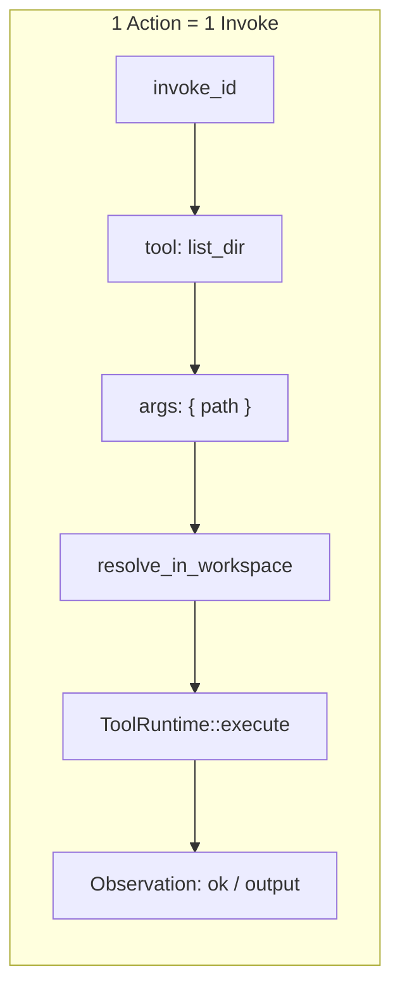
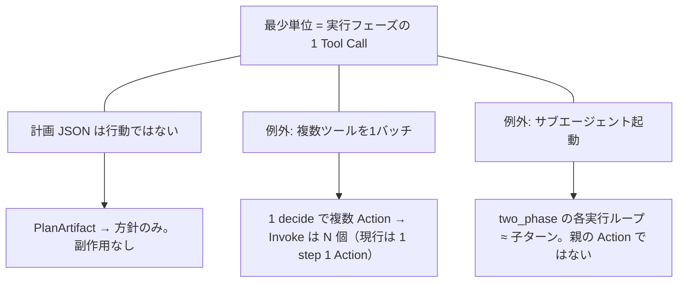

# AIエージェントの最少行動単位


実世界に効く最小の操作を「ツールを 1 回呼ぶこと」とみなす、という設計の前提である。「行動」の単位が実装ごとに違うとログ・監査・UI が噛み合わない。推論テキストや計画 JSON は行動ではなく、ツール実行とその結果（観察）が基本単位になる。

考える → ツールを 1 回呼ぶ → 結果を見る → また考えるか答える、が繰り返しの骨である。

用語: [用語集.md](用語集.md) · ReAct: [08_ReAct実装.md](08_ReAct実装.md) · 索引: [README.md](README.md) · コンテキスト: [09_コンテキストマッピング.md](09_コンテキストマッピング.md) · [EN](../../en/architecture/10_agent-minimum-action-unit.md)

## 1. 階層の全体像



まずセッションには複数のターンが並び、各ターンで計画と必要な実行が行われる。計画は作業の並びを決めるだけで、まだ外部には何もしない。

実行に入ると、サブタスクごとのループが必要な操作を繰り返す。一つの Action が一つのツール呼び出しになり、その結果が Observation として戻る。この Action と Observation の組が、実世界に影響を与えたことを追跡する最小の単位である。

| レベル | 例 | 最少単位か | HarnessSeed（`two_phase` 時） |
|--------|-----|------------|-------------------------------|
| セッション | チャット全体 | × | `SessionMemory`（REPL 短期） |
| ターン | ユーザー1発言 → 1応答 | × | `run_turn` / `TurnResult` |
| 計画 | サブタスク列の JSON | × | `PlanArtifact`（**ツールなし**） |
| 実行ループ | 1 サブタスク分の ReAct | × | `run_turn_single(mission)` |
| 行動（Action） | `read_file` を1回 | **◎** | `Action` + `invoke_id` |
| 観測（Observation） | ファイル内容・exit code | 行動の結果 | `Observation` |

**原則**: 計画フェーズは環境に触れない。副作用があるのは **実行フェーズの `Action` のみ**。

## 2. ReAct ループ（1行動の中身）

「考える → 1ツール実行 → 結果を見る」が **実行フェーズ** の最小ループ。



まずモデルは、現在の依頼や mission を受けて次の手を考える。考えるだけなら外部状態は変わらず、その内容は次の判断のために残る。

ツールを選んだときだけ一回の Action が実行され、Observation が返る。まだ足りなければ同じ往復を続け、十分な材料がそろったら Answer を返す。このため、複数の操作があっても一回ごとの呼び出しを独立して記録できる。

| 変種 | 環境への副作用 | HarnessSeed 型 |
|------|----------------|----------------|
| `Thought` | なし | `AgentStep::Thought` |
| `Action` | **あり** | `AgentStep::Action` → `execute_action` |
| `Answer` | なし（テキスト応答） | `AgentStep::Answer` |

## 3. 計画層・実行層（two_phase、共通 ReAct ループ）

`react.two_phase: true` のとき、**計画層・実行層とも** `run_layer_loop`（`src/layer.rs`）で回す。



最初に計画層が、ツールを使わずに実行する作業を組み立てる。計画が直接答えられると判断した場合は、サブタスク列を作らずに応答へ進む。

作業が必要なら、各サブタスクを順に実行する。契約済みの手順はドライバが固定順で実行し、それ以外は ReAct が状況を見ながら操作を選ぶ。いずれも終わると結果をまとめてユーザーへ返す。

| 層 | 頭脳 | ループ | ツール | 終了 |
|----|------|--------|--------|------|
| 計画 | `PlanBrainMode` | `run_plan_layer` | **なし** | `Answer` → `PlanArtifact` |
| 実行 | `exec` `BrainMode` | `run_layer_loop` または **ステップドライバ** | **あり** | `Answer` → ユーザー向け |

サブタスクに登録タスク id（`tasks/*.json`）があり `steps[]` が定義されているとき、`react.use_step_driver`（既定 `true`）なら **`src/tasks/driver.rs`** が LLM なしで契約順に `execute_action` する。失敗時は ReAct にフォールバック。`generic`（steps 空）は従来どおり ReAct。

計画 JSON スキーマ（抜粋）:

```json
{
  "summary": "…",
  "skip_execution": false,
  "subtasks": [
    { "id": 1, "goal": "…", "done_when": "…" }
  ]
}
```

実行へ渡す mission は `format_mission` で組み立てる（`Original request` / `Current subtask` / 先行サブタスク結果）。各実行ループの `TurnTrace` はターン終了時に **マージ** され、全 `Action` / `Observation` が1本の trace として残る。

## 4. 1 Tool Call の分解（ハーネス設計向け）

実行基盤で記録するなら、この粒度が扱いやすい。



一回の Action では、まず呼び出しを識別する ID とツール名、引数をそろえる。次にワークスペースなどの制約を確認してから、ランタイムが実行する。

実行の成否と出力は Observation に収める。この記録があれば、どの操作をどの引数で行い、何が返ったかを一つの単位として後から追える。

| フィールド | 意味 | 実装 |
|------------|------|------|
| `invoke_id` | ログ・trace 上のキー | `Action::invoke_id` |
| `tool` + `args` | 再現可能な命令 | `src/tool.rs` |
| ワークスペース制約 | パス拒否 | `resolve_in_workspace` |
| `ok` + `output` | 次 `decide` への入力 | `Observation` |

## 5. 境界がブレる例（設計の注意）



基本の数え方では、実行フェーズのツール呼び出し一回を一つの行動とする。計画 JSON は作業方針であり、環境を変えないため行動には含めない。

複数ツールをまとめて扱う実装では、実際に起きた呼び出しの数だけ記録を分ける必要がある。サブエージェントや複数サブタスクも、それ自体を親の一操作とせず、それぞれの実行内にある Action を同じ基準で数える。

| ケース | 扱い |
|--------|------|
| 計画フェーズ | テキスト / JSON。**Invoke を増やさない** |
| 並列ツール | 記録上は **Invoke が N 個**（HarnessSeed 現行は 1 ステップ 1 `Action`） |
| two_phase の複数サブタスク | **実行ループが N 回**。最少単位は各ループ内の `Action` |
| テキストのみ | `Thought` / `Answer` / 計画 summary は行動ではない |

## 6. まとめ

| 質問 | 答え |
|------|------|
| 最少行動単位は | **実行フェーズの 1 Tool Call + Observation** |
| 計画は行動か | **いいえ**（`PlanArtifact` は中間成果物） |
| 1 ターンに複数 Action があり得るか | **ある**（1 実行ループ内、またはサブタスク数ぶんの実行ループ） |
| ハーネスで何をログるか | 実行: `invoke_id`, `tool`, `args`, `Observation`。計画: `plan` + 任意で `[context plan]` |

## 7. HarnessSeed への対応（現行）

| 概念 | 型 / API | モジュール |
|------|----------|------------|
| ターン | `TurnResult` | `src/react.rs` |
| 計画成果 | `PlanArtifact`, `Subtask` | `src/plan.rs` |
| 順序照合 | `audit_trace` / `ArgAuditMode` | `src/tasks/audit.rs` |
| タスク契約 | `TaskDefinition`, `ExecStep`（`order` + `method`） | `src/tasks/spec.rs`, `tasks/*.json` — [task-registry.md](05_タスクレジストリ.md) |
| 計画層ループ | `run_plan_layer` + `PlanBrainMode` | `src/layer.rs`, `src/plan/brain.rs` |
| 実行ステップ | `AgentStep` | `src/action.rs` |
| 最少行動 | `Action` | `src/action.rs` |
| 観測 | `Observation` | `src/action.rs` |
| ターン内 trace | `TurnTrace` | `src/action.rs`（two_phase 時はサブタスク分をマージ） |
| サブタスク結果 | `SubtaskExecResult` | `src/react.rs` |
| 設定 | `react.two_phase`, `react.max_steps`, `react.use_step_driver`, `react.show_prompt` | `config/config.json`, `ReActConfig` |

`two_phase: false`（既定）のときは、従来どおり **1 ターン = 1 実行ループ** のみ。`true` のときだけ §3 の計画 → 直列実行が入る。

外側の推進ループ（フェーズ分割・`recalled` 引き継ぎ）は [advance-loop.md](07_推進ループ.md)（`react.advance.enabled`）。REPL の `SessionMemory` はターン間の薄い短期記憶（[context-memory-mapping.md §10](09_コンテキストマッピング.md#10-短期記憶sessionmemory実装)）。
