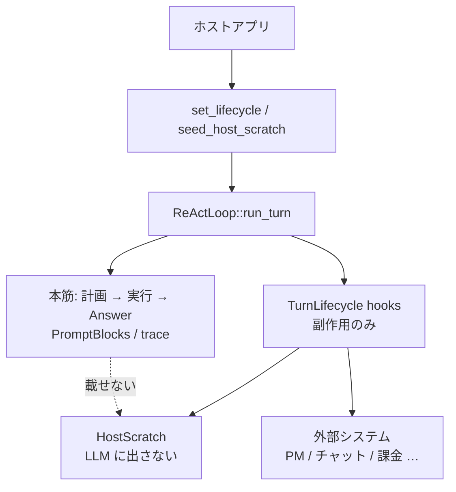

# ライフサイクル hook と HostScratch

ホストアプリ（triage-mail、開発エージェントなど）が、**本筋の ReAct ループを変えずに**外部連携するための拡張面。

- 実装: `src/lifecycle.rs`
- 登録: `ReActLoop::set_lifecycle` / `seed_host_scratch` / `host_scratch`
- 開発方針: [development-principles.md](development-principles.md)（ドメイン語彙はホスト側）

## 1. 役割分担

| 側 | 持つもの |
|----|----------|
| **エンジン（harness-seed）** | 計画／実行ループ、hook の**呼び出しタイミング**、ターン袋 `HostScratch` |
| **ホスト** | hook 実装（チケット・通知・課金など）、袋のキー設計、外部 API |

エンジンは Redmine / Paperclip / LINE WORKS / Stripe 等を**知らない**。ホストが同じ面に載せる。



## 2. 禁止事項（本筋を壊さない）

hook 内では次を**行わない**。

- `run_turn` / ツール実行の**再入**
- 計画キュー・`TurnTrace`・最終 Answer の**直接書き換え**
- エラーをエンジンへ伝播させてターンを落とすこと（外部 API 失敗は hook 内で処理）

hook は**観測と副作用**（および `HostScratch` への書き込み）に限る。制御権は常にエンジン。

## 3. 呼び出しタイミング

`two_phase` / `advance` で計画があるターン:

```text
begin_host_scratch_for_turn  （袋クリア → seed マージ）
  on_turn_started
  … 記憶 RAG …
  … 計画層 …
  on_plan_finished           （resolve_plan 適用後。skip_execution でも呼ばれる）
  for each subtask:
    on_subtask_started
    … 実行 …
    on_subtask_finished
  finish_turn（session / diary）
  on_turn_finished
```

単相実行（計画なし）では `on_turn_started` と `on_turn_finished` のみ。

ターンがエラーで中断した場合、未完了の `on_subtask_finished` / `on_turn_finished` は呼ばれない。

## 4. ペイロード（コンテキスト全文は渡さない）

本筋の rules / recalled / tool catalog / observation 全文は**渡さない**。チケット説明などに使える構造化断片だけを渡す。

| hook | 引数 |
|------|------|
| `on_turn_started` | `user_input`, `host` |
| `on_plan_finished` | `user_input`, `plan`, `host` |
| `on_subtask_started` | `user_input`, `plan`, `subtask`, `index`（0 始まり）, `host` |
| `on_subtask_finished` | 上記 + `answer`, `steps_used`, `host` |
| `on_turn_finished` | `user_input`, `answer`, `plan?`, `steps_used`, `host` |

外部チケットの説明文の目安:

| タイミング | 使える材料 |
|------------|------------|
| 親チケット作成（`on_plan_finished`） | `plan.summary`、各 subtask の `goal` / `done_when` |
| 子チケット作成（`on_subtask_started`） | `subtask.goal` |
| 子の結果（`on_subtask_finished`） | そのサブタスクの `answer` |
| 親の完了コメント（`on_turn_finished`） | 最終 `answer` |

## 5. HostScratch（ターン袋）

ターン専用のキー・バリュー置き場。**プロンプト組み立て・LLM 入力には一切使わない。**

典型キー例（ホスト自由）:

- `redmine.project_id`
- `redmine.ticket_id`（ユーザー指示や UI から seed）
- `redmine.parent_ticket_id`（`on_plan_finished` で作成後に書く）
- `redmine.child.0` …（`on_subtask_started` で子を切ったあと）

### 5.1 寿命

1. `run_turn` 先頭で袋を **clear**
2. `seed_host_scratch` があれば **merge**
3. `on_turn_started` 以降、各 hook が同じ袋を読み書き
4. ターン後は `react.host_scratch()` で読める（**次の `run_turn` 開始で再び clear**）

### 5.2 標識の入れ方

**UI で選んだ ID（推奨）**

```rust
let mut seed = HostScratch::new();
seed.insert("redmine.project_id", 1);
seed.insert("redmine.ticket_id", 10);
react.seed_host_scratch(seed);
react.run_turn(&user_input)?;
```

**指示文から読む**

`on_turn_started` で `user_input` をパースし、`host.insert(...)` する。エンジンはドメイン語彙を解釈しない。

### 5.3 API 要約

| メソッド | 意味 |
|----------|------|
| `insert` / `get` / `get_i64` / `get_str` / `remove` / `contains` | エントリ操作 |
| `merge` | 他袋を上書きマージ |
| `clear` / `is_empty` / `iter` | 全体操作 |

値型は `serde_json::Value`。

## 6. 登録と実装例

```rust
use harness_seed::{HostScratch, PlanArtifact, ReActLoop, Subtask, TurnLifecycle};
use std::sync::Arc;

struct PmSync;

impl TurnLifecycle for PmSync {
    fn on_turn_started(&self, user_input: &str, host: &mut HostScratch) {
        // 必要なら指示文から ID を袋へ
        let _ = (user_input, host);
    }

    fn on_plan_finished(&self, _user_input: &str, plan: &PlanArtifact, host: &mut HostScratch) {
        // 親チケット作成。plan.summary / plan.subtasks を説明に使う
        // host.insert("pm.parent_id", created_id);
        let _ = (plan, host);
    }

    fn on_subtask_started(
        &self,
        _user_input: &str,
        _plan: &PlanArtifact,
        subtask: &Subtask,
        index: usize,
        host: &mut HostScratch,
    ) {
        // 子チケット。host の parent_id を参照
        let _ = (subtask, index, host);
    }

    fn on_subtask_finished(
        &self,
        _user_input: &str,
        _plan: &PlanArtifact,
        subtask: &Subtask,
        answer: &str,
        _steps_used: usize,
        host: &mut HostScratch,
    ) {
        // 子に結果を書く
        let _ = (subtask, answer, host);
    }

    fn on_turn_finished(
        &self,
        _user_input: &str,
        answer: &str,
        _plan: Option<&PlanArtifact>,
        _steps_used: usize,
        host: &mut HostScratch,
    ) {
        // 親を更新 / 通知
        let _ = (answer, host);
    }
}

// react.set_lifecycle(Some(Arc::new(PmSync)));
```

複数連携は `CompositeLifecycle` で順に呼ぶ（同一 `HostScratch` を共有）。

## 7. TurnObserver との違い

| | `TurnLifecycle` | `TurnObserver` |
|--|-----------------|----------------|
| 目的 | ホスト業務（PM・通知・課金） | UI / デバッグ（ステップ表示） |
| 粒度 | ターン・計画・サブタスク | LLM 1 回・ツール 1 回 |
| 状態袋 | `HostScratch` あり | なし |
| 変更 | 副作用のみ（本筋不変） | 観測のみ |

両方登録してよい。

## 8. 関連

- 計画データ契約（ホストが INPUT/OUTPUT を固定）: [architecture/01_計画層.md](architecture/01_計画層.md)
- 記憶層（LLM に見せる recalled）: [memory.md](memory.md)
- 全体構造: [architecture/00_harness-seedの構造.md](architecture/00_harness-seedの構造.md)
