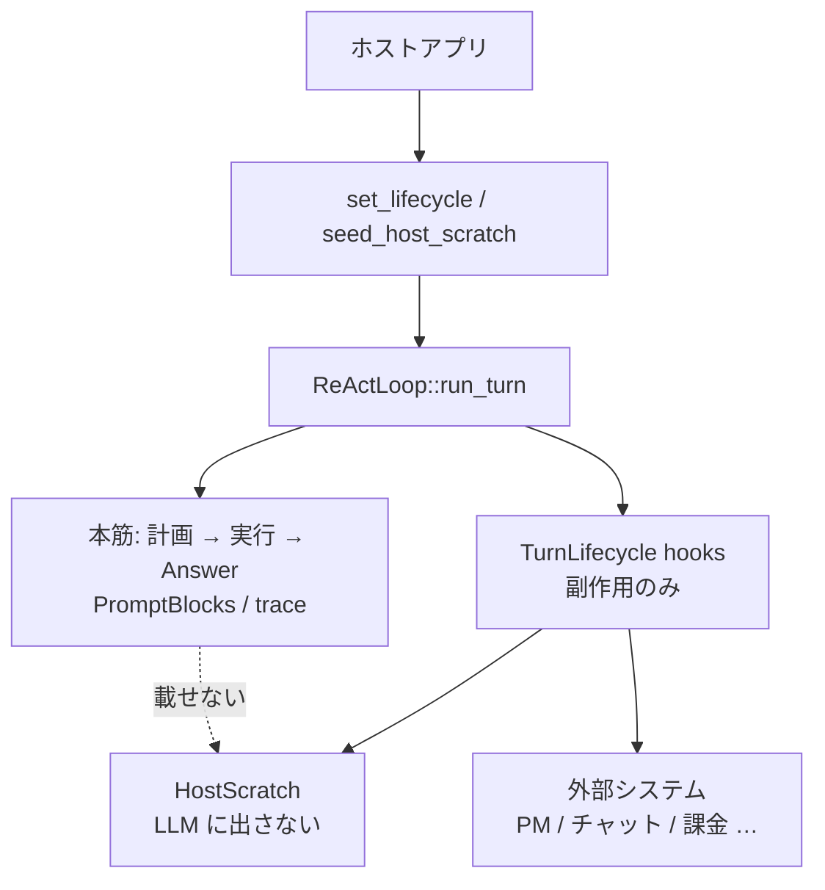

# ライフサイクル hook と HostScratch

ホストアプリ（triage-mail、開発エージェントなど）が、**本筋の ReAct ループを変えずに**外部連携するための拡張面。

- 実装: `src/lifecycle.rs`
- 登録: `ReActLoop::set_lifecycle` / `seed_host_scratch` / `host_scratch`
- 開発方針: [development-principles.md](development-principles.md)（ドメイン語彙はホスト側）

## 1. 役割分担

| 側 | 持つもの |
|----|----------|
| **エンジン（harness-seed）** | 計画／実行ループ、hook の**呼び出しタイミング**、ターン袋 `HostScratch` |
| **ホスト** | hook 実装（チケット・通知・課金など）、袋のキー設計、外部 API |

エンジンは Redmine / Paperclip / LINE WORKS / Stripe 等を**知らない**。ホストが同じ面に載せる。



## 2. 禁止事項（本筋を壊さない）

hook 内では次を**行わない**。

- `run_turn` / ツール実行の**再入**
- 計画キュー・`TurnTrace`・最終 Answer の**直接書き換え**
- エラーをエンジンへ伝播させてターンを落とすこと（外部 API 失敗は hook 内で処理）

hook は**観測と副作用**（および `HostScratch` への書き込み）に限る。制御権は常にエンジン。

## 3. 呼び出しタイミング

`two_phase` / `advance` で計画があるターン:

```text
begin_host_scratch_for_turn  （袋クリア → seed マージ）
  on_turn_started
  … 記憶 RAG …
  … 計画層 …
  on_plan_finished           （resolve_plan 適用後。skip_execution でも呼ばれる）
  for each subtask:
    on_subtask_started
    … 実行 …
    on_subtask_finished
  finish_turn（session / diary）
  on_turn_finished
```

単相実行（計画なし）では `on_turn_started` と `on_turn_finished` のみ。

ターンがエラーで中断した場合、未完了の `on_subtask_finished` / `on_turn_finished` は呼ばれない。

## 4. ペイロード（コンテキスト全文は渡さない）

本筋の rules / recalled / tool catalog / observation 全文は**渡さない**。チケット説明などに使える構造化断片だけを渡す。

| hook | 引数 | write scope |
|------|------|-------------|
| `on_turn_started` | `user_input`, `host: HostView` | `turn` |
| `on_plan_finished` | `user_input`, `plan`, `host` | `turn` |
| `on_subtask_started` | `user_input`, `plan`, `subtask`, `index`（0 始まり）, `host` | `subtasks.{subtask.id}` |
| `on_subtask_finished` | 上記 + `answer`, `steps_used`, `host` | `subtasks.{subtask.id}` |
| `on_turn_finished` | `user_input`, `answer`, `plan?`, `steps_used`, `host` | `turn` |

外部チケットの説明文の目安:

| タイミング | 使える材料 |
|------------|------------|
| 親チケット作成（`on_plan_finished`） | `plan.summary`、各 subtask の `goal` / `done_when` |
| 子チケット作成（`on_subtask_started`） | `subtask.goal` |
| 子の結果（`on_subtask_finished`） | そのサブタスクの `answer` |
| 親の完了コメント（`on_turn_finished`） | 最終 `answer` |

## 5. HostScratch（ターン袋・入れ子）

ターン専用の入れ子 JSON。**プロンプト組み立て・LLM 入力には一切使わない。**

```json
{
  "turn": {
    "project_id": 1,
    "ticket_id": 10,
    "parent_ticket_id": 42
  },
  "subtasks": {
    "1": { "child_ticket_id": 7 },
    "2": { "child_ticket_id": 8 }
  }
}
```

| 領域 | キー | 書いてよい hook |
|------|------|-----------------|
| `turn` | ホスト自由 | `on_turn_started` / `on_plan_finished` / `on_turn_finished`（および seed） |
| `subtasks.{id}` | **subtask id**（配列ではない） | その id の `on_subtask_started` / `on_subtask_finished` のみ |

**参照は袋全体**（`host.to_value()` / `turn_get_*` / `subtask_get_*`）。**書き込みは自ノードのみ**（`HostView::insert`）。並列時も子同士は枝が違うので競合しにくい。

### 5.1 寿命

1. `run_turn` 先頭で袋を **clear**
2. `seed_host_scratch` があれば **`turn` のみ merge**（`subtasks` は載せない）
3. 各 hook が `HostView` 経由で読み書き
4. ターン後は `react.host_scratch()` で読める（**次の `run_turn` 開始で再び clear**）

### 5.2 標識の入れ方

**UI で選んだ ID（推奨・seed は turn へ）**

```rust
let mut seed = HostScratch::new();
seed.turn_insert("project_id", 1);
seed.turn_insert("ticket_id", 10);
react.seed_host_scratch(seed);
react.run_turn(&user_input)?;
```

**指示文から読む**

`on_turn_started` で `user_input` をパースし、`host.insert(...)`（write scope は `turn`）する。

### 5.3 HostView

| 操作 | API |
|------|-----|
| 全体参照 | `to_value()` / `turn()` / `subtask(id)` / `turn_get_*` / `subtask_get_*` |
| 自ノード書き込み | `insert` / `remove` / `get` / `get_i64`（自ノード） |
| write scope | `WriteScope::Turn` または `WriteScope::Subtask(id)`（エンジンが付与） |

## 6. 登録と実装例

```rust
use harness_seed::{HostScratch, HostView, PlanArtifact, Subtask, TurnLifecycle};

struct PmSync;

impl TurnLifecycle for PmSync {
    fn on_turn_started(&self, user_input: &str, host: HostView<'_>) {
        let _ = (user_input, host.turn_get_i64("ticket_id"));
    }

    fn on_plan_finished(&self, _user_input: &str, plan: &PlanArtifact, mut host: HostView<'_>) {
        // 親チケット作成 → turn に書く
        host.insert("parent_ticket_id", 42);
        let _ = plan;
    }

    fn on_subtask_started(
        &self,
        _user_input: &str,
        _plan: &PlanArtifact,
        subtask: &Subtask,
        _index: usize,
        mut host: HostView<'_>,
    ) {
        let parent = host.turn_get_i64("parent_ticket_id");
        // 子チケット作成 → この subtask のノードに書く
        host.insert("child_ticket_id", 7);
        let _ = (subtask, parent);
    }

    fn on_subtask_finished(
        &self,
        _user_input: &str,
        _plan: &PlanArtifact,
        subtask: &Subtask,
        answer: &str,
        _steps_used: usize,
        host: HostView<'_>,
    ) {
        let child = host.get_i64("child_ticket_id");
        let _ = (subtask, answer, child);
    }

    fn on_turn_finished(
        &self,
        _user_input: &str,
        answer: &str,
        _plan: Option<&PlanArtifact>,
        _steps_used: usize,
        host: HostView<'_>,
    ) {
        // 子ノードを集約して親を更新
        let _ = (answer, host.subtask_get_i64(1, "child_ticket_id"));
    }
}
```

複数連携は `CompositeLifecycle` で順に呼ぶ（同一袋・同一 write scope）。

## 7. TurnObserver との違い

| | `TurnLifecycle` | `TurnObserver` |
|--|-----------------|----------------|
| 目的 | ホスト業務（PM・通知・課金） | UI / デバッグ（ステップ表示） |
| 粒度 | ターン・計画・サブタスク | LLM 1 回・ツール 1 回 |
| 状態袋 | `HostScratch` あり | なし |
| 変更 | 副作用のみ（本筋不変） | 観測のみ |

両方登録してよい。

## 8. 関連

- 計画データ契約（ホストが INPUT/OUTPUT を固定）: [architecture/01_計画層.md](architecture/01_計画層.md)
- 記憶層（LLM に見せる recalled）: [memory.md](memory.md)
- 全体構造: [architecture/00_harness-seedの構造.md](architecture/00_harness-seedの構造.md)
