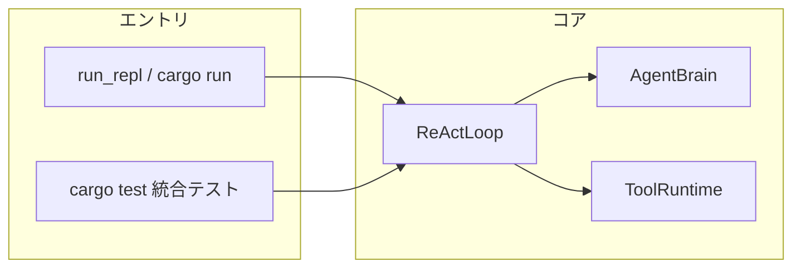
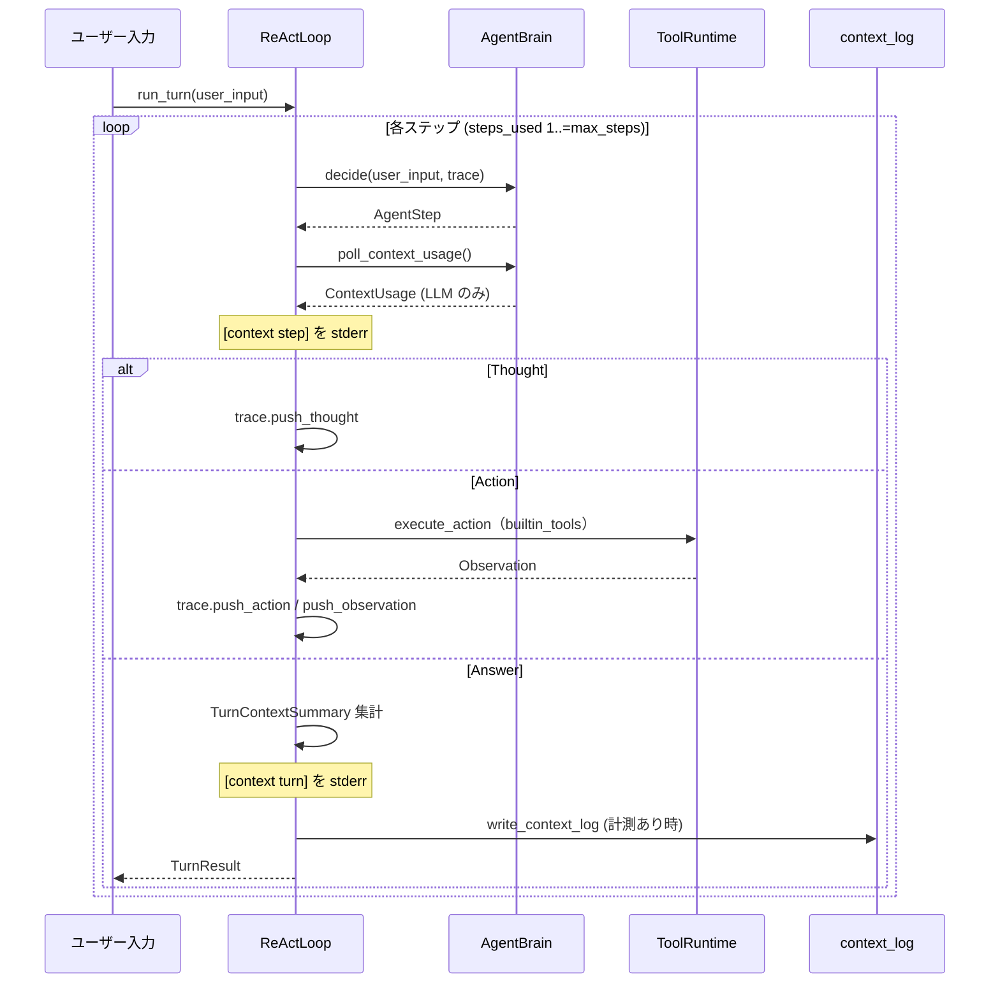

# HarnessSeed ReAct 実装状態（現行）

本ドキュメントは **2026-05 時点のソースコード**に基づく、HarnessSeed における ReAct ループの実装スナップショットである。

- 概念の背景: [agent-minimum-action-unit.md](agent-minimum-action-unit.md)
- **コンテキストの用途別マッピング（短期/中期/長期）**: [context-memory-mapping.md](context-memory-mapping.md)
- **組み込みツールの仕様（引数・挙動・失敗条件）**: [builtin_tools/README.md](builtin_tools/README.md)

## 1. 概要

HarnessSeed は **1 ユーザー入力 = 1 ターン** の ReAct ループを回し、`Answer` が返るまで `Thought` / `Action` / `Observation` を繰り返す。

| 項目 | 実装 |
|------|------|
| エンジン | `ReActLoop<B: AgentBrain>`（`src/react.rs`） |
| 最少行動単位 | **1 回の `Action`（ツール呼び出し）** |
| 頭脳 | `SimpleRuleBrain`（ルール） / `LlmBrain`（LLM JSON ステップ） |
| CLI 経路 | `BrainMode` → `ReActLoop`（`src/main.rs`） |
| 設定 | `config/config.json` + `AppConfig::react_config` |
| ツール仕様書 | [builtin_tools/](builtin_tools/README.md)（実装は `src/tool/`） |



## 2. モジュール構成

| パス | 責務 |
|------|------|
| `src/react.rs` | ループ本体、REPL、`ReActConfig` |
| `src/action.rs` | `AgentStep`, `Action`, `Observation`, `TurnTrace` |
| `src/brain.rs` | `AgentBrain` トレイト、`SimpleRuleBrain`, `BrainMode` |
| `src/tool/` | ツール trait・レジストリ・パック・`ToolRuntime`（仕様は [builtin_tools/](builtin_tools/README.md)） |
| `src/llm/brain.rs` | `LlmBrain`、システムプロンプト、メッセージ組み立て |
| `src/llm/parse.rs` | LLM 出力 JSON → `AgentStep` |
| `src/context_metrics.rs` | プロンプト／完了の計測 |
| `src/context_log.rs` | `logs/context.jsonl` への JSON Lines 追記 |

## 3. 1 ターンの制御フロー

`run_turn` は `max_steps`（既定 16）までループし、各イテレーションで **頭脳が 1 ステップ**返す。



### 3.1 `AgentStep` の扱い

| 変種 | ループ側の処理 | 環境への副作用 |
|------|----------------|----------------|
| `Thought(String)` | `trace` に蓄積のみ | なし |
| `Action(Action)` | [組み込みツール](builtin_tools/README.md) 実行 → `Observation` を `trace` に蓄積 | **あり（最少行動単位）** |
| `Answer(String)` | ターン終了。`TurnResult` を返す | なし（ユーザー向け最終応答） |

`steps_used` は **ループイテレーション回数**（`decide` の呼び出し回数）であり、ツール呼び出し回数と一致するとは限らない（`Thought` や即 `Answer` も 1 ステップとして数える）。

## 4. 頭脳（AgentBrain）

### 4.1 トレイト

```rust
pub trait AgentBrain {
    fn decide(&mut self, user_input: &str, trace: &TurnTrace) -> AgentStep;
    fn poll_context_usage(&mut self) -> Option<ContextUsage> { None }
}
```

- **`decide`**: 現在の `user_input` とターン内 `trace` から次の 1 ステップを決定。
- **`poll_context_usage`**: 直前の `decide` 内で LLM を呼んだ場合のみ計測を返す（取り出し後は頭脳側で消費）。

### 4.2 SimpleRuleBrain（ルール頭脳）

`--no-llm` または `config` に `llm.provider` が無い場合に使用。

| 入力パターン | 典型的なステップ列 |
|--------------|-------------------|
| `help` | `Answer`（1 ステップ） |
| `echo <text>` | `Action(echo)` → `Answer`（2 ステップ） — [echo.md](builtin_tools/echo.md) |
| `time` | `Action(time)` → `Answer`（2 ステップ） — [time.md](builtin_tools/time.md) |
| その他 | `Thought` → `Action(echo)` → `Answer`（3 ステップ） |

LLM を使わないため **`context_usages` は常に空** → コンテキストログは書かれない。

### 4.3 LlmBrain（LLM 頭脳）

各 `decide` で **Chat Completions API を 1 回**呼び、応答は **単一 JSON オブジェクト**として解釈する。

**システムプロンプト**（`src/llm/brain.rs` の `SYSTEM_PROMPT` 定数 + 動的 `Tool catalog`）:

- ロール: ReAct エージェント
- 出力スキーマ: `thought` / `action` / `answer`
- 利用可能ツールの列挙（`ToolRegistry::format_catalog()` — パック登録時に自動。各ツールの `.md` も書く）

**ユーザーメッセージ**（毎回再構築）:

```
User input:
{user_input}

Turn trace so far:
[thought 0] ...
[action 1] echo {...}
[observation 1] ok: ...

Next step JSON:
```

パース: `src/llm/parse.rs` の `parse_agent_step`。失敗時は `Answer` にエラー文を入れてターン終了。

### 4.4 BrainMode（CLI 用ラッパー）

`main` は `BrainMode::from_cli` で `Rule` / `Llm` を選択し、`ReActLoop<BrainMode>` に渡す。

**重要**: `BrainMode` は `poll_context_usage` を内側の頭脳へ **転送**する（CLI でも計測・ファイルログが有効になる）。

## 5. ツール（ToolRuntime）

`ReActLoop` は `Action` を受け取ると `ToolRuntime::execute` を呼ぶ。実装の正本は `src/tool/`、人間向け仕様は **[builtin_tools/](builtin_tools/README.md)**（**1 ツール 1 ファイル**）。

### 5.1 一覧

| ツール | 用途（要約） | 仕様 |
|--------|--------------|------|
| `echo` | 文字列をそのまま返す | [echo.md](builtin_tools/echo.md) |
| `time` | Unix エポック秒 | [time.md](builtin_tools/time.md) |
| `list_dir` | ディレクトリ一覧 | [list_dir.md](builtin_tools/list_dir.md) |
| `grep` | テキスト検索 | [grep.md](builtin_tools/grep.md) |
| `read_file` | ファイル読み取り | [read_file.md](builtin_tools/read_file.md) |
| `write_file` | ファイル書き込み | [write_file.md](builtin_tools/write_file.md) |
| `run_cmd` | シェル実行 | [run_cmd.md](builtin_tools/run_cmd.md) |

### 5.2 共通（builtin_tools README 参照）

- **ワークスペース**: パスはクレートルート以下のみ（`resolve_in_workspace`）。詳細は [builtin_tools/README.md#ワークスペース](builtin_tools/README.md)。
- **Observation**: `ok` / `output` の意味も同 README の「Observation」節。
- **未知ツール**: `unknown tool: <name>` で失敗し、LLM 頭脳では次の `decide` で trace に載る。

### 5.3 拡張手順

新ツールを足すとき:

1. `src/tool/builtin.rs` に `Tool` 実装を追加し、`ToolPack` または `register_plugin` で登録
2. `src/llm/brain.rs` の `SYSTEM_PROMPT` を更新
3. `doc/builtin_tools/<tool>.md` を追加し [README.md](builtin_tools/README.md) の表に 1 行足す
4. 必要なら `tests/common/mod.rs` にプロンプト定数と統合テスト

## 6. コンテキスト計測とログ

### 6.1 計測フック

LLM 呼び出しのたびに:

1. `decide` 内で `CompletionResult.usage`（`ContextUsage`）を保持
2. ループが `poll_context_usage()` で取得 → `trace.context_usages` に push
3. stderr に `[context step] ...`（**verbose 不要**）
4. `show_prompt: true` または `--show-prompt` で各ステップのプロンプト全文（`--- [plan|step] prompt step N ---`）
5. ターン終了時に `[context turn] ...`（`show_context_metrics: true` 時）
5. `context.jsonl` に追記 + `context log: appended to ...`

`prompt_tokens` は **ユーザー文のみではなく API に送った全文**（system + user ラッパー + trace）に対する値。

### 6.2 ファイルログ

| 項目 | 値 |
|------|-----|
| 既定パス | `logs/context.jsonl`（`CARGO_MANIFEST_DIR` 基準で解決） |
| 設定 | `config.json` の `log.context_metrics`（空文字で無効化） |
| 1 行 | 1 ターン分の JSON |
| `steps[].prompt` | その LLM 呼び出しのプロンプト全文 |

## 7. 設定と起動

### 7.1 頭脳の選択

```
want_llm = !no_llm && (use_llm || config に llm.provider または API キー)
```

| フラグ / 設定 | 結果 |
|---------------|------|
| 既定 + `llm.provider: lmstudio` 等 | LLM 頭脳 |
| `--no-llm` | ルール頭脳 |
| `--llm` | `provider` 未設定でも LLM 強制（要 API 設定） |

### 7.2 ReAct 関連 config

```json
{
  "react": {
    "max_steps": 16,
    "verbose": false,
    "show_context_metrics": true
  },
  "log": {
    "context_metrics": "logs/context.jsonl"
  }
}
```

CLI の `-v` / `--verbose` は `react.verbose` より優先し、Thought / Action / Observation の stderr 表示を有効にする。`--show-prompt` は `react.show_prompt` と同様に各 ReAct ステップの LLM プロンプト全文を stderr に出す（LLM 頭脳では API 送信本文、ルール頭脳ではプレビュー）。

## 8. テストと代表プロンプト

統合テストは `tests/common/mod.rs` の `config/config.json` を共有する。

| 定数 | 用途 |
|------|------|
| `SELF_INTRO_USER_PROMPT` | 自己紹介（`tests/self_intro_test.rs`） |
| `LIST_FILES_USER_PROMPT` | [list_dir](builtin_tools/list_dir.md) でカレント一覧（`tests/list_files_test.rs`） |
| `WRITE_CODE_USER_PROMPT` | [write_file](builtin_tools/write_file.md) / [read_file](builtin_tools/read_file.md) でコード作成（`tests/write_code_test.rs`） |

| テストファイル | 確認内容 |
|----------------|----------|
| `integration_test.rs` | ルール頭脳の基本応答 |
| `llm_connector_test.rs` | LLM 接続・ReAct 1 ターン |
| `brain_mode_context_test.rs` | CLI 同経路の計測 |
| `context_metrics_test.rs` | 計測サマリ |
| `list_files_test.rs` | `list_dir` ツール経由の一覧 |

LLM テストはホスト未起動・モデル未準備時 **SKIP**（失敗にしない）。

## 9. 現状の制限・未実装

| 項目 | 状態 |
|------|------|
| マルチターン会話メモリ | `SessionMemory` で直近 N ターンを `Previous turns` として注入（`react.session_max_turns`、REPL `clear`）。詳細は [context-memory-mapping.md §10](context-memory-mapping.md#10-短期記憶sessionmemory実装)。ターン内 `TurnTrace` は毎回新規 |
| システムプロンプトの外部設定 | `brain.rs` 定数のみ（`config.json` 非対応） |
| 並列ツール呼び出し | 1 ステップ 1 `Action` のみ |
| Thought の必須化 | LLM 次第で `action` / `answer` を直返し可能 |
| ストリーミング応答 | 非対応（ブロッキング completion のみ） |
| ツールの動的登録 | `ToolPack` + `register_plugin`（[tool-plugins.md](ideas/tool-plugins.md)） |
| `run_cmd` の安全性 | [run_cmd.md](builtin_tools/run_cmd.md) 参照。cwd はワークスペース内のみ、コマンド内容は未制限 |

## 10. 典型パターン例

### LLM + list_dir（2 ステップ）

ツール仕様: [list_dir.md](builtin_tools/list_dir.md)

```
ユーザー: LIST_FILES_USER_PROMPT
  → decide #1: action list_dir
  → Observation: Cargo.toml, src/, ...
  → decide #2: answer（一覧をそのまま返す）
```

### LLM + コード作成（3 ステップ前後）

ツール仕様: [write_file.md](builtin_tools/write_file.md), [read_file.md](builtin_tools/read_file.md), （検証時）[run_cmd.md](builtin_tools/run_cmd.md)

```
ユーザー: WRITE_CODE_USER_PROMPT
  → write_file → read_file で確認 → answer
  （必要なら run_cmd で cargo check）
```

### ルール頭脳 + 一般入力（3 ステップ）

```
ユーザー: hello world
  → Thought
  → Action(echo, "hello world")
  → Answer("受け取りました: hello world")
```

---

## 関連ドキュメント

| ドキュメント | 内容 |
|--------------|------|
| [builtin_tools/README.md](builtin_tools/README.md) | **組み込みツール総合**（ワークスペース・Observation・一覧） |
| [builtin_tools/echo.md](builtin_tools/echo.md) ほか各 `.md` | ツール別の引数・挙動・失敗・LLM 呼び出し例 |
| [agent-minimum-action-unit.md](agent-minimum-action-unit.md) | 最少行動単位の概念 |
| [../config/README.md](../config/README.md) | 設定レイアウト |
