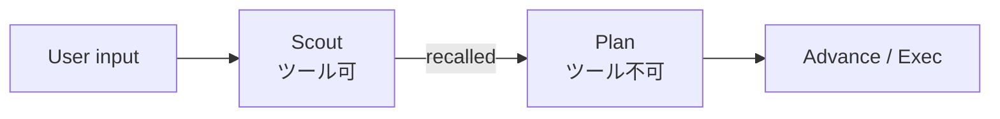

# スカウトフェーズ（計画前調査）

ユーザー要望を受け取ったあと、**計画層の前**に「足りる情報があるか評価し、足りなければツールで収集する」フェーズ。

## 位置づけ



| フェーズ | ツール | 成果物 |
|----------|--------|--------|
| **Scout** | 可 | `ResearchArtifact` → `recalled` |
| **Plan** | 不可 | `PlanArtifact` |
| **Exec / Advance** | 可 | サブタスク実行 |

## 設定

```json
"react": {
  "scout": {
    "enabled": true,
    "max_steps": 6,
    "skip_trivial": true,
    "max_note_chars": 2000,
    "show_scout": true
  }
}
```

| キー | 意味 | 既定 |
|------|------|------|
| `enabled` | 計画前にスカウトを実行 | `false` |
| `max_steps` | スカウト ReAct の上限 | `6` |
| `skip_trivial` | `help` / `time` / `echo` をスキップ | `true` |
| `max_note_chars` | `recalled` への notes 上限 | `2000` |
| `show_scout` | stdout に Scout ブロック表示 | `true` |

## ResearchArtifact

スカウト終了時の LLM `answer`（JSON）:

```json
{
  "ready_to_plan": true,
  "gaps": [],
  "notes": "src/ has react.rs; uses two_phase and advance"
}
```

- `ready_to_plan: false` でも計画層には進む（ギャップを notes/gaps に残す）。将来はここでスカウト延長も可能。
- パース失敗時はツール観測からフォールバック要約。

## プロンプト

- system: 既存 `REACT_SYSTEM_CORE` + `SCOUT_SYSTEM_APPEND`（一時 `system_extra`）
- user: `format_scout_user_input` で前置き

計画層は `PromptBlocks::recalled` の `## Scout findings` を読む（`PlanPromptContext` / 実行層と同じ `render` 経路）。

## 優先順位（`run_turn`）

1. `scout`（有効時・非 trivial）
2. `advance` または `two_phase` または単一 ReAct

`TurnResult.scout` に成果を格納。`steps_used` にスカウトのステップ数を加算。

## 関連

- [advance-loop.md](advance-loop.md) — 計画**後**のフェーズ分割
- [context-memory-mapping.md](context-memory-mapping.md) — `recalled` = 中期注入
- `src/scout.rs` — 実装
